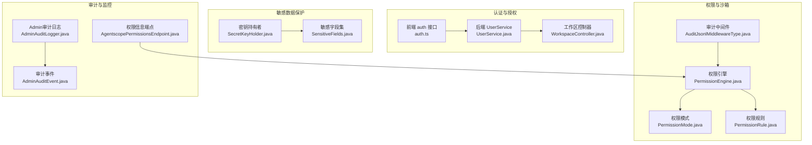
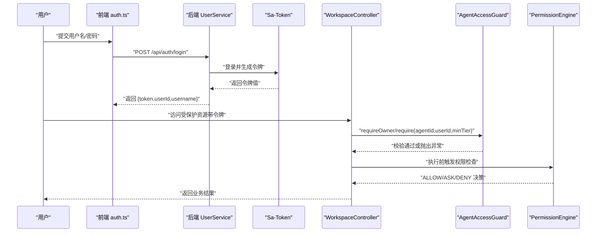
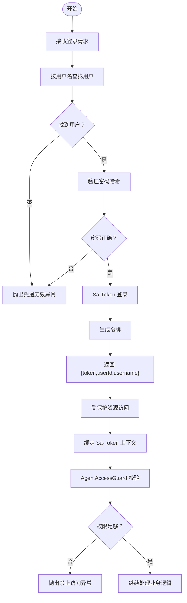
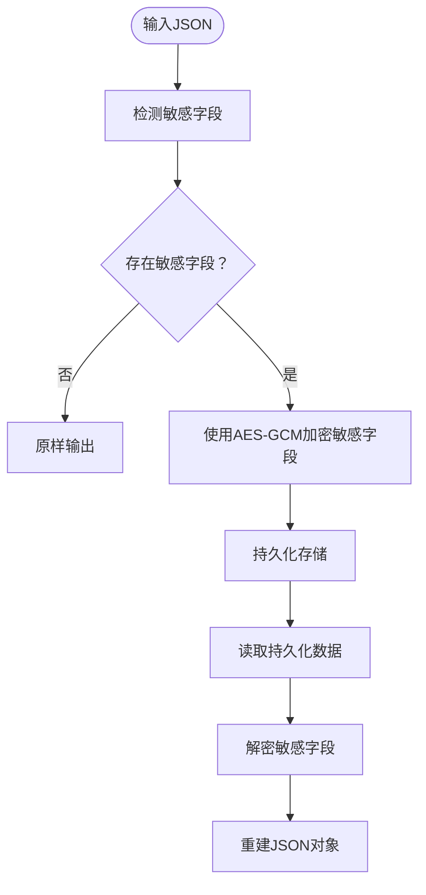
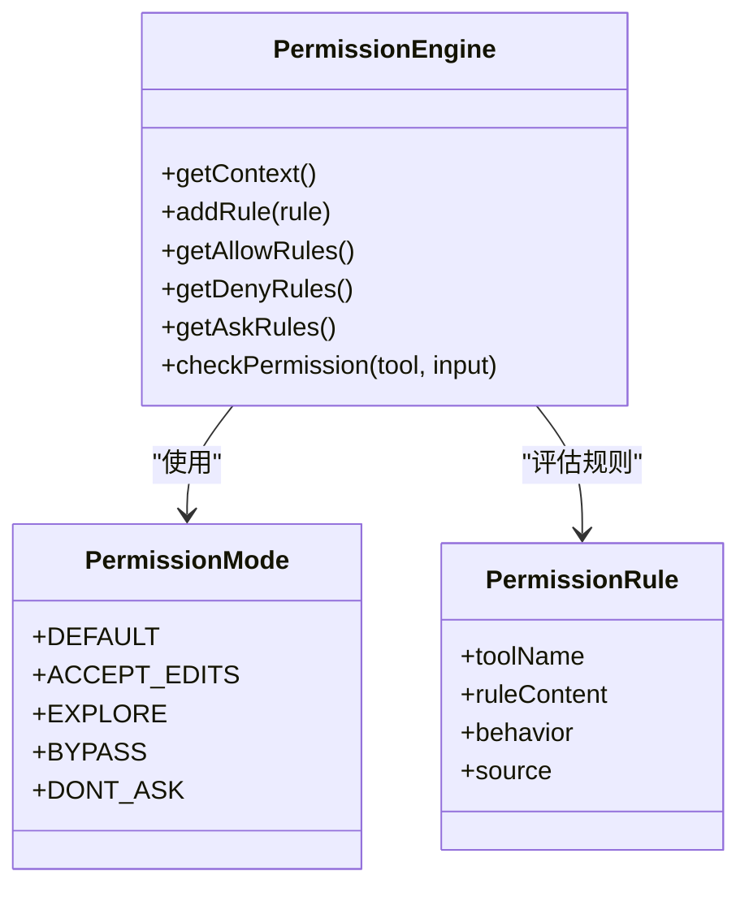
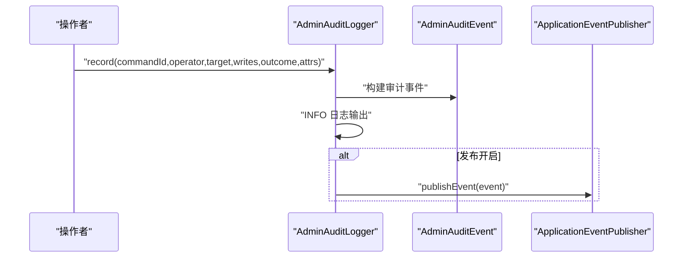
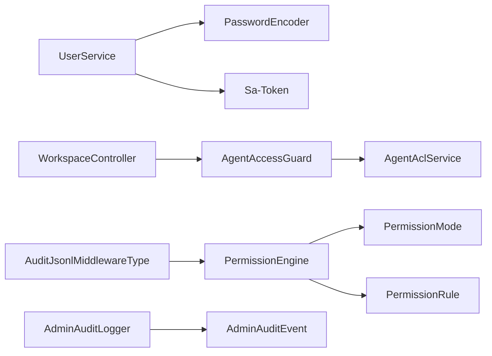

# 安全配置

<cite>
**本文引用的文件**
- [UserService.java](file://agentscope-builder-saton/src/main/java/io/agentscope/builder/saton/auth/UserService.java)
- [AuthFlowTest.java](file://agentscope-builder-saton/src/test/java/io/agentscope/builder/saton/auth/AuthFlowTest.java)
- [UserServiceTest.java](file://agentscope-builder-saton/src/test/java/io/agentscope/builder/saton/auth/UserServiceTest.java)
- [auth.ts](file://agentscope-builder-saton/frontend/src/api/auth.ts)
- [application.yml](file://agentscope-builder-saton/src/main/resources/application.yml)
- [application.yml](file://agentscope-builder-saton/src/test/resources/application.yml)
- [SecretKeyHolder.java](file://agentscope-builder-saton/src/main/java/io/agentscope/builder/saton/common/crypto/SecretKeyHolder.java)
- [SensitiveFields.java](file://agentscope-builder-saton/src/main/java/io/agentscope/builder/saton/common/crypto/SensitiveFields.java)
- [EncryptedJsonConverterTest.java](file://agentscope-builder-saton/src/test/java/io/agentscope/builder/saton/common/crypto/EncryptedJsonConverterTest.java)
- [AgentAccessGuard.java](file://agentscope-builder-saton/src/main/java/io/agentscope/builder/saton/agent/AgentAccessGuard.java)
- [Tier.java](file://agentscope-builder-saton/src/main/java/io/agentscope/builder/saton/agent/Tier.java)
- [AgentAclServiceTest.java](file://agentscope-builder-saton/src/test/java/io/agentscope/builder/saton/agent/AgentAclServiceTest.java)
- [WorkspaceController.java](file://agentscope-builder-saton/src/main/java/io/agentscope/builder/saton/workspace/WorkspaceController.java)
- [PermissionEngine.java](file://agentscope-core/src/main/java/io/agentscope/core/permission/PermissionEngine.java)
- [PermissionMode.java](file://agentscope-core/src/main/java/io/agentscope/core/permission/PermissionMode.java)
- [PermissionRule.java](file://agentscope-core/src/main/java/io/agentscope/core/permission/PermissionRule.java)
- [AdminAuditLogger.java](file://agentscope-extensions/agentscope-spring-boot-starters/agentscope-admin-spring-boot-starter/src/main/java/io/agentscope/spring/boot/admin/audit/AdminAuditLogger.java)
- [AdminAuditEvent.java](file://agentscope-extensions/agentscope-spring-boot-starters/agentscope-admin-spring-boot-starter/src/main/java/io/agentscope/spring/boot/admin/audit/AdminAuditEvent.java)
- [AgentscopePermissionsEndpoint.java](file://agentscope-extensions/agentscope-spring-boot-starters/agentscope-admin-spring-boot-starter/src/main/java/io/agentscope/spring/boot/admin/endpoint/AgentscopePermissionsEndpoint.java)
- [AuditJsonlMiddlewareType.java](file://agentscope-builder-saton/src/main/java/io/agentscope/builder/saton/factory/middleware/impl/AuditJsonlMiddlewareType.java)
- [agentscope-2.0.0-RC2-guide.html](file://agentscope-2.0.0-RC2-guide.html)
</cite>

## 目录
1. [简介](#简介)
2. [项目结构](#项目结构)
3. [核心组件](#核心组件)
4. [架构总览](#架构总览)
5. [详细组件分析](#详细组件分析)
6. [依赖分析](#依赖分析)
7. [性能考虑](#性能考虑)
8. [故障排查指南](#故障排查指南)
9. [结论](#结论)
10. [附录](#附录)

## 简介
本指南面向AgentScope Java项目的安全配置，覆盖身份认证与授权、网络安全、敏感数据保护、沙箱与执行权限控制、审计日志与监控、以及安全漏洞预防与应急响应。文档基于仓库中已实现的功能进行说明，并提供可落地的配置建议与最佳实践。

## 项目结构
围绕安全相关的关键模块与文件如下：
- 认证与授权：后端UserService与前端auth接口、Sa-Token集成、控制器上下文绑定
- 网络安全：HTTPS与TLS配置入口（application.yml）
- 敏感数据保护：字段级加密、密钥管理、数据库列转换器
- 权限与沙箱：权限引擎、权限模式、权限规则、中间件审计
- 审计与监控：Admin审计日志、审计事件发布、JSONL活动日志

图表来源
- [UserService.java:1-39](file://agentscope-builder-saton/src/main/java/io/agentscope/builder/saton/auth/UserService.java#L1-L39)
- [WorkspaceController.java:69-97](file://agentscope-builder-saton/src/main/java/io/agentscope/builder/saton/workspace/WorkspaceController.java#L69-L97)
- [PermissionEngine.java:1-336](file://agentscope-core/src/main/java/io/agentscope/core/permission/PermissionEngine.java#L1-L336)
- [PermissionMode.java:1-72](file://agentscope-core/src/main/java/io/agentscope/core/permission/PermissionMode.java#L1-L72)
- [PermissionRule.java:1-46](file://agentscope-core/src/main/java/io/agentscope/core/permission/PermissionRule.java#L1-L46)
- [AuditJsonlMiddlewareType.java:36-95](file://agentscope-builder-saton/src/main/java/io/agentscope/builder/saton/factory/middleware/impl/AuditJsonlMiddlewareType.java#L36-L95)
- [SecretKeyHolder.java:20-61](file://agentscope-builder-saton/src/main/java/io/agentscope/builder/saton/common/crypto/SecretKeyHolder.java#L20-L61)
- [SensitiveFields.java:1-22](file://agentscope-builder-saton/src/main/java/io/agentscope/builder/saton/common/crypto/SensitiveFields.java#L1-L22)
- [AdminAuditLogger.java:1-64](file://agentscope-extensions/agentscope-spring-boot-starters/agentscope-admin-spring-boot-starter/src/main/java/io/agentscope/spring/boot/admin/audit/AdminAuditLogger.java#L1-L64)
- [AdminAuditEvent.java:1-46](file://agentscope-extensions/agentscope-spring-boot-starters/agentscope-admin-spring-boot-starter/src/main/java/io/agentscope/spring/boot/admin/audit/AdminAuditEvent.java#L1-L46)
- [AgentscopePermissionsEndpoint.java:73-113](file://agentscope-extensions/agentscope-spring-boot-starters/agentscope-admin-spring-boot-starter/src/main/java/io/agentscope/spring/boot/admin/endpoint/AgentscopePermissionsEndpoint.java#L73-L113)

章节来源
- [application.yml](file://agentscope-builder-saton/src/main/resources/application.yml)
- [application.yml](file://agentscope-builder-saton/src/test/resources/application.yml)

## 核心组件
- 身份认证与会话：后端使用Sa-Token进行登录与令牌发放，前端通过auth.ts发起登录请求并携带令牌访问受保护接口。
- 授权与访问控制：基于Tier枚举的分层授权（CLONE/RUN/EDIT），统一守卫AgentAccessGuard进行权限校验。
- 权限引擎：PermissionEngine按优先级评估工具调用许可，支持ALLOW/ASK/DENY三态决策与多种模式（DEFAULT/ACCEPT_EDITS/EXPLORE/BYPASS/DONT_ASK）。
- 敏感数据保护：对数据库中的敏感字段进行字段级加密，密钥从环境变量加载，不合法时回退为开发密钥并发出警告。
- 审计与监控：AdminAuditLogger记录管理员操作，支持事件发布；AuditJsonlMiddlewareType将Agent结果追加到JSONL文件；权限端点暴露当前Agent的权限配置快照。
- 网络安全：HTTPS与TLS配置位于application.yml中，需结合部署环境启用。

章节来源
- [UserService.java:1-39](file://agentscope-builder-saton/src/main/java/io/agentscope/builder/saton/auth/UserService.java#L1-L39)
- [auth.ts:1-23](file://agentscope-builder-saton/frontend/src/api/auth.ts#L1-L23)
- [AgentAccessGuard.java:1-42](file://agentscope-builder-saton/src/main/java/io/agentscope/builder/saton/agent/AgentAccessGuard.java#L1-L42)
- [Tier.java:1-13](file://agentscope-builder-saton/src/main/java/io/agentscope/builder/saton/agent/Tier.java#L1-L13)
- [PermissionEngine.java:1-336](file://agentscope-core/src/main/java/io/agentscope/core/permission/PermissionEngine.java#L1-L336)
- [PermissionMode.java:1-72](file://agentscope-core/src/main/java/io/agentscope/core/permission/PermissionMode.java#L1-L72)
- [PermissionRule.java:1-46](file://agentscope-core/src/main/java/io/agentscope/core/permission/PermissionRule.java#L1-L46)
- [SecretKeyHolder.java:20-61](file://agentscope-builder-saton/src/main/java/io/agentscope/builder/saton/common/crypto/SecretKeyHolder.java#L20-L61)
- [SensitiveFields.java:1-22](file://agentscope-builder-saton/src/main/java/io/agentscope/builder/saton/common/crypto/SensitiveFields.java#L1-L22)
- [AdminAuditLogger.java:1-64](file://agentscope-extensions/agentscope-spring-boot-starters/agentscope-admin-spring-boot-starter/src/main/java/io/agentscope/spring/boot/admin/audit/AdminAuditLogger.java#L1-L64)
- [AuditJsonlMiddlewareType.java:36-95](file://agentscope-builder-saton/src/main/java/io/agentscope/builder/saton/factory/middleware/impl/AuditJsonlMiddlewareType.java#L36-L95)
- [AgentscopePermissionsEndpoint.java:73-113](file://agentscope-extensions/agentscope-spring-boot-starters/agentscope-admin-spring-boot-starter/src/main/java/io/agentscope/spring/boot/admin/endpoint/AgentscopePermissionsEndpoint.java#L73-L113)
- [application.yml](file://agentscope-builder-saton/src/main/resources/application.yml)

## 架构总览
下图展示认证、授权、权限控制、敏感数据保护与审计的整体交互。

图表来源
- [auth.ts:15-23](file://agentscope-builder-saton/frontend/src/api/auth.ts#L15-L23)
- [UserService.java:22-31](file://agentscope-builder-saton/src/main/java/io/agentscope/builder/saton/auth/UserService.java#L22-L31)
- [WorkspaceController.java:86-96](file://agentscope-builder-saton/src/main/java/io/agentscope/builder/saton/workspace/WorkspaceController.java#L86-L96)
- [AgentAccessGuard.java:26-41](file://agentscope-builder-saton/src/main/java/io/agentscope/builder/saton/agent/AgentAccessGuard.java#L26-L41)
- [PermissionEngine.java:139-202](file://agentscope-core/src/main/java/io/agentscope/core/permission/PermissionEngine.java#L139-L202)

## 详细组件分析

### 身份认证与授权配置
- 登录流程：前端auth.ts调用登录接口，后端UserService根据用户名查询用户，校验密码哈希，成功后通过Sa-Token建立会话并返回令牌。
- 受保护接口：WorkspaceController在处理请求前，通过Scoped方法绑定Sa-Token上下文，提取当前登录用户ID，再进行资源归属校验。
- 授权层级：Tier枚举定义CLONE/RUN/EDIT三级权限，AgentAccessGuard提供统一守卫，要求至少满足指定层级，否则抛出未找到或禁止访问异常。

图表来源
- [UserService.java:22-31](file://agentscope-builder-saton/src/main/java/io/agentscope/builder/saton/auth/UserService.java#L22-L31)
- [WorkspaceController.java:86-96](file://agentscope-builder-saton/src/main/java/io/agentscope/builder/saton/workspace/WorkspaceController.java#L86-L96)
- [AgentAccessGuard.java:26-41](file://agentscope-builder-saton/src/main/java/io/agentscope/builder/saton/agent/AgentAccessGuard.java#L26-L41)

章节来源
- [UserService.java:1-39](file://agentscope-builder-saton/src/main/java/io/agentscope/builder/saton/auth/UserService.java#L1-L39)
- [auth.ts:1-23](file://agentscope-builder-saton/frontend/src/api/auth.ts#L1-L23)
- [WorkspaceController.java:69-97](file://agentscope-builder-saton/src/main/java/io/agentscope/builder/saton/workspace/WorkspaceController.java#L69-L97)
- [AgentAccessGuard.java:1-42](file://agentscope-builder-saton/src/main/java/io/agentscope/builder/saton/agent/AgentAccessGuard.java#L1-L42)
- [Tier.java:1-13](file://agentscope-builder-saton/src/main/java/io/agentscope/builder/saton/agent/Tier.java#L1-L13)
- [AuthFlowTest.java:36-70](file://agentscope-builder-saton/src/test/java/io/agentscope/builder/saton/auth/AuthFlowTest.java#L36-L70)
- [UserServiceTest.java:24-34](file://agentscope-builder-saton/src/test/java/io/agentscope/builder/saton/auth/UserServiceTest.java#L24-L34)

### 网络安全配置（HTTPS、TLS、防火墙）
- HTTPS与TLS：在application.yml中配置服务器端口、SSL证书与私钥路径、协议版本与密码套件等参数，确保传输层安全。
- 防火墙规则：仅开放必需端口（如HTTP/HTTPS），限制源地址范围，对管理端口采用内网白名单。
- 建议：启用HSTS、禁用弱密码套件、定期轮换证书与密钥。

章节来源
- [application.yml](file://agentscope-builder-saton/src/main/resources/application.yml)
- [application.yml](file://agentscope-builder-saton/src/test/resources/application.yml)

### 敏感数据保护（API密钥与数据加密）
- 字段级加密：对数据库中包含敏感字段（如apiKey、token、password、secret、accessKeySecret）的JSON进行加密存储，读取时自动解密。
- 密钥管理：从环境变量加载AES密钥，若非Base64或长度不为32字节则回退为SHA-256派生密钥并记录警告；生产环境必须显式设置密钥。
- 兼容性：支持读取历史未加密的JSON格式，保证迁移期间兼容。

图表来源
- [SensitiveFields.java:11-17](file://agentscope-builder-saton/src/main/java/io/agentscope/builder/saton/common/crypto/SensitiveFields.java#L11-L17)
- [SecretKeyHolder.java:24-48](file://agentscope-builder-saton/src/main/java/io/agentscope/builder/saton/common/crypto/SecretKeyHolder.java#L24-L48)
- [EncryptedJsonConverterTest.java:18-39](file://agentscope-builder-saton/src/test/java/io/agentscope/builder/saton/common/crypto/EncryptedJsonConverterTest.java#L18-L39)

章节来源
- [SensitiveFields.java:1-22](file://agentscope-builder-saton/src/main/java/io/agentscope/builder/saton/common/crypto/SensitiveFields.java#L1-L22)
- [SecretKeyHolder.java:20-61](file://agentscope-builder-saton/src/main/java/io/agentscope/builder/saton/common/crypto/SecretKeyHolder.java#L20-L61)
- [EncryptedJsonConverterTest.java:1-55](file://agentscope-builder-saton/src/test/java/io/agentscope/builder/saton/common/crypto/EncryptedJsonConverterTest.java#L1-L55)

### 沙箱与执行权限控制
- 权限引擎：按优先级评估工具调用，支持工具级deny/ask/allow规则、EXPLORE只读模式、ACCEPT_EDITS接受编辑、BYPASS放行、DONT_ASK拒绝。
- 工具自检：部分工具可提供自身权限检查逻辑，引擎在特定模式下优先处理只读工具。
- 建议：生产环境使用EXPLORE+敏感工具DONT_ASK，避免危险操作；通过中间件记录活动日志以便审计。

图表来源
- [PermissionEngine.java:47-131](file://agentscope-core/src/main/java/io/agentscope/core/permission/PermissionEngine.java#L47-L131)
- [PermissionMode.java:33-38](file://agentscope-core/src/main/java/io/agentscope/core/permission/PermissionMode.java#L33-L38)
- [PermissionRule.java:33-44](file://agentscope-core/src/main/java/io/agentscope/core/permission/PermissionRule.java#L33-L44)

章节来源
- [PermissionEngine.java:1-336](file://agentscope-core/src/main/java/io/agentscope/core/permission/PermissionEngine.java#L1-L336)
- [PermissionMode.java:1-72](file://agentscope-core/src/main/java/io/agentscope/core/permission/PermissionMode.java#L1-L72)
- [PermissionRule.java:1-46](file://agentscope-core/src/main/java/io/agentscope/core/permission/PermissionRule.java#L1-L46)
- [agentscope-2.0.0-RC2-guide.html:152-158](file://agentscope-2.0.0-RC2-guide.html#L152-L158)

### 审计日志与安全事件监控
- Admin审计日志：AdminAuditLogger以INFO级别记录管理员命令、操作者、目标、是否写入、结果与属性，并可选发布为Spring事件供下游订阅。
- 审计事件：AdminAuditEvent为不可变记录，构造时进行参数校验与默认值填充。
- JSONL审计中间件：将Agent最终结果追加到activity.jsonl文件，便于离线分析。
- 权限端点：AgentscopePermissionsEndpoint导出当前Agent的权限模式与规则集合，辅助运维核验。

图表来源
- [AdminAuditLogger.java:43-63](file://agentscope-extensions/agentscope-spring-boot-starters/agentscope-admin-spring-boot-starter/src/main/java/io/agentscope/spring/boot/admin/audit/AdminAuditLogger.java#L43-L63)
- [AdminAuditEvent.java:27-45](file://agentscope-extensions/agentscope-spring-boot-starters/agentscope-admin-spring-boot-starter/src/main/java/io/agentscope/spring/boot/admin/audit/AdminAuditEvent.java#L27-L45)

章节来源
- [AdminAuditLogger.java:1-64](file://agentscope-extensions/agentscope-spring-boot-starters/agentscope-admin-spring-boot-starter/src/main/java/io/agentscope/spring/boot/admin/audit/AdminAuditLogger.java#L1-L64)
- [AdminAuditEvent.java:1-46](file://agentscope-extensions/agentscope-spring-boot-starters/agentscope-admin-spring-boot-starter/src/main/java/io/agentscope/spring/boot/admin/audit/AdminAuditEvent.java#L1-L46)
- [AuditJsonlMiddlewareType.java:36-95](file://agentscope-builder-saton/src/main/java/io/agentscope/builder/saton/factory/middleware/impl/AuditJsonlMiddlewareType.java#L36-L95)
- [AgentscopePermissionsEndpoint.java:73-113](file://agentscope-extensions/agentscope-spring-boot-starters/agentscope-admin-spring-boot-starter/src/main/java/io/agentscope/spring/boot/admin/endpoint/AgentscopePermissionsEndpoint.java#L73-L113)

## 依赖分析
- 组件耦合：认证与授权依赖Sa-Token；权限引擎独立于具体工具，通过规则与模式驱动；审计模块与权限模块松耦合，可通过事件发布扩展。
- 外部依赖：Spring Security密码编码器用于密码哈希校验；SLF4J用于审计日志；Jackson用于JSON序列化。

图表来源
- [UserService.java:8-19](file://agentscope-builder-saton/src/main/java/io/agentscope/builder/saton/auth/UserService.java#L8-L19)
- [WorkspaceController.java:86-96](file://agentscope-builder-saton/src/main/java/io/agentscope/builder/saton/workspace/WorkspaceController.java#L86-L96)
- [AgentAccessGuard.java:17-20](file://agentscope-builder-saton/src/main/java/io/agentscope/builder/saton/agent/AgentAccessGuard.java#L17-L20)
- [PermissionEngine.java:49-64](file://agentscope-core/src/main/java/io/agentscope/core/permission/PermissionEngine.java#L49-L64)
- [PermissionMode.java:33-38](file://agentscope-core/src/main/java/io/agentscope/core/permission/PermissionMode.java#L33-L38)
- [PermissionRule.java:33-44](file://agentscope-core/src/main/java/io/agentscope/core/permission/PermissionRule.java#L33-L44)
- [AdminAuditLogger.java:38-41](file://agentscope-extensions/agentscope-spring-boot-starters/agentscope-admin-spring-boot-starter/src/main/java/io/agentscope/spring/boot/admin/audit/AdminAuditLogger.java#L38-L41)
- [AuditJsonlMiddlewareType.java:65-86](file://agentscope-builder-saton/src/main/java/io/agentscope/builder/saton/factory/middleware/impl/AuditJsonlMiddlewareType.java#L65-L86)

## 性能考虑
- 密码哈希与令牌生成：使用高性能的PasswordEncoder与Sa-Token，避免在高频登录场景引入额外阻塞。
- 权限评估：规则表按工具名索引，评估顺序固定，建议在高并发场景预热常用规则，减少动态添加带来的开销。
- 审计写入：JSONL写入采用追加方式，注意磁盘IO与日志轮转策略，避免热点文件过大影响性能。

## 故障排查指南
- 登录失败
  - 现象：401未授权或凭据无效异常。
  - 排查：确认用户名是否存在、密码哈希是否匹配；检查Sa-Token上下文是否正确绑定。
  - 参考
    - [AuthFlowTest.java:62-69](file://agentscope-builder-saton/src/test/java/io/agentscope/builder/saton/auth/AuthFlowTest.java#L62-L69)
    - [UserServiceTest.java:25-34](file://agentscope-builder-saton/src/test/java/io/agentscope/builder/saton/auth/UserServiceTest.java#L25-L34)
    - [UserService.java:22-31](file://agentscope-builder-saton/src/main/java/io/agentscope/builder/saton/auth/UserService.java#L22-L31)
- 权限不足
  - 现象：403禁止访问或资源未找到。
  - 排查：确认用户Tier是否满足最小权限；检查Agent共享记录与归属关系。
  - 参考
    - [AgentAccessGuard.java:26-41](file://agentscope-builder-saton/src/main/java/io/agentscope/builder/saton/agent/AgentAccessGuard.java#L26-L41)
    - [Tier.java:10-12](file://agentscope-builder-saton/src/main/java/io/agentscope/builder/saton/agent/Tier.java#L10-L12)
    - [AgentAclServiceTest.java:18-38](file://agentscope-builder-saton/src/test/java/io/agentscope/builder/saton/agent/AgentAclServiceTest.java#L18-L38)
- 审计缺失
  - 现象：Admin审计日志未输出或事件未被订阅。
  - 排查：确认AdminAuditLogger配置项与事件发布开关；检查ApplicationEventPublisher可用性。
  - 参考
    - [AdminAuditLogger.java:50-62](file://agentscope-extensions/agentscope-spring-boot-starters/agentscope-admin-spring-boot-starter/src/main/java/io/agentscope/spring/boot/admin/audit/AdminAuditLogger.java#L50-L62)
    - [AdminAuditEvent.java:36-45](file://agentscope-extensions/agentscope-spring-boot-starters/agentscope-admin-spring-boot-starter/src/main/java/io/agentscope/spring/boot/admin/audit/AdminAuditEvent.java#L36-L45)
- 数据库敏感字段未加密
  - 现象：密钥未设置或格式错误导致回退为开发密钥，生产不可读。
  - 排查：设置环境变量并确保Base64且长度为32字节；检查历史数据兼容读取。
  - 参考
    - [SecretKeyHolder.java:24-48](file://agentscope-builder-saton/src/main/java/io/agentscope/builder/saton/common/crypto/SecretKeyHolder.java#L24-L48)
    - [EncryptedJsonConverterTest.java:42-54](file://agentscope-builder-saton/src/test/java/io/agentscope/builder/saton/common/crypto/EncryptedJsonConverterTest.java#L42-L54)

章节来源
- [AuthFlowTest.java:1-70](file://agentscope-builder-saton/src/test/java/io/agentscope/builder/saton/auth/AuthFlowTest.java#L1-L70)
- [UserServiceTest.java:1-35](file://agentscope-builder-saton/src/test/java/io/agentscope/builder/saton/auth/UserServiceTest.java#L1-L35)
- [AgentAccessGuard.java:1-42](file://agentscope-builder-saton/src/main/java/io/agentscope/builder/saton/agent/AgentAccessGuard.java#L1-L42)
- [Tier.java:1-13](file://agentscope-builder-saton/src/main/java/io/agentscope/builder/saton/agent/Tier.java#L1-L13)
- [AgentAclServiceTest.java:1-45](file://agentscope-builder-saton/src/test/java/io/agentscope/builder/saton/agent/AgentAclServiceTest.java#L1-L45)
- [AdminAuditLogger.java:1-64](file://agentscope-extensions/agentscope-spring-boot-starters/agentscope-admin-spring-boot-starter/src/main/java/io/agentscope/spring/boot/admin/audit/AdminAuditLogger.java#L1-L64)
- [AdminAuditEvent.java:1-46](file://agentscope-extensions/agentscope-spring-boot-starters/agentscope-admin-spring-boot-starter/src/main/java/io/agentscope/spring/boot/admin/audit/AdminAuditEvent.java#L1-L46)
- [SecretKeyHolder.java:20-61](file://agentscope-builder-saton/src/main/java/io/agentscope/builder/saton/common/crypto/SecretKeyHolder.java#L20-L61)
- [EncryptedJsonConverterTest.java:1-55](file://agentscope-builder-saton/src/test/java/io/agentscope/builder/saton/common/crypto/EncryptedJsonConverterTest.java#L1-L55)

## 结论
本指南基于仓库现有实现，提供了AgentScope Java的安全配置要点：以Sa-Token为基础的身份认证、基于Tier的授权、可配置的权限引擎、字段级敏感数据加密、以及完善的审计与监控能力。建议在生产环境严格启用HTTPS/TLS、强化密钥管理、审慎配置权限模式，并结合中间件与事件发布完善安全可观测性。

## 附录
- 安全漏洞预防与应急响应
  - 预防：启用HTTPS/TLS、最小权限原则、定期轮换密钥、限制API速率、输入校验与输出编码。
  - 应急：快速隔离受影响实例、回滚变更、审查审计日志、通知相关方并启动事件升级流程。
- 参考文档
  - [agentscope-2.0.0-RC2-guide.html:138-158](file://agentscope-2.0.0-RC2-guide.html#L138-L158)