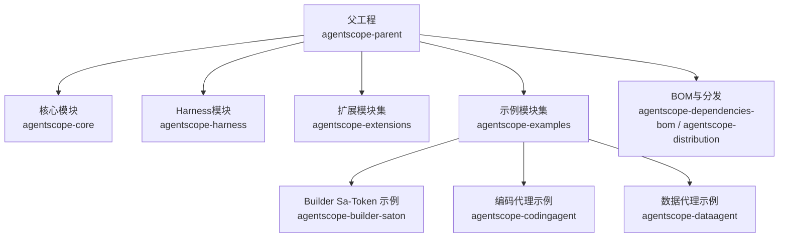
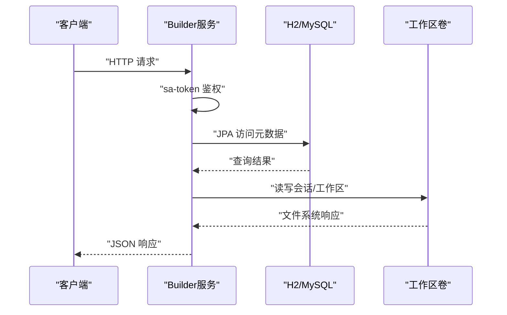
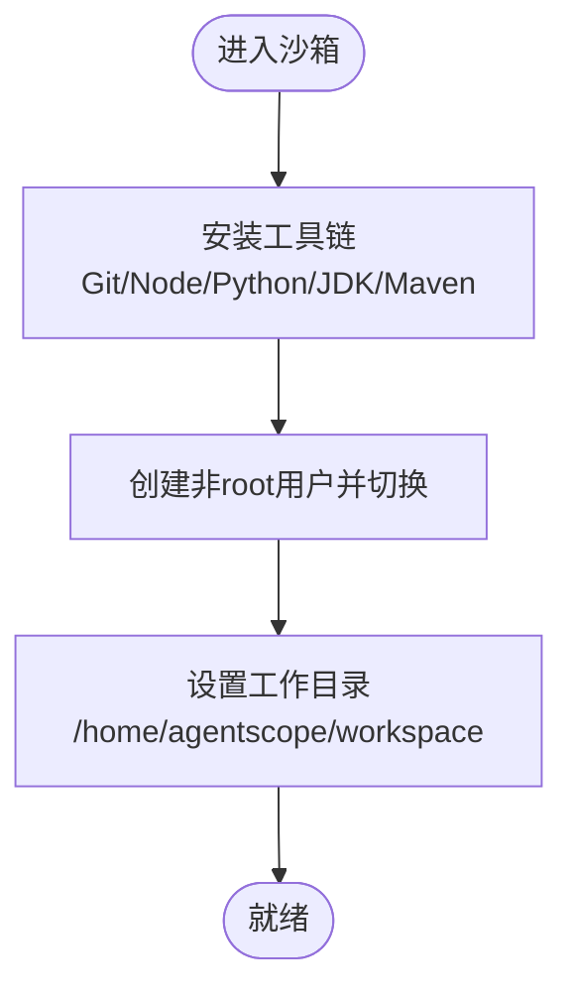
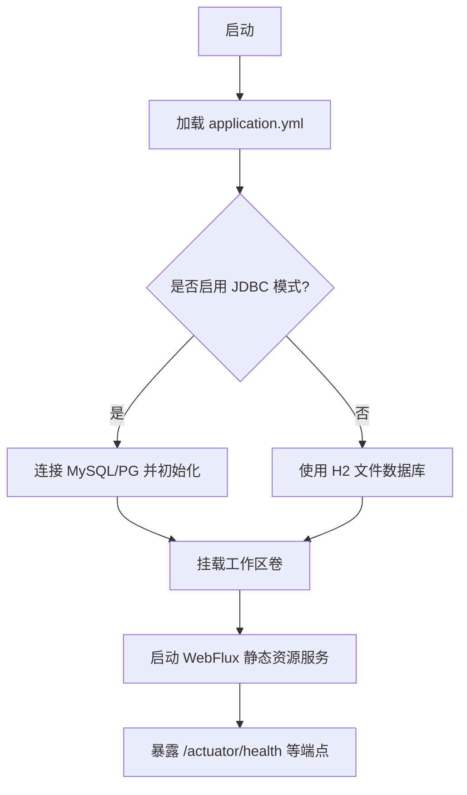
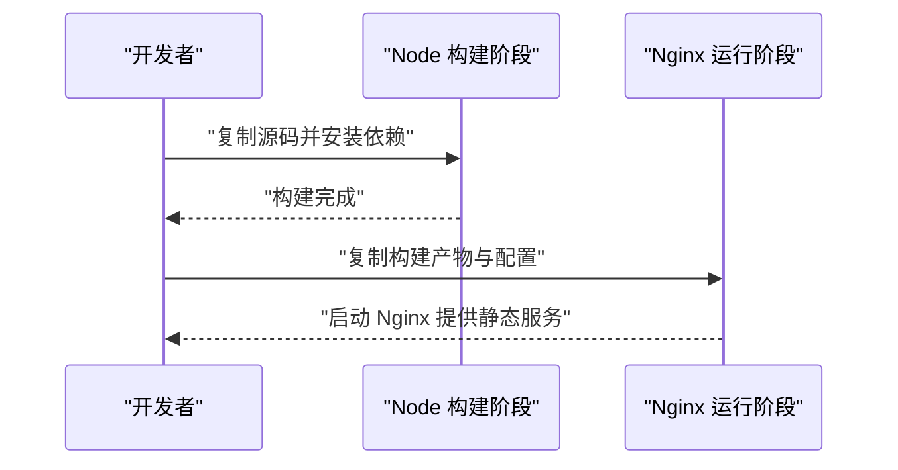
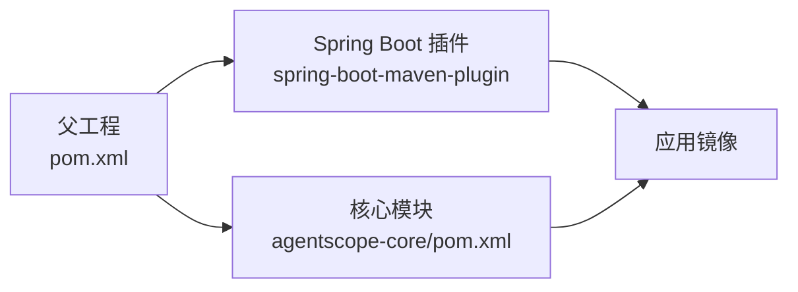

# 容器化部署

<cite>
**本文引用的文件**
- [pom.xml](file://pom.xml)
- [agentscope-core/pom.xml](file://agentscope-core/pom.xml)
- [agentscope-builder-saton/pom.xml](file://agentscope-builder-saton/pom.xml)
- [agentscope-builder-saton/src/main/resources/application.yml](file://agentscope-builder-saton/src/main/resources/application.yml)
- [agentscope-examples/agents/agentscope-codingagent/src/main/resources/application.yml](file://agentscope-examples/agents/agentscope-codingagent/src/main/resources/application.yml)
- [agentscope-examples/agents/agentscope-dataagent/src/main/resources/application.yml](file://agentscope-examples/agents/agentscope-dataagent/src/main/resources/application.yml)
- [agentscope-examples/agents/agentscope-codingagent/src/main/docker/coding-sandbox/Dockerfile](file://agentscope-examples/agents/agentscope-codingagent/src/main/docker/coding-sandbox/Dockerfile)
- [z_demo/ppt-agent-ui/scripts/deploy/Dockerfile](file://z_demo/ppt-agent-ui/scripts/deploy/Dockerfile)
</cite>

## 目录
1. [简介](#简介)
2. [项目结构](#项目结构)
3. [核心组件](#核心组件)
4. [架构总览](#架构总览)
5. [详细组件分析](#详细组件分析)
6. [依赖关系分析](#依赖关系分析)
7. [性能与资源考虑](#性能与资源考虑)
8. [故障排查指南](#故障排查指南)
9. [结论](#结论)
10. [附录](#附录)

## 简介
本指南面向AgentScope Java项目，提供从单体父工程到具体模块（如Builder Sa-Token版、示例应用）的容器化部署方案。内容涵盖：
- Docker镜像构建：多阶段构建与优化策略
- 容器配置：Dockerfile与docker-compose.yml的编写要点
- 场景化配置：开发、测试、生产三类环境的差异化参数
- 网络、卷挂载与环境变量传递
- 健康检查与重启策略
- 安全最佳实践与资源限制

## 项目结构
AgentScope Java采用多模块Maven结构，父工程统一管理版本与插件；各子模块（如agentscope-core、agentscope-builder-saton、agentscope-examples等）分别承担核心能力、示例应用与扩展能力。容器化时可按需选择打包目标模块，并结合Spring Boot插件生成可执行镜像。



图示来源
- [pom.xml:57-64](file://pom.xml#L57-L64)
- [agentscope-core/pom.xml:1-50](file://agentscope-core/pom.xml#L1-L50)
- [agentscope-builder-saton/pom.xml:1-30](file://agentscope-builder-saton/pom.xml#L1-L30)

章节来源
- [pom.xml:57-64](file://pom.xml#L57-L64)
- [agentscope-core/pom.xml:1-50](file://agentscope-core/pom.xml#L1-L50)
- [agentscope-builder-saton/pom.xml:1-30](file://agentscope-builder-saton/pom.xml#L1-L30)

## 核心组件
- 父工程与版本治理：统一Java版本、编译参数与常用插件，确保跨模块一致性。
- 核心模块：提供Agent、模型、工具、中间件、内存、事件等基础能力，适合在容器中作为运行时依赖或被其他服务依赖。
- Builder Sa-Token示例：基于Spring Boot 4与sa-token的WebFlux后端，演示会话、鉴权与工作区管理。
- 编码代理示例：包含独立的Dockerfile，用于沙箱构建与验证工具链。
- 数据代理示例：提供丰富的配置项（数据库、JWT、工作区、渠道等），便于容器化部署与环境切换。

章节来源
- [pom.xml:29-55](file://pom.xml#L29-L55)
- [agentscope-core/pom.xml:51-231](file://agentscope-core/pom.xml#L51-L231)
- [agentscope-builder-saton/pom.xml:15-45](file://agentscope-builder-saton/pom.xml#L15-L45)
- [agentscope-examples/agents/agentscope-codingagent/src/main/resources/application.yml:1-35](file://agentscope-examples/agents/agentscope-codingagent/src/main/resources/application.yml#L1-L35)
- [agentscope-examples/agents/agentscope-dataagent/src/main/resources/application.yml:1-158](file://agentscope-examples/agents/agentscope-dataagent/src/main/resources/application.yml#L1-L158)

## 架构总览
下图展示容器化部署的总体思路：以Spring Boot模块为核心，通过多阶段构建产出精简镜像；示例应用可独立运行，核心模块作为依赖被上层服务复用。

```mermaid
graph TB
subgraph "构建阶段"
sb["Spring Boot 应用镜像<br/>builder_saton / data_agent / codingagent"]
coreimg["核心库镜像可选<br/>agentscope-core"]
end
subgraph "运行阶段"
svc["容器服务进程"]
vol["持久化卷<br/>sessions / workspaces / db 文件"]
net["容器网络<br/>端口映射/服务发现"]
cfg["配置注入<br/>环境变量 / 配置文件"]
end
sb --> svc
coreimg --> sb
vol <- --> svc
net <- --> svc
cfg <- --> svc
```

图示来源
- [agentscope-builder-saton/pom.xml:123-145](file://agentscope-builder-saton/pom.xml#L123-L145)
- [agentscope-examples/agents/agentscope-codingagent/src/main/docker/coding-sandbox/Dockerfile:1-63](file://agentscope-examples/agents/agentscope-codingagent/src/main/docker/coding-sandbox/Dockerfile#L1-L63)
- [z_demo/ppt-agent-ui/scripts/deploy/Dockerfile:1-39](file://z_demo/ppt-agent-ui/scripts/deploy/Dockerfile#L1-L39)

## 详细组件分析

### Builder Sa-Token 示例（Spring Boot 4 + WebFlux）
- 运行端口与配置：默认监听端口由配置文件定义，支持通过环境变量覆盖。
- 数据源与JPA：默认使用嵌入式H2，可通过激活jdbc配置文件或环境变量切换至MySQL/PG。
- 工作区与会话：通过配置项指定本地根目录，容器中建议挂载持久化卷。
- 安全与鉴权：集成sa-token，令牌名称、超时等参数可配置。



图示来源
- [agentscope-builder-saton/src/main/resources/application.yml:1-40](file://agentscope-builder-saton/src/main/resources/application.yml#L1-L40)

章节来源
- [agentscope-builder-saton/src/main/resources/application.yml:1-40](file://agentscope-builder-saton/src/main/resources/application.yml#L1-L40)

### 编码代理示例（沙箱工具链）
- 镜像用途：为“编码变更校验”等技能提供标准化的沙箱环境，内置Git、Node、Python、JDK/Maven等工具。
- 用户与路径：以非root用户运行，工作目录位于家目录，便于容器内权限控制与卷挂载。
- Java环境：预置JDK 17，便于在容器内进行Java相关验证。



图示来源
- [agentscope-examples/agents/agentscope-codingagent/src/main/docker/coding-sandbox/Dockerfile:1-63](file://agentscope-examples/agents/agentscope-codingagent/src/main/docker/coding-sandbox/Dockerfile#L1-L63)

章节来源
- [agentscope-examples/agents/agentscope-codingagent/src/main/docker/coding-sandbox/Dockerfile:1-63](file://agentscope-examples/agents/agentscope-codingagent/src/main/docker/coding-sandbox/Dockerfile#L1-L63)

### 数据代理示例（WebFlux + 资源静态化）
- 静态资源：通过WebFlux静态路径映射，便于前端产物托管。
- 数据库与初始化：支持H2/MySQL/PG，默认H2，可通过环境变量切换。
- JWT与工作区：JWT密钥需在生产覆盖，工作区根目录可配置并挂载卷。
- 管理端点：暴露健康与指标端点，便于容器健康检查与监控。



图示来源
- [agentscope-examples/agents/agentscope-dataagent/src/main/resources/application.yml:1-158](file://agentscope-examples/agents/agentscope-dataagent/src/main/resources/application.yml#L1-L158)

章节来源
- [agentscope-examples/agents/agentscope-dataagent/src/main/resources/application.yml:1-158](file://agentscope-examples/agents/agentscope-dataagent/src/main/resources/application.yml#L1-L158)

### Nginx 前端构建镜像（示例）
- 多阶段：第一阶段使用Node构建产物，第二阶段使用Nginx提供静态服务。
- 性能优化：利用缓存mount加速依赖安装，禁用默认conf并自定义mjs类型。
- 出口端口：容器对外暴露服务端口，由编排层映射至宿主机。



图示来源
- [z_demo/ppt-agent-ui/scripts/deploy/Dockerfile:1-39](file://z_demo/ppt-agent-ui/scripts/deploy/Dockerfile#L1-L39)

章节来源
- [z_demo/ppt-agent-ui/scripts/deploy/Dockerfile:1-39](file://z_demo/ppt-agent-ui/scripts/deploy/Dockerfile#L1-L39)

## 依赖关系分析
- 父工程统一管理Java版本与常用插件，子模块通过BOM导入依赖，保证版本一致性。
- Spring Boot模块通过spring-boot-maven-plugin生成可执行包，适合直接打包进镜像。
- 示例模块各自维护独立的Dockerfile，体现“按需容器化”的策略。



图示来源
- [pom.xml:34-55](file://pom.xml#L34-L55)
- [agentscope-builder-saton/pom.xml:132-143](file://agentscope-builder-saton/pom.xml#L132-L143)
- [agentscope-core/pom.xml:33-49](file://agentscope-core/pom.xml#L33-L49)

章节来源
- [pom.xml:34-55](file://pom.xml#L34-L55)
- [agentscope-builder-saton/pom.xml:132-143](file://agentscope-builder-saton/pom.xml#L132-L143)
- [agentscope-core/pom.xml:33-49](file://agentscope-core/pom.xml#L33-L49)

## 性能与资源考虑
- JVM堆大小：父工程通过argLine设置初始与最大堆，建议在容器中根据CPU核数与内存上限调整。
- 构建缓存：多阶段构建中充分利用镜像层缓存，减少重复安装依赖的时间。
- 运行时并发：示例应用使用WebFlux，建议在容器编排中合理设置副本数与资源配额，避免阻塞IO瓶颈。
- 日志与追踪：示例应用已开启Prometheus指标与可选OTLP导出，建议在容器监控体系中采集这些端点。

章节来源
- [pom.xml:54](file://pom.xml#L54)
- [agentscope-examples/agents/agentscope-codingagent/src/main/resources/application.yml:8-35](file://agentscope-examples/agents/agentscope-codingagent/src/main/resources/application.yml#L8-L35)

## 故障排查指南
- 健康检查
  - Builder与Data Agent示例均暴露/actuator/health端点，可在容器编排中配置健康检查探针。
  - 若返回状态异常，优先检查数据库连通性、工作区卷权限与JWT密钥配置。
- 端口冲突
  - 默认端口由配置文件定义，容器启动时可通过环境变量覆盖。
- 数据库切换
  - 通过激活jdbc配置文件或设置对应环境变量实现H2/MySQL/PG切换。
- 权限问题
  - 沙箱镜像以非root用户运行，挂载卷时注意目录权限与所有者。
- 资源不足
  - 观察容器日志中的GC与OOM迹象，适当提升容器内存上限或调整JVM参数。

章节来源
- [agentscope-builder-saton/src/main/resources/application.yml:1-40](file://agentscope-builder-saton/src/main/resources/application.yml#L1-L40)
- [agentscope-examples/agents/agentscope-dataagent/src/main/resources/application.yml:26-46](file://agentscope-examples/agents/agentscope-dataagent/src/main/resources/application.yml#L26-L46)
- [agentscope-examples/agents/agentscope-codingagent/src/main/docker/coding-sandbox/Dockerfile:54-57](file://agentscope-examples/agents/agentscope-codingagent/src/main/docker/coding-sandbox/Dockerfile#L54-L57)

## 结论
通过多模块Maven工程与多阶段Docker构建，AgentScope Java能够以最小镜像体积承载核心能力与示例应用。结合环境变量与配置文件，可灵活适配开发、测试与生产三类场景；配合健康检查、卷挂载与资源限制，可实现稳定可靠的容器化交付。

## 附录

### 开发/测试/生产环境配置差异建议
- 开发环境
  - 使用H2文件数据库，关闭敏感功能（如公开健康详情），简化鉴权。
  - 挂载工作区与会话目录，便于本地调试。
- 测试环境
  - 切换至MySQL/PG，启用DDL校验或迁移脚本，开启公开健康详情以便联调。
- 生产环境
  - 强制覆盖JWT密钥，启用Redis分布式会话（如需要），开启OTLP导出与指标采集。
  - 设置合理的健康检查与重启策略，限制容器CPU/内存并开启只读根文件系统。

### 容器网络、卷挂载与环境变量
- 网络
  - 将容器端口映射到宿主机，或通过服务网格/反向代理暴露。
- 卷
  - 挂载工作区与会话目录至持久化存储，确保重启不丢失状态。
- 环境变量
  - 使用配置文件中的占位符（如PORT、DATAAGENT_*、DASHSCOPE_API_KEY等）注入运行时参数。

### 健康检查与重启策略
- 健康检查：对/actuator/health进行GET探测，失败次数与超时时间按业务需求配置。
- 重启策略：开发环境可设置立即重启，生产环境建议指数退避并限制重启次数。

### 安全最佳实践
- 非root运行：沙箱镜像已采用非root用户，建议在编排层进一步限制capabilities与只读根文件系统。
- 最小权限：仅授予容器所需的网络与卷访问权限。
- 密钥管理：通过机密管理服务注入JWT密钥与第三方API密钥，避免硬编码。