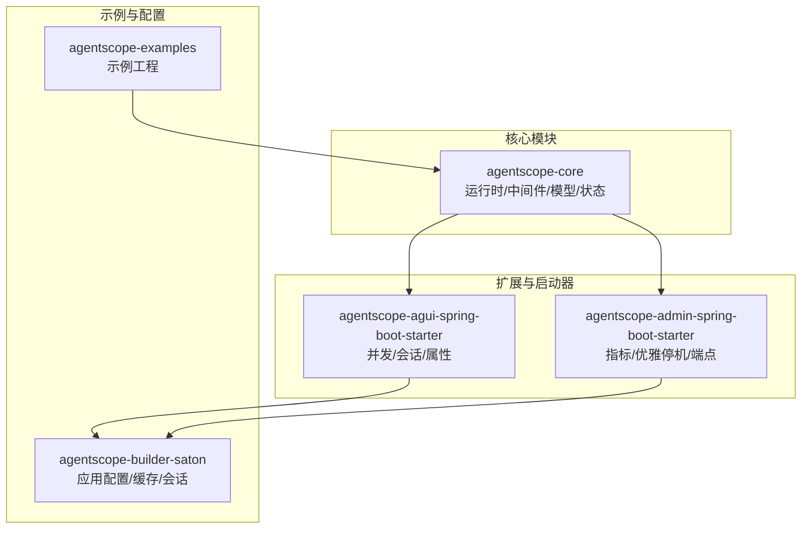
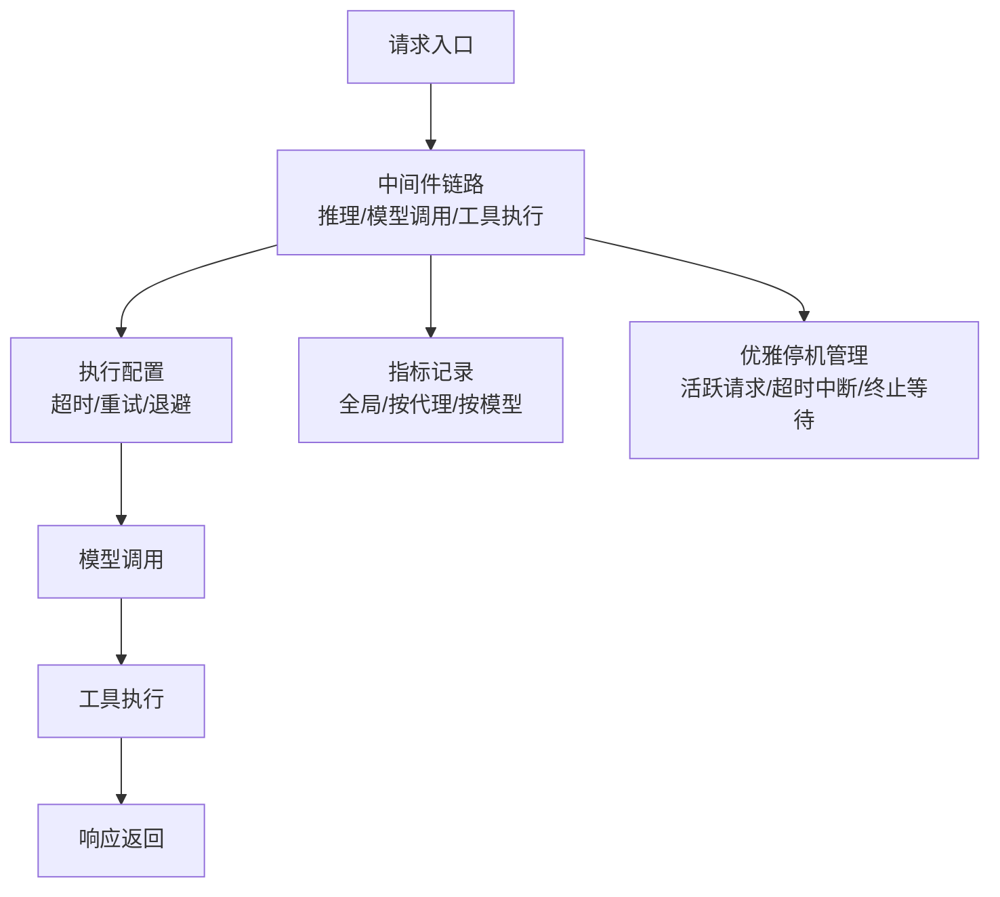
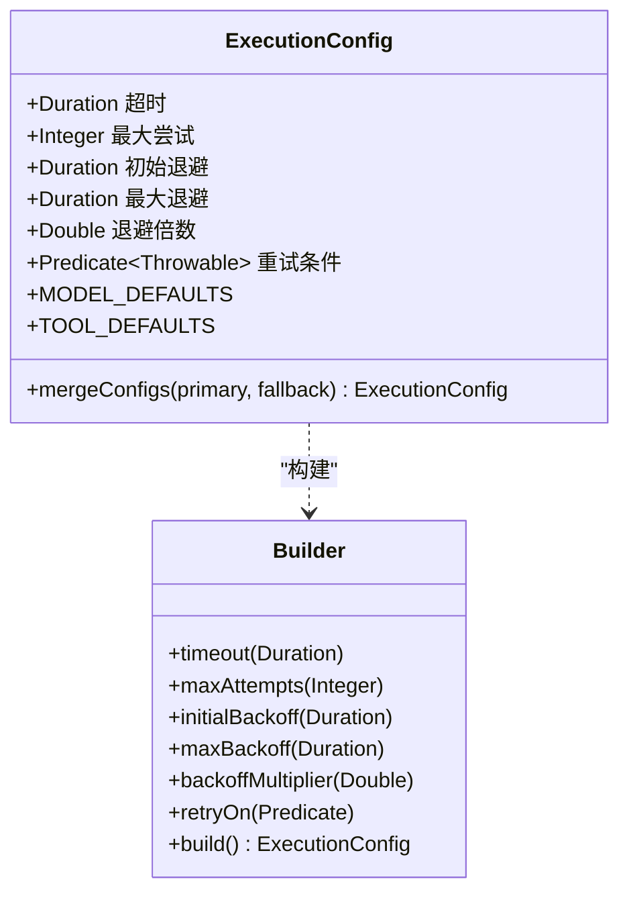
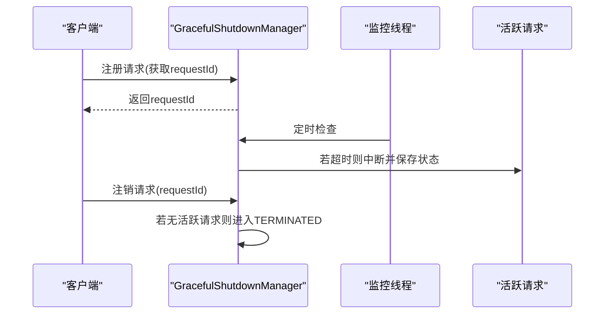
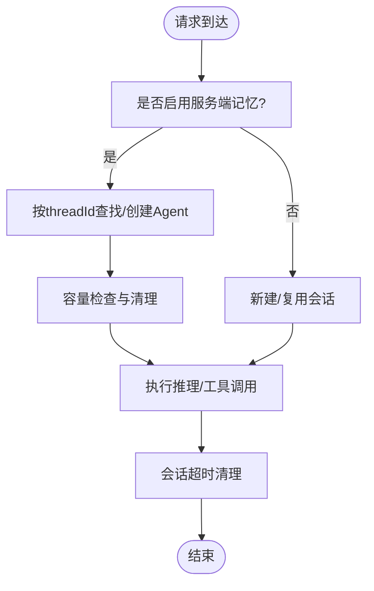
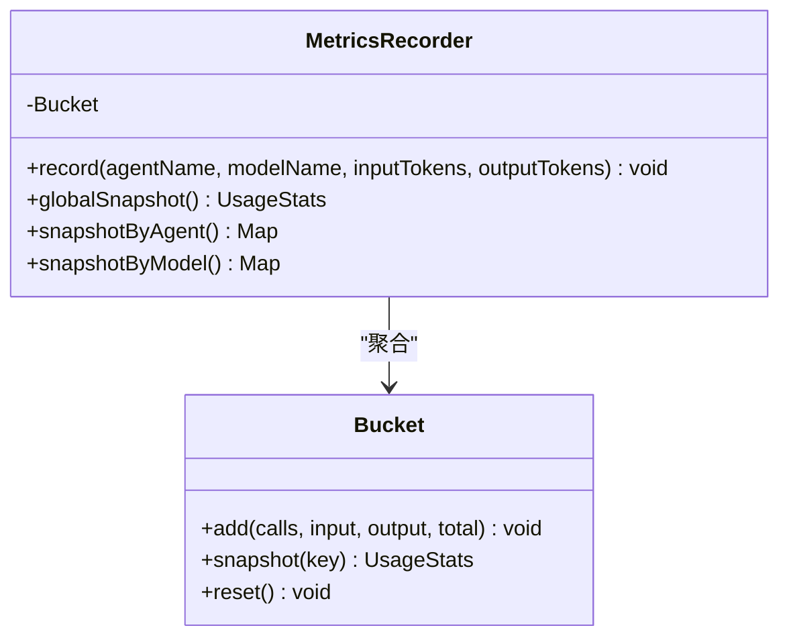
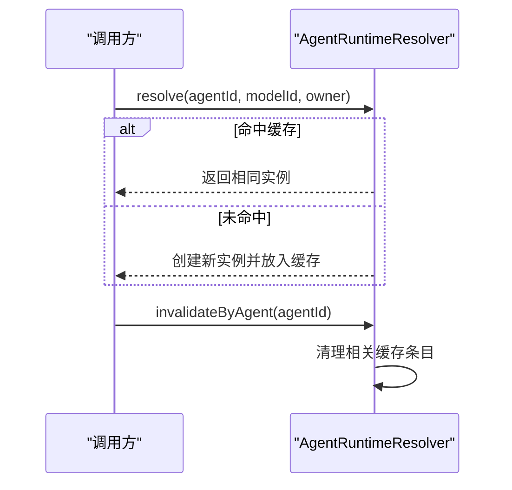
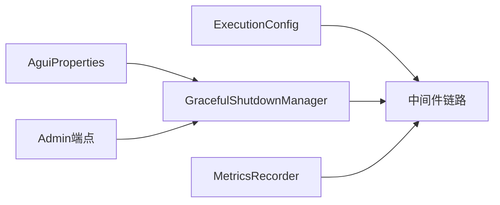

# 性能调优

<cite>
**本文引用的文件**   
- [GracefulShutdownManager.java](file://agentscope-core/src/main/java/io/agentscope/core/shutdown/GracefulShutdownManager.java)
- [ExecutionConfig.java](file://agentscope-core/src/main/java/io/agentscope/core/model/ExecutionConfig.java)
- [AguiProperties.java](file://agentscope-extensions/agentscope-spring-boot-starters/agentscope-agui-spring-boot-starter/src/main/java/io/agentscope/spring/boot/agui/common/AguiProperties.java)
- [MetricsRecorder.java](file://agentscope-extensions/agentscope-spring-boot-starters/agentscope-admin-spring-boot-starter/src/main/java/io/agentscope/spring/boot/admin/metrics/MetricsRecorder.java)
- [application.yml](file://agentscope-builder-saton/src/main/resources/application.yml)
- [AgentRuntimeResolver.java](file://agentscope-builder-saton/src/main/java/io/agentscope/builder/saton/agent/runtime/AgentRuntimeResolver.java)
- [AgentRuntimeResolverTest.java](file://agentscope-builder-saton/src/test/java/io/agentscope/builder/saton/agent/runtime/AgentRuntimeResolverTest.java)
- [code-review.instructions.md](file://.github/instructions/code-review.instructions.md)
- [AgentscopeShutdownEndpoint.java](file://agentscope-extensions/agentscope-spring-boot-starters/agentscope-admin-spring-boot-starter/src/main/java/io/agentscope/spring/boot/admin/endpoint/AgentscopeShutdownEndpoint.java)
- [AgentscopeDrainEndpoint.java](file://agentscope-extensions/agentscope-spring-boot-starters/agentscope-admin-spring-boot-starter/src/main/java/io/agentscope/spring/boot/admin/endpoint/AgentscopeDrainEndpoint.java)
</cite>

## 目录
1. [简介](#简介)
2. [项目结构](#项目结构)
3. [核心组件](#核心组件)
4. [架构总览](#架构总览)
5. [详细组件分析](#详细组件分析)
6. [依赖关系分析](#依赖关系分析)
7. [性能注意事项](#性能注意事项)
8. [故障排查指南](#故障排查指南)
9. [结论](#结论)
10. [附录](#附录)

## 简介
本指南面向AgentScope Java应用的性能调优实践，聚焦以下方面：
- JVM参数优化建议（堆大小、GC选择、内存分配策略）
- 并发配置（线程池、连接池、异步处理）
- 模型调用性能（超时与重试、批量与缓存）
- 数据库性能（查询与索引）
- 网络与I/O优化
- 性能基准测试与瓶颈定位方法

本指南结合仓库中的实际实现与配置，给出可落地的优化策略与最佳实践。

## 项目结构
AgentScope Java由多模块组成，核心与性能相关的关键位置如下：
- 核心运行时与中间件：agentscope-core
- AG-UI集成与并发控制：agentscope-extensions/.../agentscope-agui-spring-boot-starter
- 管理与可观测性：agentscope-extensions/.../agentscope-admin-spring-boot-starter
- 示例与配置：agentscope-builder-saton、agentscope-examples
- 测试与规范：单元测试与代码评审规范

[本图为概念性结构示意，无需图示来源]

## 核心组件
- 执行配置与重试：统一的超时与重试策略，支持指数退避与可插拔重试条件
- 优雅停机与请求跟踪：全局管理活跃请求、超时中断、状态保存与终止等待
- AG-UI并发与会话：基于线程的会话缓存、最大会话数与超时清理
- 指标统计：按全局/按代理/按模型维度记录调用次数与Token用量
- 应用配置：数据源、JPA、会话根目录等基础环境

**章节来源**
- [ExecutionConfig.java:1-395](file://agentscope-core/src/main/java/io/agentscope/core/model/ExecutionConfig.java#L1-L395)
- [GracefulShutdownManager.java:1-333](file://agentscope-core/src/main/java/io/agentscope/core/shutdown/GracefulShutdownManager.java#L1-L333)
- [AguiProperties.java:1-235](file://agentscope-extensions/agentscope-spring-boot-starters/agentscope-agui-spring-boot-starter/src/main/java/io/agentscope/spring/boot/agui/common/AguiProperties.java#L1-L235)
- [MetricsRecorder.java:36-100](file://agentscope-extensions/agentscope-spring-boot-starters/agentscope-admin-spring-boot-starter/src/main/java/io/agentscope/spring/boot/admin/metrics/MetricsRecorder.java#L36-L100)
- [application.yml:1-40](file://agentscope-builder-saton/src/main/resources/application.yml#L1-L40)

## 架构总览
AgentScope在运行时通过中间件链路组织“推理-模型调用-工具执行”的循环，并在关键节点插入性能监控与资源管理。系统通过执行配置控制超时与重试，通过优雅停机保障高并发下的安全关闭，通过指标统计实现端到端的性能观测。

**图示来源**
- [ExecutionConfig.java:275-297](file://agentscope-core/src/main/java/io/agentscope/core/model/ExecutionConfig.java#L275-L297)
- [MetricsRecorder.java:36-74](file://agentscope-extensions/agentscope-spring-boot-starters/agentscope-admin-spring-boot-starter/src/main/java/io/agentscope/spring/boot/admin/metrics/MetricsRecorder.java#L36-L74)
- [GracefulShutdownManager.java:211-226](file://agentscope-core/src/main/java/io/agentscope/core/shutdown/GracefulShutdownManager.java#L211-L226)

## 详细组件分析

### 组件A：执行配置与重试（ExecutionConfig）
- 设计要点
  - 统一超时、最大尝试次数、初始/最大退避、退避倍数与重试条件
  - 提供模型默认与工具默认配置，便于分场景优化
  - 支持多层合并，优先级从请求到组件再到系统默认
- 性能影响
  - 高并发下适当提高初始/最大退避，缓解上游限流
  - 工具执行默认禁用重试，避免阻塞与资源浪费
- 调优建议
  - 针对不同模型供应商与网络环境，定制超时与重试策略
  - 对易波动的上游接口启用指数退避，避免雪崩

**图示来源**
- [ExecutionConfig.java:56-394](file://agentscope-core/src/main/java/io/agentscope/core/model/ExecutionConfig.java#L56-L394)

**章节来源**
- [ExecutionConfig.java:36-170](file://agentscope-core/src/main/java/io/agentscope/core/model/ExecutionConfig.java#L36-L170)
- [ExecutionConfig.java:245-297](file://agentscope-core/src/main/java/io/agentscope/core/model/ExecutionConfig.java#L245-L297)

### 组件B：优雅停机与活跃请求管理（GracefulShutdownManager）
- 设计要点
  - 全局单例管理，原子状态机（RUNNING/SHUTTING_DOWN/TERMINATED）
  - 活跃请求按请求ID登记，支持超时强制中断与状态保存
  - 监控线程周期检查超时并触发中断
- 性能影响
  - 在高并发推理场景下，确保推理过程可被及时中断并落盘，避免资源泄漏
  - 提供等待终止能力，便于运维在变更或升级时安全停机
- 调优建议
  - 合理设置超时时间，兼顾业务完成度与停机窗口
  - 使用Actuator端点进行受控引流与停机

**图示来源**
- [GracefulShutdownManager.java:153-184](file://agentscope-core/src/main/java/io/agentscope/core/shutdown/GracefulShutdownManager.java#L153-L184)
- [GracefulShutdownManager.java:245-278](file://agentscope-core/src/main/java/io/agentscope/core/shutdown/GracefulShutdownManager.java#L245-L278)
- [GracefulShutdownManager.java:296-315](file://agentscope-core/src/main/java/io/agentscope/core/shutdown/GracefulShutdownManager.java#L296-L315)

**章节来源**
- [GracefulShutdownManager.java:40-151](file://agentscope-core/src/main/java/io/agentscope/core/shutdown/GracefulShutdownManager.java#L40-L151)
- [AgentscopeShutdownEndpoint.java:58-109](file://agentscope-extensions/agentscope-spring-boot-starters/agentscope-admin-spring-boot-starter/src/main/java/io/agentscope/spring/boot/admin/endpoint/AgentscopeShutdownEndpoint.java#L58-L109)
- [AgentscopeDrainEndpoint.java:65-94](file://agentscope-extensions/agentscope-spring-boot-starters/agentscope-admin-spring-boot-starter/src/main/java/io/agentscope/spring/boot/admin/endpoint/AgentscopeDrainEndpoint.java#L65-L94)

### 组件C：AG-UI并发与会话缓存（AguiProperties）
- 设计要点
  - 支持按线程ID维护会话实例，实现服务端侧记忆
  - 限制最大线程会话数与会话超时，防止内存膨胀
  - SSE超时控制，避免长连接占用资源
- 性能影响
  - 适度增加最大会话数可提升并发吞吐，但需配合内存与GC策略
  - 合理的会话超时可降低无效会话占用
- 调优建议
  - 根据峰值QPS与平均会话时长估算最大会话数
  - 开启服务端记忆时关注Token增长与压缩策略

**图示来源**
- [AguiProperties.java:80-113](file://agentscope-extensions/agentscope-spring-boot-starters/agentscope-agui-spring-boot-starter/src/main/java/io/agentscope/spring/boot/agui/common/AguiProperties.java#L80-L113)

**章节来源**
- [AguiProperties.java:195-233](file://agentscope-extensions/agentscope-spring-boot-starters/agentscope-agui-spring-boot-starter/src/main/java/io/agentscope/spring/boot/agui/common/AguiProperties.java#L195-L233)

### 组件D：指标统计与Token用量（MetricsRecorder）
- 设计要点
  - 全局与按代理/模型维度累计调用次数与Token用量
  - 使用无锁累加器减少竞争开销
- 性能影响
  - 低侵入式统计有助于定位热点代理与模型
  - 为限流与扩容提供数据支撑
- 调优建议
  - 将统计埋点与业务主路径分离，避免阻塞关键链路
  - 结合日志与APM，形成闭环观测

**图示来源**
- [MetricsRecorder.java:36-100](file://agentscope-extensions/agentscope-spring-boot-starters/agentscope-admin-spring-boot-starter/src/main/java/io/agentscope/spring/boot/admin/metrics/MetricsRecorder.java#L36-L100)

**章节来源**
- [MetricsRecorder.java:36-74](file://agentscope-extensions/agentscope-spring-boot-starters/agentscope-admin-spring-boot-starter/src/main/java/io/agentscope/spring/boot/admin/metrics/MetricsRecorder.java#L36-L74)

### 组件E：应用配置与数据库（application.yml）
- 设计要点
  - 数据源与JPA配置，控制DDL行为与SQL格式化
  - 会话与工作区根目录，影响I/O与磁盘占用
- 性能影响
  - DDL自动更新适合开发环境，生产建议显式迁移
  - SQL格式化在生产应关闭以减少输出开销
- 调优建议
  - 生产环境开启只读或最小DDL策略
  - 关闭show-sql，避免频繁格式化带来的CPU消耗

**章节来源**
- [application.yml:9-23](file://agentscope-builder-saton/src/main/resources/application.yml#L9-L23)
- [application.yml:35-40](file://agentscope-builder-saton/src/main/resources/application.yml#L35-L40)

### 组件F：代理运行时缓存（AgentRuntimeResolver）
- 设计要点
  - 基于键（代理定义ID、模型提供者ID）缓存代理实例
  - 支持按代理或模型维度失效，保证缓存一致性
- 性能影响
  - 缓存命中可显著降低实例创建成本
  - 失效策略需平衡一致性与性能
- 调优建议
  - 在模型或代理配置变更时主动失效，避免陈旧实例
  - 结合会话缓存与Token压缩，降低整体内存压力

**图示来源**
- [AgentRuntimeResolver.java:58-83](file://agentscope-builder-saton/src/main/java/io/agentscope/builder/saton/agent/runtime/AgentRuntimeResolver.java#L58-L83)

**章节来源**
- [AgentRuntimeResolver.java:58-83](file://agentscope-builder-saton/src/main/java/io/agentscope/builder/saton/agent/runtime/AgentRuntimeResolver.java#L58-L83)
- [AgentRuntimeResolverTest.java:52-92](file://agentscope-builder-saton/src/test/java/io/agentscope/builder/saton/agent/runtime/AgentRuntimeResolverTest.java#L52-L92)

## 依赖关系分析
- 组件耦合
  - 执行配置被中间件链路广泛使用，作为统一的超时与重试策略
  - 优雅停机管理贯穿推理生命周期，与中间件存在交互点
  - 指标统计与执行配置、中间件链路协同，形成可观测闭环
- 外部依赖
  - Spring Boot Starter提供属性绑定与自动装配
  - Actuator端点用于运维控制（引流/停机）

**图示来源**
- [ExecutionConfig.java:275-297](file://agentscope-core/src/main/java/io/agentscope/core/model/ExecutionConfig.java#L275-L297)
- [GracefulShutdownManager.java:211-226](file://agentscope-core/src/main/java/io/agentscope/core/shutdown/GracefulShutdownManager.java#L211-L226)
- [MetricsRecorder.java:36-74](file://agentscope-extensions/agentscope-spring-boot-starters/agentscope-admin-spring-boot-starter/src/main/java/io/agentscope/spring/boot/admin/metrics/MetricsRecorder.java#L36-L74)
- [AguiProperties.java:195-233](file://agentscope-extensions/agentscope-spring-boot-starters/agentscope-agui-spring-boot-starter/src/main/java/io/agentscope/spring/boot/agui/common/AguiProperties.java#L195-L233)

## 性能注意事项
- JVM参数优化
  - 堆大小：根据峰值会话数与消息长度估算堆需求，预留晋升区域与元空间
  - GC选择：优先考虑G1或ZGC，降低STW与碎片风险；对延迟敏感场景评估ZGC
  - 内存分配：新生代与老年代比例匹配业务特征；开启指针压缩（>=32G堆）
- 并发配置
  - 线程池：核心线程数与队列容量匹配模型调用耗时与突发流量
  - 连接池：数据库与外部HTTP连接池上限与空闲回收策略
  - 异步处理：Reactor链路避免阻塞操作，必要时切换弹性调度器
- 模型调用
  - 超时与重试：针对不同供应商与网络环境定制退避策略
  - 批量处理：合并小请求，减少握手与序列化开销
  - 缓存策略：代理实例与会话缓存、Token压缩与持久化刷写
- 数据库
  - 查询优化：避免N+1、使用合适的JOIN与投影
  - 索引配置：覆盖高频过滤/排序字段，定期分析执行计划
- 网络与I/O
  - 连接复用与保活，合理设置超时
  - 文件I/O：批量化写入、异步刷盘、磁盘队列缓冲
- 基准测试与瓶颈识别
  - 基准：固定负载与随机化输入，测量P50/P95/P99延迟与错误率
  - 方法：火焰图、线程转储、GC日志、慢查询日志
  - 解决：定位CPU热点、内存泄漏、锁争用与阻塞点

[本节为通用指导，不直接分析具体文件]

## 故障排查指南
- 优雅停机异常
  - 现象：停机超时后仍存在活跃请求
  - 排查：确认超时配置、监控中断信号是否下发、状态保存是否成功
  - 参考端点：/actuator/agentscope-drain 与 /actuator/agentscope-shutdown
- 指标缺失
  - 现象：Token用量统计为空
  - 排查：确认记录调用路径、维度标签是否为空、快照是否被重置
- 会话过多导致内存上涨
  - 现象：服务端内存持续增长
  - 排查：检查最大会话数与超时配置、清理策略是否生效
- 执行超时/重试风暴
  - 现象：上游限流或抖动导致大量重试
  - 排查：调整初始/最大退避、重试条件与熔断策略

**章节来源**
- [AgentscopeDrainEndpoint.java:65-94](file://agentscope-extensions/agentscope-spring-boot-starters/agentscope-admin-spring-boot-starter/src/main/java/io/agentscope/spring/boot/admin/endpoint/AgentscopeDrainEndpoint.java#L65-L94)
- [AgentscopeShutdownEndpoint.java:58-109](file://agentscope-extensions/agentscope-spring-boot-starters/agentscope-admin-spring-boot-starter/src/main/java/io/agentscope/spring/boot/admin/endpoint/AgentscopeShutdownEndpoint.java#L58-L109)
- [MetricsRecorder.java:61-74](file://agentscope-extensions/agentscope-spring-boot-starters/agentscope-admin-spring-boot-starter/src/main/java/io/agentscope/spring/boot/admin/metrics/MetricsRecorder.java#L61-L74)
- [AguiProperties.java:195-233](file://agentscope-extensions/agentscope-spring-boot-starters/agentscope-agui-spring-boot-starter/src/main/java/io/agentscope/spring/boot/agui/common/AguiProperties.java#L195-L233)
- [ExecutionConfig.java:93-134](file://agentscope-core/src/main/java/io/agentscope/core/model/ExecutionConfig.java#L93-L134)

## 结论
通过统一的执行配置、优雅停机管理、并发与会话缓存、指标统计与应用配置，AgentScope Java在高并发与复杂推理场景下具备良好的可调优性。建议以“可观测—可控制—可扩展”为主线，结合业务特征迭代优化JVM、并发与模型调用策略，持续完善数据库与网络I/O，最终达成稳定、低延迟与高吞吐的目标。

[本节为总结性内容，不直接分析具体文件]

## 附录
- 代码评审性能关注点
  - 避免在Reactor链路中使用阻塞调用
  - 资源必须正确关闭，防止连接与句柄泄露
  - 减少不必要的对象创建，优先使用不可变结构
  - 避免N+1查询，采用批量加载与投影裁剪

**章节来源**
- [code-review.instructions.md:22-27](file://.github/instructions/code-review.instructions.md#L22-L27)