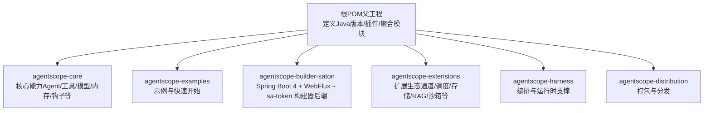
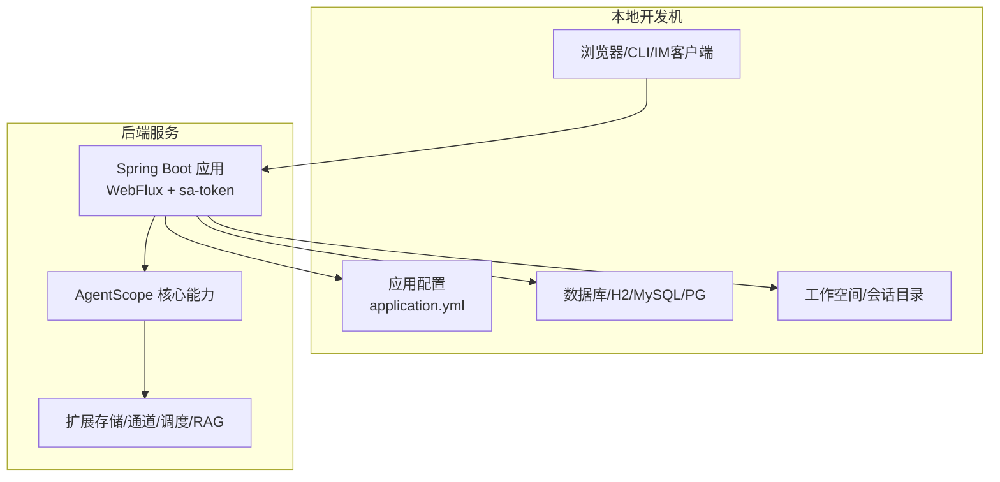
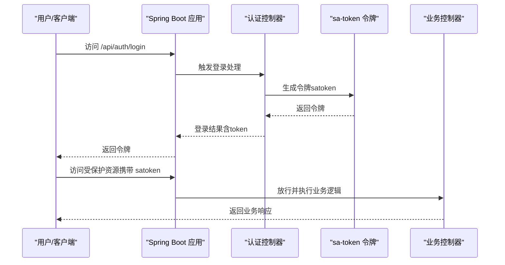
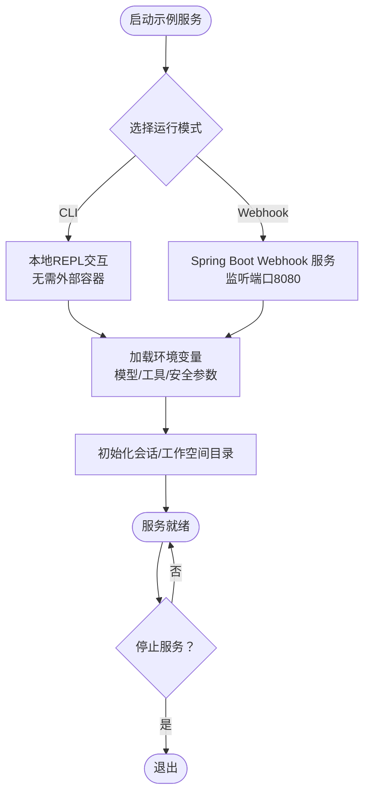
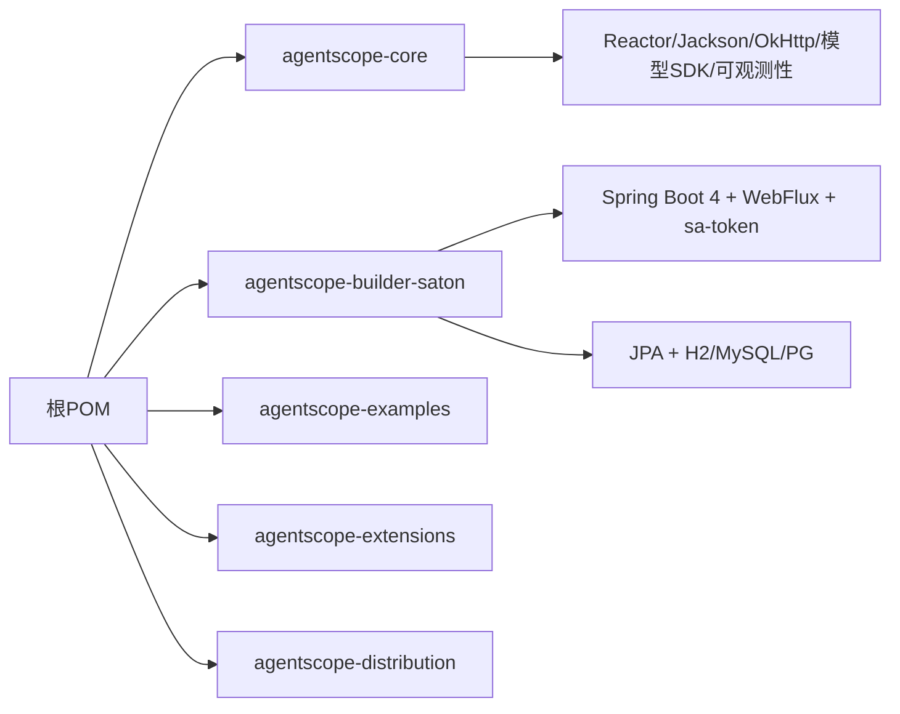

# 本地部署

<cite>
**本文引用的文件**
- [根POM（父工程）](file://pom.xml)
- [核心模块POM（agentscope-core）](file://agentscope-core/pom.xml)
- [构建器（sa-token版）模块POM（agentscope-builder-saton）](file://agentscope-builder-saton/pom.xml)
- [构建器（sa-token版）应用配置](file://agentscope-builder-saton/src/main/resources/application.yml)
- [构建器（sa-token版）测试配置](file://agentscope-builder-saton/src/test/resources/application.yml)
- [构建器（sa-token版）说明文档](file://agentscope-builder-saton/README.md)
- [示例总览与快速开始](file://agentscope-examples/README.md)
- [编码代理示例环境变量参考](file://agentscope-examples/agents/agentscope-codingagent/ENV_VARS.md)
- [编码代理示例说明文档](file://agentscope-examples/agents/agentscope-codingagent/README.md)
- [项目总说明文档](file://README.md)
</cite>

## 目录
1. [简介](#简介)
2. [项目结构](#项目结构)
3. [核心组件](#核心组件)
4. [架构概览](#架构概览)
5. [详细组件分析](#详细组件分析)
6. [依赖分析](#依赖分析)
7. [性能考虑](#性能考虑)
8. [故障排查指南](#故障排查指南)
9. [结论](#结论)
10. [附录](#附录)

## 简介
本指南面向在单机环境下部署 AgentScope Java 的用户，覆盖从环境准备、依赖安装、配置设置到启动/停止服务与调试的完整流程，并针对 Windows、Linux、macOS 的差异给出注意事项。同时提供环境变量清单（含API密钥、数据库连接、工作空间等），并给出常见问题排查建议。

## 项目结构
AgentScope Java 采用多模块 Maven 结构，核心模块提供 Agent、工具、模型、内存、钩子等基础能力；示例模块演示典型用法；构建器模块提供基于 Spring Boot 4 + WebFlux + sa-token 的“多工厂”构建平台后端。

图表来源
- [根POM（父工程）:57-64](file://pom.xml#L57-L64)
- [核心模块POM（agentscope-core）:22-31](file://agentscope-core/pom.xml#L22-L31)
- [构建器（sa-token版）模块POM（agentscope-builder-saton）:7-10](file://agentscope-builder-saton/pom.xml#L7-L10)

章节来源
- [根POM（父工程）:29-55](file://pom.xml#L29-L55)
- [项目总说明文档:72-100](file://README.md#L72-L100)

## 核心组件
- 运行时与框架
  - JDK 17+（核心模块要求）、Maven 3.6+（示例要求）
  - Spring Boot 4 + WebFlux（构建器模块）
- 关键依赖
  - Reactor（响应式）、Jackson（序列化）、OkHttp（HTTP客户端）
  - OpenTelemetry（可观测性）、OpenAI/Anthropic/DashScope/Gemini 等模型SDK
  - H2/MySQL/PG（构建器默认H2，可切换）
  - Lombok（实体与日志注解）
- 示例与运行方式
  - 示例通过 Maven exec 或 spring-boot:run 启动
  - 编码代理示例支持 CLI 与 Webhook 两种运行形态

章节来源
- [根POM（父工程）:33-35](file://pom.xml#L33-L35)
- [示例总览与快速开始:7-12](file://agentscope-examples/README.md#L7-L12)
- [构建器（sa-token版）模块POM（agentscope-builder-saton）:18-25](file://agentscope-builder-saton/pom.xml#L18-L25)
- [核心模块POM（agentscope-core）:52-176](file://agentscope-core/pom.xml#L52-L176)

## 架构概览
单机本地部署通常涉及两类服务：
- 构建器后端（Spring Boot 4 + WebFlux + sa-token）
- 示例服务（如编码代理的 Webhook 服务）

图表来源
- [构建器（sa-token版）应用配置:1-40](file://agentscope-builder-saton/src/main/resources/application.yml#L1-L40)
- [构建器（sa-token版）模块POM（agentscope-builder-saton）:48-81](file://agentscope-builder-saton/pom.xml#L48-L81)
- [核心模块POM（agentscope-core）:52-176](file://agentscope-core/pom.xml#L52-L176)

## 详细组件分析

### 构建器后端（Spring Boot 4 + WebFlux + sa-token）
- 启动方式
  - 使用 Maven 插件直接启动：mvn spring-boot:run
  - 默认监听端口：8080
  - 默认认证：sa-token，令牌名 satoken，默认超时7天
- 存储与工作空间
  - 数据源默认使用 H2 文件模式（可切换 MySQL/PG）
  - 会话与工作空间路径可通过配置项设置
- 安全与鉴权
  - 基于 sa-token 的令牌管理，支持并发共享与日志开关
- 开发与测试
  - 测试配置使用内存型 H2，便于本地验证

图表来源
- [构建器（sa-token版）说明文档:11-30](file://agentscope-builder-saton/README.md#L11-L30)
- [构建器（sa-token版）应用配置:26-34](file://agentscope-builder-saton/src/main/resources/application.yml#L26-L34)

章节来源
- [构建器（sa-token版）说明文档:11-39](file://agentscope-builder-saton/README.md#L11-L39)
- [构建器（sa-token版）应用配置:1-40](file://agentscope-builder-saton/src/main/resources/application.yml#L1-L40)
- [构建器（sa-token版）测试配置:1-23](file://agentscope-builder-saton/src/test/resources/application.yml#L1-L23)
- [构建器（sa-token版）模块POM（agentscope-builder-saton）:48-81](file://agentscope-builder-saton/pom.xml#L48-L81)

### 示例服务（以编码代理为例）
- 运行形态
  - CLI：无需 Docker，适合本地快速试用
  - Webhook 服务：监听端口 8080（可配置），支持 GitHub/DingTalk/Feishu 等渠道
- 环境变量
  - 必需：如模型API密钥、GitHub Webhook 密钥等
  - 可选：Docker 守护进程地址、搜索工具密钥、加密密钥集、分布式追踪端点等
- 会话与工作空间
  - 会话目录与工作空间目录可配置，避免污染宿主机项目树

图表来源
- [编码代理示例说明文档:147-222](file://agentscope-examples/agents/agentscope-codingagent/README.md#L147-L222)
- [编码代理示例环境变量参考:1-76](file://agentscope-examples/agents/agentscope-codingagent/ENV_VARS.md#L1-L76)

章节来源
- [编码代理示例说明文档:147-222](file://agentscope-examples/agents/agentscope-codingagent/README.md#L147-L222)
- [编码代理示例环境变量参考:1-76](file://agentscope-examples/agents/agentscope-codingagent/ENV_VARS.md#L1-L76)

## 依赖分析
- 版本与兼容性
  - 根工程统一管理 Java 版本（17），核心模块同样要求 17
  - 构建器模块使用 Spring Boot 4 与 sa-token-reactor-spring-boot4-starter
- 依赖导入
  - 通过 BOM 与 dependencyManagement 统一版本，避免冲突
- 典型依赖链
  - 核心模块：Reactor、Jackson、OkHttp、OpenTelemetry、各模型SDK
  - 构建器模块：WebFlux、sa-token、JPA/H2/MySQL/PG、Lombok、AgentScope 核心与 Harness

图表来源
- [根POM（父工程）:133-150](file://pom.xml#L133-L150)
- [核心模块POM（agentscope-core）:52-176](file://agentscope-core/pom.xml#L52-L176)
- [构建器（sa-token版）模块POM（agentscope-builder-saton）:27-45](file://agentscope-builder-saton/pom.xml#L27-L45)

章节来源
- [根POM（父工程）:133-150](file://pom.xml#L133-L150)
- [核心模块POM（agentscope-core）:52-176](file://agentscope-core/pom.xml#L52-L176)
- [构建器（sa-token版）模块POM（agentscope-builder-saton）:27-45](file://agentscope-builder-saton/pom.xml#L27-L45)

## 性能考虑
- JVM 内存
  - 根工程已设置默认堆大小参数，可根据本地资源调整
- 响应式与非阻塞
  - 使用 Reactor 与 WebFlux，减少线程阻塞，提升吞吐
- 观测性
  - OpenTelemetry 集成，便于定位瓶颈与异常

章节来源
- [根POM（父工程）:54-55](file://pom.xml#L54-L55)
- [核心模块POM（agentscope-core）:162-175](file://agentscope-core/pom.xml#L162-L175)

## 故障排查指南
- 环境变量缺失
  - 示例需要模型API密钥；若未设置，示例会提示交互输入
  - 编码代理示例需要 GitHub Webhook 密钥、模型密钥、可选搜索工具密钥等
- 数据库连接失败
  - 构建器默认使用 H2 文件模式；如切换至 MySQL/PG，请确认驱动与连接串正确
  - 测试配置使用内存型 H2，避免磁盘副作用
- 端口占用
  - 默认端口 8080；如被占用，可在配置中修改或通过环境变量覆盖
- 本地仓库与依赖
  - 构建器模块说明文档提示本地仓库路径，确保 Maven settings.xml 正确配置
- 日志与调试
  - 示例文档提供了添加调试日志的方法（系统属性）
- Docker 与沙箱
  - 如启用 Docker 沙箱，需确保 Docker 守护进程可达（socket或远程地址）

章节来源
- [示例总览与快速开始:357-386](file://agentscope-examples/README.md#L357-L386)
- [编码代理示例说明文档:206-222](file://agentscope-examples/agents/agentscope-codingagent/README.md#L206-L222)
- [构建器（sa-token版）说明文档:32-39](file://agentscope-builder-saton/README.md#L32-L39)
- [构建器（sa-token版）应用配置:1-40](file://agentscope-builder-saton/src/main/resources/application.yml#L1-L40)
- [构建器（sa-token版）测试配置:1-23](file://agentscope-builder-saton/src/test/resources/application.yml#L1-L23)

## 结论
在单机环境下部署 AgentScope Java 的关键在于：满足 JDK 与 Maven 版本要求、正确设置环境变量与数据库配置、选择合适的运行模式（CLI/Webhook），并在需要时启用 Docker 沙箱。通过本文档提供的步骤与配置清单，可快速完成本地开发与调试。

## 附录

### 本地部署步骤（Windows/Linux/macOS）
- 准备环境
  - 安装 JDK 17+ 与 Maven 3.6+
  - 准备数据库（默认 H2 文件模式；如需 MySQL/PG，请提前安装并准备账号）
- 获取代码与构建
  - 在项目根目录执行 Maven 安装，确保核心模块与示例可用
- 设置环境变量
  - 根据所选示例与功能设置相应变量（见下一节）
- 启动服务
  - 构建器后端：mvn spring-boot:run，默认监听 8080
  - 示例服务：按示例说明选择 CLI 或 Webhook 模式
- 停止服务
  - Ctrl+C 或在 IDE 中停止对应进程
- 启用调试
  - 示例文档提供了通过系统属性开启调试日志的方式

章节来源
- [根POM（父工程）:33-35](file://pom.xml#L33-L35)
- [示例总览与快速开始:7-12](file://agentscope-examples/README.md#L7-L12)
- [构建器（sa-token版）说明文档:11-15](file://agentscope-builder-saton/README.md#L11-L15)

### 环境变量配置清单
- API密钥
  - 模型提供商密钥（如 DashScope/OpenAI/Anthropic/Gemini 等）
  - GitHub Webhook 密钥（用于编码代理 Webhook 服务）
- 数据库连接
  - H2（默认文件模式）：无需额外配置
  - MySQL/PG：需设置连接串、用户名、密码（构建器模块支持 JDBC profile 切换）
- 工作空间与会话
  - 会话根目录与工作空间根目录（构建器应用配置项）
- 其他
  - Docker 守护进程地址（当启用 Docker 沙箱时）
  - 分布式追踪端点（可选）
  - 加密密钥集（用于敏感信息加密存储，构建器模块有专用密钥环境变量）

章节来源
- [编码代理示例环境变量参考:1-76](file://agentscope-examples/agents/agentscope-codingagent/ENV_VARS.md#L1-L76)
- [构建器（sa-token版）应用配置:35-40](file://agentscope-builder-saton/src/main/resources/application.yml#L35-L40)
- [构建器（sa-token版）模块POM（agentscope-builder-saton）:61-75](file://agentscope-builder-saton/pom.xml#L61-L75)