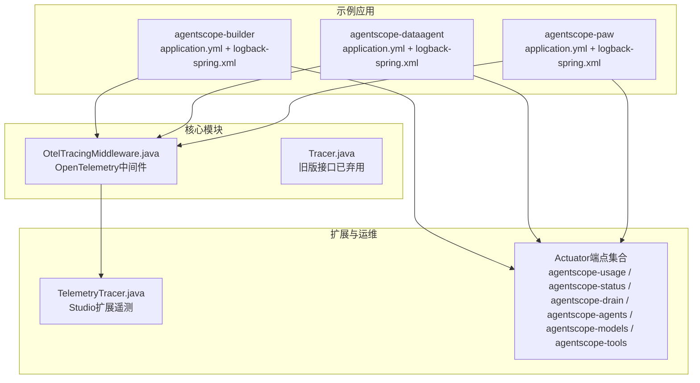
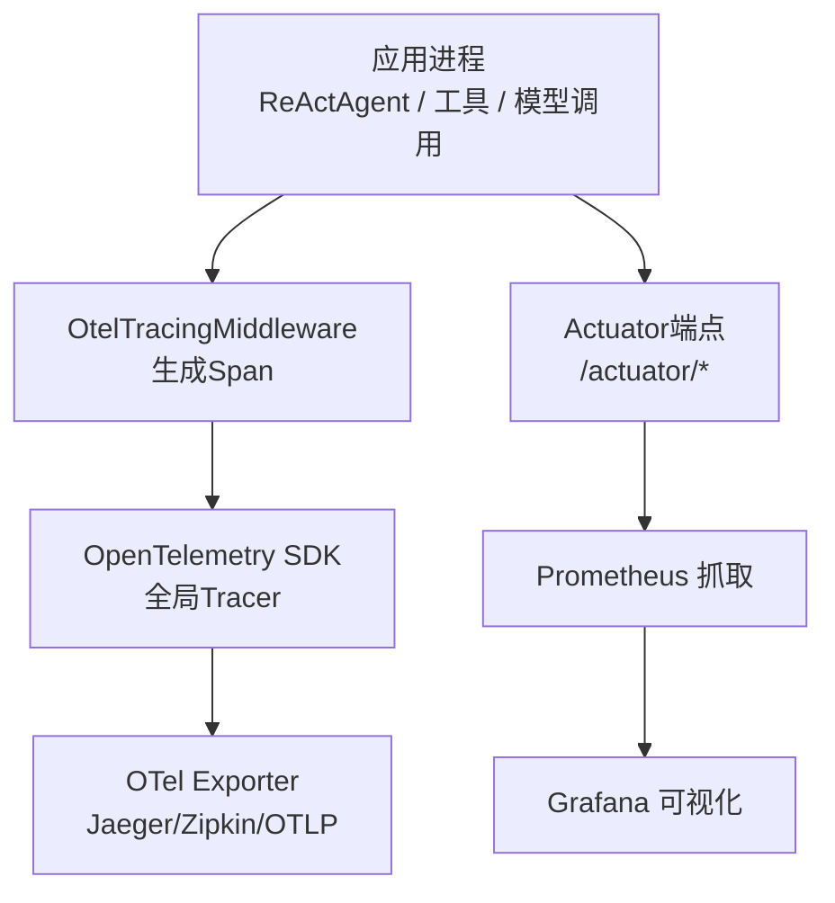
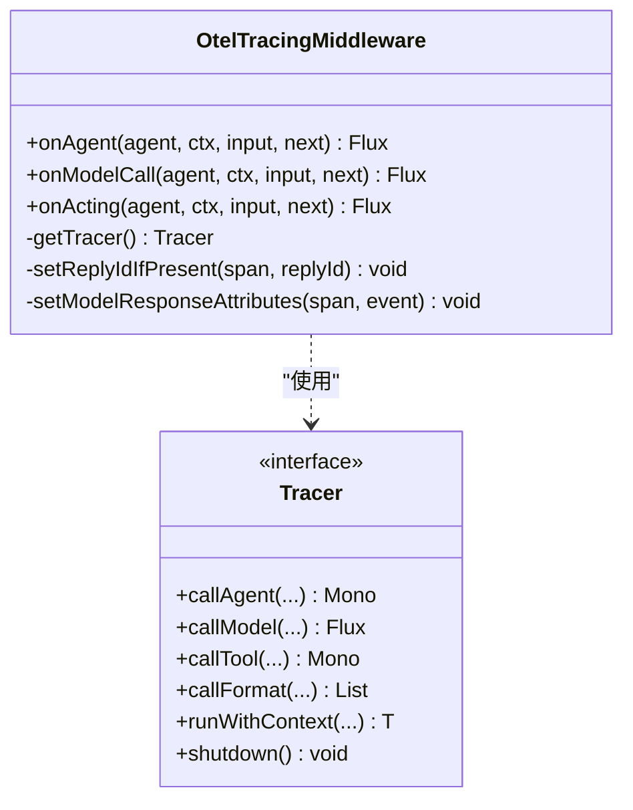
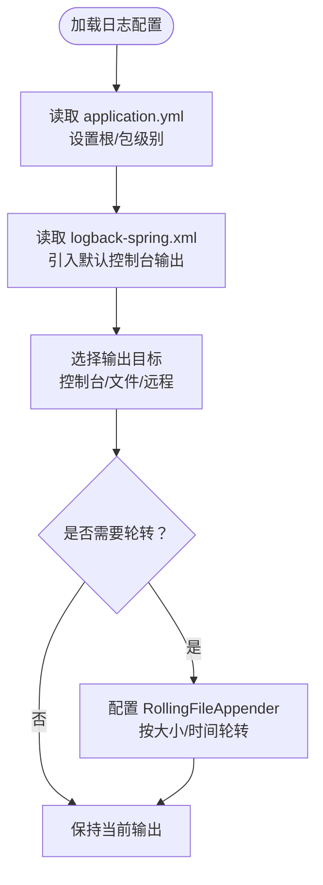
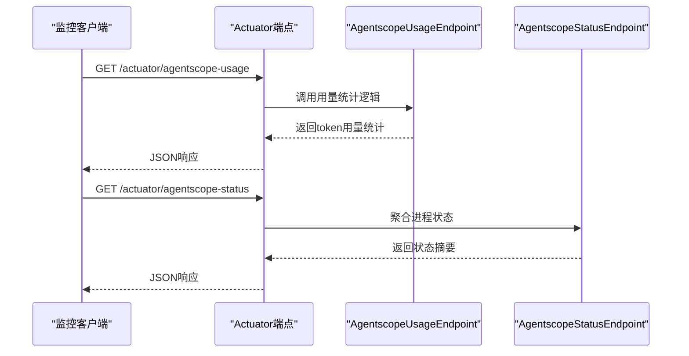
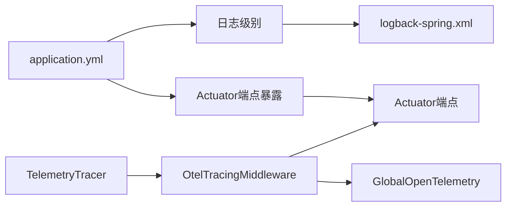

# 监控与日志

<cite>
**本文引用的文件**
- [application.yml（示例：agentscope-builder）](file://agentscope-examples/agents/agentscope-builder/src/main/resources/application.yml)
- [logback-spring.xml（示例：agentscope-builder）](file://agentscope-examples/agents/agentscope-builder/src/main/resources/logback-spring.xml)
- [OtelTracingMiddleware.java](file://agentscope-core/src/main/java/io/agentscope/core/tracing/OtelTracingMiddleware.java)
- [Tracer.java](file://agentscope-core/src/main/java/io/agentscope/core/tracing/Tracer.java)
- [TelemetryTracer.java](file://agentscope-extensions/agentscope-extensions-studio/src/main/java/io/agentscope/core/tracing/telemetry/TelemetryTracer.java)
- [application.yml（示例：agentscope-builder-saton）](file://agentscope-builder-saton/src/main/resources/application.yml)
- [application-jdbc.yml（示例：agentscope-builder-saton）](file://agentscope-builder-saton/src/main/resources/application-jdbc.yml)
- [AgentscopeUsageEndpoint.java](file://agentscope-extensions/agentscope-spring-boot-starters/agentscope-admin-spring-boot-starter/src/main/java/io/agentscope/spring/boot/admin/endpoint/AgentscopeUsageEndpoint.java)
- [AgentscopeStatusEndpoint.java](file://agentscope-extensions/agentscope-spring-boot-starters/agentscope-admin-spring-boot-starter/src/main/java/io/agentscope/spring/boot/admin/endpoint/AgentscopeStatusEndpoint.java)
- [AgentscopeDrainEndpoint.java](file://agentscope-extensions/agentscope-spring-boot-starters/agentscope-admin-spring-boot-starter/src/main/java/io/agentscope/spring/boot/admin/endpoint/AgentscopeDrainEndpoint.java)
- [AgentscopeAgentsEndpoint.java](file://agentscope-extensions/agentscope-spring-boot-starters/agentscope-admin-spring-boot-starter/src/main/java/io/agentscope/spring/boot/admin/endpoint/AgentscopeAgentsEndpoint.java)
- [AgentscopeModelsEndpoint.java](file://agentscope-extensions/agentscope-spring-boot-starters/agentscope-admin-spring-boot-starter/src/main/java/io/agentscope/spring/boot/admin/endpoint/AgentscopeModelsEndpoint.java)
- [AgentscopeToolsEndpoint.java](file://agentscope-extensions/agentscope-spring-boot-starters/agentscope-admin-spring-boot-starter/src/main/java/io/agentscope/spring/boot/admin/endpoint/AgentscopeToolsEndpoint.java)
</cite>

## 目录
1. [简介](#简介)
2. [项目结构](#项目结构)
3. [核心组件](#核心组件)
4. [架构总览](#架构总览)
5. [详细组件分析](#详细组件分析)
6. [依赖关系分析](#依赖关系分析)
7. [性能考量](#性能考量)
8. [故障排查指南](#故障排查指南)
9. [结论](#结论)
10. [附录](#附录)

## 简介
本指南面向AgentScope Java项目的监控与日志配置，重点覆盖以下方面：
- OpenTelemetry集成与追踪：如何启用并使用中间件生成调用链路、模型调用与工具执行的Span，并标注通用语义属性。
- 日志系统：基于Spring Boot默认的日志配置与Logback扩展，说明日志级别、输出格式与轮转策略的可选方案。
- 指标与可观测性：结合Spring Boot Actuator端点与Micrometer生态，给出指标采集与暴露建议。
- 分布式追踪最佳实践：Span命名、属性标注、错误处理与上下文传播。
- 告警与通知：通过外部监控系统（如Prometheus+Alertmanager+Grafana）对接指标与日志。
- 日志聚合与分析：推荐与ELK/EFK或云原生日志平台的集成思路。

## 项目结构
AgentScope Java采用多模块结构，监控与日志相关的关键位置如下：
- 配置与日志：各示例模块与业务模块均提供application.yml与logback配置文件，便于按需定制。
- 追踪中间件：核心模块提供OpenTelemetry中间件，用于在代理生命周期中自动注入Span。
- 管理端点：管理与运维启动器模块提供Actuator扩展端点，用于运行时状态、用量统计等信息导出。

图表来源
- [application.yml（示例：agentscope-builder）:106-119](file://agentscope-examples/agents/agentscope-builder/src/main/resources/application.yml#L106-L119)
- [logback-spring.xml（示例：agentscope-builder）:1-14](file://agentscope-examples/agents/agentscope-builder/src/main/resources/logback-spring.xml#L1-L14)
- [OtelTracingMiddleware.java:1-256](file://agentscope-core/src/main/java/io/agentscope/core/tracing/OtelTracingMiddleware.java#L1-L256)
- [Tracer.java:1-75](file://agentscope-core/src/main/java/io/agentscope/core/tracing/Tracer.java#L1-L75)
- [TelemetryTracer.java](file://agentscope-extensions/agentscope-extensions-studio/src/main/java/io/agentscope/core/tracing/telemetry/TelemetryTracer.java)
- [AgentscopeUsageEndpoint.java:1-36](file://agentscope-extensions/agentscope-spring-boot-starters/agentscope-admin-spring-boot-starter/src/main/java/io/agentscope/spring/boot/admin/endpoint/AgentscopeUsageEndpoint.java#L1-L36)
- [AgentscopeStatusEndpoint.java:1-46](file://agentscope-extensions/agentscope-spring-boot-starters/agentscope-admin-spring-boot-starter/src/main/java/io/agentscope/spring/boot/admin/endpoint/AgentscopeStatusEndpoint.java#L1-L46)
- [AgentscopeDrainEndpoint.java:30-63](file://agentscope-extensions/agentscope-spring-boot-starters/agentscope-admin-spring-boot-starter/src/main/java/io/agentscope/spring/boot/admin/endpoint/AgentscopeDrainEndpoint.java#L30-L63)
- [AgentscopeAgentsEndpoint.java:1-38](file://agentscope-extensions/agentscope-spring-boot-starters/agentscope-admin-spring-boot-starter/src/main/java/io/agentscope/spring/boot/admin/endpoint/AgentscopeAgentsEndpoint.java#L1-L38)
- [AgentscopeModelsEndpoint.java:1-37](file://agentscope-extensions/agentscope-spring-boot-starters/agentscope-admin-spring-boot-starter/src/main/java/io/agentscope/spring/boot/admin/endpoint/AgentscopeModelsEndpoint.java#L1-L37)
- [AgentscopeToolsEndpoint.java:1-38](file://agentscope-extensions/agentscope-spring-boot-starters/agentscope-admin-spring-boot-starter/src/main/java/io/agentscope/spring/boot/admin/endpoint/AgentscopeToolsEndpoint.java#L1-L38)

章节来源
- [application.yml（示例：agentscope-builder）:106-119](file://agentscope-examples/agents/agentscope-builder/src/main/resources/application.yml#L106-L119)
- [logback-spring.xml（示例：agentscope-builder）:1-14](file://agentscope-examples/agents/agentscope-builder/src/main/resources/logback-spring.xml#L1-L14)
- [OtelTracingMiddleware.java:1-256](file://agentscope-core/src/main/java/io/agentscope/core/tracing/OtelTracingMiddleware.java#L1-L256)
- [Tracer.java:1-75](file://agentscope-core/src/main/java/io/agentscope/core/tracing/Tracer.java#L1-L75)
- [TelemetryTracer.java](file://agentscope-extensions/agentscope-extensions-studio/src/main/java/io/agentscope/core/tracing/telemetry/TelemetryTracer.java)
- [AgentscopeUsageEndpoint.java:1-36](file://agentscope-extensions/agentscope-spring-boot-starters/agentscope-admin-spring-boot-starter/src/main/java/io/agentscope/spring/boot/admin/endpoint/AgentscopeUsageEndpoint.java#L1-L36)
- [AgentscopeStatusEndpoint.java:1-46](file://agentscope-extensions/agentscope-spring-boot-starters/agentscope-admin-spring-boot-starter/src/main/java/io/agentscope/spring/boot/admin/endpoint/AgentscopeStatusEndpoint.java#L1-L46)
- [AgentscopeDrainEndpoint.java:30-63](file://agentscope-extensions/agentscope-spring-boot-starters/agentscope-admin-spring-boot-starter/src/main/java/io/agentscope/spring/boot/admin/endpoint/AgentscopeDrainEndpoint.java#L30-L63)
- [AgentscopeAgentsEndpoint.java:1-38](file://agentscope-extensions/agentscope-spring-boot-starters/agentscope-admin-spring-boot-starter/src/main/java/io/agentscope/spring/boot/admin/endpoint/AgentscopeAgentsEndpoint.java#L1-L38)
- [AgentscopeModelsEndpoint.java:1-37](file://agentscope-extensions/agentscope-spring-boot-starters/agentscope-admin-spring-boot-starter/src/main/java/io/agentscope/spring/boot/admin/endpoint/AgentscopeModelsEndpoint.java#L1-L37)
- [AgentscopeToolsEndpoint.java:1-38](file://agentscope-extensions/agentscope-spring-boot-starters/agentscope-admin-spring-boot-starter/src/main/java/io/agentscope/spring/boot/admin/endpoint/AgentscopeToolsEndpoint.java#L1-L38)

## 核心组件
- OpenTelemetry中间件：在代理调用、模型调用、工具执行三个关键阶段生成Span，并设置通用语义属性，支持无SDK时的零开销短路。
- 日志配置：基于Spring Boot默认日志与Logback扩展，示例模块提供根日志级别与包级日志级别的配置模板。
- Actuator端点：提供运行时状态、用量统计、节点排空等运维能力，便于与监控系统对接。
- Studio扩展遥测：提供更丰富的GEN AI属性与消息聚合能力，便于统一观测。

章节来源
- [OtelTracingMiddleware.java:40-62](file://agentscope-core/src/main/java/io/agentscope/core/tracing/OtelTracingMiddleware.java#L40-L62)
- [logback-spring.xml（示例：agentscope-builder）:6-13](file://agentscope-examples/agents/agentscope-builder/src/main/resources/logback-spring.xml#L6-L13)
- [AgentscopeUsageEndpoint.java:25-32](file://agentscope-extensions/agentscope-spring-boot-starters/agentscope-admin-spring-boot-starter/src/main/java/io/agentscope/spring/boot/admin/endpoint/AgentscopeUsageEndpoint.java#L25-L32)
- [TelemetryTracer.java](file://agentscope-extensions/agentscope-extensions-studio/src/main/java/io/agentscope/core/tracing/telemetry/TelemetryTracer.java)

## 架构总览
下图展示了从应用到监控系统的整体路径：应用通过中间件生成Span，经由OpenTelemetry SDK导出至后端；同时通过Actuator端点暴露指标与状态，供Prometheus抓取。

图表来源
- [OtelTracingMiddleware.java:63-124](file://agentscope-core/src/main/java/io/agentscope/core/tracing/OtelTracingMiddleware.java#L63-L124)
- [application.yml（示例：agentscope-builder）:106-119](file://agentscope-examples/agents/agentscope-builder/src/main/resources/application.yml#L106-L119)

## 详细组件分析

### OpenTelemetry集成与追踪
- 中间件职责：在代理调用、模型调用、工具执行三个阶段分别创建Span，设置通用语义属性（如操作名、模型名、工具名、消息数量、Token用量等），并在完成或异常时正确结束Span。
- 上下文传播：中间件使用当前Tracer与Scope进行上下文绑定，确保跨组件的Span关联。
- 无SDK短路：当未配置OTel SDK时，中间件行为近似零开销，避免影响性能。

图表来源
- [OtelTracingMiddleware.java:63-256](file://agentscope-core/src/main/java/io/agentscope/core/tracing/OtelTracingMiddleware.java#L63-L256)
- [Tracer.java:39-75](file://agentscope-core/src/main/java/io/agentscope/core/tracing/Tracer.java#L39-L75)

章节来源
- [OtelTracingMiddleware.java:74-124](file://agentscope-core/src/main/java/io/agentscope/core/tracing/OtelTracingMiddleware.java#L74-L124)
- [OtelTracingMiddleware.java:129-177](file://agentscope-core/src/main/java/io/agentscope/core/tracing/OtelTracingMiddleware.java#L129-L177)
- [OtelTracingMiddleware.java:183-236](file://agentscope-core/src/main/java/io/agentscope/core/tracing/OtelTracingMiddleware.java#L183-L236)
- [OtelTracingMiddleware.java:242-254](file://agentscope-core/src/main/java/io/agentscope/core/tracing/OtelTracingMiddleware.java#L242-L254)

### 日志系统配置
- 日志级别：示例模块通过application.yml设置根日志级别与特定包的日志级别，便于控制输出粒度。
- 输出格式：示例模块通过logback-spring.xml引入Spring Boot默认的控制台输出格式，可按需替换为文件输出或自定义格式。
- 轮转策略：可通过Logback的RollingFileAppender扩展实现按大小或时间的轮转，具体配置请参考Logback官方文档与项目实际需求。

图表来源
- [application.yml（示例：agentscope-builder）:115-119](file://agentscope-examples/agents/agentscope-builder/src/main/resources/application.yml#L115-L119)
- [logback-spring.xml（示例：agentscope-builder）:1-14](file://agentscope-examples/agents/agentscope-builder/src/main/resources/logback-spring.xml#L1-L14)

章节来源
- [application.yml（示例：agentscope-builder）:115-119](file://agentscope-examples/agents/agentscope-builder/src/main/resources/application.yml#L115-L119)
- [logback-spring.xml（示例：agentscope-builder）:6-13](file://agentscope-examples/agents/agentscope-builder/src/main/resources/logback-spring.xml#L6-L13)

### 指标与运行时状态（Actuator）
- 暴露端点：示例模块通过management配置仅暴露健康与基础信息端点，可按需扩展。
- 自定义端点：运维启动器提供多个自定义端点，用于查询代理、模型、工具清单以及用量统计、节点排空状态等。

图表来源
- [application.yml（示例：agentscope-builder）:106-114](file://agentscope-examples/agents/agentscope-builder/src/main/resources/application.yml#L106-L114)
- [AgentscopeUsageEndpoint.java:25-32](file://agentscope-extensions/agentscope-spring-boot-starters/agentscope-admin-spring-boot-starter/src/main/java/io/agentscope/spring/boot/admin/endpoint/AgentscopeUsageEndpoint.java#L25-L32)
- [AgentscopeStatusEndpoint.java:37-45](file://agentscope-extensions/agentscope-spring-boot-starters/agentscope-admin-spring-boot-starter/src/main/java/io/agentscope/spring/boot/admin/endpoint/AgentscopeStatusEndpoint.java#L37-L45)

章节来源
- [application.yml（示例：agentscope-builder）:106-114](file://agentscope-examples/agents/agentscope-builder/src/main/resources/application.yml#L106-L114)
- [AgentscopeUsageEndpoint.java:1-36](file://agentscope-extensions/agentscope-spring-boot-starters/agentscope-admin-spring-boot-starter/src/main/java/io/agentscope/spring/boot/admin/endpoint/AgentscopeUsageEndpoint.java#L1-L36)
- [AgentscopeStatusEndpoint.java:1-46](file://agentscope-extensions/agentscope-spring-boot-starters/agentscope-admin-spring-boot-starter/src/main/java/io/agentscope/spring/boot/admin/endpoint/AgentscopeStatusEndpoint.java#L1-L46)
- [AgentscopeDrainEndpoint.java:30-63](file://agentscope-extensions/agentscope-spring-boot-starters/agentscope-admin-spring-boot-starter/src/main/java/io/agentscope/spring/boot/admin/endpoint/AgentscopeDrainEndpoint.java#L30-L63)
- [AgentscopeAgentsEndpoint.java:1-38](file://agentscope-extensions/agentscope-spring-boot-starters/agentscope-admin-spring-boot-starter/src/main/java/io/agentscope/spring/boot/admin/endpoint/AgentscopeAgentsEndpoint.java#L1-L38)
- [AgentscopeModelsEndpoint.java:1-37](file://agentscope-extensions/agentscope-spring-boot-starters/agentscope-admin-spring-boot-starter/src/main/java/io/agentscope/spring/boot/admin/endpoint/AgentscopeModelsEndpoint.java#L1-L37)
- [AgentscopeToolsEndpoint.java:1-38](file://agentscope-extensions/agentscope-spring-boot-starters/agentscope-admin-spring-boot-starter/src/main/java/io/agentscope/spring/boot/admin/endpoint/AgentscopeToolsEndpoint.java#L1-L38)

### Studio扩展遥测
- 属性与消息建模：扩展模块提供GEN AI相关属性与消息结构体，便于统一采集与展示。
- 聚合器：提供对流式响应的聚合能力，辅助构建更完整的观测视图。

章节来源
- [TelemetryTracer.java](file://agentscope-extensions/agentscope-extensions-studio/src/main/java/io/agentscope/core/tracing/telemetry/TelemetryTracer.java)

## 依赖关系分析
- 中间件与Tracer：OtelTracingMiddleware依赖GlobalOpenTelemetry获取Tracer，无需显式SDK即可短路。
- 配置与端点：application.yml控制日志级别与Actuator端点暴露范围；运维端点提供运行时可观测性。
- 扩展遥测：Studio扩展在通用语义基础上补充更多GEN AI属性，提升可观测深度。

图表来源
- [application.yml（示例：agentscope-builder）:106-119](file://agentscope-examples/agents/agentscope-builder/src/main/resources/application.yml#L106-L119)
- [logback-spring.xml（示例：agentscope-builder）:1-14](file://agentscope-examples/agents/agentscope-builder/src/main/resources/logback-spring.xml#L1-L14)
- [OtelTracingMiddleware.java:30-69](file://agentscope-core/src/main/java/io/agentscope/core/tracing/OtelTracingMiddleware.java#L30-L69)
- [TelemetryTracer.java](file://agentscope-extensions/agentscope-extensions-studio/src/main/java/io/agentscope/core/tracing/telemetry/TelemetryTracer.java)

章节来源
- [application.yml（示例：agentscope-builder）:106-119](file://agentscope-examples/agents/agentscope-builder/src/main/resources/application.yml#L106-L119)
- [logback-spring.xml（示例：agentscope-builder）:1-14](file://agentscope-examples/agents/agentscope-builder/src/main/resources/logback-spring.xml#L1-L14)
- [OtelTracingMiddleware.java:30-69](file://agentscope-core/src/main/java/io/agentscope/core/tracing/OtelTracingMiddleware.java#L30-L69)
- [TelemetryTracer.java](file://agentscope-extensions/agentscope-extensions-studio/src/main/java/io/agentscope/core/tracing/telemetry/TelemetryTracer.java)

## 性能考量
- 中间件开销：在未配置OTel SDK时，中间件短路至next调用，几乎无额外开销。
- 日志级别：生产环境建议将非关键包调整为WARN或ERROR，减少I/O压力。
- 端点访问：仅暴露必要端点，避免敏感信息泄露与资源消耗。
- 数据导出：OTel导出器应配置合适的批量与超时参数，避免阻塞请求线程。

## 故障排查指南
- 追踪缺失：确认是否已引入OTel SDK依赖并正确初始化；检查中间件是否被注册到代理链路。
- 日志异常：核对application.yml与logback-spring.xml中的级别与输出配置；验证文件权限与磁盘空间。
- 端点不可用：检查management端点暴露配置与安全策略；确认Actuator端点路径与鉴权设置。
- 节点排空：通过agentscope-drain端点观察接受请求状态与活动请求数，确保优雅停机流程正常。

章节来源
- [OtelTracingMiddleware.java:71-72](file://agentscope-core/src/main/java/io/agentscope/core/tracing/OtelTracingMiddleware.java#L71-L72)
- [application.yml（示例：agentscope-builder）:106-114](file://agentscope-examples/agents/agentscope-builder/src/main/resources/application.yml#L106-L114)
- [AgentscopeDrainEndpoint.java:30-63](file://agentscope-extensions/agentscope-spring-boot-starters/agentscope-admin-spring-boot-starter/src/main/java/io/agentscope/spring/boot/admin/endpoint/AgentscopeDrainEndpoint.java#L30-L63)

## 结论
通过在代理生命周期中注入OpenTelemetry中间件、合理配置日志与Actuator端点，并结合Studio扩展遥测，AgentScope Java实现了从请求到响应的全链路可观测性。配合Prometheus+Grafana与日志平台，可快速建立完善的监控与告警体系。

## 附录

### Prometheus与Grafana集成步骤
- 暴露指标：确保Actuator端点已暴露，Prometheus按需配置抓取任务。
- 导出追踪：根据部署环境选择合适的OTel Exporter（如OTLP、Jaeger、Zipkin），并将导出地址配置到OTel SDK。
- 构建仪表板：基于Actuator端点返回的状态与用量数据，以及OTel导出的Span数据，创建Grafana仪表板。

章节来源
- [application.yml（示例：agentscope-builder）:106-114](file://agentscope-examples/agents/agentscope-builder/src/main/resources/application.yml#L106-L114)
- [OtelTracingMiddleware.java:63-124](file://agentscope-core/src/main/java/io/agentscope/core/tracing/OtelTracingMiddleware.java#L63-L124)

### 告警规则与通知
- 指标阈值：针对CPU、内存、请求延迟、错误率、Token用量等关键指标设置阈值告警。
- 通知渠道：通过Alertmanager对接邮件、IM或Webhook，确保问题及时处置。
- 日志联动：结合日志平台的告警规则，对高频错误与异常堆栈触发告警。

### 日志聚合与分析
- 收集：将应用日志输出到文件或标准输出，由日志收集器（如Fluent Bit/Filebeat）统一采集。
- 存储：写入Elasticsearch/OpenSearch或云原生日志服务。
- 分析：通过Kibana或Grafana进行日志检索、聚合与可视化。