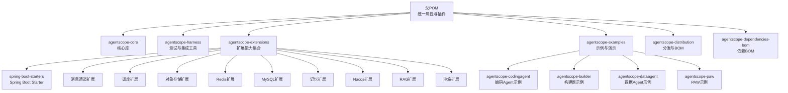
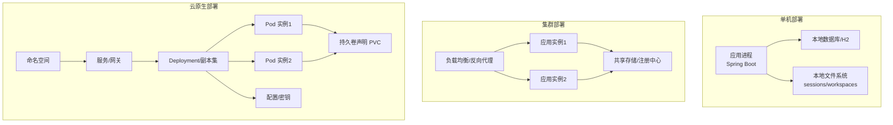
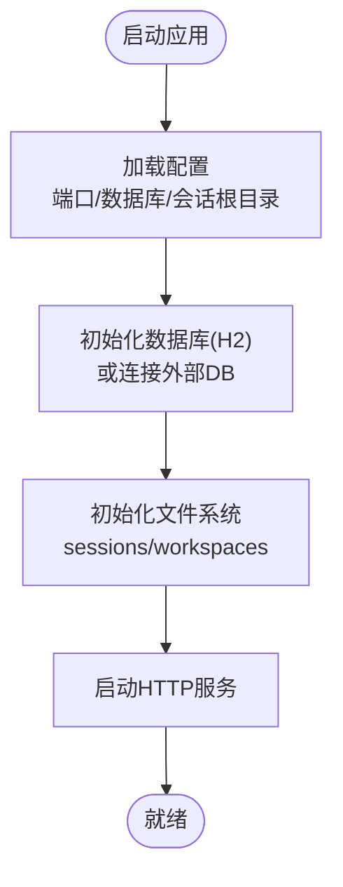
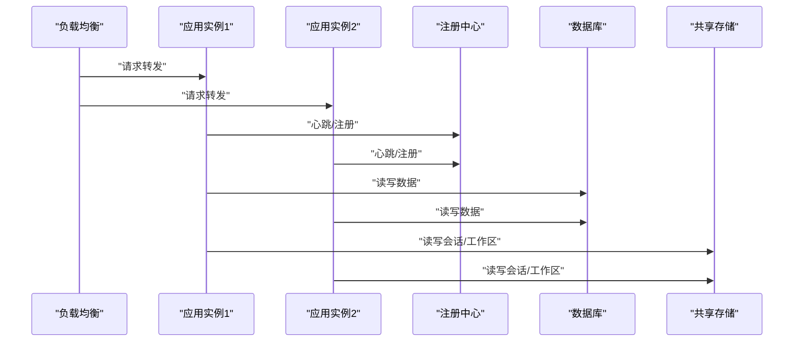
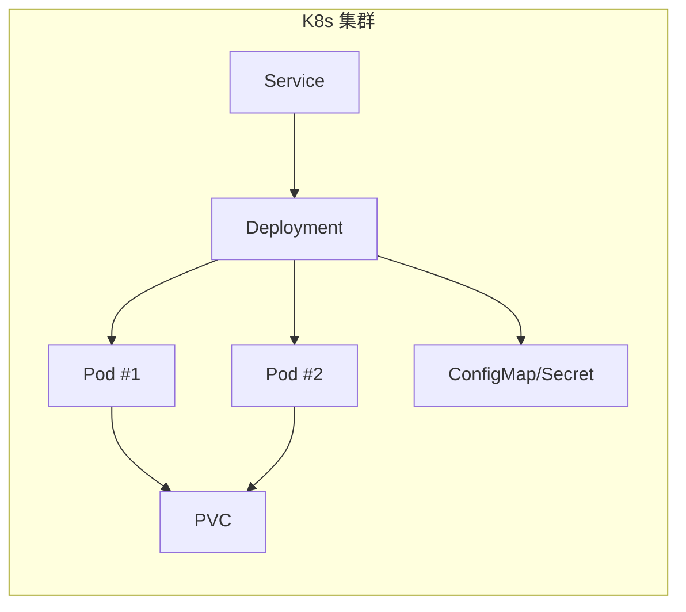
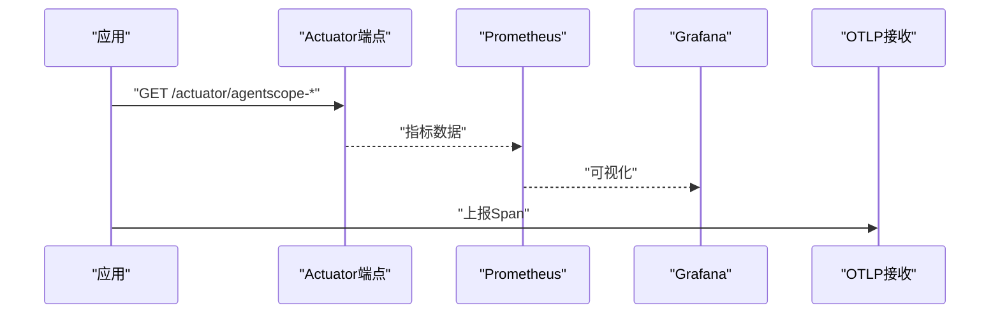
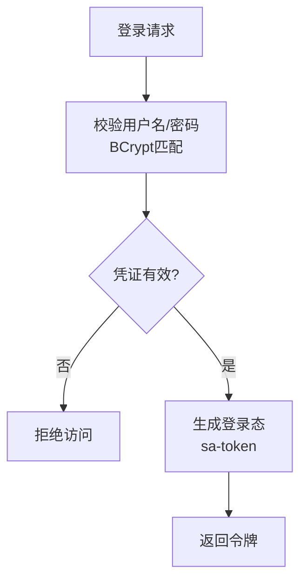
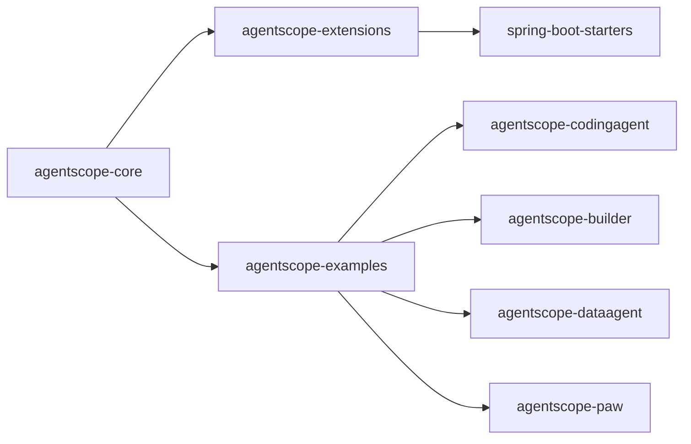

# 部署运维

<cite>
**本文引用的文件**   
- [pom.xml](file://pom.xml)
- [agentscope-core/pom.xml](file://agentscope-core/pom.xml)
- [agentscope-builder-saton/src/main/resources/application.yml](file://agentscope-builder-saton/src/main/resources/application.yml)
- [agentscope-examples/agents/agentscope-codingagent/src/main/docker/coding-sandbox/Dockerfile](file://agentscope-examples/agents/agentscope-codingagent/src/main/docker/coding-sandbox/Dockerfile)
- [agentscope-examples/agents/agentscope-codingagent/ENV_VARS.md](file://agentscope-examples/agents/agentscope-codingagent/ENV_VARS.md)
- [agentscope-examples/agents/agentscope-builder/src/main/resources/logback-spring.xml](file://agentscope-examples/agents/agentscope-builder/src/main/resources/logback-spring.xml)
- [agentscope-extensions/agentscope-spring-boot-starters/agentscope-admin-spring-boot-starter/src/main/java/io/agentscope/spring/boot/admin/endpoint/AgentscopeUsageEndpoint.java](file://agentscope-extensions/agentscope-spring-boot-starters/agentscope-admin-spring-boot-starter/src/main/java/io/agentscope/spring/boot/admin/endpoint/AgentscopeUsageEndpoint.java)
- [agentscope-extensions/agentscope-spring-boot-starters/agentscope-admin-spring-boot-starter/src/main/java/io/agentscope/spring/boot/admin/endpoint/AgentscopeStatusEndpoint.java](file://agentscope-extensions/agentscope-spring-boot-starters/agentscope-admin-spring-boot-starter/src/main/java/io/agentscope/spring/boot/admin/endpoint/AgentscopeStatusEndpoint.java)
- [agentscope-extensions/agentscope-spring-boot-starters/agentscope-admin-spring-boot-starter/src/main/java/io/agentscope/spring/boot/admin/endpoint/AgentscopeDoctorEndpoint.java](file://agentscope-extensions/agentscope-spring-boot-starters/agentscope-admin-spring-boot-starter/src/main/java/io/agentscope/spring/boot/admin/endpoint/AgentscopeDoctorEndpoint.java)
- [agentscope-builder-saton/src/main/java/io/agentscope/builder/saton/auth/PasswordEncoderHolder.java](file://agentscope-builder-saton/src/main/java/io/agentscope/builder/saton/auth/PasswordEncoderHolder.java)
- [agentscope-builder-saton/src/main/java/io/agentscope/builder/saton/auth/UserService.java](file://agentscope-builder-saton/src/main/java/io/agentscope/builder/saton/auth/UserService.java)
</cite>

## 目录
1. [简介](#简介)
2. [项目结构](#项目结构)
3. [核心组件](#核心组件)
4. [架构总览](#架构总览)
5. [详细组件分析](#详细组件分析)
6. [依赖关系分析](#依赖关系分析)
7. [性能考虑](#性能考虑)
8. [故障排除指南](#故障排除指南)
9. [结论](#结论)
10. [附录](#附录)

## 简介
本指南面向AgentScope Java在不同环境下的部署与运维，覆盖单机部署、集群部署与云原生部署路径；提供容器化最佳实践（Docker镜像构建与Kubernetes部署要点）；给出性能调优建议（JVM参数、内存与并发）；说明监控与日志配置（含OpenTelemetry与日志聚合思路）；总结安全配置与最佳实践（网络隔离与访问控制）；并提供故障排除与常见问题解答，以及备份恢复与灾难恢复策略。

## 项目结构
AgentScope Java采用多模块Maven工程组织，核心模块包括核心库、示例应用、扩展能力与分发打包等。父POM统一管理版本、插件与测试配置；子模块按功能域拆分，便于独立构建与部署。

图表来源
- [pom.xml:57-64](file://pom.xml#L57-L64)
- [agentscope-core/pom.xml:18-31](file://agentscope-core/pom.xml#L18-L31)

章节来源
- [pom.xml:29-55](file://pom.xml#L29-L55)
- [agentscope-core/pom.xml:33-49](file://agentscope-core/pom.xml#L33-L49)

## 核心组件
- 应用配置与启动
  - 示例应用使用Spring Boot，通过application.yml定义端口、数据库、会话与工作区根目录等运行时参数。
  - 日志配置采用logback-spring.xml，可按包名调整日志级别。
- 安全与认证
  - 使用BCrypt进行密码编码，结合sa-token实现登录态管理。
- 运维与可观测性
  - 提供Actuator端点用于状态、用量与自检信息输出，便于运维监控与诊断。
- 容器化与沙箱
  - 提供编码Agent的沙箱Dockerfile，包含常用开发工具链与JDK/Maven/Node等环境准备。

章节来源
- [agentscope-builder-saton/src/main/resources/application.yml:1-37](file://agentscope-builder-saton/src/main/resources/application.yml#L1-L37)
- [agentscope-examples/agents/agentscope-builder/src/main/resources/logback-spring.xml:1-14](file://agentscope-examples/agents/agentscope-builder/src/main/resources/logback-spring.xml#L1-L14)
- [agentscope-builder-saton/src/main/java/io/agentscope/builder/saton/auth/PasswordEncoderHolder.java:1-15](file://agentscope-builder-saton/src/main/java/io/agentscope/builder/saton/auth/PasswordEncoderHolder.java#L1-L15)
- [agentscope-builder-saton/src/main/java/io/agentscope/builder/saton/auth/UserService.java:1-39](file://agentscope-builder-saton/src/main/java/io/agentscope/builder/saton/auth/UserService.java#L1-L39)
- [agentscope-extensions/agentscope-spring-boot-starters/agentscope-admin-spring-boot-starter/src/main/java/io/agentscope/spring/boot/admin/endpoint/AgentscopeUsageEndpoint.java:1-58](file://agentscope-extensions/agentscope-spring-boot-starters/agentscope-admin-spring-boot-starter/src/main/java/io/agentscope/spring/boot/admin/endpoint/AgentscopeUsageEndpoint.java#L1-L58)
- [agentscope-extensions/agentscope-spring-boot-starters/agentscope-admin-spring-boot-starter/src/main/java/io/agentscope/spring/boot/admin/endpoint/AgentscopeStatusEndpoint.java:1-46](file://agentscope-extensions/agentscope-spring-boot-starters/agentscope-admin-spring-boot-starter/src/main/java/io/agentscope/spring/boot/admin/endpoint/AgentscopeStatusEndpoint.java#L1-L46)
- [agentscope-extensions/agentscope-spring-boot-starters/agentscope-admin-spring-boot-starter/src/main/java/io/agentscope/spring/boot/admin/endpoint/AgentscopeDoctorEndpoint.java:29-50](file://agentscope-extensions/agentscope-spring-boot-starters/agentscope-admin-spring-boot-starter/src/main/java/io/agentscope/spring/boot/admin/endpoint/AgentscopeDoctorEndpoint.java#L29-L50)
- [agentscope-examples/agents/agentscope-codingagent/src/main/docker/coding-sandbox/Dockerfile:1-63](file://agentscope-examples/agents/agentscope-codingagent/src/main/docker/coding-sandbox/Dockerfile#L1-L63)

## 架构总览
下图展示AgentScope Java在不同部署形态下的典型拓扑：单机模式直接运行；集群模式通过负载均衡与共享存储/注册中心；云原生模式以容器与Kubernetes编排，结合服务网格与持久化。

## 详细组件分析

### 单机部署
- 启动方式
  - 使用Spring Boot应用配置文件指定端口与数据源；默认使用嵌入式H2数据库与文件系统作为会话/工作区根目录。
- 数据与文件
  - 数据库存储于本地文件；会话与工作区目录可通过配置项指向本地路径。
- 适用场景
  - 开发测试、小规模生产或资源受限环境。

图表来源
- [agentscope-builder-saton/src/main/resources/application.yml:1-37](file://agentscope-builder-saton/src/main/resources/application.yml#L1-L37)

章节来源
- [agentscope-builder-saton/src/main/resources/application.yml:1-37](file://agentscope-builder-saton/src/main/resources/application.yml#L1-L37)

### 集群部署
- 负载均衡
  - 建议前置Nginx/HAProxy/云厂商LB，开启健康检查与会话亲和（如需）。
- 共享存储与状态
  - 数据库应使用高可用MySQL/PostgreSQL；会话与工作区建议使用共享存储（NFS/S3兼容对象存储）。
- 注册与发现
  - 结合注册中心（如Nacos/Eureka）实现服务自动发现与动态路由。
- 配置管理
  - 将敏感配置放入密钥管理（Vault/KMS），非敏感配置放入配置中心。

### 云原生部署（Kubernetes）
- 容器镜像
  - 基于官方JRE镜像构建应用镜像；示例中提供编码Agent沙箱镜像，可参考其工具链安装与用户切换实践。
- Deployment与Service
  - 使用Deployment管理副本数与滚动更新；Service暴露ClusterIP/NodePort/LoadBalancer。
- 存储
  - 使用PersistentVolume/PersistentVolumeClaim挂载共享存储；或使用对象存储适配器。
- 配置与密钥
  - ConfigMap管理非敏感配置；Secret管理密钥与令牌。
- 可观测性
  - 暴露Actuator端点，结合Prometheus/Grafana/Micrometer采集指标；OpenTelemetry导出链路追踪。

图表来源
- [agentscope-examples/agents/agentscope-codingagent/src/main/docker/coding-sandbox/Dockerfile:1-63](file://agentscope-examples/agents/agentscope-codingagent/src/main/docker/coding-sandbox/Dockerfile#L1-L63)

章节来源
- [agentscope-examples/agents/agentscope-codingagent/src/main/docker/coding-sandbox/Dockerfile:1-63](file://agentscope-examples/agents/agentscope-codingagent/src/main/docker/coding-sandbox/Dockerfile#L1-L63)

### 容器化最佳实践
- 镜像层优化
  - 多阶段构建减少镜像体积；缓存依赖层；避免在镜像中包含开发工具。
- 运行时安全
  - 使用非root用户运行；最小权限原则；禁用不必要的网络端口。
- 健康检查
  - 提供liveness/readiness探针，结合K8s重启与流量摘除策略。
- 环境变量与密钥
  - 通过环境变量注入配置；敏感信息使用Secret；避免硬编码。

章节来源
- [agentscope-examples/agents/agentscope-codingagent/ENV_VARS.md:1-76](file://agentscope-examples/agents/agentscope-codingagent/ENV_VARS.md#L1-L76)

### 性能调优
- JVM参数
  - 父POM与子模块均设置了基础堆大小参数，建议根据业务QPS与模型调用频率调整初始/最大堆、GC策略与线程栈大小。
- 内存管理
  - 控制会话与工作区大小；对大对象使用流式处理；合理设置缓存容量与过期策略。
- 并发设置
  - 调整Web线程池大小与队列长度；限制模型调用预算（全局/线程级）以防止资源耗尽。
- 指标与采样
  - 通过Actuator端点与Micrometer采集关键指标；合理设置追踪采样率。

章节来源
- [pom.xml:54](file://pom.xml#L54)
- [agentscope-examples/agents/agentscope-codingagent/ENV_VARS.md:64-76](file://agentscope-examples/agents/agentscope-codingagent/ENV_VARS.md#L64-L76)

### 监控与日志
- Actuator端点
  - 提供状态、用量与自检端点，便于自动化巡检与告警。
- 日志
  - 使用Logback配置根日志级别与包级别；建议输出到标准输出以便容器日志收集。
- 链路追踪
  - 支持OTLP导出端点；结合分布式追踪系统（Jaeger/Zipkin）定位性能瓶颈。

图表来源
- [agentscope-extensions/agentscope-spring-boot-starters/agentscope-admin-spring-boot-starter/src/main/java/io/agentscope/spring/boot/admin/endpoint/AgentscopeStatusEndpoint.java:1-46](file://agentscope-extensions/agentscope-spring-boot-starters/agentscope-admin-spring-boot-starter/src/main/java/io/agentscope/spring/boot/admin/endpoint/AgentscopeStatusEndpoint.java#L1-L46)
- [agentscope-extensions/agentscope-spring-boot-starters/agentscope-admin-spring-boot-starter/src/main/java/io/agentscope/spring/boot/admin/endpoint/AgentscopeUsageEndpoint.java:1-58](file://agentscope-extensions/agentscope-spring-boot-starters/agentscope-admin-spring-boot-starter/src/main/java/io/agentscope/spring/boot/admin/endpoint/AgentscopeUsageEndpoint.java#L1-L58)
- [agentscope-extensions/agentscope-spring-boot-starters/agentscope-admin-spring-boot-starter/src/main/java/io/agentscope/spring/boot/admin/endpoint/AgentscopeDoctorEndpoint.java:29-50](file://agentscope-extensions/agentscope-spring-boot-starters/agentscope-admin-spring-boot-starter/src/main/java/io/agentscope/spring/boot/admin/endpoint/AgentscopeDoctorEndpoint.java#L29-L50)
- [agentscope-examples/agents/agentscope-builder/src/main/resources/logback-spring.xml:1-14](file://agentscope-examples/agents/agentscope-builder/src/main/resources/logback-spring.xml#L1-L14)
- [agentscope-examples/agents/agentscope-codingagent/ENV_VARS.md:56-62](file://agentscope-examples/agents/agentscope-codingagent/ENV_VARS.md#L56-L62)

章节来源
- [agentscope-extensions/agentscope-spring-boot-starters/agentscope-admin-spring-boot-starter/src/main/java/io/agentscope/spring/boot/admin/endpoint/AgentscopeStatusEndpoint.java:1-46](file://agentscope-extensions/agentscope-spring-boot-starters/agentscope-admin-spring-boot-starter/src/main/java/io/agentscope/spring/boot/admin/endpoint/AgentscopeStatusEndpoint.java#L1-L46)
- [agentscope-extensions/agentscope-spring-boot-starters/agentscope-admin-spring-boot-starter/src/main/java/io/agentscope/spring/boot/admin/endpoint/AgentscopeUsageEndpoint.java:1-58](file://agentscope-extensions/agentscope-spring-boot-starters/agentscope-admin-spring-boot-starter/src/main/java/io/agentscope/spring/boot/admin/endpoint/AgentscopeUsageEndpoint.java#L1-L58)
- [agentscope-extensions/agentscope-spring-boot-starters/agentscope-admin-spring-boot-starter/src/main/java/io/agentscope/spring/boot/admin/endpoint/AgentscopeDoctorEndpoint.java:29-50](file://agentscope-extensions/agentscope-spring-boot-starters/agentscope-admin-spring-boot-starter/src/main/java/io/agentscope/spring/boot/admin/endpoint/AgentscopeDoctorEndpoint.java#L29-L50)
- [agentscope-examples/agents/agentscope-builder/src/main/resources/logback-spring.xml:1-14](file://agentscope-examples/agents/agentscope-builder/src/main/resources/logback-spring.xml#L1-L14)
- [agentscope-examples/agents/agentscope-codingagent/ENV_VARS.md:56-62](file://agentscope-examples/agents/agentscope-codingagent/ENV_VARS.md#L56-L62)

### 安全配置与最佳实践
- 密码与认证
  - 使用BCrypt进行密码哈希；结合sa-token实现登录态管理与会话控制。
- 网络隔离
  - 将应用置于私有VPC/子网；仅开放必要端口；启用WAF/DDoS防护。
- 访问控制
  - 在网关层实施鉴权与限流；对敏感端点启用认证与审计。
- 数据加密
  - 对静态数据与传输数据进行加密；密钥轮换与最小权限访问。

图表来源
- [agentscope-builder-saton/src/main/java/io/agentscope/builder/saton/auth/UserService.java:1-39](file://agentscope-builder-saton/src/main/java/io/agentscope/builder/saton/auth/UserService.java#L1-L39)
- [agentscope-builder-saton/src/main/java/io/agentscope/builder/saton/auth/PasswordEncoderHolder.java:1-15](file://agentscope-builder-saton/src/main/java/io/agentscope/builder/saton/auth/PasswordEncoderHolder.java#L1-L15)

章节来源
- [agentscope-builder-saton/src/main/java/io/agentscope/builder/saton/auth/UserService.java:1-39](file://agentscope-builder-saton/src/main/java/io/agentscope/builder/saton/auth/UserService.java#L1-L39)
- [agentscope-builder-saton/src/main/java/io/agentscope/builder/saton/auth/PasswordEncoderHolder.java:1-15](file://agentscope-builder-saton/src/main/java/io/agentscope/builder/saton/auth/PasswordEncoderHolder.java#L1-L15)

### 故障排除指南
- 常见问题
  - 数据库连接失败：检查URL、凭据与网络连通性；确认DDL自动更新策略。
  - 登录失败：核对用户名是否存在、密码是否匹配；查看认证日志。
  - Actuator不可达：确认端点暴露与安全配置；检查防火墙规则。
- 自检端点
  - 使用自检端点快速判断部署健康度与配置合理性。
- 日志定位
  - 提升日志级别定位异常；关注关键包的日志输出。

章节来源
- [agentscope-extensions/agentscope-spring-boot-starters/agentscope-admin-spring-boot-starter/src/main/java/io/agentscope/spring/boot/admin/endpoint/AgentscopeDoctorEndpoint.java:29-50](file://agentscope-extensions/agentscope-spring-boot-starters/agentscope-admin-spring-boot-starter/src/main/java/io/agentscope/spring/boot/admin/endpoint/AgentscopeDoctorEndpoint.java#L29-L50)
- [agentscope-examples/agents/agentscope-builder/src/main/resources/logback-spring.xml:1-14](file://agentscope-examples/agents/agentscope-builder/src/main/resources/logback-spring.xml#L1-L14)

### 备份恢复与灾难恢复
- 数据备份
  - 定期备份数据库快照；对共享存储中的会话与工作区进行归档。
- 配置备份
  - 将ConfigMap/Secret纳入GitOps管理；变更记录审计。
- 恢复演练
  - 制定RTO/RPO目标；定期进行恢复演练；验证数据一致性。
- 灾难恢复
  - 多可用区部署；跨区域复制；自动故障转移与降级策略。

## 依赖关系分析
- 组件耦合
  - 核心库提供Agent、模型、工具、记忆等基础能力；示例模块基于核心库快速搭建应用；扩展模块提供渠道、调度、存储、RAG等功能增强。
- 外部依赖
  - 包括OpenTelemetry SDK、Jackson、OkHttp、Reactor、SQLite、Redis/Jedis、OSS SDK、Kubernetes客户端等；部分为可选依赖，按需引入。

图表来源
- [pom.xml:57-64](file://pom.xml#L57-L64)
- [agentscope-core/pom.xml:51-231](file://agentscope-core/pom.xml#L51-L231)

章节来源
- [pom.xml:57-64](file://pom.xml#L57-L64)
- [agentscope-core/pom.xml:51-231](file://agentscope-core/pom.xml#L51-L231)

## 性能考虑
- JVM参数与GC
  - 根据QPS与响应时间目标调整堆大小与GC策略；结合容器资源限制设置CPU/内存配额。
- 并发与限流
  - 限制模型调用预算（全局/线程级）；对上游依赖（LLM/工具）实施超时与重试策略。
- 缓存与索引
  - 对热点数据与查询结果进行缓存；对工作区内容建立索引以提升检索效率。
- 观测性
  - 通过Actuator与Micrometer采集关键指标；结合追踪系统定位慢调用。

## 故障排除指南
- 登录失败
  - 检查用户名存在性与密码哈希匹配；确认认证流程未被拦截。
- 数据库异常
  - 校验连接串与凭据；确认DDL策略与表结构一致性。
- Actuator端点
  - 确认端点暴露与安全策略；检查网络ACL与防火墙。
- 日志排查
  - 提升日志级别；关注关键包日志；结合追踪ID定位请求链路。

章节来源
- [agentscope-builder-saton/src/main/java/io/agentscope/builder/saton/auth/UserService.java:1-39](file://agentscope-builder-saton/src/main/java/io/agentscope/builder/saton/auth/UserService.java#L1-L39)
- [agentscope-examples/agents/agentscope-builder/src/main/resources/logback-spring.xml:1-14](file://agentscope-examples/agents/agentscope-builder/src/main/resources/logback-spring.xml#L1-L14)

## 结论
AgentScope Java提供了从单机到云原生的完整部署路径。通过合理的容器化、集群与Kubernetes编排、性能调优与可观测性配置，以及完善的安全与灾备策略，可在不同规模环境中稳定运行。建议结合实际业务负载持续迭代调优，并将运维流程纳入CI/CD与GitOps体系。

## 附录
- 关键配置项与环境变量
  - 应用端口、数据库连接、会话与工作区根目录、日志级别、OTLP导出端点、追踪采样率、模型调用预算等。
- 建议的运维流程
  - 发布前检查（依赖、配置、安全）、灰度发布、回滚预案、监控告警、定期演练与审计。

章节来源
- [agentscope-builder-saton/src/main/resources/application.yml:1-37](file://agentscope-builder-saton/src/main/resources/application.yml#L1-L37)
- [agentscope-examples/agents/agentscope-builder/src/main/resources/logback-spring.xml:1-14](file://agentscope-examples/agents/agentscope-builder/src/main/resources/logback-spring.xml#L1-L14)
- [agentscope-examples/agents/agentscope-codingagent/ENV_VARS.md:1-76](file://agentscope-examples/agents/agentscope-codingagent/ENV_VARS.md#L1-L76)