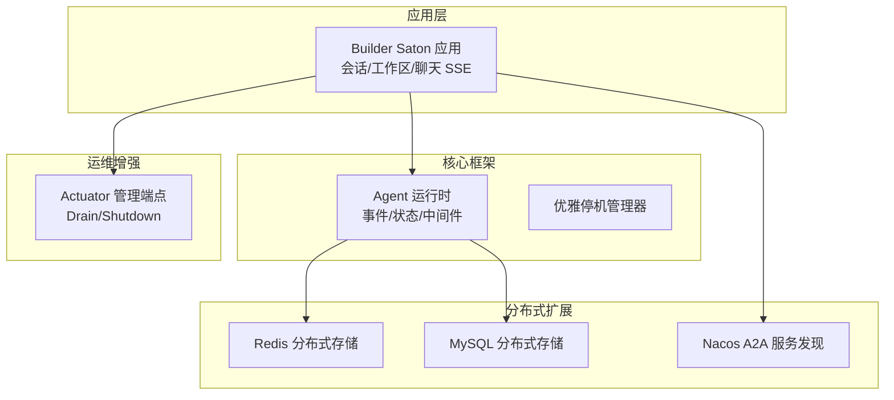
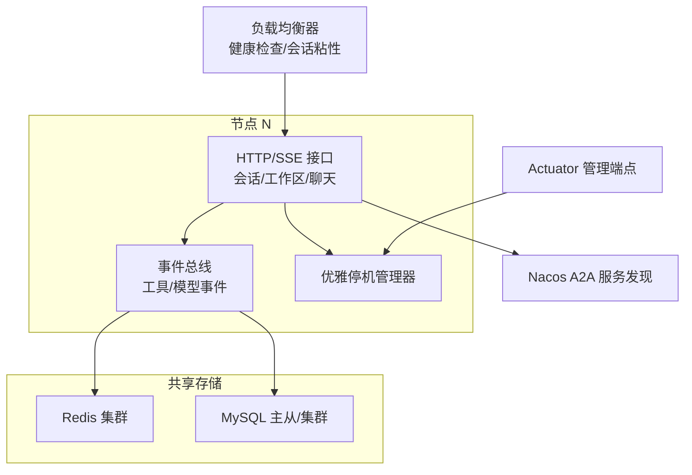
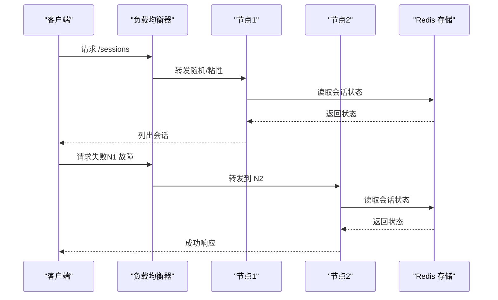
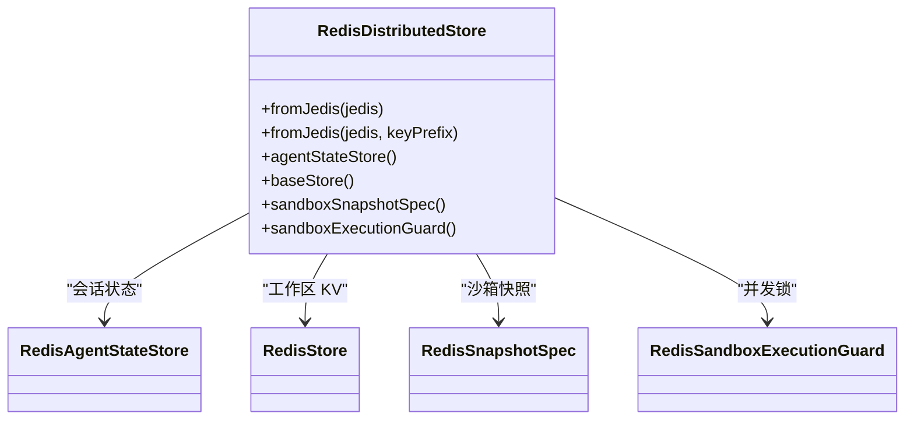
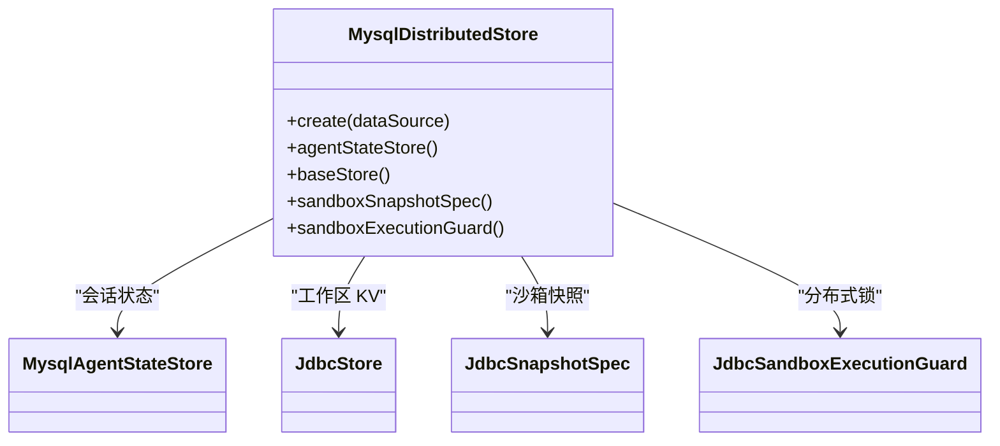
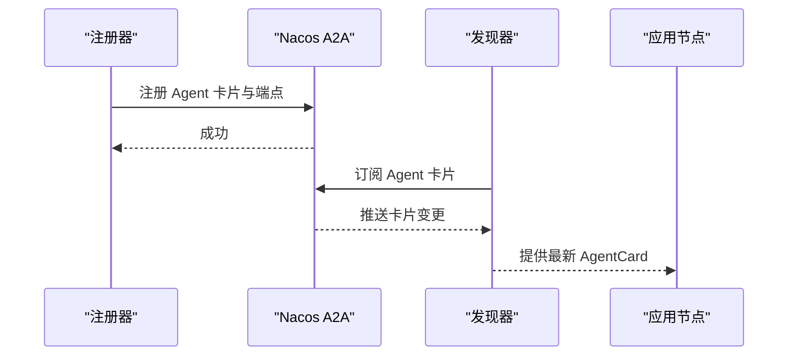
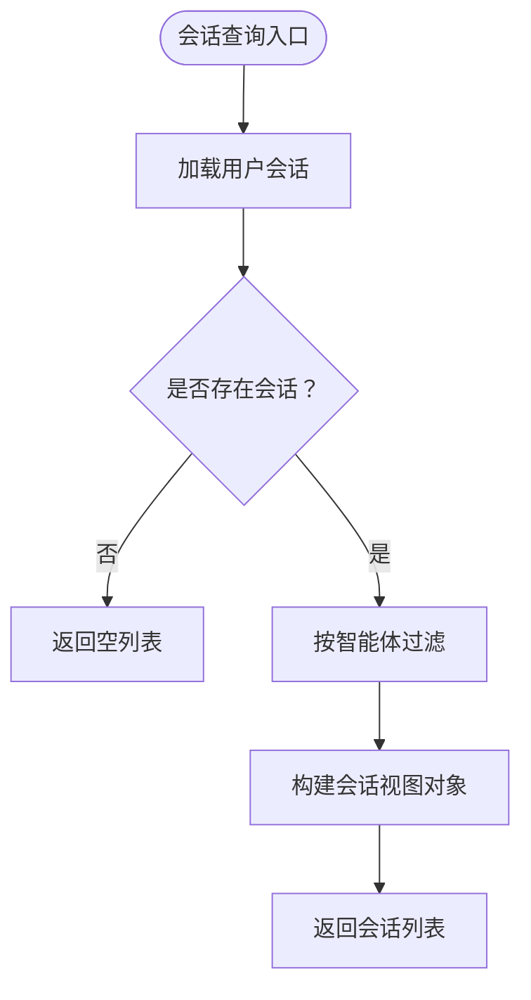
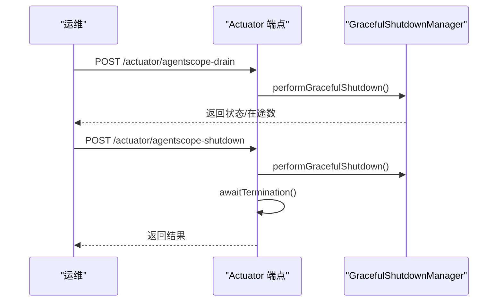
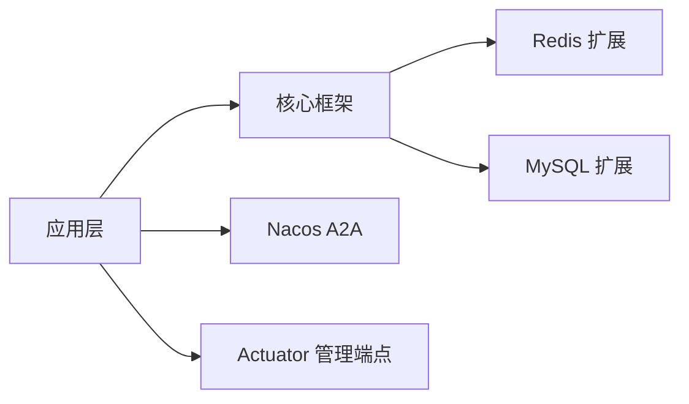

# 集群部署

<cite>
**本文引用的文件**
- [application.yml](file://agentscope-builder-saton/src/main/resources/application.yml)
- [application-jdbc.yml](file://agentscope-builder-saton/src/main/resources/application-jdbc.yml)
- [RedisDistributedStore.java](file://agentscope-extensions/agentscope-extensions-redis/src/main/java/io/agentscope/extensions/redis/RedisDistributedStore.java)
- [MysqlDistributedStore.java](file://agentscope-extensions/agentscope-extensions-mysql/src/main/java/io/agentscope/extensions/mysql/MysqlDistributedStore.java)
- [GracefulShutdownManager.java](file://agentscope-core/src/main/java/io/agentscope/core/shutdown/GracefulShutdownManager.java)
- [AgentscopeDrainEndpoint.java](file://agentscope-extensions/agentscope-spring-boot-starters/agentscope-admin-spring-boot-starter/src/main/java/io/agentscope/spring/boot/admin/endpoint/AgentscopeDrainEndpoint.java)
- [AgentscopeShutdownEndpoint.java](file://agentscope-extensions/agentscope-spring-boot-starters/agentscope-admin-spring-boot-starter/src/main/java/io/agentscope/spring/boot/admin/endpoint/AgentscopeShutdownEndpoint.java)
- [NacosA2aRegistry.java](file://agentscope-extensions/agentscope-extensions-nacos/agentscope-extensions-nacos-a2a/src/main/java/io/agentscope/core/nacos/a2a/registry/NacosA2aRegistry.java)
- [NacosAgentCardResolver.java](file://agentscope-extensions/agentscope-extensions-nacos/agentscope-extensions-nacos-a2a/src/main/java/io/agentscope/core/nacos/a2a/discovery/NacosAgentCardResolver.java)
- [AgentCard.java](file://agentscope-core/src/main/java/io/agentscope/core/a2a/agent/card/AgentCard.java)
- [AgentCardConverterUtil.java](file://agentscope-extensions/agentscope-extensions-nacos/src/main/java/io/agentscope/core/nacos/a2a/utils/AgentCardConverterUtil.java)
- [ChatController.java](file://agentscope-builder-saton/src/main/java/io/agentscope/builder/saton/agent/chat/ChatController.java)
- [AguiWebFluxHandler.java](file://agentscope-extensions/agentscope-spring-boot-starters/agentscope-agui-spring-boot-starter/src/main/java/io/agentscope/spring/boot/agui/webflux/AguiWebFluxHandler.java)
- [SessionServiceTest.java](file://agentscope-builder-saton/src/test/java/io/agentscope/builder/saton/session/SessionServiceTest.java)
- [SessionVO.java](file://agentscope-builder-saton/src/main/java/io/agentscope/builder/saton/session/dto/SessionVO.java)
- [ResetResp.java](file://agentscope-builder-saton/src/main/java/io/agentscope/builder/saton/session/dto/ResetResp.java)
- [WorkspaceController.java](file://agentscope-builder-saton/src/main/java/io/agentscope/builder/saton/workspace/WorkspaceController.java)
- [WorkspaceService.java](file://agentscope-builder-saton/src/main/java/io/agentscope/builder/saton/workspace/WorkspaceService.java)
- [McpServerService.java](file://agentscope-builder-saton/src/main/java/io/agentscope/builder/saton/resource/mcp/McpServerService.java)
- [McpServerEntity.java](file://agentscope-builder-saton/src/main/java/io/agentscope/builder/saton/resource/mcp/McpServerEntity.java)
- [McpServerRepositoryTest.java](file://agentscope-builder-saton/src/test/java/io/agentscope/builder/saton/resource/mcp/McpServerRepositoryTest.java)
</cite>

## 目录
1. [引言](#引言)
2. [项目结构](#项目结构)
3. [核心组件](#核心组件)
4. [架构总览](#架构总览)
5. [详细组件分析](#详细组件分析)
6. [依赖分析](#依赖分析)
7. [性能考虑](#性能考虑)
8. [故障排查指南](#故障排查指南)
9. [结论](#结论)
10. [附录：集群配置与操作指南](#附录集群配置与操作指南)

## 引言
本指南面向在生产环境部署 AgentScope Java 的平台工程团队，提供一套可落地的多副本集群部署方案。内容涵盖：
- 多副本架构设计原理：负载均衡与故障转移
- 共享存储配置：Redis 协调、数据库共享、文件系统共享
- 完整集群配置示例：服务发现、会话状态同步、工具事件传播
- 集群验证与性能测试策略
- 高可用与灾难恢复方案
- 扩缩容操作指南与最佳实践

## 项目结构
AgentScope Java 采用模块化分层组织，核心能力通过扩展模块提供分布式能力与运维增强。与集群部署直接相关的关键模块如下：
- 应用层：构建器前端与后端服务（Builder Saton）
- 核心框架：智能体运行时、事件总线、状态管理与优雅停机
- 分布式扩展：Redis/Mysql 分布式存储、Nacos A2A 服务发现
- 运维增强：Actuator 管理端点（Drain/Shutdown）

图表来源
- [application.yml:1-40](file://agentscope-builder-saton/src/main/resources/application.yml#L1-L40)
- [RedisDistributedStore.java:56-110](file://agentscope-extensions/agentscope-extensions-redis/src/main/java/io/agentscope/extensions/redis/RedisDistributedStore.java#L56-L110)
- [MysqlDistributedStore.java:54-92](file://agentscope-extensions/agentscope-extensions-mysql/src/main/java/io/agentscope/extensions/mysql/MysqlDistributedStore.java#L54-L92)
- [GracefulShutdownManager.java:40-333](file://agentscope-core/src/main/java/io/agentscope/core/shutdown/GracefulShutdownManager.java#L40-L333)
- [NacosA2aRegistry.java:37-150](file://agentscope-extensions/agentscope-extensions-nacos/agentscope-extensions-nacos-a2a/src/main/java/io/agentscope/core/nacos/a2a/registry/NacosA2aRegistry.java#L37-L150)
- [AgentscopeDrainEndpoint.java:42-95](file://agentscope-extensions/agentscope-spring-boot-starters/agentscope-admin-spring-boot-starter/src/main/java/io/agentscope/spring/boot/admin/endpoint/AgentscopeDrainEndpoint.java#L42-L95)
- [AgentscopeShutdownEndpoint.java:42-83](file://agentscope-extensions/agentscope-spring-boot-starters/agentscope-admin-spring-boot-starter/src/main/java/io/agentscope/spring/boot/admin/endpoint/AgentscopeShutdownEndpoint.java#L42-L83)

章节来源
- [application.yml:1-40](file://agentscope-builder-saton/src/main/resources/application.yml#L1-L40)
- [application-jdbc.yml:1-16](file://agentscope-builder-saton/src/main/resources/application-jdbc.yml#L1-L16)

## 核心组件
- 分布式状态与文件系统
  - Redis 分布式存储：统一键空间前缀，提供会话状态、KV 工作区、沙箱快照与并发锁
  - MySQL 分布式存储：基于 JDBC 的会话状态、KV 工作区与沙箱快照，支持分布式锁
- 服务发现与路由
  - Nacos A2A 注册与发现：注册 Agent 卡片与端点，订阅卡片变更，支持多传输协议
- 优雅停机与运维
  - GracefulShutdownManager：全局请求跟踪、超时强制中断、状态落盘
  - Actuator 管理端点：Drain 停止接收新请求；Shutdown 触发优雅停机并关闭上下文
- 会话与工作区
  - 会话列表/重置：按用户隔离、按会话键聚合
  - 工作区文件读写：路径解析、大小限制、权限校验
- 聊天事件流
  - SSE 事件推送：按事件类型命名，序列化失败兜底

章节来源
- [RedisDistributedStore.java:56-110](file://agentscope-extensions/agentscope-extensions-redis/src/main/java/io/agentscope/extensions/redis/RedisDistributedStore.java#L56-L110)
- [MysqlDistributedStore.java:54-92](file://agentscope-extensions/agentscope-extensions-mysql/src/main/java/io/agentscope/extensions/mysql/MysqlDistributedStore.java#L54-L92)
- [GracefulShutdownManager.java:40-333](file://agentscope-core/src/main/java/io/agentscope/core/shutdown/GracefulShutdownManager.java#L40-L333)
- [NacosA2aRegistry.java:37-150](file://agentscope-extensions/agentscope-extensions-nacos/agentscope-extensions-nacos-a2a/src/main/java/io/agentscope/core/nacos/a2a/registry/NacosA2aRegistry.java#L37-L150)
- [NacosAgentCardResolver.java:59-123](file://agentscope-extensions/agentscope-extensions-nacos/agentscope-extensions-nacos-a2a/src/main/java/io/agentscope/core/nacos/a2a/discovery/NacosAgentCardResolver.java#L59-L123)
- [ChatController.java:62-77](file://agentscope-builder-saton/src/main/java/io/agentscope/builder/saton/agent/chat/ChatController.java#L62-L77)
- [WorkspaceController.java:38-67](file://agentscope-builder-saton/src/main/java/io/agentscope/builder/saton/workspace/WorkspaceController.java#L38-L67)
- [WorkspaceService.java:64-98](file://agentscope-builder-saton/src/main/java/io/agentscope/builder/saton/workspace/WorkspaceService.java#L64-L98)
- [SessionVO.java:1-4](file://agentscope-builder-saton/src/main/java/io/agentscope/builder/saton/session/dto/SessionVO.java#L1-L4)
- [ResetResp.java:1-4](file://agentscope-builder-saton/src/main/java/io/agentscope/builder/saton/session/dto/ResetResp.java#L1-L4)

## 架构总览
下图展示多副本集群的总体交互：客户端通过负载均衡访问任意节点；节点内部通过分布式存储保持状态一致；通过 Nacos 实现服务发现与动态路由；运维通过 Actuator 端点进行 Drain/Shutdown。

图表来源
- [GracefulShutdownManager.java:40-333](file://agentscope-core/src/main/java/io/agentscope/core/shutdown/GracefulShutdownManager.java#L40-L333)
- [RedisDistributedStore.java:87-110](file://agentscope-extensions/agentscope-extensions-redis/src/main/java/io/agentscope/extensions/redis/RedisDistributedStore.java#L87-L110)
- [MysqlDistributedStore.java:72-92](file://agentscope-extensions/agentscope-extensions-mysql/src/main/java/io/agentscope/extensions/mysql/MysqlDistributedStore.java#L72-L92)
- [NacosA2aRegistry.java:68-134](file://agentscope-extensions/agentscope-extensions-nacos/agentscope-extensions-nacos-a2a/src/main/java/io/agentscope/core/nacos/a2a/registry/NacosA2aRegistry.java#L68-L134)

## 详细组件分析

### 组件一：多副本与负载均衡
- 设计要点
  - 无状态节点：会话与状态由共享存储承载，节点可水平扩缩
  - 健康检查：结合 Actuator /actuator/health 与 Drain 状态
  - 会话粘性：可选基于会话键的粘性策略，降低跨节点状态抖动
- 故障转移
  - 节点故障时，LB 将流量切换至存活节点
  - 会话状态与工作区数据由共享存储保证一致性

图表来源
- [RedisDistributedStore.java:87-110](file://agentscope-extensions/agentscope-extensions-redis/src/main/java/io/agentscope/extensions/redis/RedisDistributedStore.java#L87-L110)
- [GracefulShutdownManager.java:139-151](file://agentscope-core/src/main/java/io/agentscope/core/shutdown/GracefulShutdownManager.java#L139-L151)

章节来源
- [GracefulShutdownManager.java:139-151](file://agentscope-core/src/main/java/io/agentscope/core/shutdown/GracefulShutdownManager.java#L139-L151)

### 组件二：共享存储配置（Redis 协调）
- 键空间前缀与隔离
  - 使用统一 keyPrefix，区分 session/store/snapshot/guard 命名域
  - 支持自定义 key 前缀，便于多环境隔离
- 组件装配
  - Agent 状态存储：RedisAgentStateStore
  - 工作区 KV：RedisStore
  - 沙箱快照：RedisSnapshotSpec
  - 并发锁：RedisSandboxExecutionGuard
- 一致性与可用性
  - Redis 集群建议开启主从复制与哨兵/集群模式
  - 通过连接池与合理的超时配置提升稳定性

图表来源
- [RedisDistributedStore.java:56-110](file://agentscope-extensions/agentscope-extensions-redis/src/main/java/io/agentscope/extensions/redis/RedisDistributedStore.java#L56-L110)

章节来源
- [RedisDistributedStore.java:56-110](file://agentscope-extensions/agentscope-extensions-redis/src/main/java/io/agentscope/extensions/redis/RedisDistributedStore.java#L56-L110)

### 组件三：共享存储配置（数据库共享）
- MySQL 分布式存储
  - Agent 状态：MysqlAgentStateStore
  - 工作区 KV：JdbcStore（可初始化表结构）
  - 沙箱快照：JdbcSnapshotSpec（BLOB 存储）
  - 并发锁：JdbcSandboxExecutionGuard（GET_LOCK）
- 连接池与高可用
  - 建议使用 HikariCP/Druid 等连接池
  - 生产环境使用主从或集群，并配置只读副本

图表来源
- [MysqlDistributedStore.java:54-92](file://agentscope-extensions/agentscope-extensions-mysql/src/main/java/io/agentscope/extensions/mysql/MysqlDistributedStore.java#L54-L92)

章节来源
- [MysqlDistributedStore.java:54-92](file://agentscope-extensions/agentscope-extensions-mysql/src/main/java/io/agentscope/extensions/mysql/MysqlDistributedStore.java#L54-L92)

### 组件四：服务发现与工具事件传播
- 服务发现
  - 注册：将 Agent 卡片与端点注册到 Nacos，支持单端点或多端点批量注册
  - 发现：订阅 Agent 卡片变更，转换为本地 AgentCard 对象
- 工具事件传播
  - SSE 事件：按事件类型命名，序列化失败时返回错误兜底
  - AGUI 流：支持错误与完成事件的组合流

图表来源
- [NacosA2aRegistry.java:68-134](file://agentscope-extensions/agentscope-extensions-nacos/agentscope-extensions-nacos-a2a/src/main/java/io/agentscope/core/nacos/a2a/registry/NacosA2aRegistry.java#L68-L134)
- [NacosAgentCardResolver.java:90-121](file://agentscope-extensions/agentscope-extensions-nacos/agentscope-extensions-nacos-a2a/src/main/java/io/agentscope/core/nacos/a2a/discovery/NacosAgentCardResolver.java#L90-L121)
- [AgentCard.java](file://agentscope-core/src/main/java/io/agentscope/core/a2a/agent/card/AgentCard.java)
- [AgentCardConverterUtil.java](file://agentscope-extensions/agentscope-extensions-nacos/src/main/java/io/agentscope/core/nacos/a2a/utils/AgentCardConverterUtil.java)

章节来源
- [NacosA2aRegistry.java:37-150](file://agentscope-extensions/agentscope-extensions-nacos/agentscope-extensions-nacos-a2a/src/main/java/io/agentscope/core/nacos/a2a/registry/NacosA2aRegistry.java#L37-L150)
- [NacosAgentCardResolver.java:59-123](file://agentscope-extensions/agentscope-extensions-nacos/agentscope-extensions-nacos-a2a/src/main/java/io/agentscope/core/nacos/a2a/discovery/NacosAgentCardResolver.java#L59-L123)
- [ChatController.java:62-77](file://agentscope-builder-saton/src/main/java/io/agentscope/builder/saton/agent/chat/ChatController.java#L62-L77)
- [AguiWebFluxHandler.java:190-227](file://agentscope-extensions/agentscope-spring-boot-starters/agentscope-agui-spring-boot-starter/src/main/java/io/agentscope/spring/boot/agui/webflux/AguiWebFluxHandler.java#L190-L227)

### 组件五：会话状态同步与文件系统共享
- 会话状态
  - 会话视图：包含会话键与最后活跃时间
  - 重置响应：删除标记
  - 测试覆盖：空集合、跨用户/跨智能体隔离
- 文件系统
  - 工作区读写：路径解析、UTF-8、最大读取阈值
  - 权限与异常：非自有资源拒绝、IO 异常包装

图表来源
- [SessionServiceTest.java:25-39](file://agentscope-builder-saton/src/test/java/io/agentscope/builder/saton/session/SessionServiceTest.java#L25-L39)
- [SessionVO.java:1-4](file://agentscope-builder-saton/src/main/java/io/agentscope/builder/saton/session/dto/SessionVO.java#L1-L4)
- [ResetResp.java:1-4](file://agentscope-builder-saton/src/main/java/io/agentscope/builder/saton/session/dto/ResetResp.java#L1-L4)

章节来源
- [SessionServiceTest.java:1-39](file://agentscope-builder-saton/src/test/java/io/agentscope/builder/saton/session/SessionServiceTest.java#L1-L39)
- [WorkspaceController.java:38-67](file://agentscope-builder-saton/src/main/java/io/agentscope/builder/saton/workspace/WorkspaceController.java#L38-L67)
- [WorkspaceService.java:64-98](file://agentscope-builder-saton/src/main/java/io/agentscope/builder/saton/workspace/WorkspaceService.java#L64-L98)

### 组件六：优雅停机与运维端点
- Drain：停止接收新请求，等待在途请求完成，保留 JVM 用于日志收集
- Shutdown：先 Drain，再触发 JVM 级别优雅停机，关闭 Spring 上下文
- 状态监控：当前状态、是否接收请求、在途请求数

图表来源
- [AgentscopeDrainEndpoint.java:65-95](file://agentscope-extensions/agentscope-spring-boot-starters/agentscope-admin-spring-boot-starter/src/main/java/io/agentscope/spring/boot/admin/endpoint/AgentscopeDrainEndpoint.java#L65-L95)
- [AgentscopeShutdownEndpoint.java:58-83](file://agentscope-extensions/agentscope-spring-boot-starters/agentscope-admin-spring-boot-starter/src/main/java/io/agentscope/spring/boot/admin/endpoint/AgentscopeShutdownEndpoint.java#L58-L83)
- [GracefulShutdownManager.java:211-226](file://agentscope-core/src/main/java/io/agentscope/core/shutdown/GracefulShutdownManager.java#L211-L226)

章节来源
- [GracefulShutdownManager.java:40-333](file://agentscope-core/src/main/java/io/agentscope/core/shutdown/GracefulShutdownManager.java#L40-L333)

## 依赖分析
- 组件耦合
  - 应用层依赖核心框架与分布式扩展
  - 分布式扩展通过 DistributedStore 抽象对接不同后端
  - 服务发现与事件传播解耦于应用层
- 外部依赖
  - Redis/Mysql：分布式状态与文件系统
  - Nacos：服务卡片与端点注册/订阅
  - Actuator：运维端点

图表来源
- [RedisDistributedStore.java:18-28](file://agentscope-extensions/agentscope-extensions-redis/src/main/java/io/agentscope/extensions/redis/RedisDistributedStore.java#L18-L28)
- [MysqlDistributedStore.java:18-29](file://agentscope-extensions/agentscope-extensions-mysql/src/main/java/io/agentscope/extensions/mysql/MysqlDistributedStore.java#L18-L29)
- [NacosA2aRegistry.java:19-31](file://agentscope-extensions/agentscope-extensions-nacos/agentscope-extensions-nacos-a2a/src/main/java/io/agentscope/core/nacos/a2a/registry/NacosA2aRegistry.java#L19-L31)

章节来源
- [RedisDistributedStore.java:18-28](file://agentscope-extensions/agentscope-extensions-redis/src/main/java/io/agentscope/extensions/redis/RedisDistributedStore.java#L18-L28)
- [MysqlDistributedStore.java:18-29](file://agentscope-extensions/agentscope-extensions-mysql/src/main/java/io/agentscope/extensions/mysql/MysqlDistributedStore.java#L18-L29)
- [NacosA2aRegistry.java:19-31](file://agentscope-extensions/agentscope-extensions-nacos/agentscope-extensions-nacos-a2a/src/main/java/io/agentscope/core/nacos/a2a/registry/NacosA2aRegistry.java#L19-L31)

## 性能考虑
- 连接池与超时
  - Redis：合理设置连接池大小与命令超时
  - MySQL：HikariCP/Druid 连接池参数优化，启用只读副本分流
- 缓存与序列化
  - 会话状态与事件序列化开销控制，避免大对象频繁传输
- IO 与并发
  - 工作区读取设置大小阈值，防止大文件阻塞
  - 沙箱并发锁粒度与持有时间控制，避免热点竞争

## 故障排查指南
- 优雅停机
  - 通过 /actuator/agentscope-drain 查看当前状态；确认 active_requests 降为 0 后再执行 /actuator/agentscope-shutdown
  - 若超时未终止，检查工具执行器是否响应 shutdown 超时信号
- 服务发现
  - 注册失败：核对 Nacos 地址、鉴权与 Agent 卡片版本
  - 发现异常：确认订阅回调是否生效，AgentCard 是否被缓存
- 数据一致性
  - Redis/Mysql 只读副本延迟：优先读主库或引入最终一致策略
  - 文件系统：路径解析失败或权限不足，检查归属校验与目录权限

章节来源
- [AgentscopeDrainEndpoint.java:55-63](file://agentscope-extensions/agentscope-spring-boot-starters/agentscope-admin-spring-boot-starter/src/main/java/io/agentscope/spring/boot/admin/endpoint/AgentscopeDrainEndpoint.java#L55-L63)
- [GracefulShutdownManager.java:296-315](file://agentscope-core/src/main/java/io/agentscope/core/shutdown/GracefulShutdownManager.java#L296-L315)
- [NacosA2aRegistry.java:79-103](file://agentscope-extensions/agentscope-extensions-nacos/agentscope-extensions-nacos-a2a/src/main/java/io/agentscope/core/nacos/a2a/registry/NacosA2aRegistry.java#L79-L103)
- [NacosAgentCardResolver.java:113-121](file://agentscope-extensions/agentscope-extensions-nacos/agentscope-extensions-nacos-a2a/src/main/java/io/agentscope/core/nacos/a2a/discovery/NacosAgentCardResolver.java#L113-L121)

## 结论
通过将状态与文件系统迁移至共享存储、以 Nacos 实现服务发现与动态路由，并配合 Actuator 的 Drain/Shutdown 管理，AgentScope Java 可在多副本环境下实现高可用、可扩展且可观测的集群部署。建议在生产中结合监控与压测持续优化连接池、缓存与并发策略。

## 附录：集群配置与操作指南

### 多副本部署架构设计
- 负载均衡
  - 使用 L7 负载均衡器（如 Nginx/HAProxy/K8s Ingress），启用健康检查与会话粘性
  - 健康探针：/actuator/health；Drain 状态：/actuator/agentscope-drain
- 故障转移
  - 节点故障自动摘除，流量切换至存活节点
  - 会话状态与工作区数据由共享存储保障一致性

章节来源
- [AgentscopeDrainEndpoint.java:55-63](file://agentscope-extensions/agentscope-spring-boot-starters/agentscope-admin-spring-boot-starter/src/main/java/io/agentscope/spring/boot/admin/endpoint/AgentscopeDrainEndpoint.java#L55-L63)

### 共享存储配置
- Redis 协调
  - 初始化 Jedis 客户端，创建 RedisDistributedStore
  - 设置 keyPrefix，区分不同命名域（session/store/snapshot/guard）
- 数据库共享（MySQL）
  - 配置 DataSource（HikariCP/Druid），创建 MysqlDistributedStore
  - 工作区 KV 初始化表结构，沙箱快照使用 BLOB 存储
  - 并发锁使用 GET_LOCK() 实现分布式互斥

章节来源
- [RedisDistributedStore.java:72-85](file://agentscope-extensions/agentscope-extensions-redis/src/main/java/io/agentscope/extensions/redis/RedisDistributedStore.java#L72-L85)
- [MysqlDistributedStore.java:68-70](file://agentscope-extensions/agentscope-extensions-mysql/src/main/java/io/agentscope/extensions/mysql/MysqlDistributedStore.java#L68-L70)

### 服务发现与工具事件传播
- 服务发现
  - 注册 Agent 卡片与端点：NacosA2aRegistry.registerAgent
  - 订阅卡片变更：NacosAgentCardResolver.getAgentCard
- 工具事件传播
  - SSE 事件：ChatController 将事件转为 ServerSentEvent
  - AGUI 流：AguiWebFluxHandler 创建错误与完成事件流

章节来源
- [NacosA2aRegistry.java:68-134](file://agentscope-extensions/agentscope-extensions-nacos/agentscope-extensions-nacos-a2a/src/main/java/io/agentscope/core/nacos/a2a/registry/NacosA2aRegistry.java#L68-L134)
- [NacosAgentCardResolver.java:90-121](file://agentscope-extensions/agentscope-extensions-nacos/agentscope-extensions-nacos-a2a/src/main/java/io/agentscope/core/nacos/a2a/discovery/NacosAgentCardResolver.java#L90-L121)
- [ChatController.java:62-77](file://agentscope-builder-saton/src/main/java/io/agentscope/builder/saton/agent/chat/ChatController.java#L62-L77)
- [AguiWebFluxHandler.java:190-227](file://agentscope-extensions/agentscope-spring-boot-starters/agentscope-agui-spring-boot-starter/src/main/java/io/agentscope/spring/boot/agui/webflux/AguiWebFluxHandler.java#L190-L227)

### 集群验证方法
- 功能验证
  - 会话列表与重置：SessionServiceTest 覆盖空集合与隔离场景
  - 工作区读写：WorkspaceService 读取/写入/删除
- 运维验证
  - Drain/Shutdown：调用 /actuator/agentscope-drain 与 /actuator/agentscope-shutdown，观察状态变化与在途请求数
- 数据一致性验证
  - 多节点并发写入会话与工作区，核对共享存储最终一致

章节来源
- [SessionServiceTest.java:25-39](file://agentscope-builder-saton/src/test/java/io/agentscope/builder/saton/session/SessionServiceTest.java#L25-L39)
- [WorkspaceService.java:64-98](file://agentscope-builder-saton/src/main/java/io/agentscope/builder/saton/workspace/WorkspaceService.java#L64-L98)
- [AgentscopeDrainEndpoint.java:65-95](file://agentscope-extensions/agentscope-spring-boot-starters/agentscope-admin-spring-boot-starter/src/main/java/io/agentscope/spring/boot/admin/endpoint/AgentscopeDrainEndpoint.java#L65-L95)
- [AgentscopeShutdownEndpoint.java:58-83](file://agentscope-extensions/agentscope-spring-boot-starters/agentscope-admin-spring-boot-starter/src/main/java/io/agentscope/spring/boot/admin/endpoint/AgentscopeShutdownEndpoint.java#L58-L83)

### 性能测试策略
- 压力测试
  - 并发会话查询与工作区读写，评估共享存储吞吐
  - SSE 事件流峰值，评估序列化与网络带宽
- 资源优化
  - Redis/Mysql 连接池参数调优
  - 事件与文件大小阈值控制
- 监控指标
  - 在途请求数、Drain 状态、慢查询与阻塞队列

### 高可用与灾难恢复
- 高可用
  - Redis：主从复制+哨兵/集群，读写分离
  - MySQL：主从/集群，只读副本分流
  - Nacos：多副本部署，ZK 或嵌入式模式
- 灾难恢复
  - 快照与备份：定期备份 Redis/Mysql 数据
  - 事件回放：基于事件总线的幂等处理
  - 逐步回切：Drain 后逐节点回切，确保在途任务完成

### 集群扩缩容操作指南
- 扩容
  - 新增节点：部署应用镜像，接入负载均衡
  - 验证：健康检查通过、Drain 状态正常、共享存储连通
- 缩容
  - Drain：调用 /actuator/agentscope-drain，等待 active_requests 为 0
  - 下线：从负载均衡摘除节点，清理进程
- 最佳实践
  - 有状态与无状态分离：仅共享存储承载状态
  - 会话粘性：必要时启用，避免跨节点抖动
  - 事件幂等：工具事件与会话状态更新需具备幂等性