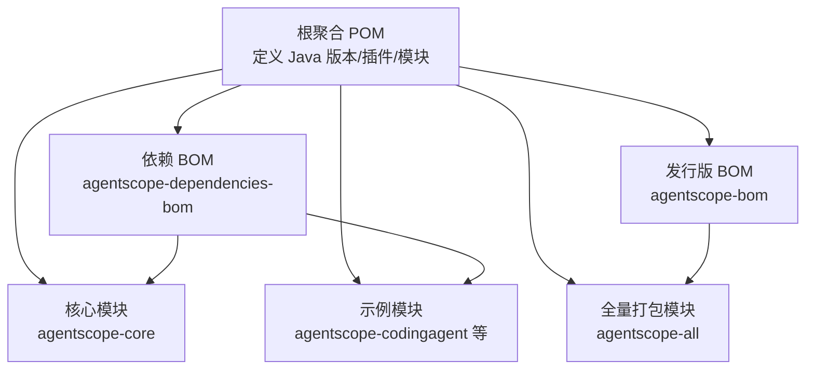
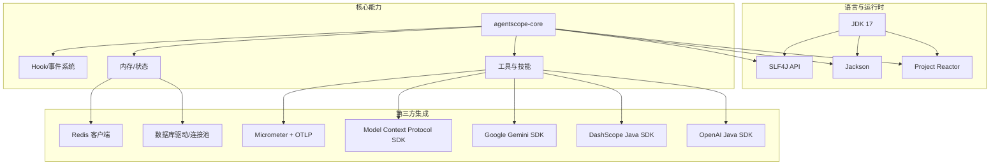
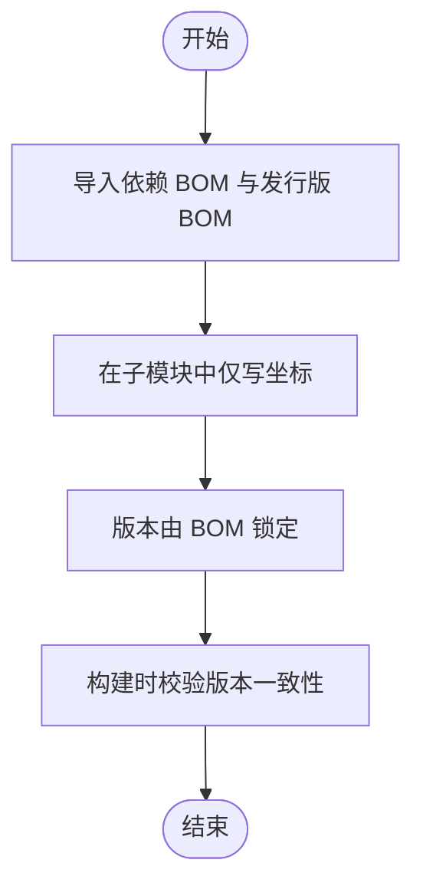
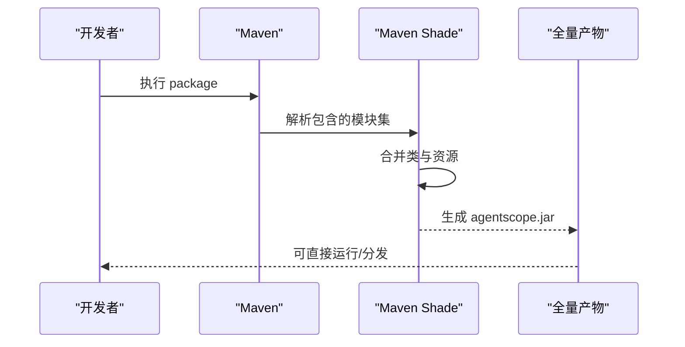

# 技术栈与依赖

<cite>
**本文引用的文件**   
- [根聚合 POM](file://pom.xml)
- [依赖 BOM](file://agentscope-dependencies-bom/pom.xml)
- [核心模块 POM](file://agentscope-core/pom.xml)
- [发行版 BOM](file://agentscope-distribution/agentscope-bom/pom.xml)
- [全量打包模块 POM](file://agentscope-distribution/agentscope-all/pom.xml)
- [示例：编码代理模块 POM](file://agentscope-examples/agents/agentscope-codingagent/pom.xml)
- [构建器示例应用配置](file://agentscope-builder-saton/src/main/resources/application.yml)
</cite>

## 目录
1. [引言](#引言)
2. [项目结构](#项目结构)
3. [核心组件](#核心组件)
4. [架构总览](#架构总览)
5. [详细组件分析](#详细组件分析)
6. [依赖分析](#依赖分析)
7. [性能考虑](#性能考虑)
8. [故障排查指南](#故障排查指南)
9. [结论](#结论)
10. [附录](#附录)

## 引言
本章节面向开发者，系统性说明 AgentScope Java 的技术栈与依赖配置，重点覆盖：
- Java 版本要求（JDK 17+）
- 核心依赖库及其作用与选择理由
- 第三方服务集成（大模型提供商、数据库连接池、监控系统等）
- 版本兼容性与升级策略
- Maven 坐标与版本锁定策略
- 环境搭建与依赖管理最佳实践

## 项目结构
AgentScope Java 采用多模块聚合工程，核心模块与发行版组织如下：
- 聚合根 POM 定义统一属性、插件与模块清单
- 依赖 BOM 统一管理第三方库版本
- 核心模块提供 Agent/模型/工具/中间件等基础能力
- 发行版 BOM 汇总所有子模块坐标
- 全量打包模块通过 Shade 插件产出“全量”依赖包
- 示例模块展示如何在业务工程中引入与使用

图表来源
- [根聚合 POM:29-64](file://pom.xml#L29-L64)
- [依赖 BOM:62-127](file://agentscope-dependencies-bom/pom.xml#L62-L127)
- [发行版 BOM:61-80](file://agentscope-distribution/agentscope-bom/pom.xml#L61-L80)
- [全量打包模块 POM:34-40](file://agentscope-distribution/agentscope-all/pom.xml#L34-L40)
- [示例：编码代理模块 POM:33-44](file://agentscope-examples/agents/agentscope-codingagent/pom.xml#L33-L44)

章节来源
- [根聚合 POM:29-64](file://pom.xml#L29-L64)
- [依赖 BOM:62-127](file://agentscope-dependencies-bom/pom.xml#L62-L127)
- [发行版 BOM:61-80](file://agentscope-distribution/agentscope-bom/pom.xml#L61-L80)
- [全量打包模块 POM:34-40](file://agentscope-distribution/agentscope-all/pom.xml#L34-L40)
- [示例：编码代理模块 POM:33-44](file://agentscope-examples/agents/agentscope-codingagent/pom.xml#L33-L44)

## 核心组件
- Java 版本：统一使用 JDK 17，编译与运行目标均为 17
- 构建工具：Maven，统一插件版本与测试配置
- 运行时：基于响应式编程模型（Project Reactor），核心模块直接依赖 reactor-core
- 序列化：Jackson 生态（databind、annotations、JSR310），配合 Victools 生成结构化输出模式
- 日志门面：SLF4J API
- HTTP 客户端：OkHttp（多模块复用）
- 测试：JUnit 5、Mockito、Reactor Test
- 可观测性：OpenTelemetry API；示例模块集成 Micrometer + OTLP 导出

章节来源
- [根聚合 POM:33-35](file://pom.xml#L33-L35)
- [核心模块 POM:52-91](file://agentscope-core/pom.xml#L52-L91)
- [依赖 BOM:70-119](file://agentscope-dependencies-bom/pom.xml#L70-L119)
- [示例：编码代理模块 POM:115-136](file://agentscope-examples/agents/agentscope-codingagent/pom.xml#L115-L136)

## 架构总览
下图展示了 AgentScope Java 在“技术栈—依赖—第三方集成”层面的整体关系。

图表来源
- [核心模块 POM:52-127](file://agentscope-core/pom.xml#L52-L127)
- [依赖 BOM:207-247](file://agentscope-dependencies-bom/pom.xml#L207-L247)
- [示例：编码代理模块 POM:76-136](file://agentscope-examples/agents/agentscope-codingagent/pom.xml#L76-L136)

## 详细组件分析

### Java 版本与构建
- 统一属性：java.version=17，maven.compiler.source/target=17
- 编译插件启用 -parameters 参数，便于运行时反射参数名
- 测试插件配置了测试报告格式与日志输出控制
- 发布配置支持 GPG 签名与 Central 发布

章节来源
- [根聚合 POM:29-55](file://pom.xml#L29-L55)
- [根聚合 POM:260-300](file://pom.xml#L260-L300)
- [根聚合 POM:346-409](file://pom.xml#L346-L409)

### 核心依赖库与作用
- Project Reactor：响应式流处理，核心模块直接依赖 reactor-core
- Jackson：JSON 序列化/反序列化与 JSR310 时间模块，配合 Victools 生成结构化输出模式
- SLF4J API：统一日志门面，避免绑定耦合
- OkHttp：HTTP 客户端，被多个模块复用
- OpenTelemetry：API 与可选 SDK 测试依赖，示例模块集成 Micrometer + OTLP
- 测试：JUnit 5、Mockito、Reactor Test

章节来源
- [核心模块 POM:52-91](file://agentscope-core/pom.xml#L52-L91)
- [核心模块 POM:161-176](file://agentscope-core/pom.xml#L161-L176)
- [依赖 BOM:130-180](file://agentscope-dependencies-bom/pom.xml#L130-L180)
- [示例：编码代理模块 POM:115-136](file://agentscope-examples/agents/agentscope-codingagent/pom.xml#L115-L136)

### 大模型提供商集成
- OpenAI：openai-java SDK
- DashScope：dashscope-sdk-java
- Google Gemini：google-genai
- Anthropic：anthropic-java
- MCP（Model Context Protocol）：mcp SDK
- 选择理由：官方或社区成熟 SDK，生态完善，便于抽象统一的调用接口

章节来源
- [依赖 BOM:207-247](file://agentscope-dependencies-bom/pom.xml#L207-L247)
- [核心模块 POM:110-126](file://agentscope-core/pom.xml#L110-L126)

### 数据库与连接池
- H2（开发/测试）：spring-boot-starter-data-jpa + h2
- MySQL：mysql-connector-j（runtime）
- PostgreSQL：postgresql 驱动
- 连接池：Spring Boot 默认 HikariCP（由 starter-data-jpa 引入）
- 示例应用配置演示了 H2 文件数据库与 JPA DDL 自动更新

章节来源
- [示例：编码代理模块 POM:61-75](file://agentscope-examples/agents/agentscope-codingagent/pom.xml#L61-L75)
- [构建器示例应用配置:9-23](file://agentscope-builder-saton/src/main/resources/application.yml#L9-L23)

### 监控与可观测性
- Micrometer + Prometheus：暴露 /actuator/prometheus
- OpenTelemetry：OTLP 导出器，结合 Micrometer tracing bridge
- 示例模块通过 spring-boot-starter-actuator 与 micrometer-registry-prometheus 集成

章节来源
- [示例：编码代理模块 POM:115-136](file://agentscope-examples/agents/agentscope-codingagent/pom.xml#L115-L136)

### 版本兼容性与升级策略
- 使用 BOM 管理第三方版本，确保模块间一致性
- Spring/Spring Boot 版本在示例模块中单独声明，避免与父 BOM 冲突
- 升级建议：
  - 先升级依赖 BOM 中的版本属性，再逐个模块验证
  - 对于 Spring/Spring Boot，优先在示例模块中验证后再推广到核心模块
  - 关注 OkHttp、Reactor、Jackson 等核心库的兼容性矩阵

章节来源
- [依赖 BOM:62-127](file://agentscope-dependencies-bom/pom.xml#L62-L127)
- [示例：编码代理模块 POM:33-44](file://agentscope-examples/agents/agentscope-codingagent/pom.xml#L33-L44)

### 依赖配置最佳实践
- 在父 POM 或自定义 BOM 中集中声明版本，子模块仅保留坐标
- 使用 dependencyManagement 锁定版本，避免传递依赖导致的不一致
- 对可选功能（如 DashScope、Redis 后端）使用 optional，并在业务模块显式引入
- 对测试依赖（如 kubernetes-server-mock）限定 scope 为 test
- 对 Spring 生态（starter）使用 Spring Boot BOM，避免版本漂移

章节来源
- [根聚合 POM:133-150](file://pom.xml#L133-L150)
- [核心模块 POM:93-108](file://agentscope-core/pom.xml#L93-L108)
- [核心模块 POM:227-230](file://agentscope-core/pom.xml#L227-L230)

### 环境搭建与依赖管理实用指导
- 开发环境：JDK 17+，Maven 3.8+
- 推荐步骤：
  1) 克隆仓库后，先执行 mvn -DskipTests install 完成依赖解析
  2) 在业务工程中引入发行版 BOM（agentscope-bom）或直接依赖所需模块
  3) 如需 Spring 集成，参考示例模块引入相应 starter
  4) 配置数据源与日志，按需开启监控导出
- 注意事项：
  - 若项目已有 Spring Boot，注意与示例模块中的 Spring Boot 版本保持兼容
  - 对外部 SDK（如 DashScope/OpenAI）按需引入，避免不必要的依赖体积

章节来源
- [根聚合 POM:29-55](file://pom.xml#L29-L55)
- [发行版 BOM:80-100](file://agentscope-distribution/agentscope-bom/pom.xml#L80-L100)
- [构建器示例应用配置:1-40](file://agentscope-builder-saton/src/main/resources/application.yml#L1-L40)

## 依赖分析

### 依赖导入与版本锁定
- 根 POM 通过 dependencyManagement 导入两个 BOM：
  - agentscope-dependencies-bom：统一第三方依赖版本
  - agentscope-bom：统一内部模块坐标
- 子模块按需引入具体依赖，无需重复声明版本

图表来源
- [根聚合 POM:133-150](file://pom.xml#L133-L150)
- [依赖 BOM:129-180](file://agentscope-dependencies-bom/pom.xml#L129-L180)
- [发行版 BOM:80-100](file://agentscope-distribution/agentscope-bom/pom.xml#L80-L100)

章节来源
- [根聚合 POM:133-150](file://pom.xml#L133-L150)
- [依赖 BOM:129-180](file://agentscope-dependencies-bom/pom.xml#L129-L180)
- [发行版 BOM:80-100](file://agentscope-distribution/agentscope-bom/pom.xml#L80-L100)

### 全量打包与模块化
- 全量打包模块通过 Maven Shade 插件将核心与扩展模块打包为单一产物
- 适合快速分发与集成，但会带来依赖冲突风险，建议在需要时使用

图表来源
- [全量打包模块 POM:375-432](file://agentscope-distribution/agentscope-all/pom.xml#L375-L432)

章节来源
- [全量打包模块 POM:375-432](file://agentscope-distribution/agentscope-all/pom.xml#L375-L432)

## 性能考虑
- 响应式模型（Reactor）降低阻塞开销，适合高并发 I/O 密集场景
- Jackson 的流式处理与 JSR310 模块提升序列化效率
- 合理使用 BOM 锁定版本，避免因依赖树过深导致的启动与运行时开销
- 监控导出（OTLP/Prometheus）建议在生产环境按需开启，避免过度采样

## 故障排查指南
- 版本冲突：检查是否同时引入了不同版本的 Spring/Spring Boot 依赖，优先使用示例模块中的版本组合
- 日志缺失：确认未引入 slf4j-simple 等实现（核心模块对 DashScope 的排除即为此类场景）
- HTTP 调用异常：核对 OkHttp 版本与网络代理设置
- 监控无数据：确认 Micrometer 与 OTLP 导出器已正确配置，且环境变量/配置项生效

章节来源
- [核心模块 POM:93-108](file://agentscope-core/pom.xml#L93-L108)
- [示例：编码代理模块 POM:115-136](file://agentscope-examples/agents/agentscope-codingagent/pom.xml#L115-L136)

## 结论
AgentScope Java 以 JDK 17 为基础，围绕响应式编程、结构化输出与可观测性构建核心能力，通过 BOM 统一版本管理，结合多种大模型 SDK 与数据库/缓存生态，形成可扩展、可维护的 Agent 开发生态。建议在实际项目中遵循“BOM 锁定版本、按需引入、最小依赖”的原则，确保稳定性与可演进性。

## 附录

### Maven 坐标与版本锁定要点
- 依赖 BOM（agentscope-dependencies-bom）：集中管理第三方库版本
- 发行版 BOM（agentscope-bom）：集中管理内部模块坐标
- 示例模块（agentscope-codingagent）：演示如何在业务工程中引入 Spring 生态与监控依赖

章节来源
- [依赖 BOM:129-180](file://agentscope-dependencies-bom/pom.xml#L129-L180)
- [发行版 BOM:80-100](file://agentscope-distribution/agentscope-bom/pom.xml#L80-L100)
- [示例：编码代理模块 POM:33-44](file://agentscope-examples/agents/agentscope-codingagent/pom.xml#L33-L44)