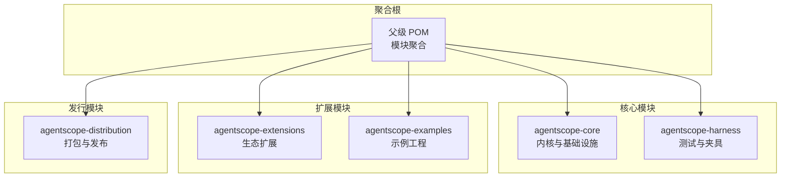
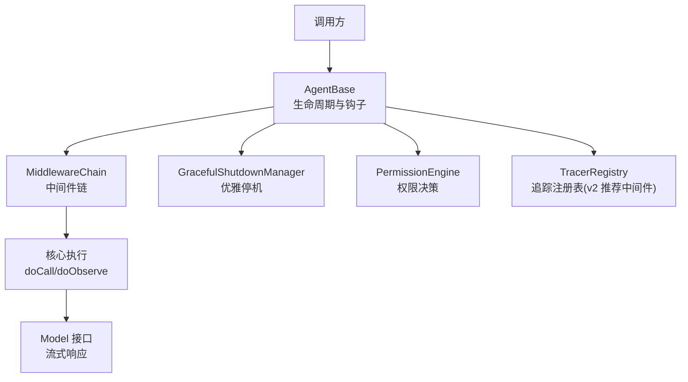
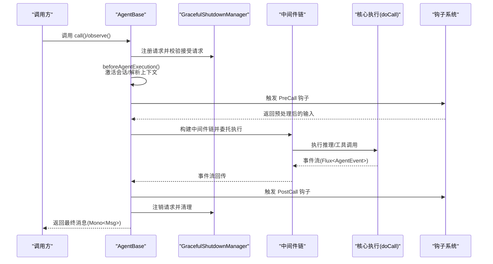
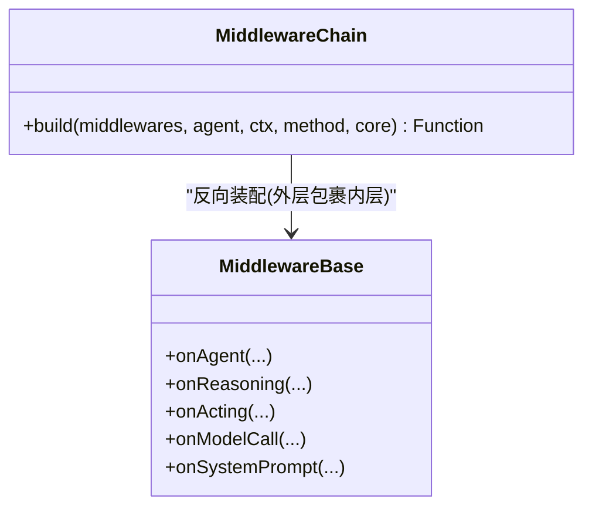
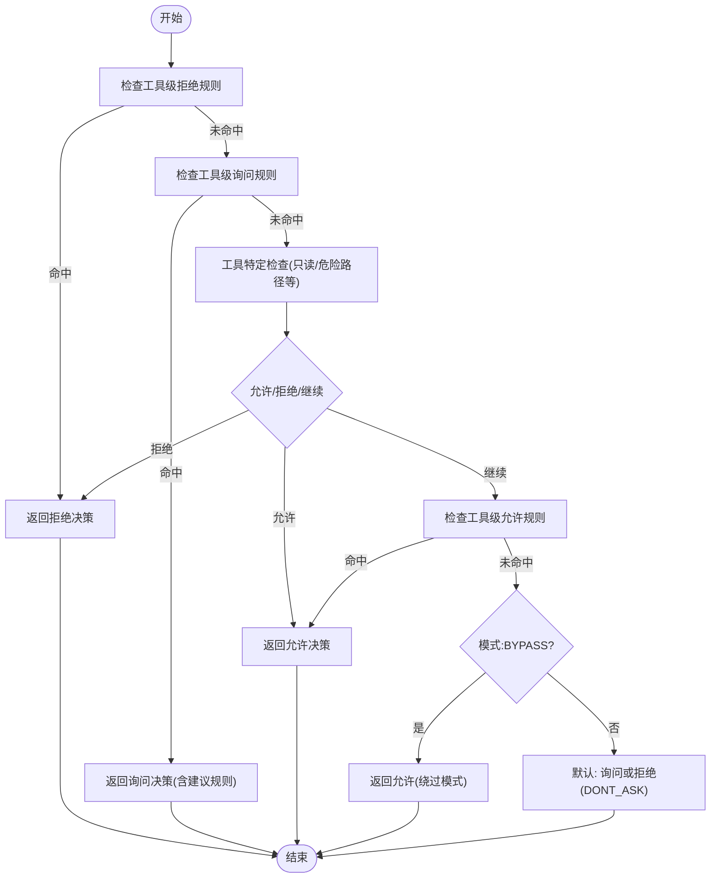
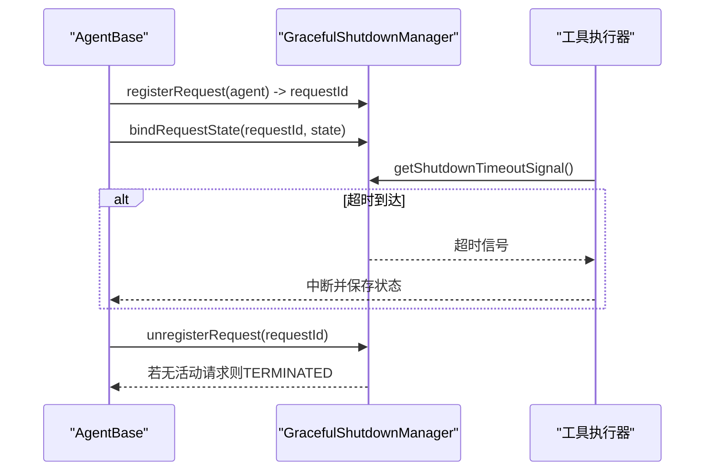
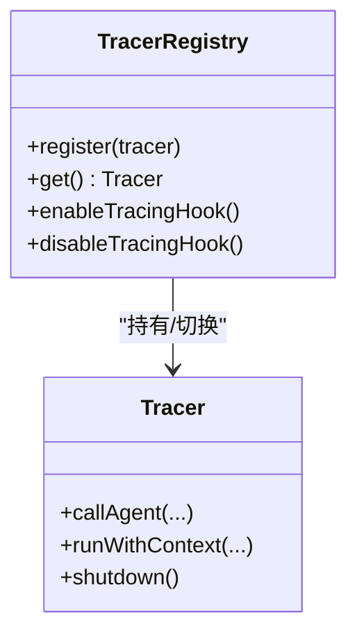
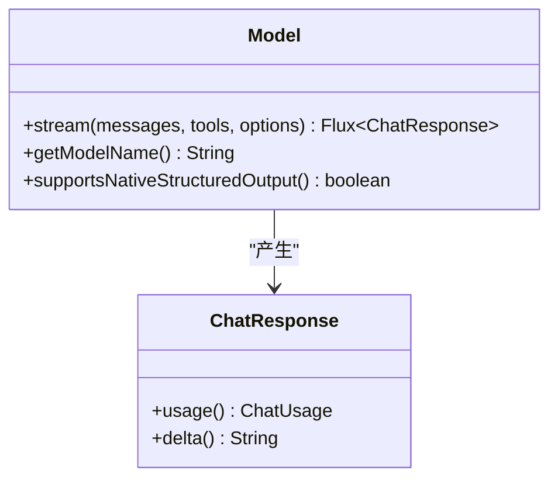
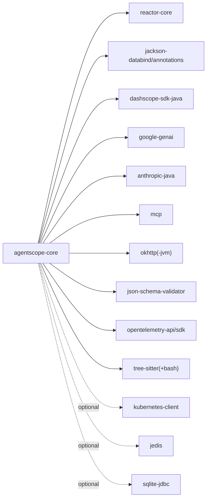

# 架构设计理念

<cite>
**本文引用的文件**
- [pom.xml](file://pom.xml)
- [Version.java](file://agentscope-core/src/main/java/io/agentscope/core/Version.java)
- [Agent.java](file://agentscope-core/src/main/java/io/agentscope/core/agent/Agent.java)
- [AgentBase.java](file://agentscope-core/src/main/java/io/agentscope/core/agent/AgentBase.java)
- [ObservableAgent.java](file://agentscope-core/src/main/java/io/agentscope/core/agent/ObservableAgent.java)
- [StreamableAgent.java](file://agentscope-core/src/main/java/io/agentscope/core/agent/StreamableAgent.java)
- [MiddlewareBase.java](file://agentscope-core/src/main/java/io/agentscope/core/middleware/MiddlewareBase.java)
- [MiddlewareChain.java](file://agentscope-core/src/main/java/io/agentscope/core/middleware/MiddlewareChain.java)
- [Model.java](file://agentscope-core/src/main/java/io/agentscope/core/model/Model.java)
- [GracefulShutdownManager.java](file://agentscope-core/src/main/java/io/agentscope/core/shutdown/GracefulShutdownManager.java)
- [PermissionEngine.java](file://agentscope-core/src/main/java/io/agentscope/core/permission/PermissionEngine.java)
- [TracerRegistry.java](file://agentscope-core/src/main/java/io/agentscope/core/tracing/TracerRegistry.java)
- [agentscope-core/pom.xml](file://agentscope-core/pom.xml)
</cite>

## 目录
1. [引言](#引言)
2. [项目结构](#项目结构)
3. [核心组件](#核心组件)
4. [架构总览](#架构总览)
5. [详细组件分析](#详细组件分析)
6. [依赖分析](#依赖分析)
7. [性能考量](#性能考量)
8. [故障排查指南](#故障排查指南)
9. [结论](#结论)
10. [附录](#附录)

## 引言
本文件系统性阐述 AgentScope Java 的架构设计理念与实现细节，聚焦以下主题：
- 分层设计与插件化架构：通过接口分层（Agent/Callable/Streamable/Observable）与中间件链模式实现高内聚低耦合
- 中间件链模式：洋葱模型在推理、执行、模型调用与系统提示词上的拦截与转换
- 生产级特性：安全沙箱隔离（权限引擎）、可观测性设计（追踪注册表）、高性能响应式架构（Project Reactor）
- 组件交互、数据流与控制流：从调用入口到事件流的完整生命周期
- 灵活性与易用性平衡：从简单应用到企业级部署的适配策略
- 技术选型原因：Project Reactor 的响应式流、Jackson/Victools 的结构化输出、OpenTelemetry 集成等

## 项目结构
AgentScope Java 采用多模块聚合结构，核心模块包含：
- agentscope-core：框架内核，定义 Agent 接口族、中间件、模型抽象、状态与工具、权限与优雅停机等基础设施
- agentscope-extensions：扩展生态（渠道、RAG、调度器、沙箱、存储等）
- agentscope-examples：示例工程
- agentscope-harness：测试与集成夹具
- agentscope-distribution：打包与发布配置

图示来源
- [pom.xml:57-64](file://pom.xml#L57-L64)

章节来源
- [pom.xml:57-64](file://pom.xml#L57-L64)

## 核心组件
本节从接口与抽象类角度梳理 AgentScope 的核心构件，阐明职责边界与协作方式。

- Agent 接口族
  - Agent：统一能力接口，组合 Callable、Streamable、Observable 三类能力，强调“一次调用产生一个终止消息”的契约
  - ObservableAgent：观察模式，允许接收消息而不生成回复，支撑多智能体协作
  - StreamableAgent：已废弃，v2 推荐使用更细粒度的 AgentEvent 流
  - CallableAgent：由 AgentBase 实现，提供 call()/call(..., Class)/call(..., JsonNode) 等重载

- AgentBase 抽象基类
  - 提供统一生命周期：acquireExecution → beforeAgentExecution → 预钩子 → doCall → 后置钩子 → afterAgentExecution → releaseExecution
  - 响应式中断与优雅停机：基于 Reactor 的 Mono/Flux，结合 GracefulShutdownManager 进行请求跟踪与超时强制中断
  - 钩子系统：PreCall/PostCall/Error 等事件驱动，支持动态增删钩子
  - 会话序列化：按 key 对并发调用进行串行化，避免同一会话状态竞态

- 中间件体系
  - MiddlewareBase：定义 onAgent/onReasoning/onActing/onModelCall/onSystemPrompt 五种拦截点，洋葱式包装
  - MiddlewareChain：构建反向装配的中间件链，确保外层包裹内层逻辑

- 模型抽象
  - Model 接口：统一模型能力，支持结构化输出与工具调用；不同厂商模型通过适配器实现

- 权限与安全
  - PermissionEngine：基于规则的权限决策流水线，支持 deny/ask/allow/bypass 等模式，覆盖只读探索、危险路径检测等场景

- 可观测性
  - TracerRegistry：全局追踪注册表，提供 Reactor 全局钩子以传播追踪上下文（v2 已弃用，推荐 OtelTracingMiddleware）

- 优雅停机
  - GracefulShutdownManager：全局管理运行中请求，支持超时强制中断、状态保存与终止等待

章节来源
- [Agent.java:47-115](file://agentscope-core/src/main/java/io/agentscope/core/agent/Agent.java#L47-L115)
- [ObservableAgent.java:36-54](file://agentscope-core/src/main/java/io/agentscope/core/agent/ObservableAgent.java#L36-L54)
- [StreamableAgent.java:23-194](file://agentscope-core/src/main/java/io/agentscope/core/agent/StreamableAgent.java#L23-L194)
- [AgentBase.java:47-90](file://agentscope-core/src/main/java/io/agentscope/core/agent/AgentBase.java#L47-L90)
- [MiddlewareBase.java:59-144](file://agentscope-core/src/main/java/io/agentscope/core/middleware/MiddlewareBase.java#L59-L144)
- [MiddlewareChain.java:31-79](file://agentscope-core/src/main/java/io/agentscope/core/middleware/MiddlewareChain.java#L31-L79)
- [Model.java:22-54](file://agentscope-core/src/main/java/io/agentscope/core/model/Model.java#L22-L54)
- [PermissionEngine.java:47-336](file://agentscope-core/src/main/java/io/agentscope/core/permission/PermissionEngine.java#L47-L336)
- [TracerRegistry.java:44-165](file://agentscope-core/src/main/java/io/agentscope/core/tracing/TracerRegistry.java#L44-L165)
- [GracefulShutdownManager.java:40-333](file://agentscope-core/src/main/java/io/agentscope/core/shutdown/GracefulShutdownManager.java#L40-L333)

## 架构总览
AgentScope Java 采用“接口分层 + 中间件链 + 响应式流”的架构范式，核心要点如下：
- 分层设计
  - 表达层：Agent 接口族（可调用、可观察、可流式）
  - 执行层：AgentBase 生命周期与钩子系统
  - 插件层：MiddlewareBase 拦截点与 MiddlewareChain 构建
  - 能力层：Model 抽象、工具与状态、权限与安全
- 插件化架构
  - 中间件以洋葱模式包裹核心逻辑，支持按需装配
  - 钩子系统支持动态增删，便于扩展与监控
- 中间件链模式
  - onAgent/onReasoning/onActing/onModelCall/onSystemPrompt 五类拦截点覆盖完整生命周期
- 响应式与可观测性
  - 基于 Project Reactor 的 Flux/Mono，实现背压与异步流处理
  - TracerRegistry 提供全局上下文传播（v2 推荐使用专用中间件）
- 安全与合规
  - PermissionEngine 提供规则驱动的权限决策，支持只读探索、危险路径检测与用户确认

图示来源
- [AgentBase.java:252-322](file://agentscope-core/src/main/java/io/agentscope/core/agent/AgentBase.java#L252-L322)
- [MiddlewareChain.java:46-62](file://agentscope-core/src/main/java/io/agentscope/core/middleware/MiddlewareChain.java#L46-L62)
- [Model.java:22-54](file://agentscope-core/src/main/java/io/agentscope/core/model/Model.java#L22-L54)
- [GracefulShutdownManager.java:153-184](file://agentscope-core/src/main/java/io/agentscope/core/shutdown/GracefulShutdownManager.java#L153-L184)
- [PermissionEngine.java:139-202](file://agentscope-core/src/main/java/io/agentscope/core/permission/PermissionEngine.java#L139-L202)
- [TracerRegistry.java:161-163](file://agentscope-core/src/main/java/io/agentscope/core/tracing/TracerRegistry.java#L161-L163)

## 详细组件分析

### AgentBase 生命周期与钩子系统
AgentBase 将一次调用封装为“资源获取 → 会话激活 → 预钩子 → 执行 → 后置钩子 → 清理释放”的完整生命周期，配合 Reactor 的 Mono/Flux 实现非阻塞与可中断的执行模型。

图示来源
- [AgentBase.java:252-322](file://agentscope-core/src/main/java/io/agentscope/core/agent/AgentBase.java#L252-L322)
- [GracefulShutdownManager.java:153-184](file://agentscope-core/src/main/java/io/agentscope/core/shutdown/GracefulShutdownManager.java#L153-L184)
- [MiddlewareChain.java:46-62](file://agentscope-core/src/main/java/io/agentscope/core/middleware/MiddlewareChain.java#L46-L62)

章节来源
- [AgentBase.java:189-322](file://agentscope-core/src/main/java/io/agentscope/core/agent/AgentBase.java#L189-L322)

### 中间件链模式与拦截点
中间件以洋葱模式组织，外层包裹内层，支持五类拦截点：
- onAgent：拦截整个代理调用
- onReasoning：拦截推理阶段（模型调用+流式解析）
- onActing：拦截单个工具调用执行
- onModelCall：拦截原始模型 API 调用
- onSystemPrompt：顺序变换系统提示词

图示来源
- [MiddlewareBase.java:59-144](file://agentscope-core/src/main/java/io/agentscope/core/middleware/MiddlewareBase.java#L59-L144)
- [MiddlewareChain.java:31-79](file://agentscope-core/src/main/java/io/agentscope/core/middleware/MiddlewareChain.java#L31-L79)

章节来源
- [MiddlewareBase.java:25-58](file://agentscope-core/src/main/java/io/agentscope/core/middleware/MiddlewareBase.java#L25-L58)
- [MiddlewareChain.java:25-79](file://agentscope-core/src/main/java/io/agentscope/core/middleware/MiddlewareChain.java#L25-L79)

### 权限引擎与安全沙箱
PermissionEngine 提供规则驱动的权限决策流水线，优先级从高到低依次为：工具级拒绝规则、询问规则、工具特定检查（只读/危险路径等）、允许规则、绕过模式、默认询问或拒绝（取决于模式）。该机制可与沙箱执行守卫结合，形成端到端的安全控制闭环。

图示来源
- [PermissionEngine.java:139-202](file://agentscope-core/src/main/java/io/agentscope/core/permission/PermissionEngine.java#L139-L202)

章节来源
- [PermissionEngine.java:28-46](file://agentscope-core/src/main/java/io/agentscope/core/permission/PermissionEngine.java#L28-L46)

### 优雅停机与中断控制
GracefulShutdownManager 提供全局的优雅停机管理，包括：
- 请求注册与注销：每个调用分配唯一 requestId，避免同实例并发调用互相覆盖
- 超时强制中断：达到超时后触发信号，逐个中断并保存状态
- 终止等待：当所有活动请求清空后进入 TERMINATED 状态

图示来源
- [GracefulShutdownManager.java:153-184](file://agentscope-core/src/main/java/io/agentscope/core/shutdown/GracefulShutdownManager.java#L153-L184)
- [GracefulShutdownManager.java:211-278](file://agentscope-core/src/main/java/io/agentscope/core/shutdown/GracefulShutdownManager.java#L211-L278)

章节来源
- [GracefulShutdownManager.java:37-91](file://agentscope-core/src/main/java/io/agentscope/core/shutdown/GracefulShutdownManager.java#L37-L91)

### 观测性与追踪
TracerRegistry 提供全局追踪上下文传播（v2 已弃用），建议改用 OtelTracingMiddleware。其通过 Reactor 全局钩子对每个操作符进行包装，确保订阅者在正确的追踪上下文中处理信号。

图示来源
- [TracerRegistry.java:44-165](file://agentscope-core/src/main/java/io/agentscope/core/tracing/TracerRegistry.java#L44-L165)

章节来源
- [TracerRegistry.java:25-41](file://agentscope-core/src/main/java/io/agentscope/core/tracing/TracerRegistry.java#L25-L41)

### 结构化输出与模型抽象
Model 接口统一了模型能力，支持：
- 流式聊天补全响应（Flux<ChatResponse>）
- 结构化输出（native structured output 或工具注入）
- 工具调用与生成选项

图示来源
- [Model.java:22-54](file://agentscope-core/src/main/java/io/agentscope/core/model/Model.java#L22-L54)

章节来源
- [Model.java:22-54](file://agentscope-core/src/main/java/io/agentscope/core/model/Model.java#L22-L54)

## 依赖分析
核心模块依赖关系概览（部分关键依赖）：
- 响应式与序列化：io.projectreactor:reactor-core、com.fasterxml.jackson.*
- 模型 SDK：com.alibaba:dashscope-sdk-java、com.google.genai:google-genai、com.anthropic:anthropic-java
- MCP 协议：io.modelcontextprotocol.sdk:mcp
- HTTP 客户端：com.squareup.okhttp3:okhttp(-jvm)
- JSON Schema 校验：com.networknt:json-schema-validator
- OpenTelemetry：io.opentelemetry:opentelemetry-api/sdk
- 语法树与安全分析：io.github.bonede:tree-sitter(+bash)
- 可选存储与容器：redis.clients:jedis、org.apache.commons:commons-compress、org.xerial:sqlite-jdbc、io.fabric8:kubernetes-client

图示来源
- [agentscope-core/pom.xml:51-231](file://agentscope-core/pom.xml#L51-L231)

章节来源
- [agentscope-core/pom.xml:51-231](file://agentscope-core/pom.xml#L51-L231)

## 性能考量
- 响应式与背压：基于 Project Reactor 的 Flux/Mono 支持背压与异步处理，降低阻塞与线程占用
- 生命周期最小化：AgentBase 在调用前后仅做必要绑定与清理，避免额外开销
- 中间件链短路：中间件默认透传，仅在需要时插入逻辑，减少不必要包装
- 优雅停机超时：GracefulShutdownManager 的超时强制中断避免长时间悬挂，保障系统回收效率
- 序列化与并发：按会话键串行化调用，避免内存竞争导致的重试风暴

## 故障排查指南
- 中断与异常
  - 检查 InterruptedException 是否被正确捕获并转交至 handleInterrupt
  - 使用 getRuntimeContext() 获取当前调用上下文，定位钩子与中间件状态
- 优雅停机
  - 确认 registerRequest/getShutdownTimeoutSignal/bindRequestState 的调用链是否完整
  - 使用 awaitTermination 检查是否达到 TERMINATED 状态
- 权限问题
  - 核对 PermissionEngine 的规则表与模式（BYPASS/DONT_ASK/EXPLORE/ACCEPT_EDITS）
  - 关注工具特定检查（只读/危险路径）与建议规则生成
- 追踪上下文
  - v2 推荐使用 OtelTracingMiddleware 替代全局钩子，避免对无关管道造成性能影响

章节来源
- [AgentBase.java:494-502](file://agentscope-core/src/main/java/io/agentscope/core/agent/AgentBase.java#L494-L502)
- [GracefulShutdownManager.java:211-278](file://agentscope-core/src/main/java/io/agentscope/core/shutdown/GracefulShutdownManager.java#L211-L278)
- [PermissionEngine.java:139-202](file://agentscope-core/src/main/java/io/agentscope/core/permission/PermissionEngine.java#L139-L202)
- [TracerRegistry.java:78-130](file://agentscope-core/src/main/java/io/agentscope/core/tracing/TracerRegistry.java#L78-L130)

## 结论
AgentScope Java 通过“接口分层 + 中间件链 + 响应式流 + 权限与可观测性”的设计，实现了从简单应用到企业级部署的灵活适配。其核心价值在于：
- 易扩展：中间件与钩子系统让横切关注点（日志、监控、权限、限流）可插拔
- 易运维：统一的生命周期与优雅停机，保障服务稳定与可回收
- 易安全：规则驱动的权限引擎与可选沙箱执行守卫，满足合规要求
- 易观测：追踪上下文传播与事件流，便于问题定位与性能分析

## 附录
- 版本与用户代理
  - Version 提供统一的 User-Agent 字符串，用于识别客户端与统计使用情况

章节来源
- [Version.java:24-45](file://agentscope-core/src/main/java/io/agentscope/core/Version.java#L24-L45)