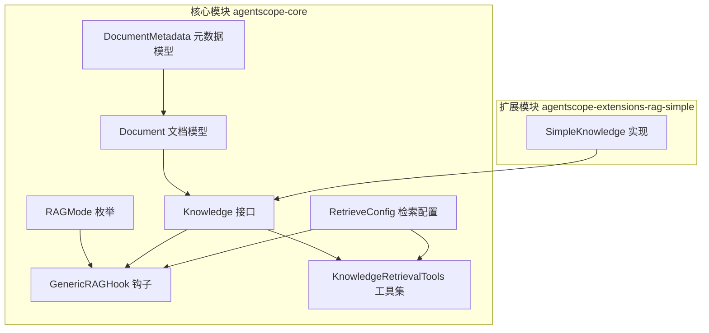
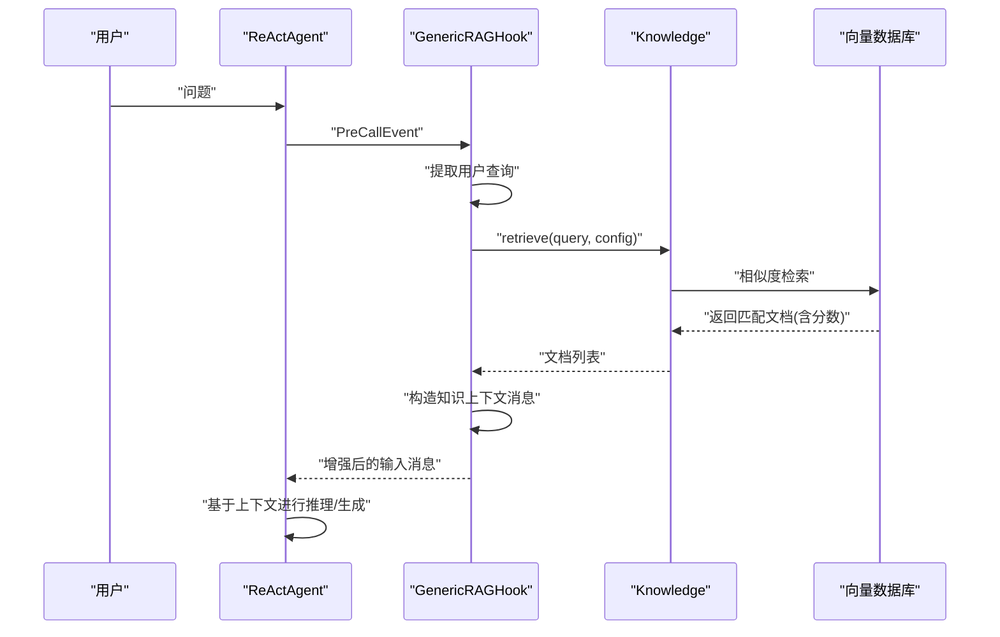
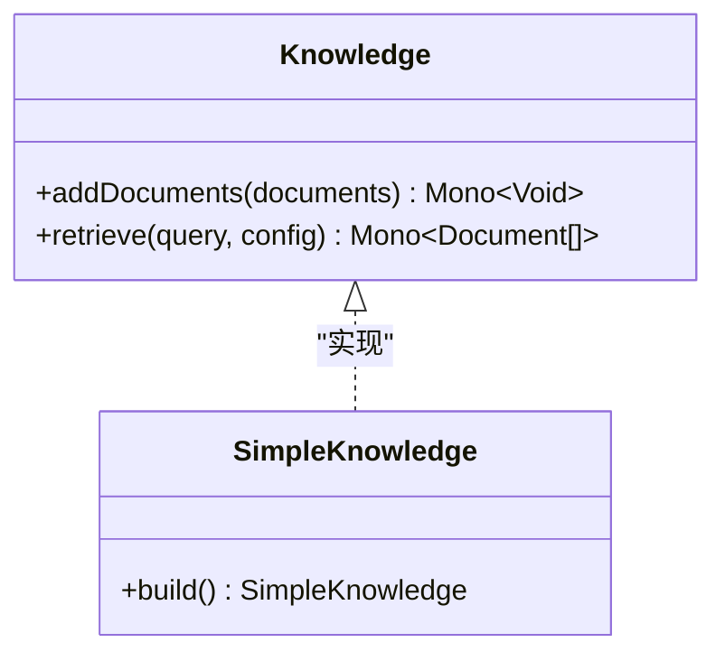
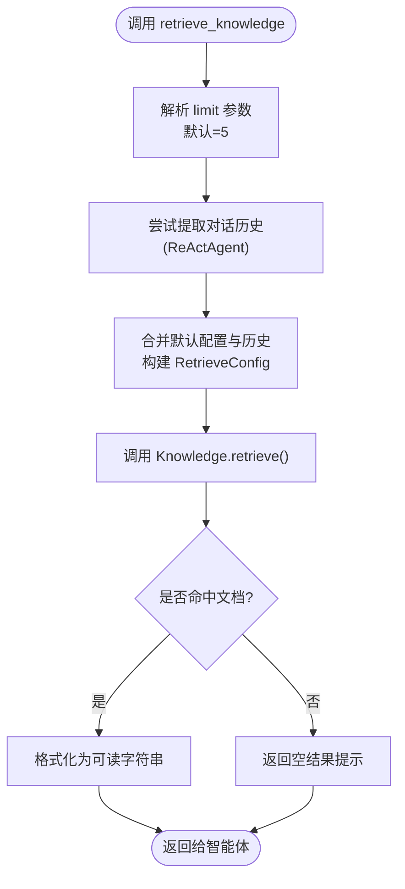
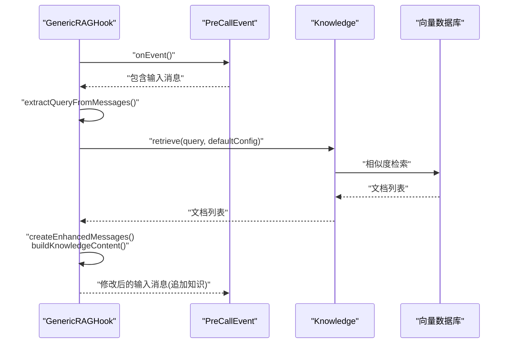
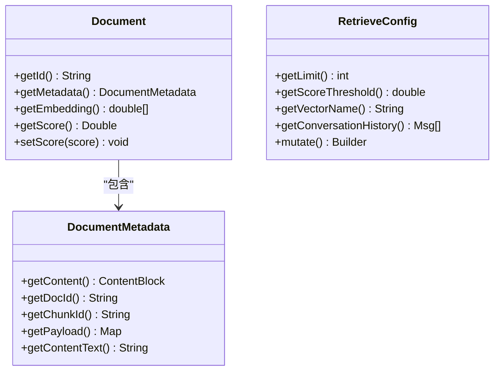
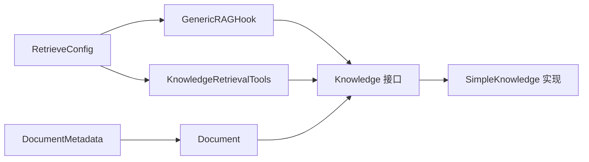

# RAG检索增强生成

<cite>
**本文引用的文件**
- [RAGMode.java](file://agentscope-core/src/main/java/io/agentscope/core/rag/RAGMode.java)
- [Knowledge.java](file://agentscope-core/src/main/java/io/agentscope/core/rag/Knowledge.java)
- [KnowledgeRetrievalTools.java](file://agentscope-core/src/main/java/io/agentscope/core/rag/KnowledgeRetrievalTools.java)
- [GenericRAGHook.java](file://agentscope-core/src/main/java/io/agentscope/core/rag/GenericRAGHook.java)
- [Document.java](file://agentscope-core/src/main/java/io/agentscope/core/rag/model/Document.java)
- [DocumentMetadata.java](file://agentscope-core/src/main/java/io/agentscope/core/rag/model/DocumentMetadata.java)
- [RetrieveConfig.java](file://agentscope-core/src/main/java/io/agentscope/core/rag/model/RetrieveConfig.java)
- [SimpleKnowledge.java](file://agentscope-extensions/agentscope-extensions-rag/agentscope-extensions-rag-simple/src/main/java/io/agentscope/core/rag/knowledge/SimpleKnowledge.java)
- [rag.md（v1 中文）](file://docs/v1/zh/docs/task/rag.md)
- [rag.md（v1 英文）](file://docs/v1/en/docs/task/rag.md)
- [overview.md（v2 中文）](file://docs/v2/zh/integration/rag/overview.md)
</cite>

## 目录
1. [简介](#简介)
2. [项目结构](#项目结构)
3. [核心组件](#核心组件)
4. [架构总览](#架构总览)
5. [组件详解](#组件详解)
6. [依赖关系分析](#依赖关系分析)
7. [性能与优化](#性能与优化)
8. [故障排查指南](#故障排查指南)
9. [结论](#结论)
10. [附录](#附录)

## 简介
本文件面向AgentScope的RAG（检索增强生成）能力，系统梳理已废弃但具备参考价值的RAG子系统在核心模块中的设计与实现，包括：
- RAG模式枚举：Generic（通用）、Agentic（智能体主动）与NONE（禁用）三种模式的定位与适用场景
- 知识库接口与工具集：Knowledge接口、检索工具类、以及钩子系统GenericRAGHook如何在代理生命周期中注入检索结果
- 数据模型：Document与DocumentMetadata、RetrieveConfig等关键数据结构
- 配置与最佳实践：检索参数、模式选择、向量存储选型与性能优化建议

注意：上述组件已在2.0.0版本标记为废弃，官方文档指出“移除rag包，将检索集成到应用层”。本文件用于帮助理解历史实现与迁移路径。

## 项目结构
RAG相关代码位于核心模块的io.agentscope.core.rag包下，并配套了模型类与检索工具类；扩展模块提供了具体的知识库实现（如SimpleKnowledge）。

图表来源
- [RAGMode.java:32-56](file://agentscope-core/src/main/java/io/agentscope/core/rag/RAGMode.java#L32-L56)
- [Knowledge.java:34-58](file://agentscope-core/src/main/java/io/agentscope/core/rag/Knowledge.java#L34-L58)
- [GenericRAGHook.java:69-108](file://agentscope-core/src/main/java/io/agentscope/core/rag/GenericRAGHook.java#L69-L108)
- [KnowledgeRetrievalTools.java:57-95](file://agentscope-core/src/main/java/io/agentscope/core/rag/KnowledgeRetrievalTools.java#L57-L95)
- [Document.java:38-60](file://agentscope-core/src/main/java/io/agentscope/core/rag/model/Document.java#L38-L60)
- [DocumentMetadata.java:56-109](file://agentscope-core/src/main/java/io/agentscope/core/rag/model/DocumentMetadata.java#L56-L109)
- [RetrieveConfig.java:32-44](file://agentscope-core/src/main/java/io/agentscope/core/rag/model/RetrieveConfig.java#L32-L44)
- [SimpleKnowledge.java:255-263](file://agentscope-extensions/agentscope-extensions-rag/agentscope-extensions-rag-simple/src/main/java/io/agentscope/core/rag/knowledge/SimpleKnowledge.java#L255-L263)

章节来源
- [RAGMode.java:18-56](file://agentscope-core/src/main/java/io/agentscope/core/rag/RAGMode.java#L18-L56)
- [Knowledge.java:23-58](file://agentscope-core/src/main/java/io/agentscope/core/rag/Knowledge.java#L23-L58)
- [KnowledgeRetrievalTools.java:28-56](file://agentscope-core/src/main/java/io/agentscope/core/rag/KnowledgeRetrievalTools.java#L28-L56)
- [GenericRAGHook.java:34-67](file://agentscope-core/src/main/java/io/agentscope/core/rag/GenericRAGHook.java#L34-L67)
- [Document.java:24-37](file://agentscope-core/src/main/java/io/agentscope/core/rag/model/Document.java#L24-L37)
- [DocumentMetadata.java:24-54](file://agentscope-core/src/main/java/io/agentscope/core/rag/model/DocumentMetadata.java#L24-L54)
- [RetrieveConfig.java:21-31](file://agentscope-core/src/main/java/io/agentscope/core/rag/model/RetrieveConfig.java#L21-L31)
- [SimpleKnowledge.java:225-265](file://agentscope-extensions/agentscope-extensions-rag/agentscope-extensions-rag-simple/src/main/java/io/agentscope/core/rag/knowledge/SimpleKnowledge.java#L225-L265)

## 核心组件
- RAGMode：定义三种检索增强模式，用于指导检索与注入策略
- Knowledge：知识库统一接口，抽象出“添加文档”和“检索”两大能力
- KnowledgeRetrievalTools：面向智能体的工具集，暴露检索工具方法，支持对话历史注入
- GenericRAGHook：通用钩子，在推理前自动检索并注入知识上下文
- Document/DocumentMetadata/RetrieveConfig：RAG数据模型与检索配置

章节来源
- [RAGMode.java:32-56](file://agentscope-core/src/main/java/io/agentscope/core/rag/RAGMode.java#L32-L56)
- [Knowledge.java:34-58](file://agentscope-core/src/main/java/io/agentscope/core/rag/Knowledge.java#L34-L58)
- [KnowledgeRetrievalTools.java:57-95](file://agentscope-core/src/main/java/io/agentscope/core/rag/KnowledgeRetrievalTools.java#L57-L95)
- [GenericRAGHook.java:69-108](file://agentscope-core/src/main/java/io/agentscope/core/rag/GenericRAGHook.java#L69-L108)
- [Document.java:38-60](file://agentscope-core/src/main/java/io/agentscope/core/rag/model/Document.java#L38-L60)
- [DocumentMetadata.java:56-109](file://agentscope-core/src/main/java/io/agentscope/core/rag/model/DocumentMetadata.java#L56-L109)
- [RetrieveConfig.java:32-44](file://agentscope-core/src/main/java/io/agentscope/core/rag/model/RetrieveConfig.java#L32-L44)

## 架构总览
RAG在代理生命周期中的集成路径如下：
- Generic模式：通过GenericRAGHook拦截推理事件，在输入消息中注入检索到的知识
- Agentic模式：通过KnowledgeRetrievalTools作为工具供智能体按需调用
- Knowledge接口：屏蔽底层知识库实现差异，统一检索入口

图表来源
- [GenericRAGHook.java:110-166](file://agentscope-core/src/main/java/io/agentscope/core/rag/GenericRAGHook.java#L110-L166)
- [Knowledge.java:46-57](file://agentscope-core/src/main/java/io/agentscope/core/rag/Knowledge.java#L46-L57)

## 组件详解

### RAG模式与应用场景
- Generic（通用）：每次推理前自动检索并注入知识，适合简单问答、一致性要求高、或模型能力较弱的场景
- Agentic（智能体主动）：智能体通过工具自行决定何时检索，适合复杂任务、需要选择性检索与强模型
- NONE（禁用）：不启用RAG功能

章节来源
- [RAGMode.java:32-56](file://agentscope-core/src/main/java/io/agentscope/core/rag/RAGMode.java#L32-L56)
- [rag.md（v1 中文）:535-537](file://docs/v1/zh/docs/task/rag.md#L535-L537)
- [rag.md（v1 英文）:535-537](file://docs/v1/en/docs/task/rag.md#L535-L537)

### Knowledge接口与知识库实现
- 接口职责：添加文档（嵌入并入库）、基于查询检索（支持阈值与数量限制）
- 实现建议：扩展模块提供SimpleKnowledge等实现，封装嵌入模型与向量存储
- 迁移提示：官方文档强调“仅负责检索”，导入/更新由平台控制台或服务API完成，便于在使用侧完全替换

图表来源
- [Knowledge.java:34-58](file://agentscope-core/src/main/java/io/agentscope/core/rag/Knowledge.java#L34-L58)
- [SimpleKnowledge.java:255-263](file://agentscope-extensions/agentscope-extensions-rag/agentscope-extensions-rag-simple/src/main/java/io/agentscope/core/rag/knowledge/SimpleKnowledge.java#L255-L263)

章节来源
- [Knowledge.java:34-58](file://agentscope-core/src/main/java/io/agentscope/core/rag/Knowledge.java#L34-L58)
- [SimpleKnowledge.java:225-265](file://agentscope-extensions/agentscope-extensions-rag/agentscope-extensions-rag-simple/src/main/java/io/agentscope/core/rag/knowledge/SimpleKnowledge.java#L225-L265)
- [overview.md（v2 中文）:42-42](file://docs/v2/zh/integration/rag/overview.md#L42-L42)

### KnowledgeRetrievalTools工具集
- 能力概述：注册为智能体工具，提供“检索知识”工具方法；默认返回格式化的检索结果字符串
- 对话历史注入：当智能体为ReActAgent时，自动读取会话上下文并注入到检索配置，提升多轮检索准确性
- 错误处理：工具内部对检索异常进行兜底返回，避免中断智能体流程

图表来源
- [KnowledgeRetrievalTools.java:119-167](file://agentscope-core/src/main/java/io/agentscope/core/rag/KnowledgeRetrievalTools.java#L119-L167)

章节来源
- [KnowledgeRetrievalTools.java:57-95](file://agentscope-core/src/main/java/io/agentscope/core/rag/KnowledgeRetrievalTools.java#L57-L95)
- [KnowledgeRetrievalTools.java:119-167](file://agentscope-core/src/main/java/io/agentscope/core/rag/KnowledgeRetrievalTools.java#L119-L167)
- [KnowledgeRetrievalTools.java:178-197](file://agentscope-core/src/main/java/io/agentscope/core/rag/KnowledgeRetrievalTools.java#L178-L197)

### GenericRAGHook钩子系统
- 触发点：拦截PreCallEvent（推理前）
- 行为：从消息流中提取用户查询，调用Knowledge检索，将结果以消息形式注入到输入消息末尾
- 容错：检索失败时记录告警并跳过注入，保证主流程继续执行
- 优先级：设置较高优先级，确保在钩子链中尽早执行

图表来源
- [GenericRAGHook.java:110-166](file://agentscope-core/src/main/java/io/agentscope/core/rag/GenericRAGHook.java#L110-L166)
- [GenericRAGHook.java:177-191](file://agentscope-core/src/main/java/io/agentscope/core/rag/GenericRAGHook.java#L177-L191)
- [GenericRAGHook.java:201-233](file://agentscope-core/src/main/java/io/agentscope/core/rag/GenericRAGHook.java#L201-L233)

章节来源
- [GenericRAGHook.java:69-108](file://agentscope-core/src/main/java/io/agentscope/core/rag/GenericRAGHook.java#L69-L108)
- [GenericRAGHook.java:110-166](file://agentscope-core/src/main/java/io/agentscope/core/rag/GenericRAGHook.java#L110-L166)
- [GenericRAGHook.java:177-191](file://agentscope-core/src/main/java/io/agentscope/core/rag/GenericRAGHook.java#L177-L191)
- [GenericRAGHook.java:201-233](file://agentscope-core/src/main/java/io/agentscope/core/rag/GenericRAGHook.java#L201-L233)

### 数据模型与检索配置
- Document：文档实体，包含元数据、可选嵌入向量与相似度分数，ID基于元数据确定性生成
- DocumentMetadata：文档元数据，支持多种内容类型与自定义payload字段
- RetrieveConfig：检索配置，支持limit、scoreThreshold、vectorName与对话历史注入

图表来源
- [Document.java:38-114](file://agentscope-core/src/main/java/io/agentscope/core/rag/model/Document.java#L38-L114)
- [DocumentMetadata.java:56-149](file://agentscope-core/src/main/java/io/agentscope/core/rag/model/DocumentMetadata.java#L56-L149)
- [RetrieveConfig.java:32-83](file://agentscope-core/src/main/java/io/agentscope/core/rag/model/RetrieveConfig.java#L32-L83)

章节来源
- [Document.java:38-114](file://agentscope-core/src/main/java/io/agentscope/core/rag/model/Document.java#L38-L114)
- [DocumentMetadata.java:56-149](file://agentscope-core/src/main/java/io/agentscope/core/rag/model/DocumentMetadata.java#L56-L149)
- [RetrieveConfig.java:32-83](file://agentscope-core/src/main/java/io/agentscope/core/rag/model/RetrieveConfig.java#L32-L83)

## 依赖关系分析
- 组件耦合
  - GenericRAGHook依赖Knowledge接口与RetrieveConfig，负责在推理前注入上下文
  - KnowledgeRetrievalTools依赖Knowledge接口与RetrieveConfig，负责对外暴露检索工具
  - Document与DocumentMetadata为数据载体，被Knowledge与检索流程广泛使用
- 可能的循环依赖
  - 当前各组件均为单向依赖，未见循环
- 外部依赖
  - 扩展模块提供具体实现（如SimpleKnowledge），核心模块仅依赖接口

图表来源
- [GenericRAGHook.java:69-108](file://agentscope-core/src/main/java/io/agentscope/core/rag/GenericRAGHook.java#L69-L108)
- [KnowledgeRetrievalTools.java:57-95](file://agentscope-core/src/main/java/io/agentscope/core/rag/KnowledgeRetrievalTools.java#L57-L95)
- [Knowledge.java:34-58](file://agentscope-core/src/main/java/io/agentscope/core/rag/Knowledge.java#L34-L58)
- [SimpleKnowledge.java:255-263](file://agentscope-extensions/agentscope-extensions-rag/agentscope-extensions-rag-simple/src/main/java/io/agentscope/core/rag/knowledge/SimpleKnowledge.java#L255-L263)
- [Document.java:38-60](file://agentscope-core/src/main/java/io/agentscope/core/rag/model/Document.java#L38-L60)
- [DocumentMetadata.java:56-109](file://agentscope-core/src/main/java/io/agentscope/core/rag/model/DocumentMetadata.java#L56-L109)
- [RetrieveConfig.java:32-44](file://agentscope-core/src/main/java/io/agentscope/core/rag/model/RetrieveConfig.java#L32-L44)

章节来源
- [GenericRAGHook.java:69-108](file://agentscope-core/src/main/java/io/agentscope/core/rag/GenericRAGHook.java#L69-L108)
- [KnowledgeRetrievalTools.java:57-95](file://agentscope-core/src/main/java/io/agentscope/core/rag/KnowledgeRetrievalTools.java#L57-L95)
- [Knowledge.java:34-58](file://agentscope-core/src/main/java/io/agentscope/core/rag/Knowledge.java#L34-L58)
- [SimpleKnowledge.java:255-263](file://agentscope-extensions/agentscope-extensions-rag/agentscope-extensions-rag-simple/src/main/java/io/agentscope/core/rag/knowledge/SimpleKnowledge.java#L255-L263)
- [Document.java:38-60](file://agentscope-core/src/main/java/io/agentscope/core/rag/model/Document.java#L38-L60)
- [DocumentMetadata.java:56-109](file://agentscope-core/src/main/java/io/agentscope/core/rag/model/DocumentMetadata.java#L56-L109)
- [RetrieveConfig.java:32-44](file://agentscope-core/src/main/java/io/agentscope/core/rag/model/RetrieveConfig.java#L32-L44)

## 性能与优化
- 分块策略：依据模型上下文窗口与任务场景选择分块大小（典型256-1024字符），并采用10%-20%重叠保持上下文连贯
- 检索参数：从0.3-0.5的分数阈值起步，结合检索质量逐步调整；Top-K初始3-5，再根据上下文窗口限制动态调整
- 模式选择：Generic适合简单问答与一致性需求高的场景；Agentic适合复杂任务与强模型驱动的选择性检索
- 向量存储：开发/测试可用内存存储；生产环境推荐具备持久化能力的向量数据库；部分场景支持私有部署的服务

章节来源
- [rag.md（v1 中文）:525-542](file://docs/v1/zh/docs/task/rag.md#L525-L542)
- [rag.md（v1 英文）:525-552](file://docs/v1/en/docs/task/rag.md#L525-L552)

## 故障排查指南
- 检索失败告警：GenericRAGHook在检索异常时会记录警告并跳过注入，不影响后续推理流程
- 工具兜底：KnowledgeRetrievalTools在检索异常时返回错误提示字符串，避免中断智能体执行
- 建议排查步骤
  - 确认Knowledge实现可用且向量库正常
  - 检查检索配置（limit/scoreThreshold/vectorName/conversationHistory）是否合理
  - 验证对话历史注入逻辑（仅ReActAgent可读取会话上下文）

章节来源
- [GenericRAGHook.java:160-165](file://agentscope-core/src/main/java/io/agentscope/core/rag/GenericRAGHook.java#L160-L165)
- [KnowledgeRetrievalTools.java:162-166](file://agentscope-core/src/main/java/io/agentscope/core/rag/KnowledgeRetrievalTools.java#L162-L166)

## 结论
- RAGMode、Knowledge接口、GenericRAGHook与KnowledgeRetrievalTools共同构成了AgentScope的RAG能力框架
- 尽管相关组件已标记为废弃，其设计理念仍可指导当前与未来的检索集成：将检索能力下沉至应用层，保持知识库实现的可替换性
- 建议在新项目中直接对接扩展模块提供的知识库实现，并遵循官方文档关于“仅负责检索”的设计原则

## 附录

### 配置与使用要点（基于源码注释与示例路径）
- Generic模式集成
  - 创建GenericRAGHook并绑定到智能体，即可在每次推理前自动注入检索结果
  - 示例路径参考：[GenericRAGHook.java:48-58](file://agentscope-core/src/main/java/io/agentscope/core/rag/GenericRAGHook.java#L48-L58)
- Agentic模式集成
  - 注册KnowledgeRetrievalTools到智能体工具箱，智能体可在需要时主动检索
  - 示例路径参考：[KnowledgeRetrievalTools.java:38-51](file://agentscope-core/src/main/java/io/agentscope/core/rag/KnowledgeRetrievalTools.java#L38-L51)
- 自定义知识库后端
  - 实现Knowledge接口并注入到Hook或工具中，即可无缝替换底层实现
  - 示例路径参考：[SimpleKnowledge.java:255-263](file://agentscope-extensions/agentscope-extensions-rag/agentscope-extensions-rag-simple/src/main/java/io/agentscope/core/rag/knowledge/SimpleKnowledge.java#L255-L263)

章节来源
- [GenericRAGHook.java:48-58](file://agentscope-core/src/main/java/io/agentscope/core/rag/GenericRAGHook.java#L48-L58)
- [KnowledgeRetrievalTools.java:38-51](file://agentscope-core/src/main/java/io/agentscope/core/rag/KnowledgeRetrievalTools.java#L38-L51)
- [SimpleKnowledge.java:255-263](file://agentscope-extensions/agentscope-extensions-rag/agentscope-extensions-rag-simple/src/main/java/io/agentscope/core/rag/knowledge/SimpleKnowledge.java#L255-L263)