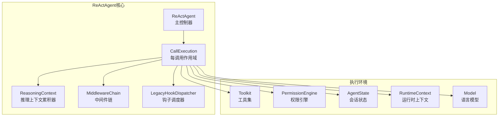
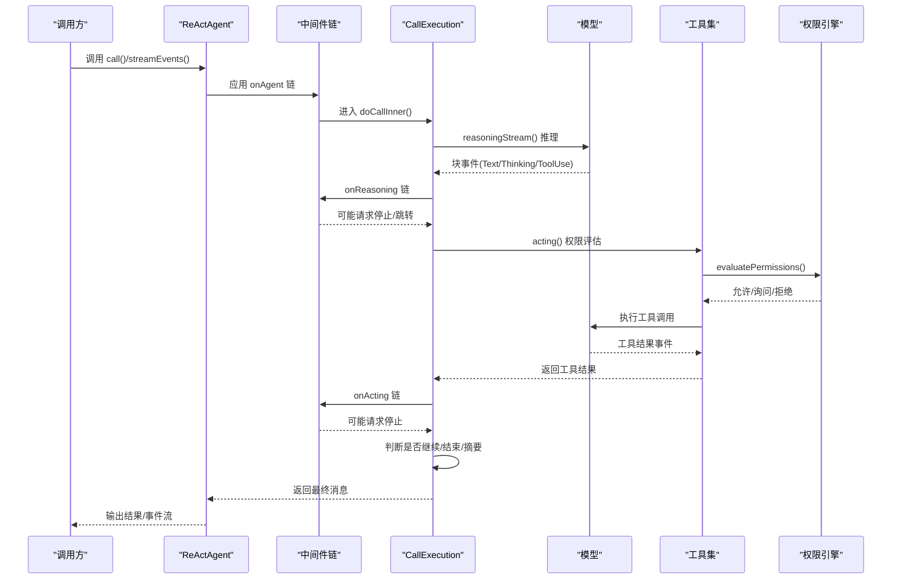
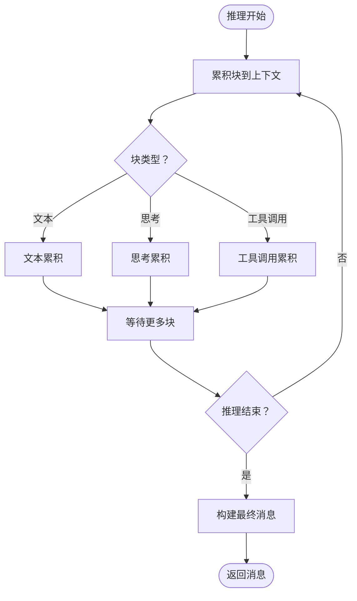
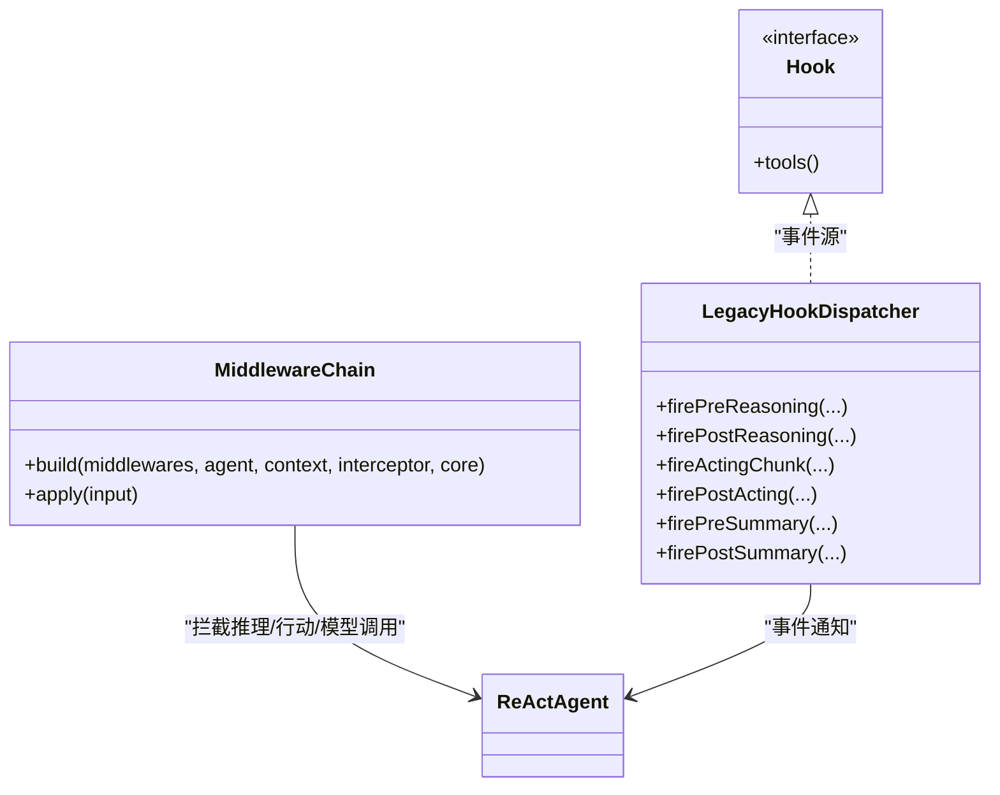
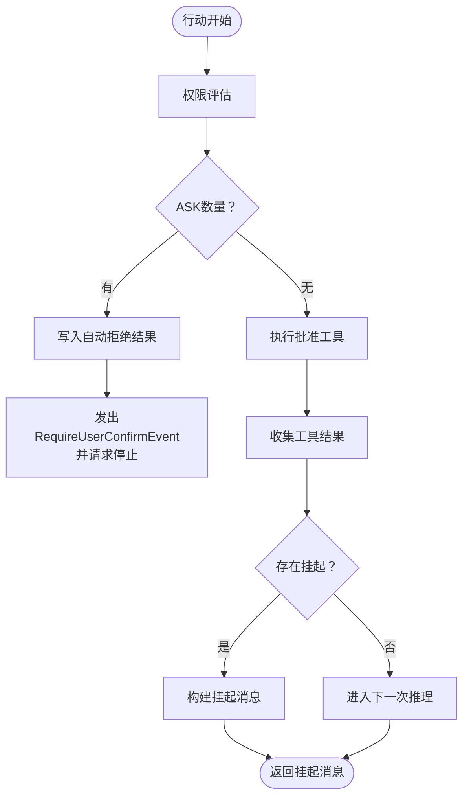
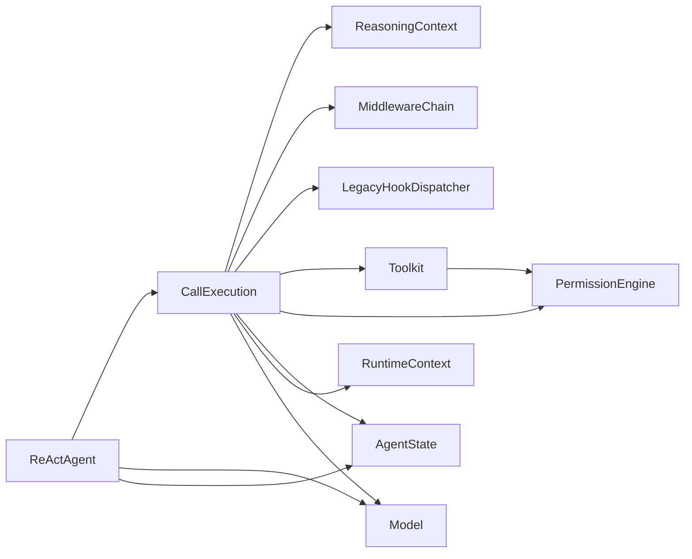

# ReAct推理-行动模式

<cite>
**本文档引用的文件**
- [ReActAgent.java](file://agentscope-core/src/main/java/io/agentscope/core/ReActAgent.java)
- [ReasoningContext.java](file://agentscope-core/src/main/java/io/agentscope/core/agent/accumulator/ReasoningContext.java)
- [MiddlewareChain.java](file://agentscope-core/src/main/java/io/agentscope/core/middleware/MiddlewareChain.java)
- [Hook.java](file://agentscope-core/src/main/java/io/agentscope/core/hook/Hook.java)
- [LegacyHookDispatcher.java](file://agentscope-core/src/main/java/io/agentscope/core/hook/LegacyHookDispatcher.java)
- [Toolkit.java](file://agentscope-core/src/main/java/io/agentscope/core/tool/Toolkit.java)
- [ToolUseBlock.java](file://agentscope-core/src/main/java/io/agentscope/core/message/ToolUseBlock.java)
- [ToolResultBlock.java](file://agentscope-core/src/main/java/io/agentscope/core/message/ToolResultBlock.java)
- [AgentState.java](file://agentscope-core/src/main/java/io/agentscope/core/state/AgentState.java)
- [RuntimeContext.java](file://agentscope-core/src/main/java/io/agentscope/core/agent/RuntimeContext.java)
- [AgentEvent.java](file://agentscope-core/src/main/java/io/agentscope/core/event/AgentEvent.java)
- [ThinkingBlock.java](file://agentscope-core/src/main/java/io/agentscope/core/message/ThinkingBlock.java)
- [TextBlock.java](file://agentscope-core/src/main/java/io/agentscope/core/message/TextBlock.java)
- [ToolCallState.java](file://agentscope-core/src/main/java/io/agentscope/core/message/ToolCallState.java)
- [PermissionEngine.java](file://agentscope-core/src/main/java/io/agentscope/core/permission/PermissionEngine.java)
- [GenerateOptions.java](file://agentscope-core/src/main/java/io/agentscope/core/model/GenerateOptions.java)
- [ExecutionConfig.java](file://agentscope-core/src/main/java/io/agentscope/core/model/ExecutionConfig.java)
- [Model.java](file://agentscope-core/src/main/java/io/agentscope/core/model/Model.java)
</cite>

## 目录
1. [简介](#简介)
2. [项目结构](#项目结构)
3. [核心组件](#核心组件)
4. [架构总览](#架构总览)
5. [详细组件分析](#详细组件分析)
6. [依赖关系分析](#依赖关系分析)
7. [性能考虑](#性能考虑)
8. [故障排除指南](#故障排除指南)
9. [结论](#结论)
10. [附录](#附录)

## 简介
本文件系统性阐述ReAct（推理-行动）模式在Agentscope Java框架中的实现与使用方法。ReAct通过“推理（思考与规划）-行动（工具执行）”的交替循环，结合中间件链、钩子系统、推理上下文累积器以及工具调用状态管理，形成可扩展、可观测、可中断的智能体执行模型。本文将深入解析ReActAgent类的实现细节，涵盖迭代限制、中间件链、钩子系统、推理上下文累积、工具调用状态管理，并提供配置与使用的具体示例路径。

## 项目结构
ReActAgent位于agentscope-core模块中，围绕其展开的配套组件包括：
- 推理上下文累积器：用于聚合模型输出块并生成最终消息
- 中间件链：统一拦截推理、模型调用、行动阶段，支持扩展
- 钩子系统：事件驱动的观察与干预机制
- 工具执行：基于Toolkit的工具注册与执行，含权限控制
- 会话与状态：基于AgentState的持久化与并发安全槽位
- 模型接口：统一的流式模型调用抽象

图表来源
- [ReActAgent.java:1335-1392](file://agentscope-core/src/main/java/io/agentscope/core/ReActAgent.java#L1335-L1392)
- [ReasoningContext.java](file://agentscope-core/src/main/java/io/agentscope/core/agent/accumulator/ReasoningContext.java)
- [MiddlewareChain.java](file://agentscope-core/src/main/java/io/agentscope/core/middleware/MiddlewareChain.java)
- [LegacyHookDispatcher.java](file://agentscope-core/src/main/java/io/agentscope/core/hook/LegacyHookDispatcher.java)
- [Toolkit.java](file://agentscope-core/src/main/java/io/agentscope/core/tool/Toolkit.java)
- [PermissionEngine.java](file://agentscope-core/src/main/java/io/agentscope/core/permission/PermissionEngine.java)
- [AgentState.java](file://agentscope-core/src/main/java/io/agentscope/core/state/AgentState.java)
- [RuntimeContext.java](file://agentscope-core/src/main/java/io/agentscope/core/agent/RuntimeContext.java)
- [Model.java](file://agentscope-core/src/main/java/io/agentscope/core/model/Model.java)

章节来源
- [ReActAgent.java:1335-1392](file://agentscope-core/src/main/java/io/agentscope/core/ReActAgent.java#L1335-L1392)

## 核心组件
- ReActAgent：主控制器，负责生命周期管理、事件流构建、中间件与钩子调度、会话槽位激活与状态持久化。
- CallExecution：每调用作用域，封装AgentState、PermissionEngine、事件发射器、结构化输出工具等，承载完整的ReAct循环。
- ReasoningContext：推理上下文累积器，按块类型（文本、思考、工具调用）累积并生成最终消息。
- MiddlewareChain：中间件链，拦截推理、模型调用、行动阶段，支持请求停止、命中人类在环（HITL）等控制。
- LegacyHookDispatcher：钩子调度器，驱动推理、行动、摘要阶段的事件通知与后处理。
- Toolkit：工具注册与执行入口，支持批量工具调用、权限评估、挂起工具处理。
- AgentState：会话级状态容器，包含对话上下文、工具上下文、权限上下文、中断控制等。
- RuntimeContext：每调用元数据载体，向中间件与工具传递用户/会话信息与工具执行上下文。
- Model：统一的模型接口，支持流式输出与事件发射。

章节来源
- [ReActAgent.java:1335-1392](file://agentscope-core/src/main/java/io/agentscope/core/ReActAgent.java#L1335-L1392)
- [ReasoningContext.java](file://agentscope-core/src/main/java/io/agentscope/core/agent/accumulator/ReasoningContext.java)
- [MiddlewareChain.java](file://agentscope-core/src/main/java/io/agentscope/core/middleware/MiddlewareChain.java)
- [LegacyHookDispatcher.java](file://agentscope-core/src/main/java/io/agentscope/core/hook/LegacyHookDispatcher.java)
- [Toolkit.java](file://agentscope-core/src/main/java/io/agentscope/core/tool/Toolkit.java)
- [AgentState.java](file://agentscope-core/src/main/java/io/agentscope/core/state/AgentState.java)
- [RuntimeContext.java](file://agentscope-core/src/main/java/io/agentscope/core/agent/RuntimeContext.java)
- [Model.java](file://agentscope-core/src/main/java/io/agentscope/core/model/Model.java)

## 架构总览
ReActAgent采用“事件驱动+中间件拦截+钩子通知”的架构，核心流程如下：
- 调用入口：call()/streamEvents()构建AgentEvent流，贯穿Pre/Post阶段与中间件链。
- 推理阶段：ReasoningContext累积块，中间件可请求停止或跳转到推理；PostReasoning决定是否进入行动。
- 行动阶段：权限评估（PermissionEngine），批量工具执行，事件流与钩子通知，处理挂起与错误结果。
- 循环控制：根据迭代次数、工具调用状态、权限决策与中间件请求进行流转。
- 总结阶段：达到最大迭代数时触发摘要生成，产出最终消息。

图表来源
- [ReActAgent.java:852-850](file://agentscope-core/src/main/java/io/agentscope/core/ReActAgent.java#L852-L850)
- [ReActAgent.java:1835-1962](file://agentscope-core/src/main/java/io/agentscope/core/ReActAgent.java#L1835-L1962)
- [ReActAgent.java:2167-2248](file://agentscope-core/src/main/java/io/agentscope/core/ReActAgent.java#L2167-L2248)
- [ReActAgent.java:2838-2908](file://agentscope-core/src/main/java/io/agentscope/core/ReActAgent.java#L2838-L2908)

## 详细组件分析

### ReActAgent类实现详解
- 构造与装配
  - 通过Builder注入系统提示、模型、工具集、中间件、执行配置、生成选项、默认会话ID、权限上下文等。
  - 内置GracefulShutdownMiddleware以支持优雅停机。
- 生命周期与事件流
  - buildAgentStream统一处理call()与streamEvents()，确保onAgent中间件链在所有路径上执行。
  - 事件流以AgentStartEvent开始，AgentEndEvent结束，期间包含AgentResultEvent携带最终消息。
- 会话槽位与状态
  - 每个RuntimeContext确定(userId, sessionId)槽位，激活对应AgentState与PermissionEngine缓存。
  - 支持AgentStateStore持久化，分布式部署下每次调用从存储重新加载最新状态。
- 结构化输出
  - 原生路径：通过模型response_format返回JSON，自然终止循环。
  - 回退路径：注入generate_response合成工具，由PostActingEvent触发停止并提取结果。
- 中断与恢复
  - per-session InterruptControl支持用户中断与系统关闭中断，支持丢弃/保留部分推理内容策略。

章节来源
- [ReActAgent.java:288-330](file://agentscope-core/src/main/java/io/agentscope/core/ReActAgent.java#L288-L330)
- [ReActAgent.java:795-850](file://agentscope-core/src/main/java/io/agentscope/core/ReActAgent.java#L795-L850)
- [ReActAgent.java:437-478](file://agentscope-core/src/main/java/io/agentscope/core/ReActAgent.java#L437-L478)
- [ReActAgent.java:954-1078](file://agentscope-core/src/main/java/io/agentscope/core/ReActAgent.java#L954-L1078)

### 推理上下文累积器（ReasoningContext）
- 功能：接收模型流式块，按类型累积（文本、思考、工具调用），并在推理结束时生成最终消息。
- 复杂度：累积过程线性于块数量，空间开销与块数量成正比。
- 优化点：按块类型分别跟踪起始状态，避免重复事件；在中断场景下可选择性保留已累积内容。

图表来源
- [ReActAgent.java:2020-2098](file://agentscope-core/src/main/java/io/agentscope/core/ReActAgent.java#L2020-L2098)
- [ReActAgent.java:1841-1929](file://agentscope-core/src/main/java/io/agentscope/core/ReActAgent.java#L1841-L1929)

章节来源
- [ReActAgent.java:1841-1929](file://agentscope-core/src/main/java/io/agentscope/core/ReActAgent.java#L1841-L1929)
- [ReActAgent.java:2020-2098](file://agentscope-core/src/main/java/io/agentscope/core/ReActAgent.java#L2020-L2098)

### 中间件链（MiddlewareChain）与钩子系统（Hook）
- 中间件链
  - onAgent：包裹整个生命周期，确保call与streamEvents一致行为。
  - onReasoning：拦截推理阶段输入/输出，支持请求停止、跳转推理、修改生成选项。
  - onModelCall：拦截模型调用，转发事件。
  - onActing：拦截行动阶段，支持请求停止、批量工具执行。
- 钩子系统
  - LegacyHookDispatcher：驱动Pre/PostReasoning、ActingChunk、PostActing、Pre/PostSummary等事件。
  - 事件类型覆盖：模型调用开始/结束、文本/思考/工具块开始/增量/结束、工具结果增量/结束、请求停止、权限询问等。

图表来源
- [MiddlewareChain.java](file://agentscope-core/src/main/java/io/agentscope/core/middleware/MiddlewareChain.java)
- [Hook.java](file://agentscope-core/src/main/java/io/agentscope/core/hook/Hook.java)
- [LegacyHookDispatcher.java](file://agentscope-core/src/main/java/io/agentscope/core/hook/LegacyHookDispatcher.java)

章节来源
- [ReActAgent.java:1888-1896](file://agentscope-core/src/main/java/io/agentscope/core/ReActAgent.java#L1888-L1896)
- [ReActAgent.java:2029-2035](file://agentscope-core/src/main/java/io/agentscope/core/ReActAgent.java#L2029-L2035)
- [ReActAgent.java:2186-2192](file://agentscope-core/src/main/java/io/agentscope/core/ReActAgent.java#L2186-L2192)
- [ReActAgent.java:2927-2933](file://agentscope-core/src/main/java/io/agentscope/core/ReActAgent.java#L2927-L2933)

### 工具调用状态管理与权限控制
- 工具状态
  - ToolUseBlock.State：ALLOWED、ASKING、DENIED，用于追踪待执行、需确认、被拒绝的工具调用。
  - CallExecution维护pending工具集合，过滤重复执行，支持挂起工具（ToolSuspendException）。
- 权限控制
  - PermissionEngine：对每个工具调用进行评估，返回ASK/ALLOW/DENY。
  - 支持规则动态添加（用户确认时），自动拒绝的工具直接写入DENIED结果。
- 批量执行与事件流
  - runToolBatch：区分自动拒绝与批准执行，批准工具通过executeToolCalls异步执行并流式返回增量结果。
  - 对非流式工具补充一次性文本/数据块事件，保证事件完整性。

图表来源
- [ReActAgent.java:2267-2322](file://agentscope-core/src/main/java/io/agentscope/core/ReActAgent.java#L2267-L2322)
- [ReActAgent.java:2350-2496](file://agentscope-core/src/main/java/io/agentscope/core/ReActAgent.java#L2350-L2496)
- [ReActAgent.java:2519-2581](file://agentscope-core/src/main/java/io/agentscope/core/ReActAgent.java#L2519-L2581)

章节来源
- [ReActAgent.java:3123-3158](file://agentscope-core/src/main/java/io/agentscope/core/ReActAgent.java#L3123-L3158)
- [ReActAgent.java:2519-2581](file://agentscope-core/src/main/java/io/agentscope/core/ReActAgent.java#L2519-L2581)
- [ReActAgent.java:2350-2496](file://agentscope-core/src/main/java/io/agentscope/core/ReActAgent.java#L2350-L2496)

### 迭代限制与摘要生成
- 迭代限制：maxIters参数控制推理-行动循环的最大次数。
- 达到上限处理：summarizing()阶段生成摘要消息，同时为未完成的工具调用写入错误结果。
- 事件通知：ExceedMaxItersEvent告知外部达到最大迭代数。

章节来源
- [ReActAgent.java:2838-2908](file://agentscope-core/src/main/java/io/agentscope/core/ReActAgent.java#L2838-L2908)
- [ReActAgent.java:2921-3008](file://agentscope-core/src/main/java/io/agentscope/core/ReActAgent.java#L2921-L3008)

### 结构化输出（原生与回退）
- 原生路径：当模型支持response_format时，直接生成结构化JSON，自然结束推理循环。
- 回退路径：注入generate_response合成工具，PostActingEvent触发停止，提取结构化结果并合并元数据（用量、思考块）。

章节来源
- [ReActAgent.java:993-1027](file://agentscope-core/src/main/java/io/agentscope/core/ReActAgent.java#L993-L1027)
- [ReActAgent.java:1034-1078](file://agentscope-core/src/main/java/io/agentscope/core/ReActAgent.java#L1034-L1078)
- [ReActAgent.java:1182-1253](file://agentscope-core/src/main/java/io/agentscope/core/ReActAgent.java#L1182-L1253)
- [ReActAgent.java:1255-1316](file://agentscope-core/src/main/java/io/agentscope/core/ReActAgent.java#L1255-L1316)

### 配置与使用示例（代码路径）
以下示例均提供文件路径而非代码片段，请参考相应位置：

- 创建ReActAgent并配置系统提示、模型、工具集、最大迭代次数
  - 示例路径：[ReActAgent.java:163-190](file://agentscope-core/src/main/java/io/agentscope/core/ReActAgent.java#L163-L190)
  - Builder关键方法：[ReActAgent.java:3596-3649](file://agentscope-core/src/main/java/io/agentscope/core/ReActAgent.java#L3596-L3649)
- 设置生成选项（温度、采样参数等）
  - 示例路径：[ReActAgent.java:3826-3829](file://agentscope-core/src/main/java/io/agentscope/core/ReActAgent.java#L3826-L3829)
- 启用结构化输出（原生或回退）
  - 示例路径：[ReActAgent.java:993-1027](file://agentscope-core/src/main/java/io/agentscope/core/ReActAgent.java#L993-L1027)
  - 示例路径：[ReActAgent.java:1034-1078](file://agentscope-core/src/main/java/io/agentscope/core/ReActAgent.java#L1034-L1078)
- 流式事件处理（streamEvents）
  - 示例路径：[ReActAgent.java:865-892](file://agentscope-core/src/main/java/io/agentscope/core/ReActAgent.java#L865-L892)
- 会话与状态持久化（AgentStateStore）
  - 示例路径：[ReActAgent.java:3850-3853](file://agentscope-core/src/main/java/io/agentscope/core/ReActAgent.java#L3850-L3853)
  - 示例路径：[ReActAgent.java:412-422](file://agentscope-core/src/main/java/io/agentscope/core/ReActAgent.java#L412-L422)

## 依赖关系分析
- 组件耦合
  - ReActAgent强依赖CallExecution（每调用作用域）、ReasoningContext（推理累积）、MiddlewareChain（拦截）、LegacyHookDispatcher（事件）、Toolkit（工具执行）、PermissionEngine（权限）、AgentState（状态）。
- 外部依赖
  - Model接口抽象不同供应商模型；ExecutionConfig/GenerateOptions提供统一的执行与生成配置。
- 潜在循环依赖
  - 中间件与钩子通过事件解耦，避免直接循环引用；工具执行通过Toolkit间接访问。

图表来源
- [ReActAgent.java:1335-1392](file://agentscope-core/src/main/java/io/agentscope/core/ReActAgent.java#L1335-L1392)
- [ReActAgent.java:288-330](file://agentscope-core/src/main/java/io/agentscope/core/ReActAgent.java#L288-L330)

章节来源
- [ReActAgent.java:1335-1392](file://agentscope-core/src/main/java/io/agentscope/core/ReActAgent.java#L1335-L1392)
- [ReActAgent.java:288-330](file://agentscope-core/src/main/java/io/agentscope/core/ReActAgent.java#L288-L330)

## 性能考虑
- 流式处理：模型与工具调用均采用流式事件，降低首字节延迟，提升可观测性。
- 并发与序列化：按(userId, sessionId)槽位序列化同一会话的调用，跨会话并行；中间件与钩子在订阅上下文中隔离。
- 缓存与持久化：AgentState与PermissionEngine按槽位缓存；必要时通过AgentStateStore持久化，分布式部署下每次调用重载最新状态。
- 中断与优雅停机：支持系统关闭中断与用户中断，结合部分推理保留策略，减少重复计算。

## 故障排除指南
- 最大迭代数Reached
  - 现象：达到maxIters后触发摘要生成，未完成工具调用写入错误结果。
  - 处理：检查工具执行耗时与权限策略，适当增加maxIters或优化工具。
  - 参考路径：[ReActAgent.java:2838-2908](file://agentscope-core/src/main/java/io/agentscope/core/ReActAgent.java#L2838-L2908)
- 权限询问（HITL）
  - 现象：工具调用进入ASKING状态，Agent暂停等待用户确认。
  - 处理：在后续调用中携带ConfirmResult元数据继续；或调整PermissionContextState。
  - 参考路径：[ReActAgent.java:1437-1470](file://agentscope-core/src/main/java/io/agentscope/core/ReActAgent.java#L1437-L1470)
- 工具执行失败
  - 现象：工具异常或超时，生成错误结果以保证循环继续。
  - 处理：检查工具实现与网络/资源状况；必要时启用enablePendingToolRecovery自动补全。
  - 参考路径：[ReActAgent.java:2697-2727](file://agentscope-core/src/main/java/io/agentscope/core/ReActAgent.java#L2697-L2727)
- 中断与恢复
  - 现象：用户或系统中断导致执行中止。
  - 处理：根据中断源与策略决定是否保留部分推理；通过RuntimeContext指定userId/sessionId定位会话。
  - 参考路径：[ReActAgent.java:3196-3220](file://agentscope-core/src/main/java/io/agentscope/core/ReActAgent.java#L3196-L3220)

章节来源
- [ReActAgent.java:2838-2908](file://agentscope-core/src/main/java/io/agentscope/core/ReActAgent.java#L2838-L2908)
- [ReActAgent.java:1437-1470](file://agentscope-core/src/main/java/io/agentscope/core/ReActAgent.java#L1437-L1470)
- [ReActAgent.java:2697-2727](file://agentscope-core/src/main/java/io/agentscope/core/ReActAgent.java#L2697-L2727)
- [ReActAgent.java:3196-3220](file://agentscope-core/src/main/java/io/agentscope/core/ReActAgent.java#L3196-L3220)

## 结论
ReAct推理-行动模式通过清晰的推理-行动循环、完善的中间件与钩子体系、严谨的工具状态与权限管理，实现了高扩展性与可观测性的智能体执行框架。ReActAgent作为核心控制器，将这些能力整合为统一的事件驱动流水线，既适合单轮任务，也能胜任复杂多步骤问题的分解与求解。

## 附录
- 关键类与职责概览
  - ReActAgent：主控制器，生命周期与事件流构建
  - CallExecution：每调用作用域，承载ReAct循环
  - ReasoningContext：推理块累积与最终消息生成
  - MiddlewareChain：推理/行动/模型调用拦截
  - LegacyHookDispatcher：事件通知与后处理
  - Toolkit：工具注册与批量执行
  - PermissionEngine：工具权限评估
  - AgentState：会话状态与持久化
  - RuntimeContext：每调用元数据载体
  - Model：统一模型接口

章节来源
- [ReActAgent.java:1335-1392](file://agentscope-core/src/main/java/io/agentscope/core/ReActAgent.java#L1335-L1392)
- [ReActAgent.java:1841-1929](file://agentscope-core/src/main/java/io/agentscope/core/ReActAgent.java#L1841-L1929)
- [ReActAgent.java:1888-1896](file://agentscope-core/src/main/java/io/agentscope/core/ReActAgent.java#L1888-L1896)
- [ReActAgent.java:2029-2035](file://agentscope-core/src/main/java/io/agentscope/core/ReActAgent.java#L2029-L2035)
- [ReActAgent.java:2186-2192](file://agentscope-core/src/main/java/io/agentscope/core/ReActAgent.java#L2186-L2192)
- [ReActAgent.java:2267-2322](file://agentscope-core/src/main/java/io/agentscope/core/ReActAgent.java#L2267-L2322)
- [ReActAgent.java:2519-2581](file://agentscope-core/src/main/java/io/agentscope/core/ReActAgent.java#L2519-L2581)
- [ReActAgent.java:2838-2908](file://agentscope-core/src/main/java/io/agentscope/core/ReActAgent.java#L2838-L2908)
- [ReActAgent.java:3196-3220](file://agentscope-core/src/main/java/io/agentscope/core/ReActAgent.java#L3196-L3220)