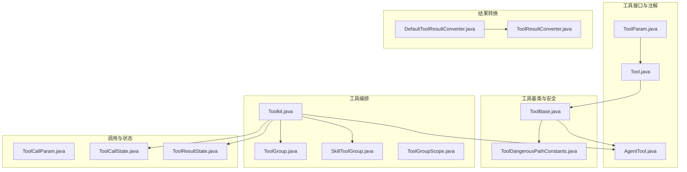
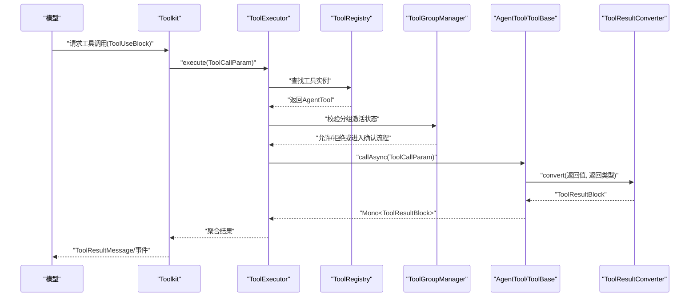
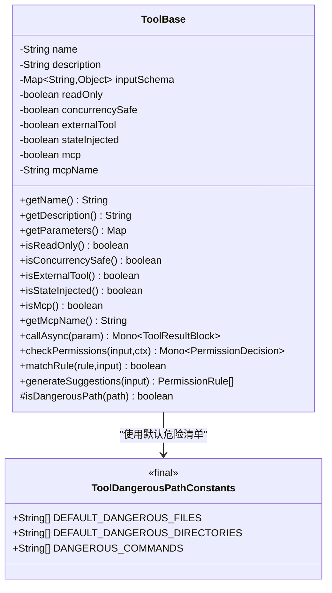
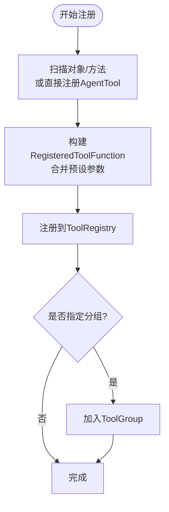
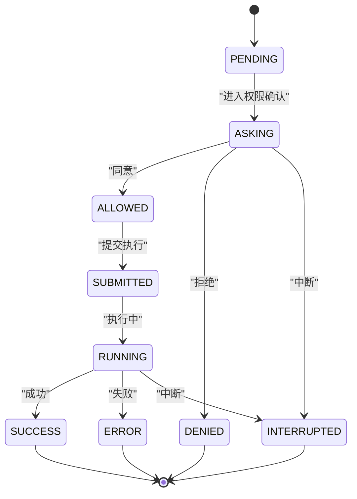
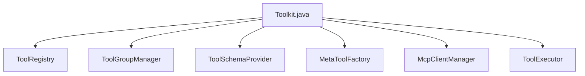

# 工具集成与调用

<cite>
**本文引用的文件**
- [Tool.java](file://agentscope-core/src/main/java/io/agentscope/core/tool/Tool.java)
- [ToolBase.java](file://agentscope-core/src/main/java/io/agentscope/core/tool/ToolBase.java)
- [ToolParam.java](file://agentscope-core/src/main/java/io/agentscope/core/tool/ToolParam.java)
- [ToolResultConverter.java](file://agentscope-core/src/main/java/io/agentscope/core/tool/ToolResultConverter.java)
- [DefaultToolResultConverter.java](file://agentscope-core/src/main/java/io/agentscope/core/tool/DefaultToolResultConverter.java)
- [Toolkit.java](file://agentscope-core/src/main/java/io/agentscope/core/tool/Toolkit.java)
- [ToolGroup.java](file://agentscope-core/src/main/java/io/agentscope/core/tool/ToolGroup.java)
- [SkillToolGroup.java](file://agentscope-core/src/main/java/io/agentscope/core/tool/SkillToolGroup.java)
- [ToolGroupScope.java](file://agentscope-core/src/main/java/io/agentscope/core/tool/ToolGroupScope.java)
- [ToolDangerousPathConstants.java](file://agentscope-core/src/main/java/io/agentscope/core/tool/ToolDangerousPathConstants.java)
- [AgentTool.java](file://agentscope-core/src/main/java/io/agentscope/core/tool/AgentTool.java)
- [ToolCallParam.java](file://agentscope-core/src/main/java/io/agentscope/core/tool/ToolCallParam.java)
- [ToolCallState.java](file://agentscope-core/src/main/java/io/agentscope/core/message/ToolCallState.java)
- [ToolResultState.java](file://agentscope-core/src/main/java/io/agentscope/core/message/ToolResultState.java)
</cite>

## 目录
1. [简介](#简介)
2. [项目结构](#项目结构)
3. [核心组件](#核心组件)
4. [架构总览](#架构总览)
5. [详细组件分析](#详细组件分析)
6. [依赖关系分析](#依赖关系分析)
7. [性能考量](#性能考量)
8. [故障排查指南](#故障排查指南)
9. [结论](#结论)
10. [附录](#附录)

## 简介
本文件面向ReAct工具集成与调用机制，系统化阐述工具注册与管理流程、工具接口与基类规范、工具组与权限控制、工具调用状态与结果状态、参数验证与执行上下文传递、错误处理策略，并提供可操作的实践建议与可视化图示，帮助开发者快速构建安全、可观测、可扩展的工具体系。

## 项目结构
围绕工具系统的关键包与类如下：
- 接口与注解：AgentTool、Tool、ToolParam
- 基类与常量：ToolBase、ToolDangerousPathConstants
- 结果转换器：ToolResultConverter、DefaultToolResultConverter
- 工具编排：Toolkit、ToolGroup、SkillToolGroup、ToolGroupScope
- 调用参数与状态：ToolCallParam、ToolCallState、ToolResultState

图表来源
- [AgentTool.java:40-119](file://agentscope-core/src/main/java/io/agentscope/core/tool/AgentTool.java#L40-L119)
- [Tool.java:60-194](file://agentscope-core/src/main/java/io/agentscope/core/tool/Tool.java#L60-L194)
- [ToolParam.java:62-105](file://agentscope-core/src/main/java/io/agentscope/core/tool/ToolParam.java#L62-L105)
- [ToolBase.java:60-342](file://agentscope-core/src/main/java/io/agentscope/core/tool/ToolBase.java#L60-L342)
- [ToolDangerousPathConstants.java:27-81](file://agentscope-core/src/main/java/io/agentscope/core/tool/ToolDangerousPathConstants.java#L27-L81)
- [ToolResultConverter.java:48-59](file://agentscope-core/src/main/java/io/agentscope/core/tool/ToolResultConverter.java#L48-L59)
- [DefaultToolResultConverter.java:39-98](file://agentscope-core/src/main/java/io/agentscope/core/tool/DefaultToolResultConverter.java#L39-L98)
- [Toolkit.java:66-800](file://agentscope-core/src/main/java/io/agentscope/core/tool/Toolkit.java#L66-L800)
- [ToolGroup.java:42-258](file://agentscope-core/src/main/java/io/agentscope/core/tool/ToolGroup.java#L42-L258)
- [SkillToolGroup.java:44-180](file://agentscope-core/src/main/java/io/agentscope/core/tool/SkillToolGroup.java#L44-L180)
- [ToolGroupScope.java:29-43](file://agentscope-core/src/main/java/io/agentscope/core/tool/ToolGroupScope.java#L29-L43)
- [ToolCallParam.java:46-260](file://agentscope-core/src/main/java/io/agentscope/core/tool/ToolCallParam.java#L46-L260)
- [ToolCallState.java:20-42](file://agentscope-core/src/main/java/io/agentscope/core/message/ToolCallState.java#L20-L42)
- [ToolResultState.java:20-42](file://agentscope-core/src/main/java/io/agentscope/core/message/ToolResultState.java#L20-L42)

章节来源
- [Toolkit.java:66-118](file://agentscope-core/src/main/java/io/agentscope/core/tool/Toolkit.java#L66-L118)
- [Tool.java:24-56](file://agentscope-core/src/main/java/io/agentscope/core/tool/Tool.java#L24-L56)
- [ToolBase.java:34-60](file://agentscope-core/src/main/java/io/agentscope/core/tool/ToolBase.java#L34-L60)

## 核心组件
- 工具接口与注解
  - AgentTool：统一的异步工具接口，要求实现名称、描述、参数模式、严格模式、输出模式（可选）与异步调用方法。
  - Tool：方法级注解，声明工具名、描述、严格模式、只读、并发安全、外部工具标记、状态注入、危险路径列表、自定义结果转换器等元信息。
  - ToolParam：参数级注解，要求显式命名、必填性与描述，用于生成JSON Schema。
- 工具基类与安全
  - ToolBase：抽象基类，封装工具元信息、只读/并发/外部/状态注入/MCP标识；提供默认权限检查、规则匹配与建议、危险路径检测。
  - ToolDangerousPathConstants：默认危险文件与目录清单，供工具自检使用。
- 结果转换器
  - ToolResultConverter：工具返回值到ToolResultBlock的转换接口；DefaultToolResultConverter提供JSON序列化、空值与void处理的默认实现。
- 工具编排
  - Toolkit：工具注册、分组、Schema生成、MCP客户端管理、执行器委派、流式回调设置、深拷贝等能力的门面。
  - ToolGroup/SkillToolGroup/ToolGroupScope：工具分组、技能绑定组、分组作用域（META/EXTERNAL）。
- 调用参数与状态
  - ToolCallParam：封装ToolUseBlock、输入参数、Agent、运行时上下文、ToolEmitter。
  - ToolCallState/ToolResultState：工具调用阶段与结果状态枚举，便于事件追踪与UI反馈。

章节来源
- [AgentTool.java:40-119](file://agentscope-core/src/main/java/io/agentscope/core/tool/AgentTool.java#L40-L119)
- [Tool.java:60-194](file://agentscope-core/src/main/java/io/agentscope/core/tool/Tool.java#L60-L194)
- [ToolParam.java:62-105](file://agentscope-core/src/main/java/io/agentscope/core/tool/ToolParam.java#L62-L105)
- [ToolBase.java:60-342](file://agentscope-core/src/main/java/io/agentscope/core/tool/ToolBase.java#L60-L342)
- [ToolDangerousPathConstants.java:27-81](file://agentscope-core/src/main/java/io/agentscope/core/tool/ToolDangerousPathConstants.java#L27-L81)
- [ToolResultConverter.java:48-59](file://agentscope-core/src/main/java/io/agentscope/core/tool/ToolResultConverter.java#L48-L59)
- [DefaultToolResultConverter.java:39-98](file://agentscope-core/src/main/java/io/agentscope/core/tool/DefaultToolResultConverter.java#L39-L98)
- [Toolkit.java:66-800](file://agentscope-core/src/main/java/io/agentscope/core/tool/Toolkit.java#L66-L800)
- [ToolGroup.java:42-258](file://agentscope-core/src/main/java/io/agentscope/core/tool/ToolGroup.java#L42-L258)
- [SkillToolGroup.java:44-180](file://agentscope-core/src/main/java/io/agentscope/core/tool/SkillToolGroup.java#L44-L180)
- [ToolGroupScope.java:29-43](file://agentscope-core/src/main/java/io/agentscope/core/tool/ToolGroupScope.java#L29-L43)
- [ToolCallParam.java:46-260](file://agentscope-core/src/main/java/io/agentscope/core/tool/ToolCallParam.java#L46-L260)
- [ToolCallState.java:20-42](file://agentscope-core/src/main/java/io/agentscope/core/message/ToolCallState.java#L20-L42)
- [ToolResultState.java:20-42](file://agentscope-core/src/main/java/io/agentscope/core/message/ToolResultState.java#L20-L42)

## 架构总览
下图展示了从模型调用到工具执行、权限评估、结果转换与事件上报的端到端流程。

图表来源
- [Toolkit.java:490-525](file://agentscope-core/src/main/java/io/agentscope/core/tool/Toolkit.java#L490-L525)
- [ToolCallParam.java:46-260](file://agentscope-core/src/main/java/io/agentscope/core/tool/ToolCallParam.java#L46-L260)
- [AgentTool.java:104-119](file://agentscope-core/src/main/java/io/agentscope/core/tool/AgentTool.java#L104-L119)
- [ToolResultConverter.java:48-59](file://agentscope-core/src/main/java/io/agentscope/core/tool/ToolResultConverter.java#L48-L59)

## 详细组件分析

### 工具接口与注解规范
- AgentTool
  - 规范职责：统一暴露工具名称、描述、参数Schema、严格模式、输出Schema（可选）、异步调用入口。
  - 设计要点：所有操作以响应式Mono返回，确保非阻塞与可观测。
- Tool
  - 元信息：name/description/strict/readOnly/concurrencySafe/externalTool/stateInjected/dangerousFiles/dangerousDirectories/converter。
  - 使用约束：参数需标注ToolParam；返回类型支持字符串、Mono<String>等；工具名建议snake_case；描述应清晰说明用途与返回。
- ToolParam
  - 必填字段：name（运行时参数名不可靠，需显式声明）；可选required/description。
  - 价值：驱动JSON Schema生成，提升LLM参数填充准确性。

章节来源
- [AgentTool.java:40-119](file://agentscope-core/src/main/java/io/agentscope/core/tool/AgentTool.java#L40-L119)
- [Tool.java:60-194](file://agentscope-core/src/main/java/io/agentscope/core/tool/Tool.java#L60-L194)
- [ToolParam.java:62-105](file://agentscope-core/src/main/java/io/agentscope/core/tool/ToolParam.java#L62-L105)

### 工具基类与安全策略
- ToolBase
  - 元信息与行为：通过Builder注入name/description/inputSchema/readOnly/concurrencySafe/externalTool/stateInjected/mcp/mcpName。
  - 权限与规则：checkPermissions/generateSuggestions/matchRule提供权限引擎接入点，默认放行并委托给规则表。
  - 危险路径检测：isDangerousPath对文件名与路径段进行大小写无关匹配，并解析符号链接防止绕过。
  - 外部工具保护：非外部工具覆盖callAsync；外部工具直接抛出非法状态异常，避免本地误执行。
- ToolDangerousPathConstants
  - 默认危险文件与目录清单，工具可通过重写字段替换默认集。

图表来源
- [ToolBase.java:60-342](file://agentscope-core/src/main/java/io/agentscope/core/tool/ToolBase.java#L60-L342)
- [ToolDangerousPathConstants.java:27-81](file://agentscope-core/src/main/java/io/agentscope/core/tool/ToolDangerousPathConstants.java#L27-L81)

章节来源
- [ToolBase.java:60-342](file://agentscope-core/src/main/java/io/agentscope/core/tool/ToolBase.java#L60-L342)
- [ToolDangerousPathConstants.java:27-81](file://agentscope-core/src/main/java/io/agentscope/core/tool/ToolDangerousPathConstants.java#L27-L81)

### 工具注册与管理流程
- 注册入口
  - 扫描对象：支持扫描含@Tool注解的方法并自动注册；也支持直接注册AgentTool实例与SchemaOnlyTool。
  - 组织方式：可指定分组、扩展模型、预设参数；预设参数在运行时可更新。
- 分组与作用域
  - ToolGroup：按名称、描述、激活状态、范围（META/EXTERNAL）与工具集合管理。
  - SkillToolGroup：与特定技能绑定，增强描述提示模型在该技能激活时必须启用此组。
  - ToolGroupScope：META由元工具动态管理；EXTERNAL由开发者代码管理。
- 深拷贝与会话持久化
  - Toolkit.copy保留用户回调，便于ReActAgent在不同会话中复用工具集。

图表来源
- [Toolkit.java:154-243](file://agentscope-core/src/main/java/io/agentscope/core/tool/Toolkit.java#L154-L243)
- [ToolGroup.java:42-258](file://agentscope-core/src/main/java/io/agentscope/core/tool/ToolGroup.java#L42-L258)
- [SkillToolGroup.java:44-180](file://agentscope-core/src/main/java/io/agentscope/core/tool/SkillToolGroup.java#L44-L180)

章节来源
- [Toolkit.java:154-243](file://agentscope-core/src/main/java/io/agentscope/core/tool/Toolkit.java#L154-L243)
- [ToolGroup.java:42-258](file://agentscope-core/src/main/java/io/agentscope/core/tool/ToolGroup.java#L42-L258)
- [SkillToolGroup.java:44-180](file://agentscope-core/src/main/java/io/agentscope/core/tool/SkillToolGroup.java#L44-L180)

### 工具调用状态与结果状态
- ToolCallState：pending → asking → allowed → submitted → finished，用于追踪工具调用生命周期与权限确认阶段。
- ToolResultState：success/error/interrupted/denied/running，用于表示工具执行结果状态，便于事件与UI层消费。

图表来源
- [ToolCallState.java:20-42](file://agentscope-core/src/main/java/io/agentscope/core/message/ToolCallState.java#L20-L42)
- [ToolResultState.java:20-42](file://agentscope-core/src/main/java/io/agentscope/core/message/ToolResultState.java#L20-L42)

章节来源
- [ToolCallState.java:20-42](file://agentscope-core/src/main/java/io/agentscope/core/message/ToolCallState.java#L20-L42)
- [ToolResultState.java:20-42](file://agentscope-core/src/main/java/io/agentscope/core/message/ToolResultState.java#L20-L42)

### 参数验证、执行上下文与错误处理
- 参数验证
  - 通过ToolParam的name/required/description生成JSON Schema，结合Tool.strict启用更严格的参数校验。
- 执行上下文
  - ToolCallParam封装ToolUseBlock、输入参数、Agent、RuntimeContext与ToolEmitter；支持流式chunk回调。
- 错误处理
  - 外部工具：ToolBase对externalTool=true的工具禁止本地调用，避免框架内误执行。
  - 权限决策：checkPermissions默认放行，具体工具可覆盖以实现细粒度策略。
  - 结果转换：DefaultToolResultConverter对null/void/ToolResultBlock/序列化失败提供稳健回退。

章节来源
- [ToolParam.java:62-105](file://agentscope-core/src/main/java/io/agentscope/core/tool/ToolParam.java#L62-L105)
- [ToolBase.java:166-181](file://agentscope-core/src/main/java/io/agentscope/core/tool/ToolBase.java#L166-L181)
- [DefaultToolResultConverter.java:43-96](file://agentscope-core/src/main/java/io/agentscope/core/tool/DefaultToolResultConverter.java#L43-L96)
- [ToolCallParam.java:46-260](file://agentscope-core/src/main/java/io/agentscope/core/tool/ToolCallParam.java#L46-L260)

### 自定义工具实现示例与最佳实践
- 实现步骤
  - 定义工具类，使用@Tool标注方法，参数使用@ToolParam标注name/required/description。
  - 如需自定义结果格式，实现ToolResultConverter或使用@Tool(converter=...)指定自定义转换器。
  - 若工具需要AgentState或外部执行，合理设置stateInjected/externalTool。
- 配置工具组与权限
  - 使用ToolGroup/SkillToolGroup创建分组，设置scope为META以便元工具动态管理；或EXTERNAL由开发者代码管理。
  - 在ToolBase中覆盖checkPermissions/generateSuggestions/matchRule实现细粒度权限策略。
- 性能与可观测性
  - 合理设置concurrencySafe以允许并行执行；必要时使用MCP外部工具并配合ToolCallState/ToolResultState事件追踪。
  - 使用setChunkCallback设置流式回调，实时上报中间结果。

章节来源
- [Tool.java:60-194](file://agentscope-core/src/main/java/io/agentscope/core/tool/Tool.java#L60-L194)
- [ToolParam.java:62-105](file://agentscope-core/src/main/java/io/agentscope/core/tool/ToolParam.java#L62-L105)
- [ToolResultConverter.java:48-59](file://agentscope-core/src/main/java/io/agentscope/core/tool/ToolResultConverter.java#L48-L59)
- [ToolGroup.java:42-258](file://agentscope-core/src/main/java/io/agentscope/core/tool/ToolGroup.java#L42-L258)
- [SkillToolGroup.java:44-180](file://agentscope-core/src/main/java/io/agentscope/core/tool/SkillToolGroup.java#L44-L180)
- [Toolkit.java:446-464](file://agentscope-core/src/main/java/io/agentscope/core/tool/Toolkit.java#L446-L464)

## 依赖关系分析
- 组件耦合
  - Toolkit作为门面，组合ToolRegistry、ToolGroupManager、ToolSchemaProvider、MetaToolFactory、McpClientManager与ToolExecutor，职责清晰、内聚高。
  - ToolBase实现AgentTool，提供默认权限与安全策略，便于子类复用。
- 外部依赖
  - 结果转换依赖JsonUtils；权限模块与事件模块在消息包中定义，工具侧仅通过接口交互，降低耦合。

图表来源
- [Toolkit.java:66-118](file://agentscope-core/src/main/java/io/agentscope/core/tool/Toolkit.java#L66-L118)

章节来源
- [Toolkit.java:66-118](file://agentscope-core/src/main/java/io/agentscope/core/tool/Toolkit.java#L66-L118)

## 性能考量
- 并行执行：根据配置选择并行/串行执行，减少总延迟；对高并发工具设置concurrencySafe=true。
- 流式输出：通过setChunkCallback与ToolEmitter实现增量输出，改善用户体验与可观测性。
- 序列化开销：DefaultToolResultConverter在失败时回退toString，避免阻塞；复杂对象建议自定义转换器进行压缩或摘要。
- 外部工具：外部工具不占用框架线程池，但需注意模型返回后的处理与事件上报。

## 故障排查指南
- 工具未被调用
  - 检查工具是否注册到正确的ToolGroup且处于激活状态；使用getActiveGroups核验。
  - 确认ToolCallParam的toolUseBlock与输入参数与Schema一致。
- 权限被拒绝
  - 覆盖ToolBase.checkPermissions返回明确ALLOW/ASK/DENY；或调整Tool.strict以加强校验。
- 外部工具异常
  - externalTool=true的工具不应在框架内本地执行；若出现异常，检查是否误调用本地callAsync。
- 结果为空或异常
  - 检查ToolResultConverter实现；必要时使用默认转换器验证问题是否由自定义转换逻辑引起。

章节来源
- [Toolkit.java:699-712](file://agentscope-core/src/main/java/io/agentscope/core/tool/Toolkit.java#L699-L712)
- [ToolBase.java:166-181](file://agentscope-core/src/main/java/io/agentscope/core/tool/ToolBase.java#L166-L181)
- [DefaultToolResultConverter.java:43-96](file://agentscope-core/src/main/java/io/agentscope/core/tool/DefaultToolResultConverter.java#L43-L96)

## 结论
ReAct工具体系以AgentTool为核心接口，结合@Tool/@ToolParam注解与ToolBase基类，形成“声明即注册、分组即控制、权限即策略”的完整闭环。Toolkit作为门面协调注册、分组、Schema、执行与事件，配合ToolCallState/ToolResultState实现端到端可观测。通过合理的分组策略、权限设计与流式回调，可在保证安全的前提下实现高性能、可扩展的工具集成。

## 附录
- 快速清单
  - 工具实现：@Tool + @ToolParam；必要时自定义ToolResultConverter。
  - 分组管理：ToolGroup/SkillToolGroup；META用于元工具动态管理。
  - 权限策略：ToolBase.checkPermissions/generateSuggestions/matchRule。
  - 上下文传递：ToolCallParam封装Agent/RuntimeContext/ToolEmitter。
  - 状态追踪：ToolCallState/ToolResultState。
  - 性能优化：并行执行、流式回调、自定义转换器。