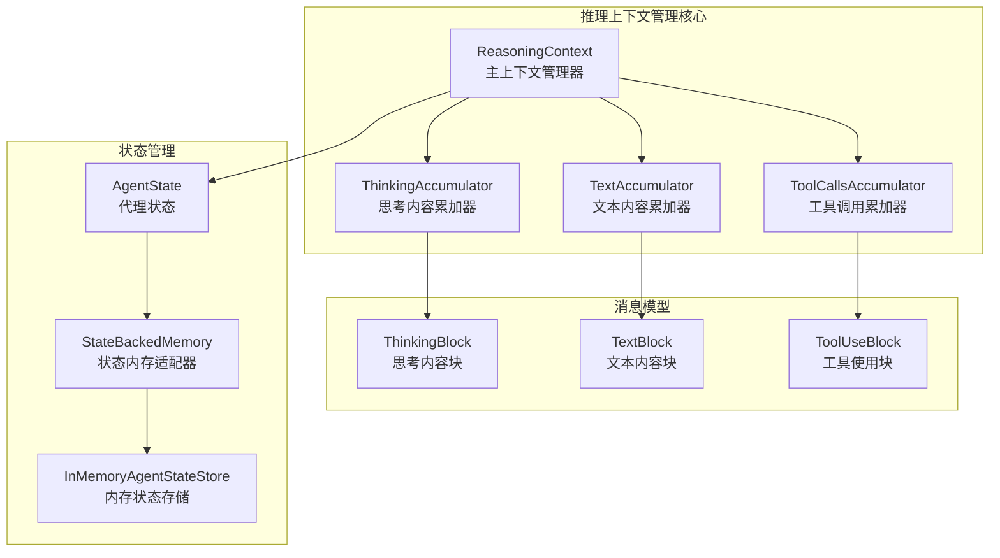
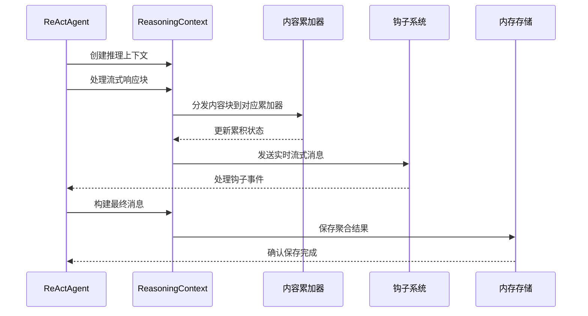
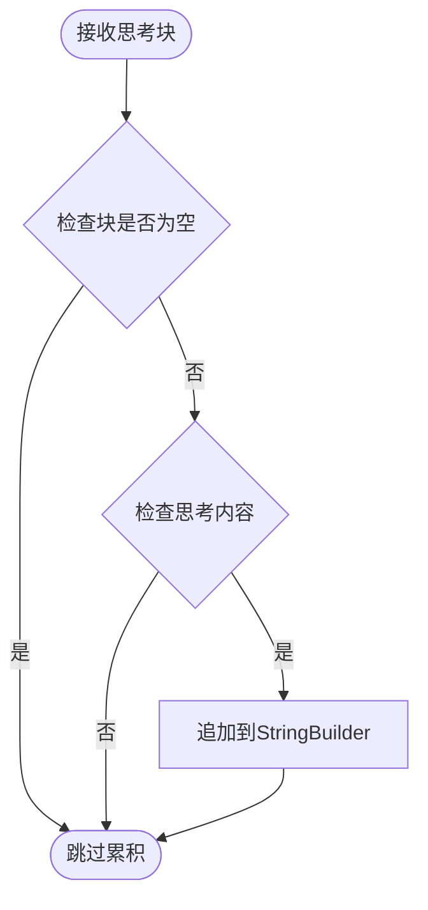
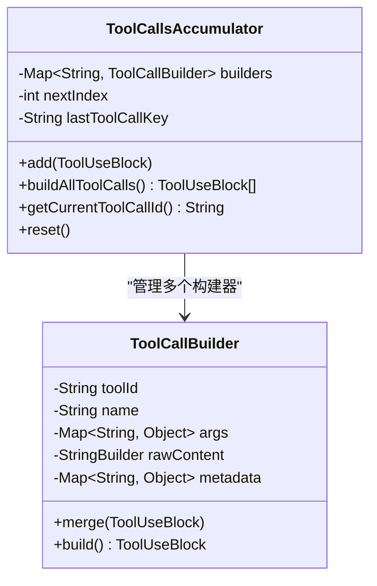
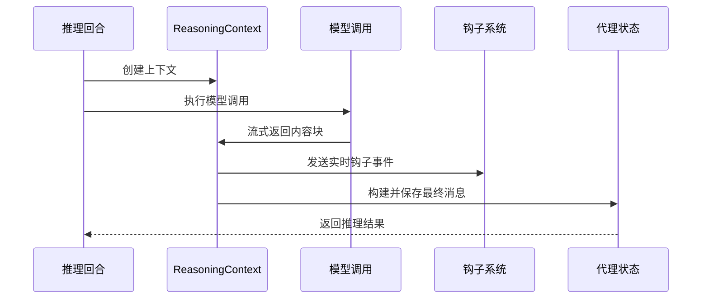
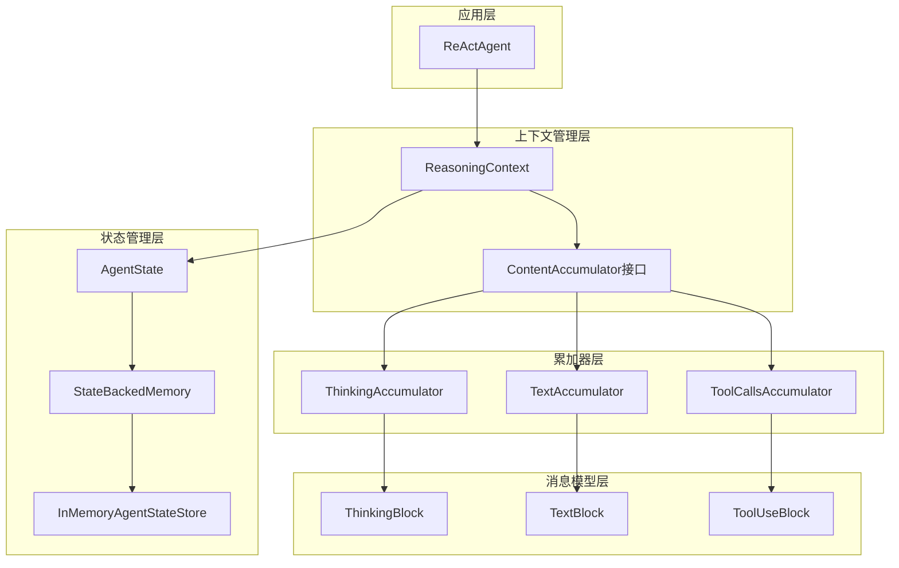

# 推理上下文管理

<cite>
**本文档引用的文件**
- [ReasoningContext.java](file://agentscope-core/src/main/java/io/agentscope/core/agent/accumulator/ReasoningContext.java)
- [ThinkingAccumulator.java](file://agentscope-core/src/main/java/io/agentscope/core/agent/accumulator/ThinkingAccumulator.java)
- [ContentAccumulator.java](file://agentscope-core/src/main/java/io/agentscope/core/agent/accumulator/ContentAccumulator.java)
- [TextAccumulator.java](file://agentscope-core/src/main/java/io/agentscope/core/agent/accumulator/TextAccumulator.java)
- [ToolCallsAccumulator.java](file://agentscope-core/src/main/java/io/agentscope/core/agent/accumulator/ToolCallsAccumulator.java)
- [ThinkingBlock.java](file://agentscope-core/src/main/java/io/agentscope/core/message/ThinkingBlock.java)
- [TextBlock.java](file://agentscope-core/src/main/java/io/agentscope/core/message/TextBlock.java)
- [ToolUseBlock.java](file://agentscope-core/src/main/java/io/agentscope/core/message/ToolUseBlock.java)
- [ReActAgent.java](file://agentscope-core/src/main/java/io/agentscope/core/ReActAgent.java)
- [AgentState.java](file://agentscope-core/src/main/java/io/agentscope/core/state/AgentState.java)
- [StateBackedMemory.java](file://agentscope-core/src/main/java/io/agentscope/core/memory/StateBackedMemory.java)
- [InMemoryAgentStateStore.java](file://agentscope-core/src/main/java/io/agentscope/core/state/InMemoryAgentStateStore.java)
- [ReasoningContextTest.java](file://agentscope-core/src/test/java/io/agentscope/core/agent/accumulator/ReasoningContextTest.java)
</cite>

## 目录
1. [简介](#简介)
2. [项目结构](#项目结构)
3. [核心组件](#核心组件)
4. [架构概览](#架构概览)
5. [详细组件分析](#详细组件分析)
6. [依赖关系分析](#依赖关系分析)
7. [性能考虑](#性能考虑)
8. [故障排除指南](#故障排除指南)
9. [结论](#结论)
10. [附录](#附录)

## 简介

推理上下文管理系统是ReAct智能体框架的核心组件，负责管理多模态推理过程中的状态和内容累积。该系统通过ReasoningContext类统一管理文本、思考过程和工具调用的累积，支持实时流式输出和最终聚合构建。

本系统采用分层设计模式，将不同类型的推理内容（文本、思考、工具调用）分别由对应的累加器进行管理，确保推理过程的透明性和可追溯性。每个推理回合都会生成独立的ReasoningContext实例，保证上下文的隔离性和一致性。

## 项目结构

推理上下文管理系统主要位于agentscope-core模块的agent.accumulator包中，包含以下核心文件：

**图表来源**
- [ReasoningContext.java:1-291](file://agentscope-core/src/main/java/io/agentscope/core/agent/accumulator/ReasoningContext.java#L1-L291)
- [ThinkingAccumulator.java:1-79](file://agentscope-core/src/main/java/io/agentscope/core/agent/accumulator/ThinkingAccumulator.java#L1-L79)
- [TextAccumulator.java:1-78](file://agentscope-core/src/main/java/io/agentscope/core/agent/accumulator/TextAccumulator.java#L1-L78)
- [ToolCallsAccumulator.java:1-306](file://agentscope-core/src/main/java/io/agentscope/core/agent/accumulator/ToolCallsAccumulator.java#L1-L306)

**章节来源**
- [ReasoningContext.java:1-291](file://agentscope-core/src/main/java/io/agentscope/core/agent/accumulator/ReasoningContext.java#L1-L291)
- [ThinkingAccumulator.java:1-79](file://agentscope-core/src/main/java/io/agentscope/core/agent/accumulator/ThinkingAccumulator.java#L1-L79)
- [TextAccumulator.java:1-78](file://agentscope-core/src/main/java/io/agentscope/core/agent/accumulator/TextAccumulator.java#L1-L78)
- [ToolCallsAccumulator.java:1-306](file://agentscope-core/src/main/java/io/agentscope/core/agent/accumulator/ToolCallsAccumulator.java#L1-L306)

## 核心组件

### ReasoningContext主上下文管理器

ReasoningContext是推理上下文管理的核心类，负责协调三个专用累加器的工作。它采用组合模式，将不同类型的内容累积逻辑封装在独立的累加器中。

**核心职责：**
- 统一管理推理过程中的所有内容累积
- 处理流式响应块并生成实时消息
- 构建最终的聚合消息用于持久化
- 维护聊天使用量统计信息

**设计特点：**
- 每个推理回合创建独立实例，确保上下文隔离
- 支持多种内容类型的实时流式输出
- 提供最终聚合构建功能，便于持久化存储

**章节来源**
- [ReasoningContext.java:44-291](file://agentscope-core/src/main/java/io/agentscope/core/agent/accumulator/ReasoningContext.java#L44-L291)

### ContentAccumulator接口体系

ContentAccumulator定义了内容累积的标准接口，为不同类型的推理内容提供统一的处理机制。

**接口方法：**
- `add(T block)` - 添加内容块到累积器
- `hasContent()` - 检查是否包含累积内容
- `buildAggregated()` - 构建聚合内容块
- `reset()` - 重置累积器状态

**实现策略：**
- 文本内容：简单字符串拼接
- 思考内容：顺序字符串累积
- 工具调用：复杂参数合并和状态管理

**章节来源**
- [ContentAccumulator.java:29-61](file://agentscope-core/src/main/java/io/agentscope/core/agent/accumulator/ContentAccumulator.java#L29-L61)

## 架构概览

推理上下文管理系统采用分层架构设计，从底层的消息模型到上层的推理控制，形成了清晰的职责分离：

**图表来源**
- [ReActAgent.java:2085-2156](file://agentscope-core/src/main/java/io/agentscope/core/ReActAgent.java#L2085-L2156)
- [ReasoningContext.java:79-190](file://agentscope-core/src/main/java/io/agentscope/core/agent/accumulator/ReasoningContext.java#L79-L190)

## 详细组件分析

### ThinkingAccumulator思考内容累加器

ThinkingAccumulator专门负责管理推理过程中的思考内容累积，采用StringBuilder进行高效字符串拼接。

**实现机制：**
- 使用StringBuilder进行内存高效的字符串累积
- 支持空值检查，避免null引用问题
- 提供hasContent()方法判断累积状态
- 实现reset()方法清空累积内容

**处理流程：**

**图表来源**
- [ThinkingAccumulator.java:36-59](file://agentscope-core/src/main/java/io/agentscope/core/agent/accumulator/ThinkingAccumulator.java#L36-L59)

**章节来源**
- [ThinkingAccumulator.java:28-79](file://agentscope-core/src/main/java/io/agentscope/core/agent/accumulator/ThinkingAccumulator.java#L28-L79)

### ToolCallsAccumulator工具调用累加器

ToolCallsAccumulator是最复杂的累加器，负责管理多个并行工具调用的累积和状态管理。

**核心特性：**
- 支持多线程并发访问
- 维护工具调用ID映射表
- 处理工具调用参数增量合并
- 支持占位符名称处理（如"__fragment__"）

**状态管理：**

**图表来源**
- [ToolCallsAccumulator.java:40-135](file://agentscope-core/src/main/java/io/agentscope/core/agent/accumulator/ToolCallsAccumulator.java#L40-L135)

**处理策略：**
- 工具调用识别：优先使用ID，其次使用非占位符名称
- 参数合并：深度合并工具调用参数
- 内容解析：尝试解析原始JSON内容
- 状态跟踪：维护最后工具调用键以便占位符处理

**章节来源**
- [ToolCallsAccumulator.java:40-306](file://agentscope-core/src/main/java/io/agentscope/core/agent/accumulator/ToolCallsAccumulator.java#L40-L306)

### ReActAgent推理循环集成

ReActAgent将推理上下文管理器集成到完整的推理循环中，实现了端到端的推理过程管理。

**集成点：**
- 每次推理回合创建新的ReasoningContext实例
- 在模型调用流中实时处理累积和钩子通知
- 将最终聚合消息添加到代理状态上下文中
- 支持中断和恢复机制

**处理流程：**

**图表来源**
- [ReActAgent.java:1897-1962](file://agentscope-core/src/main/java/io/agentscope/core/ReActAgent.java#L1897-L1962)
- [ReActAgent.java:2085-2156](file://agentscope-core/src/main/java/io/agentscope/core/ReActAgent.java#L2085-L2156)

**章节来源**
- [ReActAgent.java:1897-2156](file://agentscope-core/src/main/java/io/agentscope/core/ReActAgent.java#L1897-L2156)

## 依赖关系分析

推理上下文管理系统具有清晰的依赖层次结构，从基础的消息模型到高级的推理控制：

**图表来源**
- [ReasoningContext.java:44-51](file://agentscope-core/src/main/java/io/agentscope/core/agent/accumulator/ReasoningContext.java#L44-L51)
- [ContentAccumulator.java:29](file://agentscope-core/src/main/java/io/agentscope/core/agent/accumulator/ContentAccumulator.java#L29)

**依赖特点：**
- 单向依赖：从应用层到基础设施层
- 接口抽象：通过ContentAccumulator接口实现松耦合
- 状态隔离：每个推理回合独立管理上下文
- 可扩展性：支持新的内容类型通过实现ContentAccumulator接口

**章节来源**
- [ReasoningContext.java:44-51](file://agentscope-core/src/main/java/io/agentscope/core/agent/accumulator/ReasoningContext.java#L44-L51)
- [ContentAccumulator.java:29-61](file://agentscope-core/src/main/java/io/agentscope/core/agent/accumulator/ContentAccumulator.java#L29-L61)

## 性能考虑

推理上下文管理系统在设计时充分考虑了性能优化：

**内存优化：**
- 使用StringBuilder进行字符串累积，减少内存分配
- 采用LinkedHashMap保持工具调用的插入顺序
- 及时清理不再使用的累积器状态

**并发安全：**
- ToolCallsAccumulator使用线程安全的数据结构
- 合理的同步机制确保多线程环境下的数据一致性

**流式处理：**
- 实时流式输出减少延迟
- 增量累积避免大对象的重复拷贝

## 故障排除指南

### 常见问题及解决方案

**问题1：工具调用ID不匹配**
- 现象：占位符工具调用无法正确关联
- 解决：使用enrichToolUseBlockWithId方法自动补全ID

**问题2：累积内容丢失**
- 现象：推理过程中断导致部分内容丢失
- 解决：检查上下文实例的生命周期管理

**问题3：内存泄漏**
- 现象：长时间运行后内存使用持续增长
- 解决：定期调用reset()方法清理累积器状态

**章节来源**
- [ReasoningContext.java:210-230](file://agentscope-core/src/main/java/io/agentscope/core/agent/accumulator/ReasoningContext.java#L210-L230)
- [ToolCallsAccumulator.java:283-294](file://agentscope-core/src/main/java/io/agentscope/core/agent/accumulator/ToolCallsAccumulator.java#L283-L294)

## 结论

推理上下文管理系统通过合理的架构设计和实现策略，成功解决了多模态推理过程中的状态管理挑战。系统的主要优势包括：

1. **模块化设计**：通过ContentAccumulator接口实现不同类型内容的统一管理
2. **实时流式处理**：支持推理过程的实时监控和调试
3. **状态隔离**：每个推理回合独立管理上下文，确保数据一致性
4. **可扩展性**：易于添加新的内容类型和处理策略

该系统为ReAct智能体提供了坚实的基础，支持复杂的推理场景和多轮对话管理。

## 附录

### 配置和监控示例

**配置要点：**
- 合理设置推理轮次限制，防止无限循环
- 配置适当的超时机制，避免长时间阻塞
- 监控累积器状态，及时发现异常情况

**监控指标：**
- 推理轮次执行时间
- 累积器内存使用量
- 工具调用成功率
- 流式输出延迟

**章节来源**
- [ReasoningContextTest.java:46-337](file://agentscope-core/src/test/java/io/agentscope/core/agent/accumulator/ReasoningContextTest.java#L46-L337)