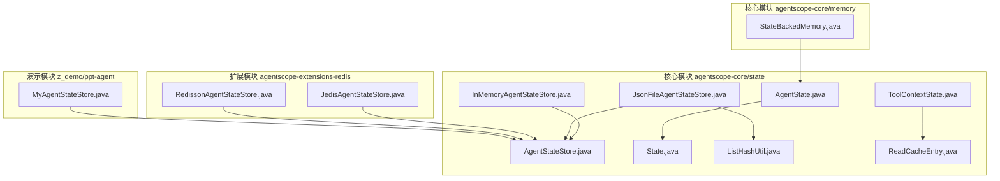
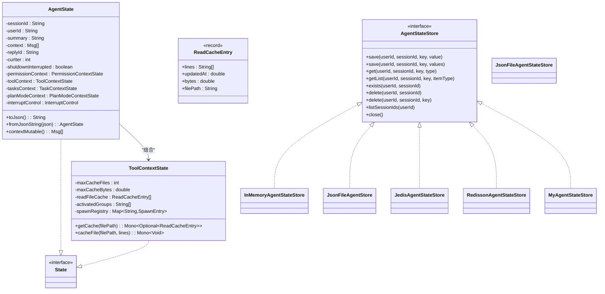
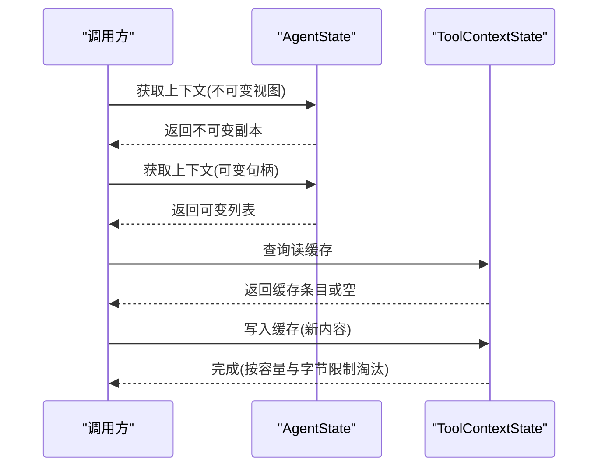
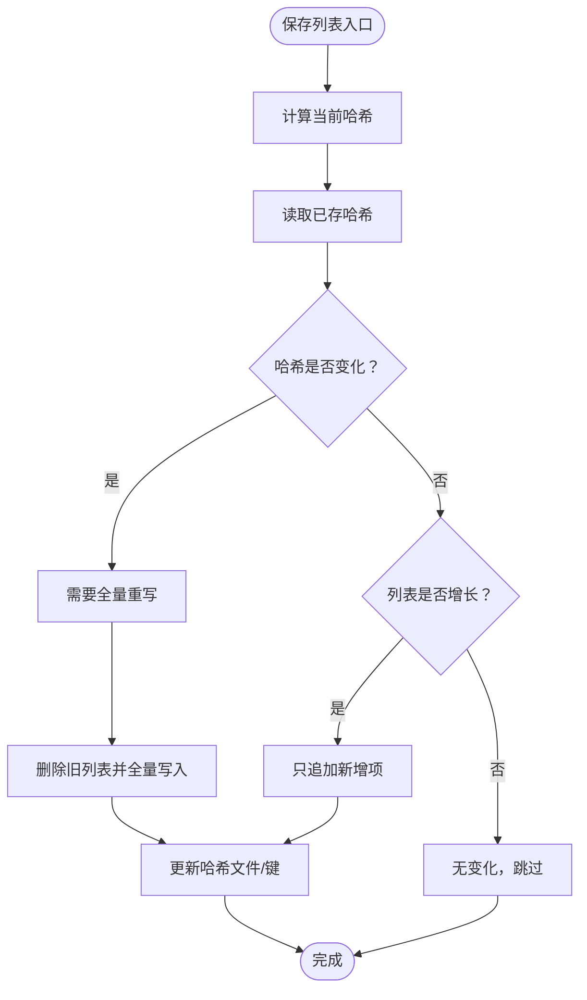
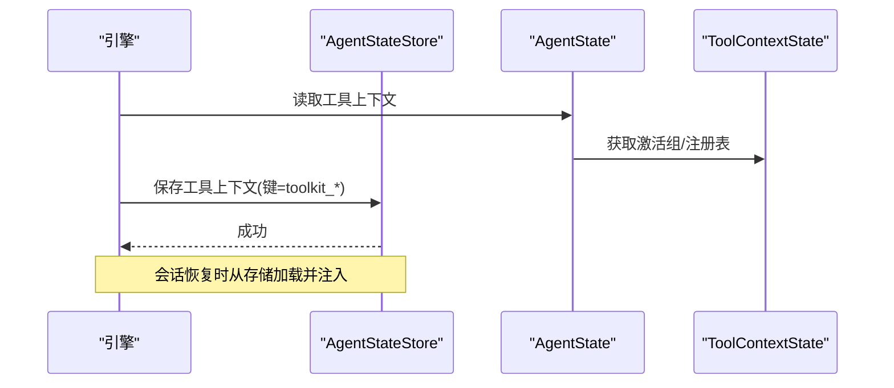
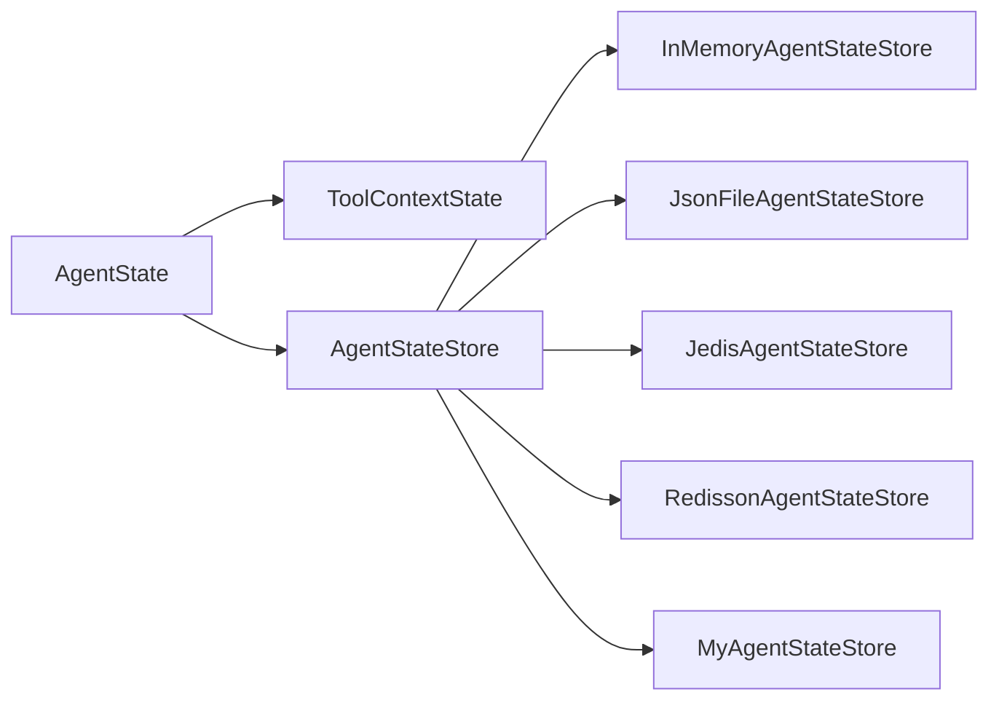

# 状态管理与持久化

<cite>
**本文引用的文件**
- [AgentState.java](file://agentscope-core/src/main/java/io/agentscope/core/state/AgentState.java)
- [AgentStateStore.java](file://agentscope-core/src/main/java/io/agentscope/core/state/AgentStateStore.java)
- [InMemoryAgentStateStore.java](file://agentscope-core/src/main/java/io/agentscope/core/state/InMemoryAgentStateStore.java)
- [JsonFileAgentStateStore.java](file://agentscope-core/src/main/java/io/agentscope/core/state/JsonFileAgentStateStore.java)
- [State.java](file://agentscope-core/src/main/java/io/agentscope/core/state/State.java)
- [ToolContextState.java](file://agentscope-core/src/main/java/io/agentscope/core/state/ToolContextState.java)
- [ListHashUtil.java](file://agentscope-core/src/main/java/io/agentscope/core/state/ListHashUtil.java)
- [ReadCacheEntry.java](file://agentscope-core/src/main/java/io/agentscope/core/state/ReadCacheEntry.java)
- [StateBackedMemory.java](file://agentscope-core/src/main/java/io/agentscope/core/memory/StateBackedMemory.java)
- [AgentStateTest.java](file://agentscope-core/src/test/java/io/agentscope/core/state/AgentStateTest.java)
- [JedisAgentStateStore.java](file://agentscope-extensions/agentscope-extensions-redis/src/main/java/io/agentscope/extensions/redis/state/jedis/JedisAgentStateStore.java)
- [RedissonAgentStateStore.java](file://agentscope-extensions/agentscope-extensions-redis/src/main/java/io/agentscope/extensions/redis/state/redisson/RedissonAgentStateStore.java)
- [MyAgentStateStore.java](file://z_demo/ppt-agent/src/main/java/io/github/chenygs/pptagent/agent/state/MyAgentStateStore.java)
</cite>

## 目录
1. [简介](#简介)
2. [项目结构](#项目结构)
3. [核心组件](#核心组件)
4. [架构总览](#架构总览)
5. [详细组件分析](#详细组件分析)
6. [依赖关系分析](#依赖关系分析)
7. [性能考量](#性能考量)
8. [故障排查指南](#故障排查指南)
9. [结论](#结论)
10. [附录](#附录)

## 简介
本文件聚焦于 ReAct 状态管理与持久化机制，系统性阐述以下主题：
- AgentState 类的设计与实现：状态字段定义、生命周期管理、序列化机制
- AgentStateStore 接口及其实现：内存存储、文件存储、Redis 存储等适配策略
- 状态缓存机制（stateCache）与并发性能优化
- 状态同步（syncToolkitToState）的实现细节与最佳实践
- 配置不同存储后端、实现自定义状态存储、处理状态冲突与一致性保障的方法

## 项目结构
ReAct 状态管理位于 agentscope-core 模块的 state 包中，并在 memory 包中提供与历史消息的兼容适配。扩展模块提供了 Redis 等分布式存储实现。

**图表来源**
- [AgentState.java:1-424](file://agentscope-core/src/main/java/io/agentscope/core/state/AgentState.java#L1-L424)
- [AgentStateStore.java:1-167](file://agentscope-core/src/main/java/io/agentscope/core/state/AgentStateStore.java#L1-L167)
- [InMemoryAgentStateStore.java:1-195](file://agentscope-core/src/main/java/io/agentscope/core/state/InMemoryAgentStateStore.java#L1-L195)
- [JsonFileAgentStateStore.java:1-397](file://agentscope-core/src/main/java/io/agentscope/core/state/JsonFileAgentStateStore.java#L1-L397)
- [State.java:1-31](file://agentscope-core/src/main/java/io/agentscope/core/state/State.java#L1-L31)
- [ToolContextState.java:1-293](file://agentscope-core/src/main/java/io/agentscope/core/state/ToolContextState.java#L1-L293)
- [ListHashUtil.java:1-172](file://agentscope-core/src/main/java/io/agentscope/core/state/ListHashUtil.java#L1-L172)
- [ReadCacheEntry.java:1-44](file://agentscope-core/src/main/java/io/agentscope/core/state/ReadCacheEntry.java#L1-L44)
- [StateBackedMemory.java:1-80](file://agentscope-core/src/main/java/io/agentscope/core/memory/StateBackedMemory.java#L1-L80)
- [JedisAgentStateStore.java:63-134](file://agentscope-extensions/agentscope-extensions-redis/src/main/java/io/agentscope/extensions/redis/state/jedis/JedisAgentStateStore.java#L63-L134)
- [RedissonAgentStateStore.java:65-128](file://agentscope-extensions/agentscope-extensions-redis/src/main/java/io/agentscope/extensions/redis/state/redisson/RedissonAgentStateStore.java#L65-L128)
- [MyAgentStateStore.java:69-101](file://z_demo/ppt-agent/src/main/java/io/github/chenygs/pptagent/agent/state/MyAgentStateStore.java#L69-L101)

**章节来源**
- [AgentState.java:1-424](file://agentscope-core/src/main/java/io/agentscope/core/state/AgentState.java#L1-L424)
- [AgentStateStore.java:1-167](file://agentscope-core/src/main/java/io/agentscope/core/state/AgentStateStore.java#L1-L167)

## 核心组件
- AgentState：单个智能体的运行时状态，包含会话标识、用户标识、对话上下文、滚动摘要、回复标识、当前推理迭代次数、中断标记、权限上下文、工具上下文、任务上下文、计划模式上下文等。支持 JSON 序列化与反序列化，提供不可变视图与可变句柄以兼顾安全与性能。
- AgentStateStore 接口：统一的状态持久化抽象，定义保存、加载、删除、列举会话等操作；实现可选的 per-key 删除与资源清理。
- InMemoryAgentStateStore：基于并发映射的内存存储，适合单进程场景；提供线程安全与匿名会话命名空间隔离。
- JsonFileAgentStateStore：基于文件系统的 JSON/JSONL 存储，支持原子写入、哈希校验的增量追加/全量重写策略，目录布局对特殊字符进行安全编码。
- ToolContextState：工具读缓存与子代理注册表，维护 LRU 缓存与 mtime 校验，避免过期数据；仅序列化配置字段，运行时缓存重建为空。
- ListHashUtil：列表状态变更检测工具，通过采样计算哈希，判断是否需要全量重写或增量追加。
- StateBackedMemory：向后兼容适配器，将消息历史读写委托给 AgentState 的上下文列表。

**章节来源**
- [AgentState.java:31-424](file://agentscope-core/src/main/java/io/agentscope/core/state/AgentState.java#L31-L424)
- [AgentStateStore.java:22-167](file://agentscope-core/src/main/java/io/agentscope/core/state/AgentStateStore.java#L22-L167)
- [InMemoryAgentStateStore.java:26-195](file://agentscope-core/src/main/java/io/agentscope/core/state/InMemoryAgentStateStore.java#L26-L195)
- [JsonFileAgentStateStore.java:41-397](file://agentscope-core/src/main/java/io/agentscope/core/state/JsonFileAgentStateStore.java#L41-L397)
- [ToolContextState.java:36-293](file://agentscope-core/src/main/java/io/agentscope/core/state/ToolContextState.java#L36-L293)
- [ListHashUtil.java:20-172](file://agentscope-core/src/main/java/io/agentscope/core/state/ListHashUtil.java#L20-L172)
- [StateBackedMemory.java:24-80](file://agentscope-core/src/main/java/io/agentscope/core/memory/StateBackedMemory.java#L24-L80)

## 架构总览
ReAct 状态管理采用“状态对象 + 存储接口 + 多实现”的分层设计。AgentState 作为领域模型，ToolContextState 等子上下文承载复杂状态；AgentStateStore 抽象出统一的持久化能力；具体实现覆盖内存、文件与分布式缓存（Redis）等场景。

**图表来源**
- [AgentState.java:59-424](file://agentscope-core/src/main/java/io/agentscope/core/state/AgentState.java#L59-L424)
- [ToolContextState.java:48-293](file://agentscope-core/src/main/java/io/agentscope/core/state/ToolContextState.java#L48-L293)
- [ReadCacheEntry.java:31-44](file://agentscope-core/src/main/java/io/agentscope/core/state/ReadCacheEntry.java#L31-L44)
- [AgentStateStore.java:61-167](file://agentscope-core/src/main/java/io/agentscope/core/state/AgentStateStore.java#L61-L167)
- [InMemoryAgentStateStore.java:46-195](file://agentscope-core/src/main/java/io/agentscope/core/state/InMemoryAgentStateStore.java#L46-L195)
- [JsonFileAgentStateStore.java:66-397](file://agentscope-core/src/main/java/io/agentscope/core/state/JsonFileAgentStateStore.java#L66-L397)
- [JedisAgentStateStore.java:63-134](file://agentscope-extensions/agentscope-extensions-redis/src/main/java/io/agentscope/extensions/redis/state/jedis/JedisAgentStateStore.java#L63-L134)
- [RedissonAgentStateStore.java:65-128](file://agentscope-extensions/agentscope-extensions-redis/src/main/java/io/agentscope/extensions/redis/state/redisson/RedissonAgentStateStore.java#L65-L128)
- [MyAgentStateStore.java:69-101](file://z_demo/ppt-agent/src/main/java/io/github/chenygs/pptagent/agent/state/MyAgentStateStore.java#L69-L101)

## 详细组件分析

### AgentState 设计与实现
- 字段与职责
  - 会话与用户标识：用于多租户与匿名场景的区分与隔离
  - 对话上下文：消息列表，提供不可变视图与可变句柄
  - 滚动摘要：自由字符串形式，便于后续结构化演进
  - 回复标识与迭代计数：用于流式输出与重入恢复
  - 中断标记：用于优雅关闭流程
  - 权限、工具、任务、计划模式上下文：细分子域状态
  - 运行时中断控制：延迟初始化，非序列化
- 生命周期管理
  - 构造与默认值：Builder 提供默认值填充；空字段回退到安全默认
  - 不可变视图：context() 返回防御性拷贝；contextMutable() 提供就地修改能力
  - 序列化：toJson()/fromJsonString() 基于通用 JSON 工具；@JsonPropertyOrder 控制字段顺序
- 并发与缓存
  - 运行时中断控制使用延迟初始化与同步块，确保线程安全
  - ToolContextState 内部维护 LRU 缓存与 mtime 校验，避免过期读取

**图表来源**
- [AgentState.java:179-288](file://agentscope-core/src/main/java/io/agentscope/core/state/AgentState.java#L179-L288)
- [ToolContextState.java:184-241](file://agentscope-core/src/main/java/io/agentscope/core/state/ToolContextState.java#L184-L241)

**章节来源**
- [AgentState.java:31-424](file://agentscope-core/src/main/java/io/agentscope/core/state/AgentState.java#L31-L424)
- [ToolContextState.java:36-293](file://agentscope-core/src/main/java/io/agentscope/core/state/ToolContextState.java#L36-L293)
- [AgentStateTest.java:35-168](file://agentscope-core/src/test/java/io/agentscope/core/state/AgentStateTest.java#L35-L168)

### AgentStateStore 接口与实现策略
- 接口能力
  - 单值与列表两种保存策略：列表实现可选择增量追加或全量替换
  - 加载与存在性检查：支持按类型加载与空值处理
  - 会话级删除与键级删除：默认不支持键级删除，实现可覆盖
  - 会话枚举：按用户命名空间列出可见会话
- 内存实现（InMemoryAgentStateStore）
  - 使用嵌套并发映射组织用户→会话→状态槽
  - 匿名用户归入固定命名空间，避免空字符串冲突
  - 列表保存采用全量替换策略
- 文件实现（JsonFileAgentStateStore）
  - 目录布局：根目录下按用户与会话分层，匿名用户使用特定目录
  - 文件命名：状态文件为 .json，列表文件为 .jsonl
  - 增量策略：基于哈希的全量重写/增量追加，原子写入与哈希文件保护
  - 安全编码：对用户ID/会话ID中的特殊字符进行 Base64(URL) 编码
- 分布式实现（Redis）
  - Jedis 实现：使用字符串键存储单值，集合记录会话键集；列表键配合哈希键实现增量/全量策略
  - Redisson 实现：基于 RBucket/RList/RSet 的类型化存储，支持增量追加

**图表来源**
- [JsonFileAgentStateStore.java:110-133](file://agentscope-core/src/main/java/io/agentscope/core/state/JsonFileAgentStateStore.java#L110-L133)
- [ListHashUtil.java:147-170](file://agentscope-core/src/main/java/io/agentscope/core/state/ListHashUtil.java#L147-L170)
- [JedisAgentStateStore.java:119-134](file://agentscope-extensions/agentscope-extensions-redis/src/main/java/io/agentscope/extensions/redis/state/jedis/JedisAgentStateStore.java#L119-L134)
- [RedissonAgentStateStore.java:108-128](file://agentscope-extensions/agentscope-extensions-redis/src/main/java/io/agentscope/extensions/redis/state/redisson/RedissonAgentStateStore.java#L108-L128)

**章节来源**
- [AgentStateStore.java:22-167](file://agentscope-core/src/main/java/io/agentscope/core/state/AgentStateStore.java#L22-L167)
- [InMemoryAgentStateStore.java:26-195](file://agentscope-core/src/main/java/io/agentscope/core/state/InMemoryAgentStateStore.java#L26-L195)
- [JsonFileAgentStateStore.java:41-397](file://agentscope-core/src/main/java/io/agentscope/core/state/JsonFileAgentStateStore.java#L41-L397)
- [JedisAgentStateStore.java:86-134](file://agentscope-extensions/agentscope-extensions-redis/src/main/java/io/agentscope/extensions/redis/state/jedis/JedisAgentStateStore.java#L86-L134)
- [RedissonAgentStateStore.java:88-128](file://agentscope-extensions/agentscope-extensions-redis/src/main/java/io/agentscope/extensions/redis/state/redisson/RedissonAgentStateStore.java#L88-L128)

### 状态缓存机制与并发性能
- ToolContextState 的读缓存
  - LRU 列表与容量/字节上限双重约束
  - mtime 校验：文件变更或不存在则驱逐缓存条目
  - 异步 IO：文件系统操作在弹性调度器上执行，避免阻塞 Reactor
- 并发访问
  - 读缓存访问使用同步块保护内部列表
  - 列表保存在文件实现中采用哈希与原子写入，降低锁竞争
- 性能建议
  - 合理设置最大缓存文件数与字节数，平衡内存占用与命中率
  - 对频繁读取的大文件启用缓存，避免重复 IO

**章节来源**
- [ToolContextState.java:36-241](file://agentscope-core/src/main/java/io/agentscope/core/state/ToolContextState.java#L36-L241)
- [ReadCacheEntry.java:23-44](file://agentscope-core/src/main/java/io/agentscope/core/state/ReadCacheEntry.java#L23-L44)

### 状态同步（syncToolkitToState）实现细节
- 同步目标
  - 将工具包（toolkit）状态与 AgentState 的工具上下文保持一致
  - 支持激活组、子代理注册表等信息的持久化与恢复
- 关键点
  - 使用 AgentStateStore 保存工具上下文的关键键（如激活组、子代理注册表）
  - 在会话恢复时从存储加载并注入到 AgentState 的工具上下文中
  - 对列表型状态采用哈希检测，确保修改/删除场景的一致性
- 兼容性
  - StateBackedMemory 提供历史消息的读写适配，便于迁移期间保持行为一致

**图表来源**
- [AgentState.java:235-248](file://agentscope-core/src/main/java/io/agentscope/core/state/AgentState.java#L235-L248)
- [ToolContextState.java:110-151](file://agentscope-core/src/main/java/io/agentscope/core/state/ToolContextState.java#L110-L151)
- [StateBackedMemory.java:67-78](file://agentscope-core/src/main/java/io/agentscope/core/memory/StateBackedMemory.java#L67-L78)

**章节来源**
- [AgentState.java:235-248](file://agentscope-core/src/main/java/io/agentscope/core/state/AgentState.java#L235-L248)
- [ToolContextState.java:110-151](file://agentscope-core/src/main/java/io/agentscope/core/state/ToolContextState.java#L110-L151)
- [StateBackedMemory.java:67-78](file://agentscope-core/src/main/java/io/agentscope/core/memory/StateBackedMemory.java#L67-L78)

### 自定义状态存储实现指南
- 基本步骤
  - 实现 AgentStateStore 接口：保存/加载/删除/列举/存在性检查
  - 列表保存策略：参考 ListHashUtil 的哈希检测逻辑，决定全量重写或增量追加
  - 键空间设计：遵循 (userId, sessionId) 组合作为会话槽位，避免手动拼接
  - 资源清理：实现 close() 释放连接池/客户端等资源
- 示例参考
  - Redis 实现（Jedis/Redisson）：键空间组织、集合跟踪键集、列表增量追加
  - 数据库实现（演示工程）：基于关系表的分页/计数与哈希键记录

**章节来源**
- [AgentStateStore.java:61-167](file://agentscope-core/src/main/java/io/agentscope/core/state/AgentStateStore.java#L61-L167)
- [ListHashUtil.java:147-170](file://agentscope-core/src/main/java/io/agentscope/core/state/ListHashUtil.java#L147-L170)
- [JedisAgentStateStore.java:86-134](file://agentscope-extensions/agentscope-extensions-redis/src/main/java/io/agentscope/extensions/redis/state/jedis/JedisAgentStateStore.java#L86-L134)
- [RedissonAgentStateStore.java:88-128](file://agentscope-extensions/agentscope-extensions-redis/src/main/java/io/agentscope/extensions/redis/state/redisson/RedissonAgentStateStore.java#L88-L128)
- [MyAgentStateStore.java:69-101](file://z_demo/ppt-agent/src/main/java/io/github/chenygs/pptagent/agent/state/MyAgentStateStore.java#L69-L101)

## 依赖关系分析
- 组件耦合
  - AgentState 依赖 ToolContextState、PermissionContextState 等子上下文，形成高内聚低耦合
  - AgentStateStore 与具体实现解耦，通过接口屏蔽存储差异
- 外部依赖
  - JSON 序列化：统一由 JSON 工具处理
  - Redis 扩展：Jedis/Redisson 客户端封装键空间与类型化存储
  - 文件系统：UTF-8 原子写入、哈希文件、目录遍历

**图表来源**
- [AgentState.java:59-424](file://agentscope-core/src/main/java/io/agentscope/core/state/AgentState.java#L59-L424)
- [AgentStateStore.java:61-167](file://agentscope-core/src/main/java/io/agentscope/core/state/AgentStateStore.java#L61-L167)
- [InMemoryAgentStateStore.java:46-195](file://agentscope-core/src/main/java/io/agentscope/core/state/InMemoryAgentStateStore.java#L46-L195)
- [JsonFileAgentStateStore.java:66-397](file://agentscope-core/src/main/java/io/agentscope/core/state/JsonFileAgentStateStore.java#L66-L397)
- [JedisAgentStateStore.java:63-134](file://agentscope-extensions/agentscope-extensions-redis/src/main/java/io/agentscope/extensions/redis/state/jedis/JedisAgentStateStore.java#L63-L134)
- [RedissonAgentStateStore.java:65-128](file://agentscope-extensions/agentscope-extensions-redis/src/main/java/io/agentscope/extensions/redis/state/redisson/RedissonAgentStateStore.java#L65-L128)
- [MyAgentStateStore.java:69-101](file://z_demo/ppt-agent/src/main/java/io/github/chenygs/pptagent/agent/state/MyAgentStateStore.java#L69-L101)

**章节来源**
- [AgentState.java:59-424](file://agentscope-core/src/main/java/io/agentscope/core/state/AgentState.java#L59-L424)
- [AgentStateStore.java:61-167](file://agentscope-core/src/main/java/io/agentscope/core/state/AgentStateStore.java#L61-L167)

## 性能考量
- 列表保存策略
  - 小列表：全量替换或直接追加
  - 大列表：采样哈希检测，避免全量扫描
- 缓存与 IO
  - 读缓存减少磁盘与网络 IO，结合 mtime 校验提升可靠性
  - 原子写入与哈希文件降低竞态风险
- 并发与异步
  - 缓存操作在弹性调度器执行，避免阻塞事件循环
  - 内存实现使用并发映射，降低锁粒度

[本节为通用指导，无需特定文件来源]

## 故障排查指南
- 常见问题
  - 会话 ID 为空或空白：实现要求 sessionId 非空且非空白，否则抛出异常
  - 用户 ID 为空：匿名会话映射到固定命名空间，避免冲突
  - 列表未更新：确认哈希文件/键是否存在，必要时触发全量重写
  - 缓存失效：检查文件 mtime 是否变化，必要时清空缓存或调整阈值
- 定位方法
  - 使用单元测试验证序列化/反序列化与默认值行为
  - 在存储实现中打印关键路径（键空间、哈希、长度），辅助排错

**章节来源**
- [AgentStateTest.java:35-168](file://agentscope-core/src/test/java/io/agentscope/core/state/AgentStateTest.java#L35-L168)
- [JsonFileAgentStateStore.java:365-395](file://agentscope-core/src/main/java/io/agentscope/core/state/JsonFileAgentStateStore.java#L365-L395)
- [ToolContextState.java:184-251](file://agentscope-core/src/main/java/io/agentscope/core/state/ToolContextState.java#L184-L251)

## 结论
ReAct 状态管理通过清晰的领域模型与可插拔的存储接口，实现了跨场景的一致性与高性能。AgentState 提供完备的运行时状态与序列化能力；AgentStateStore 抽象屏蔽了存储差异；工具读缓存与哈希检测进一步提升了并发与一致性保障。通过合理配置与扩展，可在内存、文件与分布式环境中灵活部署，并满足高可用与可运维需求。

[本节为总结性内容，无需特定文件来源]

## 附录
- 配置与使用要点
  - 选择存储后端：开发/测试用内存存储；生产用文件或 Redis 存储
  - 列表保存策略：优先使用增量追加，必要时触发全量重写
  - 键空间设计：严格遵循 (userId, sessionId) 组合，避免手工拼接
  - 资源清理：实现 close() 释放连接池与线程资源
- 参考实现
  - 内存：InMemoryAgentStateStore
  - 文件：JsonFileAgentStateStore
  - Redis：JedisAgentStateStore、RedissonAgentStateStore
  - 数据库：MyAgentStateStore（演示）

[本节为概览性内容，无需特定文件来源]