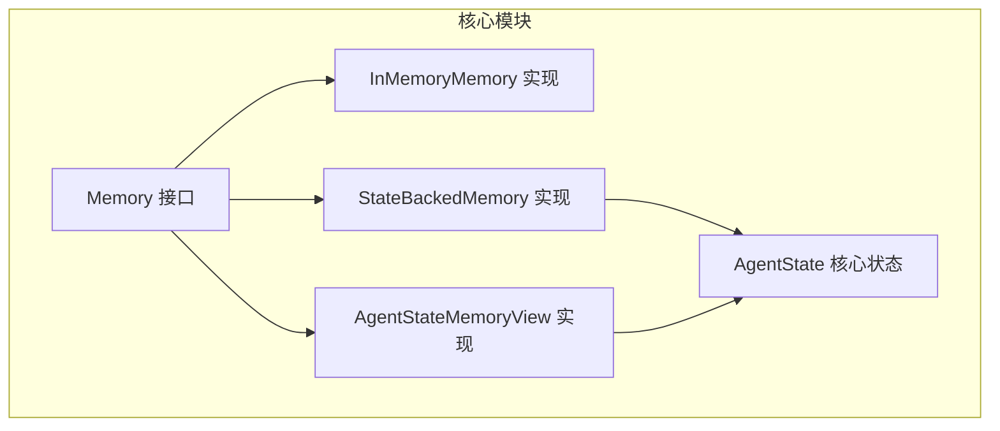
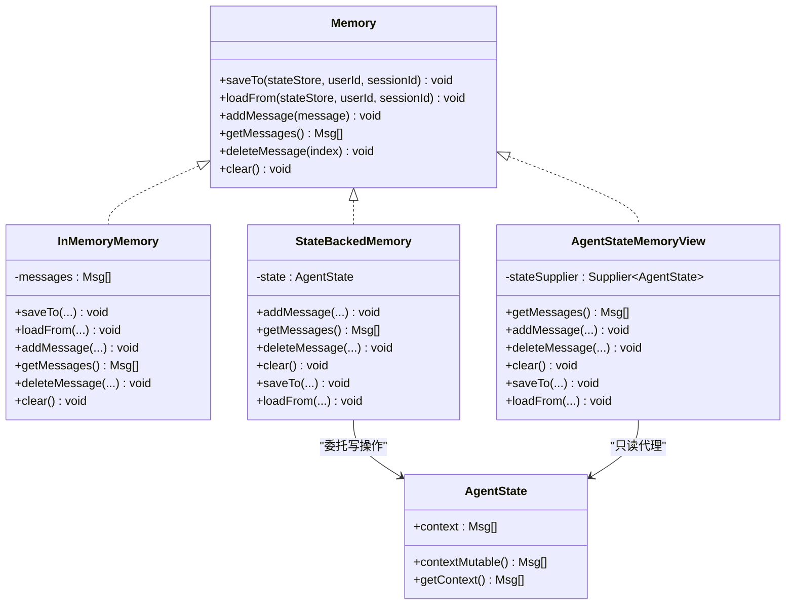
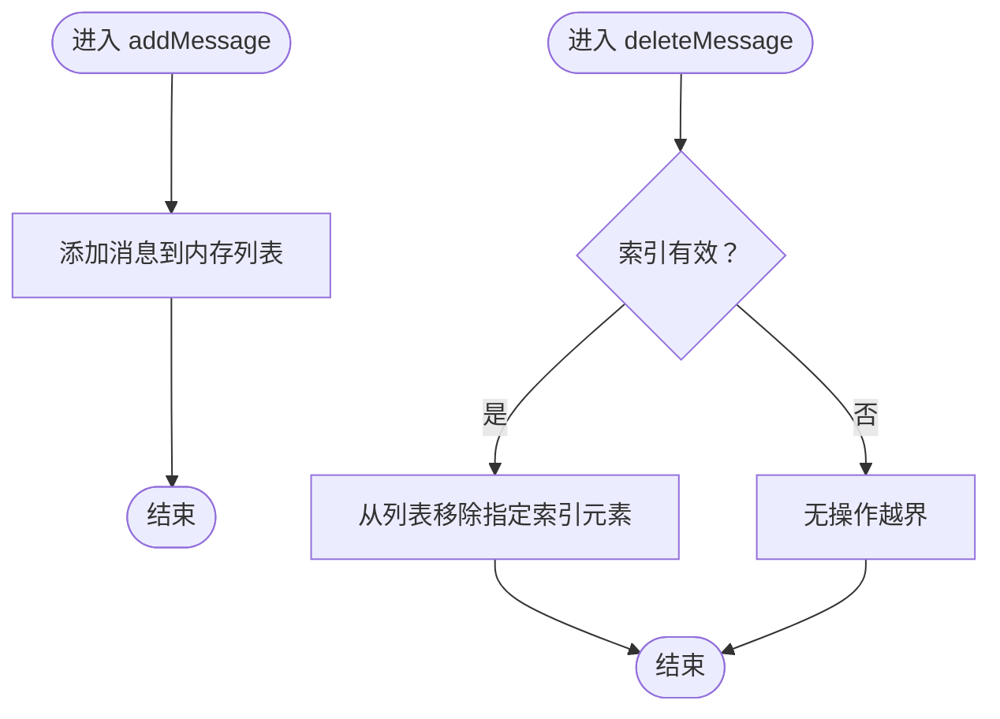
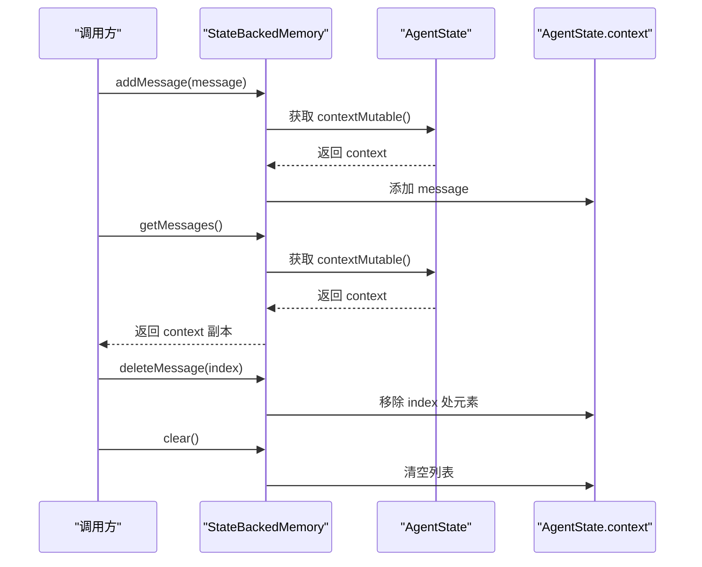
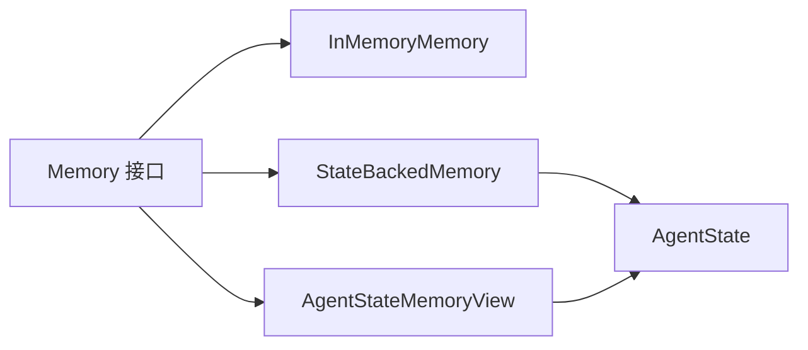

# Memory接口设计

<cite>
**本文引用的文件**   
- [Memory.java](file://agentscope-core/src/main/java/io/agentscope/core/memory/Memory.java)
- [InMemoryMemory.java](file://agentscope-core/src/main/java/io/agentscope/core/memory/InMemoryMemory.java)
- [StateBackedMemory.java](file://agentscope-core/src/main/java/io/agentscope/core/memory/StateBackedMemory.java)
- [AgentStateMemoryView.java](file://agentscope-core/src/main/java/io/agentscope/core/memory/AgentStateMemoryView.java)
- [AgentState.java](file://agentscope-core/src/main/java/io/agentscope/core/state/AgentState.java)
- [InMemoryMemoryTest.java](file://agentscope-core/src/test/java/io/agentscope/core/legacy/memory/InMemoryMemoryTest.java)
</cite>

## 目录
1. [引言](#引言)
2. [项目结构](#项目结构)
3. [核心组件](#核心组件)
4. [架构总览](#架构总览)
5. [详细组件分析](#详细组件分析)
6. [依赖关系分析](#依赖关系分析)
7. [性能考量](#性能考量)
8. [故障排查指南](#故障排查指南)
9. [结论](#结论)
10. [附录](#附录)

## 引言
本文件面向Memory接口的实现与使用，系统阐述其设计理念、架构原则与演进路径。Memory接口在2.0.0版本中被标记为废弃，仅保留向后兼容用途；当前对话历史的承载位置已迁移至AgentState的上下文容器。本文将：
- 解释Memory接口的职责边界与设计动机
- 深入说明各方法的语义、行为与适用场景
- 讲解saveTo/loadFrom在v1.0.x中的兼容性角色及为何在2.0.0中被废弃
- 提供自定义Memory实现的实践建议与并发安全要点
- 展示与AgentState协作的架构视图与调用流程

## 项目结构
Memory接口及其相关实现位于agentscope-core模块的memory包内，并通过AgentState在2.0.0+版本中承担实际的会话上下文管理。

图表来源
- [Memory.java:35-79](file://agentscope-core/src/main/java/io/agentscope/core/memory/Memory.java#L35-L79)
- [InMemoryMemory.java:37-135](file://agentscope-core/src/main/java/io/agentscope/core/memory/InMemoryMemory.java#L37-L135)
- [StateBackedMemory.java:36-80](file://agentscope-core/src/main/java/io/agentscope/core/memory/StateBackedMemory.java#L36-L80)
- [AgentStateMemoryView.java:43-87](file://agentscope-core/src/main/java/io/agentscope/core/memory/AgentStateMemoryView.java#L43-L87)
- [AgentState.java:59-424](file://agentscope-core/src/main/java/io/agentscope/core/state/AgentState.java#L59-L424)

章节来源
- [Memory.java:22-34](file://agentscope-core/src/main/java/io/agentscope/core/memory/Memory.java#L22-L34)
- [AgentState.java:31-45](file://agentscope-core/src/main/java/io/agentscope/core/state/AgentState.java#L31-L45)

## 核心组件
- Memory接口：定义对话历史的增删改查与持久化钩子，用于v1.0.x兼容与迁移期支持。
- InMemoryMemory：内存型实现，内置线程安全的消息列表与状态存取能力。
- StateBackedMemory：适配器实现，将所有读写委托给AgentState.contextMutable()。
- AgentStateMemoryView：只读适配器，将getMessages代理到AgentState.getContext()，其余写操作抛出异常。
- AgentState：2.0.0+版本的会话上下文载体，包含context列表与工具/任务/权限等子上下文。

章节来源
- [Memory.java:35-79](file://agentscope-core/src/main/java/io/agentscope/core/memory/Memory.java#L35-L79)
- [InMemoryMemory.java:37-135](file://agentscope-core/src/main/java/io/agentscope/core/memory/InMemoryMemory.java#L37-L135)
- [StateBackedMemory.java:36-80](file://agentscope-core/src/main/java/io/agentscope/core/memory/StateBackedMemory.java#L36-L80)
- [AgentStateMemoryView.java:43-87](file://agentscope-core/src/main/java/io/agentscope/core/memory/AgentStateMemoryView.java#L43-L87)
- [AgentState.java:59-424](file://agentscope-core/src/main/java/io/agentscope/core/state/AgentState.java#L59-L424)

## 架构总览
下图展示了Memory接口在2.0.0+版本中的定位与与AgentState的关系。其中StateBackedMemory与AgentStateMemoryView分别代表“写兼容”和“只读兼容”的适配层。

图表来源
- [Memory.java:35-79](file://agentscope-core/src/main/java/io/agentscope/core/memory/Memory.java#L35-L79)
- [InMemoryMemory.java:37-135](file://agentscope-core/src/main/java/io/agentscope/core/memory/InMemoryMemory.java#L37-L135)
- [StateBackedMemory.java:36-80](file://agentscope-core/src/main/java/io/agentscope/core/memory/StateBackedMemory.java#L36-L80)
- [AgentStateMemoryView.java:43-87](file://agentscope-core/src/main/java/io/agentscope/core/memory/AgentStateMemoryView.java#L43-L87)
- [AgentState.java:59-424](file://agentscope-core/src/main/java/io/agentscope/core/state/AgentState.java#L59-L424)

## 详细组件分析

### Memory接口设计与方法语义
- 设计理念
  - 作为对话历史存储组件，Memory接口提供统一的增删改查与会话级持久化钩子，用于v1.0.x遗留系统的兼容与迁移期过渡。
  - 2.0.0起，对话历史由AgentState持有，Memory接口被标记为废弃，仅保留写镜像以兼容旧代码。
- 方法说明
  - addMessage：追加一条消息到历史缓冲区。
  - getMessages：返回当前全部消息（非空列表）。
  - deleteMessage：按索引删除消息；越界视为无操作，保证并发安全。
  - clear：清空历史消息。
  - saveTo/loadFrom：在v1.0.x中用于通过AgentStateStore持久化/恢复消息缓冲；2.0.0后由AgentState直接管理，该接口仅作兼容镜像。
- 兼容性说明
  - v1.0.x：会话状态通过AgentStateStore保存消息列表键值，Memory.saveTo/loadFrom参与序列化/反序列化。
  - 2.0.0+：会话状态整体序列化为AgentState，上下文变更直接在AgentState.context上进行，Memory接口不再承担持久化职责。

章节来源
- [Memory.java:22-34](file://agentscope-core/src/main/java/io/agentscope/core/memory/Memory.java#L22-L34)
- [Memory.java:35-79](file://agentscope-core/src/main/java/io/agentscope/core/memory/Memory.java#L35-L79)

### InMemoryMemory：内存型实现
- 特点
  - 使用CopyOnWriteArrayList保证读多写少场景下的并发安全。
  - 提供saveTo/loadFrom，将消息列表保存到AgentStateStore，键名固定前缀，便于v1.0.x迁移。
  - getMessages过滤null条目并返回新列表副本，避免外部修改影响内部状态。
- 并发与线程安全
  - 写操作（add/clear）在CopyOnWriteArrayList上执行，读操作（getMessages）不阻塞。
  - deleteMessage对越界索引采用无操作策略，避免异常传播。
- 使用场景
  - 本地开发、单元测试或轻量级会话管理。
  - 迁移阶段作为兼容层，逐步替换为AgentState直接管理。

图表来源
- [InMemoryMemory.java:92-123](file://agentscope-core/src/main/java/io/agentscope/core/memory/InMemoryMemory.java#L92-L123)

章节来源
- [InMemoryMemory.java:26-36](file://agentscope-core/src/main/java/io/agentscope/core/memory/InMemoryMemory.java#L26-L36)
- [InMemoryMemory.java:39-135](file://agentscope-core/src/main/java/io/agentscope/core/memory/InMemoryMemory.java#L39-L135)

### StateBackedMemory：AgentState写适配器
- 角色
  - 将所有写操作（add/get/delete/clear）委托给AgentState.contextMutable()，实现与AgentState的无缝对接。
  - 同时实现saveTo/loadFrom，将上下文写入AgentStateStore，保持v1.0.x的持久化契约。
- 适用场景
  - 已有代码通过Memory接口访问上下文，但希望迁移到AgentState管理的场景。
- 注意事项
  - 读操作返回contextMutable的副本，写操作直接作用于AgentState上下文，需关注并发与生命周期管理。

章节来源
- [StateBackedMemory.java:24-35](file://agentscope-core/src/main/java/io/agentscope/core/memory/StateBackedMemory.java#L24-L35)
- [StateBackedMemory.java:36-80](file://agentscope-core/src/main/java/io/agentscope/core/memory/StateBackedMemory.java#L36-L80)

### AgentStateMemoryView：只读代理
- 角色
  - 仅实现getMessages，其他写操作均抛出UnsupportedOperationException，明确禁止通过该视图修改上下文。
  - 通过Supplier<AgentState>在调用时解析AgentState，若尚未绑定则返回空列表而非异常。
- 适用场景
  - 兼容旧版工具/钩子在2.0.0+环境中读取上下文，避免破坏性修改。
- 设计动机
  - 在2.0.0重构中，Agent不再拥有独立Memory实例，只读视图确保向后兼容的同时防止误用。

章节来源
- [AgentStateMemoryView.java:25-42](file://agentscope-core/src/main/java/io/agentscope/core/memory/AgentStateMemoryView.java#L25-L42)
- [AgentStateMemoryView.java:43-87](file://agentscope-core/src/main/java/io/agentscope/core/memory/AgentStateMemoryView.java#L43-L87)

### 与AgentState的协作流程
以下序列图展示在2.0.0+版本中，通过StateBackedMemory或AgentState直接操作上下文的典型流程。

图表来源
- [StateBackedMemory.java:44-65](file://agentscope-core/src/main/java/io/agentscope/core/memory/StateBackedMemory.java#L44-L65)
- [AgentState.java:179-188](file://agentscope-core/src/main/java/io/agentscope/core/state/AgentState.java#L179-L188)

## 依赖关系分析
- 耦合与内聚
  - Memory接口与具体实现之间通过接口解耦，便于替换与扩展。
  - StateBackedMemory与AgentState高度内聚，写操作直接委托上下文，降低额外抽象成本。
  - AgentStateMemoryView与AgentState弱耦合，通过Supplier延迟绑定，提升灵活性。
- 外部依赖
  - Memory实现依赖AgentStateStore（v1.0.x兼容）与AgentState（2.0.0+核心）。
  - 测试覆盖了并发安全性与边界条件，验证deleteMessage越界无操作与clear幂等性。

图表来源
- [Memory.java:35-79](file://agentscope-core/src/main/java/io/agentscope/core/memory/Memory.java#L35-L79)
- [StateBackedMemory.java:36-80](file://agentscope-core/src/main/java/io/agentscope/core/memory/StateBackedMemory.java#L36-L80)
- [AgentStateMemoryView.java:43-87](file://agentscope-core/src/main/java/io/agentscope/core/memory/AgentStateMemoryView.java#L43-L87)
- [AgentState.java:59-424](file://agentscope-core/src/main/java/io/agentscope/core/state/AgentState.java#L59-L424)

章节来源
- [InMemoryMemoryTest.java:156-176](file://agentscope-core/src/test/java/io/agentscope/core/legacy/memory/InMemoryMemoryTest.java#L156-L176)

## 性能考量
- 读写模型
  - InMemoryMemory使用CopyOnWriteArrayList，适合高读低写场景；频繁写入可能带来复制开销。
  - StateBackedMemory与AgentStateMemoryView均委托AgentState上下文，避免额外集合拷贝。
- 序列化与持久化
  - v1.0.x通过saveTo/loadFrom将消息列表写入AgentStateStore；2.0.0+由AgentState整体序列化，减少多次键值写入。
- 并发与锁粒度
  - CopyOnWriteArrayList在写时复制，读操作无锁；deleteMessage对越界采用无操作策略，避免异常与同步开销。
- 建议
  - 对于高频写入场景，优先考虑直接操作AgentState.contextMutable()，减少中间层封装。
  - 若必须使用Memory接口，请评估写入频率与数据规模，必要时结合批量写入策略。

## 故障排查指南
- 常见问题
  - 越界删除无效：deleteMessage对负数或超出范围的索引不做任何操作，属预期行为。
  - 清空后读取为空：clear清空上下文，后续getMessages返回空列表。
  - 只读视图写失败：AgentStateMemoryView的写操作会抛出UnsupportedOperationException。
- 定位方法
  - 检查调用链是否通过StateBackedMemory或AgentState直接写入。
  - 核对AgentState的生命周期与绑定状态（Supplier返回值）。
  - 在并发场景下，确认未对同一索引重复删除导致结果不符合预期。
- 单元测试参考
  - 并发安全与边界条件已在测试中覆盖，可对照用例定位问题。

章节来源
- [InMemoryMemoryTest.java:107-133](file://agentscope-core/src/test/java/io/agentscope/core/legacy/memory/InMemoryMemoryTest.java#L107-L133)
- [InMemoryMemoryTest.java:156-176](file://agentscope-core/src/test/java/io/agentscope/core/legacy/memory/InMemoryMemoryTest.java#L156-L176)
- [AgentStateMemoryView.java:58-85](file://agentscope-core/src/main/java/io/agentscope/core/memory/AgentStateMemoryView.java#L58-L85)

## 结论
- Memory接口在2.0.0版本中被标记为废弃，仅保留写兼容镜像与只读代理，以平滑迁移。
- 当前对话历史应直接通过AgentState.getContext()/contextMutable()进行管理，获得更清晰的状态模型与更好的性能表现。
- 自定义实现建议遵循现有实现的并发与边界处理策略，优先选择直接操作AgentState的方式，减少中间层带来的复杂性与潜在风险。

## 附录
- 自定义Memory实现建议
  - 明确职责：仅在迁移期或兼容需求下实现Memory接口；新业务直接使用AgentState。
  - 并发安全：如需自定义列表，优先采用线程安全集合或在调用侧加锁。
  - 边界处理：对越界删除采用无操作策略，保持幂等性。
  - 持久化：v1.0.x可用saveTo/loadFrom；2.0.0+请使用AgentState整体序列化方案。
- 代码示例路径（不含具体代码内容）
  - [Memory接口定义:35-79](file://agentscope-core/src/main/java/io/agentscope/core/memory/Memory.java#L35-L79)
  - [InMemoryMemory实现:37-135](file://agentscope-core/src/main/java/io/agentscope/core/memory/InMemoryMemory.java#L37-L135)
  - [StateBackedMemory实现:36-80](file://agentscope-core/src/main/java/io/agentscope/core/memory/StateBackedMemory.java#L36-L80)
  - [AgentStateMemoryView实现:43-87](file://agentscope-core/src/main/java/io/agentscope/core/memory/AgentStateMemoryView.java#L43-87)
  - [AgentState核心状态:59-424](file://agentscope-core/src/main/java/io/agentscope/core/state/AgentState.java#L59-L424)
  - [并发与边界测试:156-176](file://agentscope-core/src/test/java/io/agentscope/core/legacy/memory/InMemoryMemoryTest.java#L156-L176)