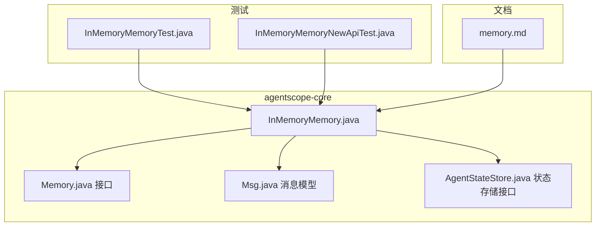
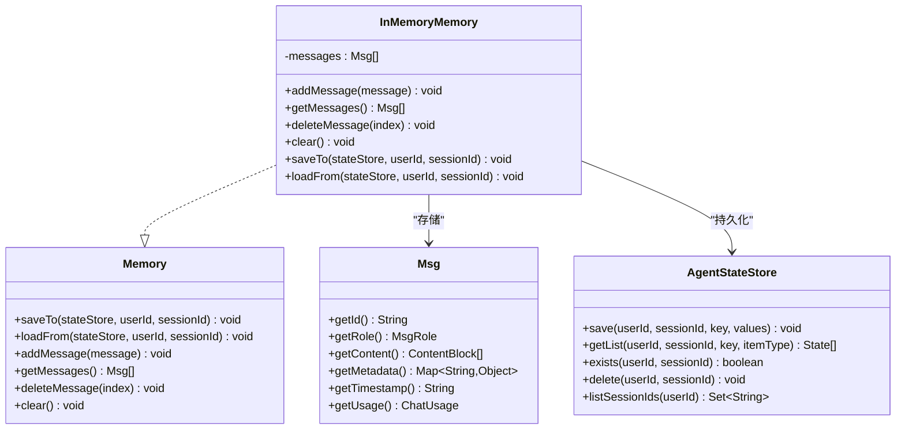
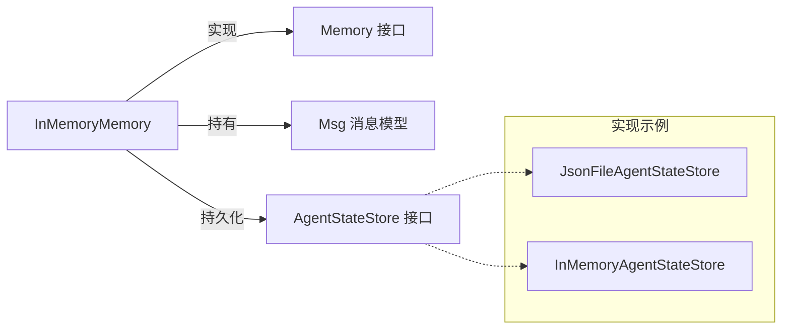

# 内存存储实现

<cite>
**本文档引用的文件**
- [InMemoryMemory.java](file://agentscope-core/src/main/java/io/agentscope/core/memory/InMemoryMemory.java)
- [Memory.java](file://agentscope-core/src/main/java/io/agentscope/core/memory/Memory.java)
- [Msg.java](file://agentscope-core/src/main/java/io/agentscope/core/message/Msg.java)
- [AgentStateStore.java](file://agentscope-core/src/main/java/io/agentscope/core/state/AgentStateStore.java)
- [InMemoryMemoryTest.java](file://agentscope-core/src/test/java/io/agentscope/core/legacy/memory/InMemoryMemoryTest.java)
- [InMemoryMemoryNewApiTest.java](file://agentscope-core/src/test/java/io/agentscope/core/legacy/memory/InMemoryMemoryNewApiTest.java)
- [memory.md](file://docs/v1/en/docs/task/memory.md)
</cite>

## 目录
1. [简介](#简介)
2. [项目结构](#项目结构)
3. [核心组件](#核心组件)
4. [架构概览](#架构概览)
5. [详细组件分析](#详细组件分析)
6. [依赖关系分析](#依赖关系分析)
7. [性能考虑](#性能考虑)
8. [故障排查指南](#故障排查指南)
9. [结论](#结论)
10. [附录](#附录)

## 简介
本文件针对 InMemoryMemory 的实现进行深入技术文档化，重点覆盖以下方面：
- 内存管理策略：消息缓冲区的线程安全与扩容机制、内存使用优化
- 数据结构设计：列表容器选择（CopyOnWriteArrayList）的原因与性能权衡
- 消息检索与删除：高效实现与边界条件处理
- 大容量历史记录：在高并发下的稳定性保障
- 配置参数与监控：如何通过状态持久化接口监控内存使用，以及在高并发场景下的性能保障手段
- 使用示例：基于仓库中的测试与文档路径，提供可追溯的参考位置

## 项目结构
InMemoryMemory 位于 agentscope-core 模块中，作为短期记忆的默认实现，负责将消息保存在内存中，并支持通过 AgentStateStore 进行持久化/恢复。



**图表来源**
- [InMemoryMemory.java:1-135](file://agentscope-core/src/main/java/io/agentscope/core/memory/InMemoryMemory.java#L1-L135)
- [Memory.java:1-79](file://agentscope-core/src/main/java/io/agentscope/core/memory/Memory.java#L1-L79)
- [Msg.java:1-843](file://agentscope-core/src/main/java/io/agentscope/core/message/Msg.java#L1-L843)
- [AgentStateStore.java:1-167](file://agentscope-core/src/main/java/io/agentscope/core/state/AgentStateStore.java#L1-L167)
- [InMemoryMemoryTest.java:1-178](file://agentscope-core/src/test/java/io/agentscope/core/legacy/memory/InMemoryMemoryTest.java#L1-L178)
- [InMemoryMemoryNewApiTest.java:1-204](file://agentscope-core/src/test/java/io/agentscope/core/legacy/memory/InMemoryMemoryNewApiTest.java#L1-L204)
- [memory.md:27-81](file://docs/v1/en/docs/task/memory.md#L27-L81)

**章节来源**
- [InMemoryMemory.java:1-135](file://agentscope-core/src/main/java/io/agentscope/core/memory/InMemoryMemory.java#L1-L135)
- [Memory.java:1-79](file://agentscope-core/src/main/java/io/agentscope/core/memory/Memory.java#L1-L79)
- [Msg.java:1-843](file://agentscope-core/src/main/java/io/agentscope/core/message/Msg.java#L1-L843)
- [AgentStateStore.java:1-167](file://agentscope-core/src/main/java/io/agentscope/core/state/AgentStateStore.java#L1-L167)
- [InMemoryMemoryTest.java:1-178](file://agentscope-core/src/test/java/io/agentscope/core/legacy/memory/InMemoryMemoryTest.java#L1-L178)
- [InMemoryMemoryNewApiTest.java:1-204](file://agentscope-core/src/test/java/io/agentscope/core/legacy/memory/InMemoryMemoryNewApiTest.java#L1-L204)
- [memory.md:27-81](file://docs/v1/en/docs/task/memory.md#L27-L81)

## 核心组件
- InMemoryMemory：基于线程安全列表的短期记忆实现，默认保存消息到内存，支持通过 AgentStateStore 进行持久化与恢复。
- Memory 接口：定义了记忆组件的基本能力（添加、获取、删除、清空、保存/加载）。
- Msg：消息模型，包含角色、内容块、元数据、时间戳等字段，用于承载对话历史。
- AgentStateStore：统一的状态存储接口，支持保存/加载列表值，不同实现可采用增量写入或全量替换策略。

**章节来源**
- [InMemoryMemory.java:36-135](file://agentscope-core/src/main/java/io/agentscope/core/memory/InMemoryMemory.java#L36-L135)
- [Memory.java:35-79](file://agentscope-core/src/main/java/io/agentscope/core/memory/Memory.java#L35-L79)
- [Msg.java:67-152](file://agentscope-core/src/main/java/io/agentscope/core/message/Msg.java#L67-L152)
- [AgentStateStore.java:61-167](file://agentscope-core/src/main/java/io/agentscope/core/state/AgentStateStore.java#L61-L167)

## 架构概览
InMemoryMemory 通过 CopyOnWriteArrayList 实现线程安全的消息列表，提供以下能力：
- 添加消息：O(1) 时间复杂度
- 获取消息：过滤空值后返回新列表，读取时无锁拷贝
- 删除消息：索引有效性检查后删除，避免越界异常
- 清空消息：清空列表
- 状态持久化：通过 saveTo/loadFrom 将消息列表保存到 AgentStateStore，支持增量/全量策略



**图表来源**
- [Memory.java:35-79](file://agentscope-core/src/main/java/io/agentscope/core/memory/Memory.java#L35-L79)
- [InMemoryMemory.java:37-135](file://agentscope-core/src/main/java/io/agentscope/core/memory/InMemoryMemory.java#L37-L135)
- [Msg.java:67-152](file://agentscope-core/src/main/java/io/agentscope/core/message/Msg.java#L67-L152)
- [AgentStateStore.java:61-167](file://agentscope-core/src/main/java/io/agentscope/core/state/AgentStateStore.java#L61-L167)

## 详细组件分析

### InMemoryMemory 类实现细节
- 数据结构选择
  - 使用 CopyOnWriteArrayList 作为内部消息容器，确保读多写少场景下的线程安全与高并发读取性能。
  - 读取时通过流式过滤空值并收集为新列表，避免暴露内部可变性。
- 动态扩容机制
  - 基于底层 ArrayList 的动态扩容策略，无需显式配置上限；在高吞吐场景下需关注内存增长与 GC 压力。
- 消息检索
  - getMessages 返回非空消息列表副本，避免外部修改影响内部状态。
- 消息删除
  - deleteMessage 对索引进行边界检查，越界视为无操作，避免异常传播。
- 清空与持久化
  - clear 清空所有消息；saveTo/loadFrom 支持将完整消息列表保存到 AgentStateStore，供后续恢复。

```mermaid
sequenceDiagram
participant Caller as "调用方"
participant Memory as "InMemoryMemory"
participant Store as "AgentStateStore"
Caller->>Memory : addMessage(msg)
Memory->>Memory : messages.add(msg)
Caller->>Memory : getMessages()
Memory->>Memory : messages.stream().filter(nonNull).collect()
Caller->>Memory : deleteMessage(index)
Memory->>Memory : 边界检查后 remove(index)
Caller->>Memory : saveTo(store, userId, sessionId)
Memory->>Store : save(userId, sessionId, "memory_messages", new ArrayList(messages))
Caller->>Memory : loadFrom(store, userId, sessionId)
Memory->>Store : getList(userId, sessionId, "memory_messages", Msg.class)
Store-->>Memory : List<Msg>
Memory->>Memory : messages.clear(); messages.addAll(loaded)
```

**图表来源**
- [InMemoryMemory.java:62-81](file://agentscope-core/src/main/java/io/agentscope/core/memory/InMemoryMemory.java#L62-L81)
- [AgentStateStore.java:92-117](file://agentscope-core/src/main/java/io/agentscope/core/state/AgentStateStore.java#L92-L117)

**章节来源**
- [InMemoryMemory.java:37-135](file://agentscope-core/src/main/java/io/agentscope/core/memory/InMemoryMemory.java#L37-L135)

### 数据结构设计与性能考量
- 列表容器选择
  - CopyOnWriteArrayList 适合“读多写少”的场景，读操作无锁，写操作复制数组，避免迭代器一致性问题。
  - 对于频繁删除与超长历史记录，建议结合外部窗口/压缩策略控制内存占用。
- 消息对象设计
  - Msg 为不可变对象，字段通过构造期校验与过滤，减少运行期错误。
  - 内容块列表为不可变视图，避免并发修改导致的不一致。

**章节来源**
- [InMemoryMemory.java:39-108](file://agentscope-core/src/main/java/io/agentscope/core/memory/InMemoryMemory.java#L39-L108)
- [Msg.java:134-151](file://agentscope-core/src/main/java/io/agentscope/core/message/Msg.java#L134-L151)

### 高并发场景下的稳定性保障
- 线程安全
  - 读取操作通过流式过滤与收集新列表，避免共享可变状态。
  - 写入操作由 CopyOnWriteArrayList 保证原子性与可见性。
- 测试验证
  - 并发添加与删除测试覆盖了高并发下的正确性与稳定性。

**章节来源**
- [InMemoryMemoryTest.java:156-176](file://agentscope-core/src/test/java/io/agentscope/core/legacy/memory/InMemoryMemoryTest.java#L156-L176)

### 大容量历史记录处理
- 增量持久化
  - saveTo 负责保存完整消息列表；具体存储策略由 AgentStateStore 实现决定（如增量追加或全量替换）。
- 加载与替换
  - loadFrom 会完全替换当前内存中的消息集合，确保与存储一致。

**章节来源**
- [InMemoryMemory.java:62-81](file://agentscope-core/src/main/java/io/agentscope/core/memory/InMemoryMemory.java#L62-L81)
- [AgentStateStore.java:75-92](file://agentscope-core/src/main/java/io/agentscope/core/state/AgentStateStore.java#L75-L92)

### 配置参数与监控
- 配置参数
  - InMemoryMemory 本身不提供容量限制或淘汰策略的配置项；可通过外部策略（如会话管理器、钩子）控制消息数量。
- 监控内存使用
  - 可通过 AgentStateStore 的实现（例如文件存储）观察持久化文件大小变化，间接反映内存中消息体量。
  - 在高并发场景下，建议结合 JVM 堆内存监控与 GC 日志分析内存增长趋势。

**章节来源**
- [InMemoryMemoryNewApiTest.java:136-180](file://agentscope-core/src/test/java/io/agentscope/core/legacy/memory/InMemoryMemoryNewApiTest.java#L136-L180)
- [memory.md:51-81](file://docs/v1/en/docs/task/memory.md#L51-L81)

## 依赖关系分析
InMemoryMemory 与外部组件的耦合关系如下：



**图表来源**
- [InMemoryMemory.java:37-135](file://agentscope-core/src/main/java/io/agentscope/core/memory/InMemoryMemory.java#L37-L135)
- [Memory.java:35-79](file://agentscope-core/src/main/java/io/agentscope/core/memory/Memory.java#L35-L79)
- [Msg.java:67-152](file://agentscope-core/src/main/java/io/agentscope/core/message/Msg.java#L67-L152)
- [AgentStateStore.java:61-167](file://agentscope-core/src/main/java/io/agentscope/core/state/AgentStateStore.java#L61-L167)

**章节来源**
- [InMemoryMemory.java:37-135](file://agentscope-core/src/main/java/io/agentscope/core/memory/InMemoryMemory.java#L37-L135)
- [AgentStateStore.java:61-167](file://agentscope-core/src/main/java/io/agentscope/core/state/AgentStateStore.java#L61-L167)

## 性能考虑
- 时间复杂度
  - 添加消息：O(1)
  - 获取消息：O(n)（过滤空值并收集）
  - 删除消息：O(n)（列表删除为 O(n)，但仅限有效索引）
  - 清空消息：O(1)
- 空间复杂度
  - 存储每个消息对象及其内容块，长期会话可能造成显著内存增长
- 并发特性
  - 读取无锁，写入复制数组，适合读多写少场景
- 优化建议
  - 引入会话级窗口/压缩策略，定期清理旧消息
  - 结合增量持久化，避免一次性序列化超大列表
  - 在高并发下评估 GC 压力，必要时调整 JVM 参数

[本节为通用性能讨论，不直接分析具体文件]

## 故障排查指南
- 空指针与越界
  - getMessages 会过滤空值；删除时对索引进行边界检查，越界不抛异常。
- 并发一致性
  - 若出现读取结果与预期不符，检查是否在读取过程中同时发生写入。
- 持久化一致性
  - saveTo/loadFrom 会替换内存内容；若发现历史丢失，请确认存储实现是否支持增量写入。

**章节来源**
- [InMemoryMemory.java:105-133](file://agentscope-core/src/main/java/io/agentscope/core/memory/InMemoryMemory.java#L105-L133)
- [InMemoryMemoryTest.java:107-133](file://agentscope-core/src/test/java/io/agentscope/core/legacy/memory/InMemoryMemoryTest.java#L107-L133)

## 结论
InMemoryMemory 提供了简单可靠的短期记忆实现，借助 CopyOnWriteArrayList 在高并发读取场景下具备良好的稳定性。对于大容量历史记录，建议配合会话管理与增量持久化策略，以平衡内存占用与性能表现。由于该实现已标记为弃用，新项目应优先采用 AgentState 上下文管理对话历史。

[本节为总结性内容，不直接分析具体文件]

## 附录

### 使用示例（基于仓库中的测试与文档）
- 基本用法与历史访问
  - 示例路径：[memory.md:62-81](file://docs/v1/en/docs/task/memory.md#L62-L81)
- 新 API（saveTo/loadFrom）集成
  - 示例路径：[InMemoryMemoryNewApiTest.java:51-114](file://agentscope-core/src/test/java/io/agentscope/core/legacy/memory/InMemoryMemoryNewApiTest.java#L51-L114)
- 并发测试
  - 示例路径：[InMemoryMemoryTest.java:156-176](file://agentscope-core/src/test/java/io/agentscope/core/legacy/memory/InMemoryMemoryTest.java#L156-L176)

**章节来源**
- [memory.md:51-81](file://docs/v1/en/docs/task/memory.md#L51-L81)
- [InMemoryMemoryNewApiTest.java:51-114](file://agentscope-core/src/test/java/io/agentscope/core/legacy/memory/InMemoryMemoryNewApiTest.java#L51-L114)
- [InMemoryMemoryTest.java:156-176](file://agentscope-core/src/test/java/io/agentscope/core/legacy/memory/InMemoryMemoryTest.java#L156-L176)