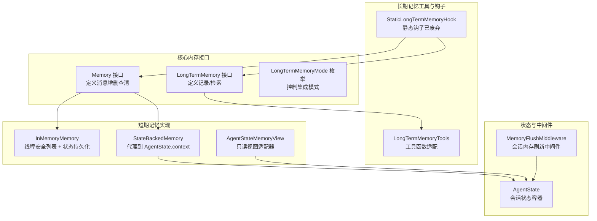
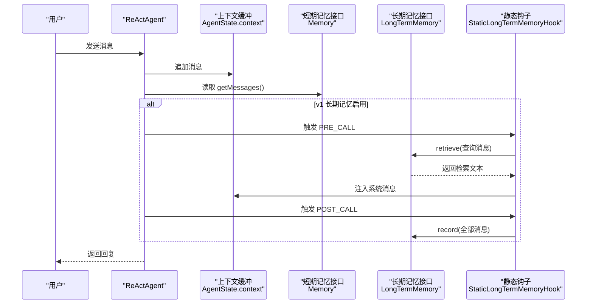
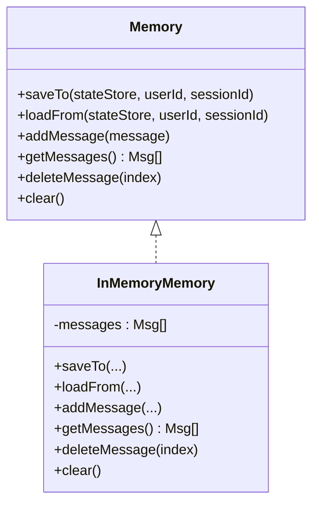
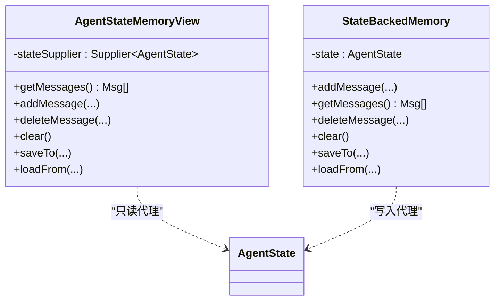
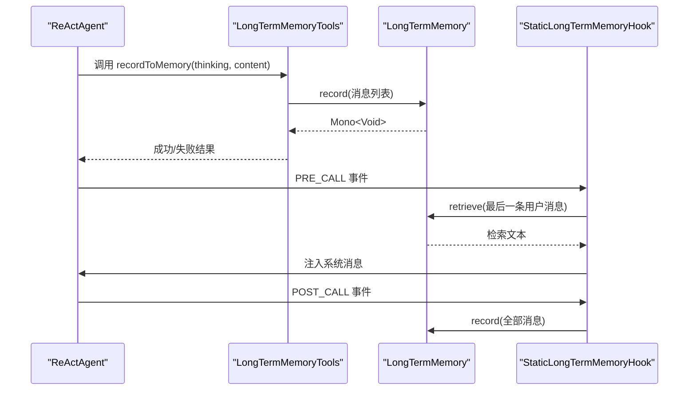
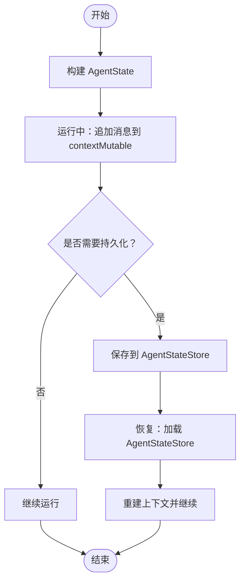
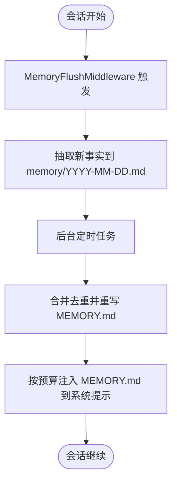
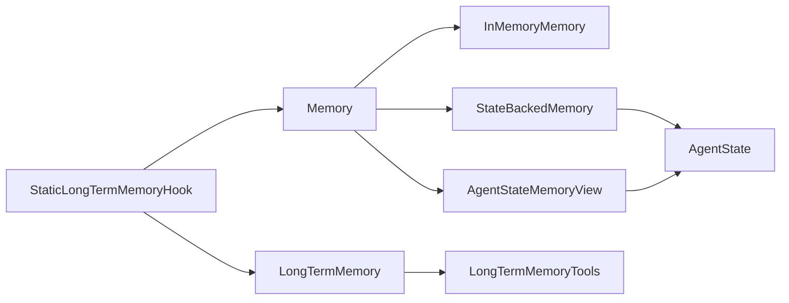

# 内存管理系统

<cite>
**本文引用的文件**
- [Memory.java](file://agentscope-core/src/main/java/io/agentscope/core/memory/Memory.java)
- [InMemoryMemory.java](file://agentscope-core/src/main/java/io/agentscope/core/memory/InMemoryMemory.java)
- [LongTermMemory.java](file://agentscope-core/src/main/java/io/agentscope/core/memory/LongTermMemory.java)
- [LongTermMemoryMode.java](file://agentscope-core/src/main/java/io/agentscope/core/memory/LongTermMemoryMode.java)
- [LongTermMemoryTools.java](file://agentscope-core/src/main/java/io/agentscope/core/memory/LongTermMemoryTools.java)
- [AgentStateMemoryView.java](file://agentscope-core/src/main/java/io/agentscope/core/memory/AgentStateMemoryView.java)
- [StateBackedMemory.java](file://agentscope-core/src/main/java/io/agentscope/core/memory/StateBackedMemory.java)
- [StaticLongTermMemoryHook.java](file://agentscope-core/src/main/java/io/agentscope/core/memory/StaticLongTermMemoryHook.java)
- [AgentState.java](file://agentscope-core/src/main/java/io/agentscope/core/state/AgentState.java)
- [memory.md（v2 中文）](file://docs/v2/zh/docs/harness/memory.md)
- [workspace.md（v2 中文）](file://docs/v2/zh/docs/harness/workspace.md)
- [memory.md（v1 中文）](file://docs/v1/zh/docs/task/memory.md)
- [MemoryFlushMiddleware.java](file://agentscope-harness/src/main/java/io/agentscope/harness/agent/middleware/MemoryFlushMiddleware.java)
</cite>

## 目录
1. [简介](#简介)
2. [项目结构](#项目结构)
3. [核心组件](#核心组件)
4. [架构总览](#架构总览)
5. [组件详解](#组件详解)
6. [依赖关系分析](#依赖关系分析)
7. [性能与并发特性](#性能与并发特性)
8. [故障排查指南](#故障排查指南)
9. [结论](#结论)
10. [附录](#附录)

## 简介
本文件面向 AgentScope 的内存管理子系统，系统性梳理了短期记忆与长期记忆的接口设计、实现方案与迁移路径。重点覆盖以下主题：
- Memory 接口与 InMemoryMemory 的快速访问机制
- 长期记忆抽象 LongTermMemory 的异步持久化策略
- AgentStateMemoryView 如何提供只读视图与访问控制
- 会话状态保存与恢复、生命周期管理、缓存策略与性能优化
- 并发访问的线程安全与异步记录的背压控制
- 使用示例与最佳实践（通过源码路径指引）

## 项目结构
内存管理相关代码主要位于 agentscope-core 的 memory 包与 state 包，并在 harness 的中间件中提供会话级内存刷新与节流能力。

图表来源
- [Memory.java:35-79](file://agentscope-core/src/main/java/io/agentscope/core/memory/Memory.java#L35-L79)
- [InMemoryMemory.java:37-135](file://agentscope-core/src/main/java/io/agentscope/core/memory/InMemoryMemory.java#L37-L135)
- [LongTermMemory.java:71-112](file://agentscope-core/src/main/java/io/agentscope/core/memory/LongTermMemory.java#L71-L112)
- [LongTermMemoryMode.java:54-71](file://agentscope-core/src/main/java/io/agentscope/core/memory/LongTermMemoryMode.java#L54-L71)
- [LongTermMemoryTools.java:67-216](file://agentscope-core/src/main/java/io/agentscope/core/memory/LongTermMemoryTools.java#L67-L216)
- [AgentStateMemoryView.java:43-87](file://agentscope-core/src/main/java/io/agentscope/core/memory/AgentStateMemoryView.java#L43-L87)
- [StateBackedMemory.java:36-80](file://agentscope-core/src/main/java/io/agentscope/core/memory/StateBackedMemory.java#L36-L80)
- [AgentState.java:59-188](file://agentscope-core/src/main/java/io/agentscope/core/state/AgentState.java#L59-L188)
- [MemoryFlushMiddleware.java](file://agentscope-harness/src/main/java/io/agentscope/harness/agent/middleware/MemoryFlushMiddleware.java)

章节来源
- [Memory.java:35-79](file://agentscope-core/src/main/java/io/agentscope/core/memory/Memory.java#L35-L79)
- [InMemoryMemory.java:37-135](file://agentscope-core/src/main/java/io/agentscope/core/memory/InMemoryMemory.java#L37-L135)
- [LongTermMemory.java:71-112](file://agentscope-core/src/main/java/io/agentscope/core/memory/LongTermMemory.java#L71-L112)
- [LongTermMemoryMode.java:54-71](file://agentscope-core/src/main/java/io/agentscope/core/memory/LongTermMemoryMode.java#L54-L71)
- [LongTermMemoryTools.java:67-216](file://agentscope-core/src/main/java/io/agentscope/core/memory/LongTermMemoryTools.java#L67-L216)
- [AgentStateMemoryView.java:43-87](file://agentscope-core/src/main/java/io/agentscope/core/memory/AgentStateMemoryView.java#L43-L87)
- [StateBackedMemory.java:36-80](file://agentscope-core/src/main/java/io/agentscope/core/memory/StateBackedMemory.java#L36-L80)
- [AgentState.java:59-188](file://agentscope-core/src/main/java/io/agentscope/core/state/AgentState.java#L59-L188)

## 核心组件
- Memory 接口：定义短期记忆的统一操作（新增、查询、删除、清空），并兼容旧版状态持久化（已标记为废弃）。
- InMemoryMemory：基于线程安全列表的短期记忆实现，支持状态序列化/反序列化，便于会话恢复。
- AgentStateMemoryView：只读适配器，将 getMessages 代理到 AgentState 的上下文，保证旧版工具链兼容。
- StateBackedMemory：兼容适配器，将所有读写委托给 AgentState.contextMutable，确保迁移期间行为一致。
- LongTermMemory 接口：定义长期记忆的异步记录与检索 API，返回 Reactor Mono 类型。
- LongTermMemoryMode：控制长期记忆的集成模式（自动、代理控制、两者皆有）。
- LongTermMemoryTools：将核心 API 适配为工具函数，供代理在 AGENT_CONTROL 模式下调用。
- StaticLongTermMemoryHook：框架钩子（已废弃），在 PRE_CALL 和 POST_CALL 阶段自动注入/记录长期记忆。
- AgentState：会话级运行时状态容器，包含上下文缓冲、摘要、权限/工具/任务等子状态。
- MemoryFlushMiddleware：会话级内存刷新中间件，负责将对话中的“新事实”抽取并写入工作区，支持节流与合并去重。

章节来源
- [Memory.java:35-79](file://agentscope-core/src/main/java/io/agentscope/core/memory/Memory.java#L35-L79)
- [InMemoryMemory.java:37-135](file://agentscope-core/src/main/java/io/agentscope/core/memory/InMemoryMemory.java#L37-L135)
- [AgentStateMemoryView.java:43-87](file://agentscope-core/src/main/java/io/agentscope/core/memory/AgentStateMemoryView.java#L43-L87)
- [StateBackedMemory.java:36-80](file://agentscope-core/src/main/java/io/agentscope/core/memory/StateBackedMemory.java#L36-L80)
- [LongTermMemory.java:71-112](file://agentscope-core/src/main/java/io/agentscope/core/memory/LongTermMemory.java#L71-L112)
- [LongTermMemoryMode.java:54-71](file://agentscope-core/src/main/java/io/agentscope/core/memory/LongTermMemoryMode.java#L54-L71)
- [LongTermMemoryTools.java:67-216](file://agentscope-core/src/main/java/io/agentscope/core/memory/LongTermMemoryTools.java#L67-L216)
- [StaticLongTermMemoryHook.java:78-301](file://agentscope-core/src/main/java/io/agentscope/core/memory/StaticLongTermMemoryHook.java#L78-L301)
- [AgentState.java:59-188](file://agentscope-core/src/main/java/io/agentscope/core/state/AgentState.java#L59-L188)
- [MemoryFlushMiddleware.java](file://agentscope-harness/src/main/java/io/agentscope/harness/agent/middleware/MemoryFlushMiddleware.java)

## 架构总览
AgentScope 的内存体系经历了从 v1 到 v2 的重大演进：
- v1：短期记忆（Memory）+ 长期记忆（LongTermMemory）双轨并行，长期记忆通过钩子或工具参与自动/手动管理。
- v2：长期记忆移除，短期记忆统一由 AgentState.context 管理；会话状态通过 AgentStateStore 持久化；Harness 提供 MemoryFlushMiddleware 实现“长期记忆”的替代功能（工作区 MEMORY.md 与按日流水账）。

图表来源
- [StaticLongTermMemoryHook.java:124-262](file://agentscope-core/src/main/java/io/agentscope/core/memory/StaticLongTermMemoryHook.java#L124-L262)
- [LongTermMemory.java:91-110](file://agentscope-core/src/main/java/io/agentscope/core/memory/LongTermMemory.java#L91-L110)
- [AgentState.java:179-188](file://agentscope-core/src/main/java/io/agentscope/core/state/AgentState.java#L179-L188)

## 组件详解

### Memory 接口与 InMemoryMemory
- 设计理念
  - 统一短期记忆操作：新增、查询、删除指定索引、清空。
  - 兼容旧版状态持久化：提供 saveTo/loadFrom，用于将消息缓冲保存到 AgentStateStore（v1 会话）。
  - 已废弃：自 2.0 起，对话上下文迁移到 AgentState，该接口保留仅为兼容性镜像。
- InMemoryMemory 实现要点
  - 使用线程安全列表存储消息，支持并发读取与安全删除。
  - saveTo/loadFrom 将消息列表序列化/反序列化，键名采用固定前缀，便于会话恢复。
  - getMessages 过滤空条目并返回新列表副本，避免外部修改影响内部状态。

图表来源
- [Memory.java:35-79](file://agentscope-core/src/main/java/io/agentscope/core/memory/Memory.java#L35-L79)
- [InMemoryMemory.java:37-135](file://agentscope-core/src/main/java/io/agentscope/core/memory/InMemoryMemory.java#L37-L135)

章节来源
- [Memory.java:35-79](file://agentscope-core/src/main/java/io/agentscope/core/memory/Memory.java#L35-L79)
- [InMemoryMemory.java:37-135](file://agentscope-core/src/main/java/io/agentscope/core/memory/InMemoryMemory.java#L37-L135)

### AgentStateMemoryView 与 StateBackedMemory
- AgentStateMemoryView
  - 作用：只读适配器，将 getMessages 代理到 AgentState.getContext()，在调用时解析 Supplier。
  - 行为：所有写操作均抛出只读异常；saveTo 为空操作；用于兼容旧版工具链。
- StateBackedMemory
  - 作用：将所有读写委托给 AgentState.contextMutable，确保迁移期间行为一致。
  - 适用：当仍需通过 agent.getMemory() 访问上下文的历史代码。

图表来源
- [AgentStateMemoryView.java:43-87](file://agentscope-core/src/main/java/io/agentscope/core/memory/AgentStateMemoryView.java#L43-L87)
- [StateBackedMemory.java:36-80](file://agentscope-core/src/main/java/io/agentscope/core/memory/StateBackedMemory.java#L36-L80)
- [AgentState.java:179-188](file://agentscope-core/src/main/java/io/agentscope/core/state/AgentState.java#L179-L188)

章节来源
- [AgentStateMemoryView.java:43-87](file://agentscope-core/src/main/java/io/agentscope/core/memory/AgentStateMemoryView.java#L43-L87)
- [StateBackedMemory.java:36-80](file://agentscope-core/src/main/java/io/agentscope/core/memory/StateBackedMemory.java#L36-L80)
- [AgentState.java:179-188](file://agentscope-core/src/main/java/io/agentscope/core/state/AgentState.java#L179-L188)

### 长期记忆：接口、模式与工具
- LongTermMemory 接口
  - record(List<Msg>)：异步记录消息，抽取“重要信息”持久化。
  - retrieve(Msg)：根据输入消息检索相关记忆，返回文本供注入上下文。
- LongTermMemoryMode
  - AGENT_CONTROL：代理通过工具自行决定何时记录/检索。
  - STATIC_CONTROL：框架自动在推理前后注入/记录。
  - BOTH：组合模式，兼顾自动化与代理控制。
- LongTermMemoryTools
  - 将 record/retrieve 适配为工具方法，参数更贴近代理调用习惯。
- StaticLongTermMemoryHook（已废弃）
  - 在 PRE_CALL 注入检索到的记忆，在 POST_CALL 异步记录对话。
  - 支持同步/异步记录，异步路径使用受限弹性调度器，避免无界排队。

图表来源
- [LongTermMemoryTools.java:103-152](file://agentscope-core/src/main/java/io/agentscope/core/memory/LongTermMemoryTools.java#L103-L152)
- [LongTermMemory.java:91-110](file://agentscope-core/src/main/java/io/agentscope/core/memory/LongTermMemory.java#L91-L110)
- [StaticLongTermMemoryHook.java:154-262](file://agentscope-core/src/main/java/io/agentscope/core/memory/StaticLongTermMemoryHook.java#L154-L262)

章节来源
- [LongTermMemory.java:71-112](file://agentscope-core/src/main/java/io/agentscope/core/memory/LongTermMemory.java#L71-L112)
- [LongTermMemoryMode.java:54-71](file://agentscope-core/src/main/java/io/agentscope/core/memory/LongTermMemoryMode.java#L54-L71)
- [LongTermMemoryTools.java:67-216](file://agentscope-core/src/main/java/io/agentscope/core/memory/LongTermMemoryTools.java#L67-L216)
- [StaticLongTermMemoryHook.java:78-301](file://agentscope-core/src/main/java/io/agentscope/core/memory/StaticLongTermMemoryHook.java#L78-L301)

### 会话状态保存与恢复、生命周期管理
- 保存与恢复
  - v1：Memory.saveTo/loadFrom 将消息列表保存到 AgentStateStore，键名含前缀，便于增量存储。
  - v2：会话状态整体保存于 AgentState，配合 AgentStateStore 进行序列化/反序列化。
- 生命周期
  - 创建：AgentState.Builder 构建，初始化上下文、摘要、迭代计数等。
  - 运行：每次调用追加消息至 contextMutable，必要时更新摘要。
  - 结束：根据配置持久化 AgentState，支持中断信号与优雅关闭。
- 会话恢复
  - 通过 AgentStateStore 加载对应 userId/sessionId 的状态，重建 AgentState 并恢复上下文。

图表来源
- [AgentState.java:81-103](file://agentscope-core/src/main/java/io/agentscope/core/state/AgentState.java#L81-L103)
- [AgentState.java:279-288](file://agentscope-core/src/main/java/io/agentscope/core/state/AgentState.java#L279-L288)
- [InMemoryMemory.java:62-81](file://agentscope-core/src/main/java/io/agentscope/core/memory/InMemoryMemory.java#L62-L81)

章节来源
- [AgentState.java:59-188](file://agentscope-core/src/main/java/io/agentscope/core/state/AgentState.java#L59-L188)
- [InMemoryMemory.java:62-81](file://agentscope-core/src/main/java/io/agentscope/core/memory/InMemoryMemory.java#L62-L81)

### 内存刷新中间件与工作区沉淀
- MemoryFlushMiddleware
  - 功能：在会话中将对话前缀中的“新事实”抽取并写入工作区文件（按日流水账），后台定时合并去重，生成 MEMORY.md 并注入系统提示。
  - 节流：支持按触发器节流（如每 N 分钟一次），减少 Token 消耗。
  - 配置：可通过 MemoryConfig 控制 flush 触发策略与提示词扩展。
- 工作区结构
  - MEMORY.md：策划后的长期记忆摘要，按预算注入系统提示。
  - memory/：按日期追加的事实流水账，后续合并去重。

图表来源
- [MemoryFlushMiddleware.java](file://agentscope-harness/src/main/java/io/agentscope/harness/agent/middleware/MemoryFlushMiddleware.java)
- [workspace.md（v2 中文）:300-320](file://docs/v2/zh/docs/harness/workspace.md#L300-L320)
- [memory.md（v2 中文）:110-151](file://docs/v2/zh/docs/harness/memory.md#L110-L151)

章节来源
- [workspace.md（v2 中文）:300-320](file://docs/v2/zh/docs/harness/workspace.md#L300-L320)
- [memory.md（v2 中文）:110-151](file://docs/v2/zh/docs/harness/memory.md#L110-L151)

## 依赖关系分析
- 组件耦合
  - Memory 与 InMemoryMemory：实现关系，前者定义契约，后者提供线程安全实现。
  - StateBackedMemory 与 AgentStateMemoryView：均代理到 AgentState，前者写入，后者只读。
  - LongTermMemory 与 LongTermMemoryTools：前者定义 API，后者适配为工具。
  - StaticLongTermMemoryHook：依赖 LongTermMemory 与 Memory，负责事件驱动的自动管理（已废弃）。
- 外部依赖
  - Reactor Mono：长期记忆 API 返回类型，支持非阻塞集成。
  - AgentStateStore：状态持久化抽象，v1 用于 Memory 的 saveTo/loadFrom，v2 用于 AgentState 的序列化/反序列化。

图表来源
- [Memory.java:35-79](file://agentscope-core/src/main/java/io/agentscope/core/memory/Memory.java#L35-L79)
- [InMemoryMemory.java:37-135](file://agentscope-core/src/main/java/io/agentscope/core/memory/InMemoryMemory.java#L37-L135)
- [StateBackedMemory.java:36-80](file://agentscope-core/src/main/java/io/agentscope/core/memory/StateBackedMemory.java#L36-L80)
- [AgentStateMemoryView.java:43-87](file://agentscope-core/src/main/java/io/agentscope/core/memory/AgentStateMemoryView.java#L43-L87)
- [LongTermMemory.java:71-112](file://agentscope-core/src/main/java/io/agentscope/core/memory/LongTermMemory.java#L71-L112)
- [LongTermMemoryTools.java:67-216](file://agentscope-core/src/main/java/io/agentscope/core/memory/LongTermMemoryTools.java#L67-L216)
- [StaticLongTermMemoryHook.java:78-301](file://agentscope-core/src/main/java/io/agentscope/core/memory/StaticLongTermMemoryHook.java#L78-L301)
- [AgentState.java:59-188](file://agentscope-core/src/main/java/io/agentscope/core/state/AgentState.java#L59-L188)

章节来源
- [Memory.java:35-79](file://agentscope-core/src/main/java/io/agentscope/core/memory/Memory.java#L35-L79)
- [LongTermMemory.java:71-112](file://agentscope-core/src/main/java/io/agentscope/core/memory/LongTermMemory.java#L71-L112)
- [StaticLongTermMemoryHook.java:78-301](file://agentscope-core/src/main/java/io/agentscope/core/memory/StaticLongTermMemoryHook.java#L78-L301)

## 性能与并发特性
- 线程安全
  - InMemoryMemory 使用线程安全列表，读取时过滤空项并返回新副本，避免外部修改。
  - StateBackedMemory 委托给 AgentState.contextMutable，遵循 AgentState 的并发模型。
- 异步与背压
  - 长期记忆记录采用 Reactor Mono，支持非阻塞集成。
  - StaticLongTermMemoryHook 的异步记录使用受限弹性调度器（最多 1 个工作者，队列容量 3），饱和时丢弃并记录告警，避免无界积压。
- 缓存与节流
  - MemoryFlushMiddleware 支持按时间节流，降低频繁 flush 的 Token 开销。
  - 后台合并去重减少重复信息注入，提升上下文质量。

章节来源
- [InMemoryMemory.java:92-133](file://agentscope-core/src/main/java/io/agentscope/core/memory/InMemoryMemory.java#L92-L133)
- [StateBackedMemory.java:44-65](file://agentscope-core/src/main/java/io/agentscope/core/memory/StateBackedMemory.java#L44-L65)
- [StaticLongTermMemoryHook.java:85-86](file://agentscope-core/src/main/java/io/agentscope/core/memory/StaticLongTermMemoryHook.java#L85-L86)
- [StaticLongTermMemoryHook.java:229-261](file://agentscope-core/src/main/java/io/agentscope/core/memory/StaticLongTermMemoryHook.java#L229-L261)
- [memory.md（v2 中文）:110-151](file://docs/v2/zh/docs/harness/memory.md#L110-L151)

## 故障排查指南
- 旧版工具报只读错误
  - 症状：调用 addMessage/deleteMessage/clear/saveTo/loadFrom 抛出只读异常。
  - 原因：AgentStateMemoryView 为只读适配器；应改用 AgentState.contextMutable 或直接读取 AgentState.getContext()。
  - 解决：替换为写入 AgentState.contextMutable 的方式。
- 长期记忆钩子不再生效
  - 症状：PRE_CALL/POST_CALL 不再自动注入/记录。
  - 原因：StaticLongTermMemoryHook 已废弃；v2 中长期记忆移除。
  - 解决：使用 MemoryFlushMiddleware 替代，将事实沉淀到工作区。
- 异步记录被丢弃
  - 症状：日志出现“异步记录失败”告警。
  - 原因：受限调度器饱和，新任务被丢弃。
  - 解决：调整触发频率或降级为同步记录（不推荐），或优化后台合并任务。

章节来源
- [AgentStateMemoryView.java:58-85](file://agentscope-core/src/main/java/io/agentscope/core/memory/AgentStateMemoryView.java#L58-L85)
- [StaticLongTermMemoryHook.java:232-248](file://agentscope-core/src/main/java/io/agentscope/core/memory/StaticLongTermMemoryHook.java#L232-L248)
- [memory.md（v2 中文）:110-151](file://docs/v2/zh/docs/harness/memory.md#L110-L151)

## 结论
- v1 的 Memory/LongTermMemory 与钩子提供了灵活的短期与长期记忆管理；v2 将短期记忆统一到 AgentState，长期记忆移除，通过 MemoryFlushMiddleware 与工作区实现“长期记忆”的替代能力。
- InMemoryMemory 与 StateBackedMemory/AgentStateMemoryView 保障了迁移期间的行为一致性与兼容性。
- 异步记录与节流策略有效平衡性能与成本，建议在长会话场景中合理配置 flush 触发策略。

## 附录
- 使用示例（通过源码路径）
  - v1 短期记忆 InMemoryMemory 示例：[memory.md（v1 中文）:62-81](file://docs/v1/zh/docs/task/memory.md#L62-L81)
  - v1 长期记忆 Mem0/ReMe/百炼 示例：[memory.md（v1 中文）:214-314](file://docs/v1/zh/docs/task/memory.md#L214-L314)
  - v2 内存刷新与节流示例：[memory.md（v2 中文）:110-151](file://docs/v2/zh/docs/harness/memory.md#L110-L151)
- 关键实现参考
  - Memory 接口与 InMemoryMemory：[Memory.java:35-79](file://agentscope-core/src/main/java/io/agentscope/core/memory/Memory.java#L35-L79)，[InMemoryMemory.java:37-135](file://agentscope-core/src/main/java/io/agentscope/core/memory/InMemoryMemory.java#L37-L135)
  - AgentState 上下文与只读/可变句柄：[AgentState.java:179-188](file://agentscope-core/src/main/java/io/agentscope/core/state/AgentState.java#L179-188)
  - 长期记忆工具与钩子（已废弃）：[LongTermMemoryTools.java:67-216](file://agentscope-core/src/main/java/io/agentscope/core/memory/LongTermMemoryTools.java#L67-216)，[StaticLongTermMemoryHook.java:78-301](file://agentscope-core/src/main/java/io/agentscope/core/memory/StaticLongTermMemoryHook.java#L78-301)
  - 会话内存刷新中间件：[MemoryFlushMiddleware.java](file://agentscope-harness/src/main/java/io/agentscope/harness/agent/middleware/MemoryFlushMiddleware.java)