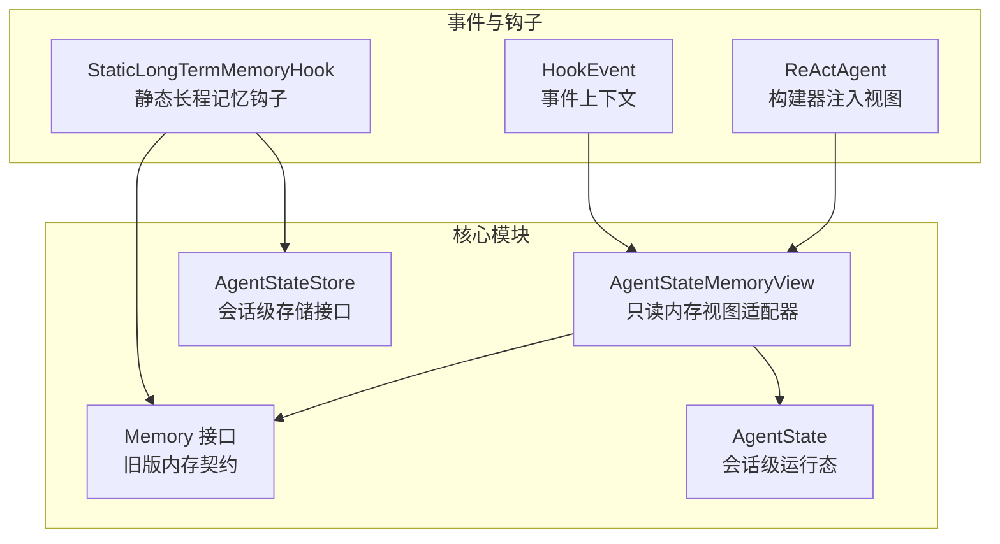
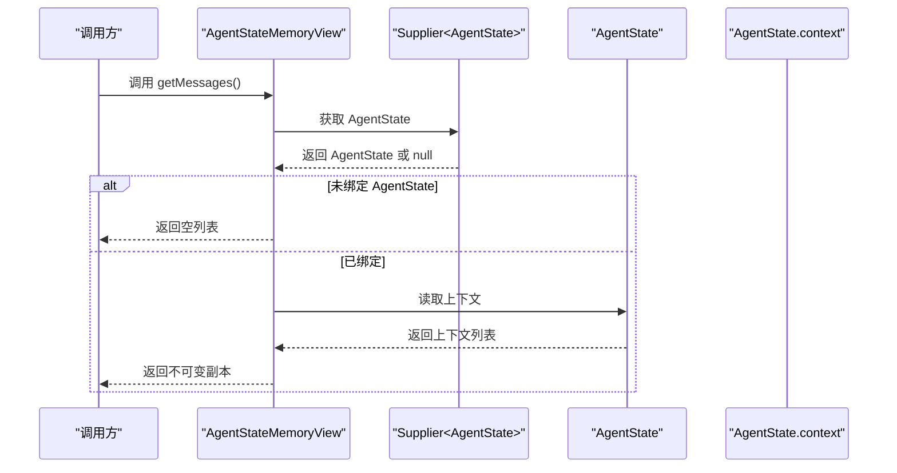
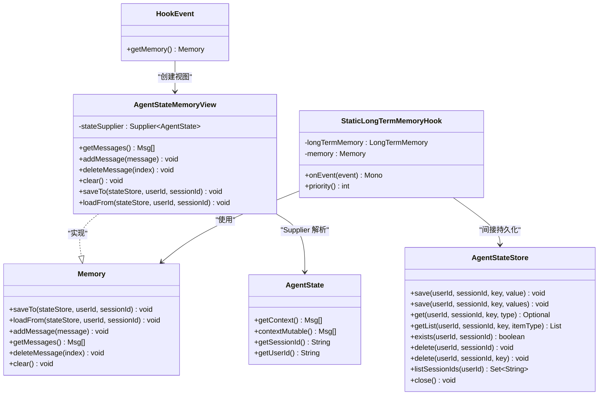
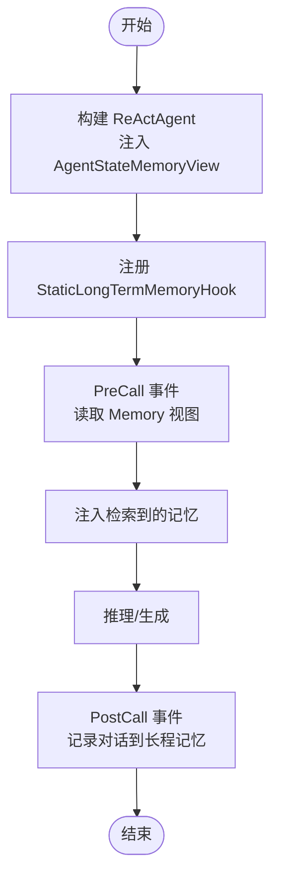

# 内存视图访问

<cite>
**本文引用的文件**
- [AgentStateMemoryView.java](file://agentscope-core/src/main/java/io/agentscope/core/memory/AgentStateMemoryView.java)
- [Memory.java](file://agentscope-core/src/main/java/io/agentscope/core/memory/Memory.java)
- [AgentState.java](file://agentscope-core/src/main/java/io/agentscope/core/state/AgentState.java)
- [AgentStateStore.java](file://agentscope-core/src/main/java/io/agentscope/core/state/AgentStateStore.java)
- [StaticLongTermMemoryHook.java](file://agentscope-core/src/main/java/io/agentscope/core/memory/StaticLongTermMemoryHook.java)
- [HookEvent.java](file://agentscope-core/src/main/java/io/agentscope/core/hook/HookEvent.java)
- [ReActAgent.java](file://agentscope-core/src/main/java/io/agentscope/core/ReActAgent.java)
- [SessionInfo.java](file://agentscope-core/src/main/java/io/agentscope/core/state/SessionInfo.java)
</cite>

## 目录
1. [引言](#引言)
2. [项目结构](#项目结构)
3. [核心组件](#核心组件)
4. [架构总览](#架构总览)
5. [组件详解](#组件详解)
6. [依赖关系分析](#依赖关系分析)
7. [性能考量](#性能考量)
8. [故障排查指南](#故障排查指南)
9. [结论](#结论)
10. [附录](#附录)

## 引言
本文件围绕 AgentStateMemoryView 的设计与实现进行系统化说明，重点阐述其在 AgentState 系统中的定位、只读访问策略、与会话/用户的多租户隔离机制，以及如何通过视图模式实现“快照式”上下文读取与兼容旧版框架的持久化接口。同时给出配置访问权限、实现多租户隔离、以及记录与审计内存访问的实践建议。

## 项目结构
AgentStateMemoryView 位于 agentscope-core 模块的 memory 包中，作为对旧版 Memory 接口的兼容适配器存在；其运行时行为由 AgentState 提供的上下文列表支撑，并通过 AgentStateStore 实现持久化能力（尽管视图本身不直接写入）。

图表来源
- [AgentStateMemoryView.java:43-86](file://agentscope-core/src/main/java/io/agentscope/core/memory/AgentStateMemoryView.java#L43-L86)
- [Memory.java:35-78](file://agentscope-core/src/main/java/io/agentscope/core/memory/Memory.java#L35-L78)
- [AgentState.java:59-423](file://agentscope-core/src/main/java/io/agentscope/core/state/AgentState.java#L59-L423)
- [AgentStateStore.java:61-166](file://agentscope-core/src/main/java/io/agentscope/core/state/AgentStateStore.java#L61-L166)
- [StaticLongTermMemoryHook.java:78-300](file://agentscope-core/src/main/java/io/agentscope/core/memory/StaticLongTermMemoryHook.java#L78-L300)
- [HookEvent.java:130-144](file://agentscope-core/src/main/java/io/agentscope/core/hook/HookEvent.java#L130-L144)
- [ReActAgent.java:4284-4303](file://agentscope-core/src/main/java/io/agentscope/core/ReActAgent.java#L4284-L4303)

章节来源
- [AgentStateMemoryView.java:1-87](file://agentscope-core/src/main/java/io/agentscope/core/memory/AgentStateMemoryView.java#L1-L87)
- [Memory.java:1-79](file://agentscope-core/src/main/java/io/agentscope/core/memory/Memory.java#L1-L79)
- [AgentState.java:1-424](file://agentscope-core/src/main/java/io/agentscope/core/state/AgentState.java#L1-L424)
- [AgentStateStore.java:1-167](file://agentscope-core/src/main/java/io/agentscope/core/state/AgentStateStore.java#L1-L167)
- [StaticLongTermMemoryHook.java:1-301](file://agentscope-core/src/main/java/io/agentscope/core/memory/StaticLongTermMemoryHook.java#L1-L301)
- [HookEvent.java:130-212](file://agentscope-core/src/main/java/io/agentscope/core/hook/HookEvent.java#L130-L212)
- [ReActAgent.java:4260-4459](file://agentscope-core/src/main/java/io/agentscope/core/ReActAgent.java#L4260-L4459)

## 核心组件
- AgentStateMemoryView：只读内存视图适配器，将调用转发至当前时刻的 AgentState 上下文，提供与旧版 Memory 兼容的只读接口。
- Memory 接口：定义了旧版内存操作契约（新增、读取、删除、清空、保存/加载），用于兼容历史工具与钩子。
- AgentState：单会话运行态载体，包含上下文列表、摘要、回复标识、迭代计数、中断控制、权限/工具/任务/计划模式上下文等。
- AgentStateStore：会话级持久化接口，以 (userId, sessionId) 为键空间，支持保存/加载/删除/列举会话。
- StaticLongTermMemoryHook：旧版静态长程记忆钩子，通过 Memory 视图在推理前注入检索到的记忆，在推理后记录对话。
- HookEvent：事件上下文，提供便捷方法获取只读内存视图。
- ReActAgent：在构建阶段注入 AgentStateMemoryView，以支持旧版静态长程记忆钩子。

章节来源
- [AgentStateMemoryView.java:43-86](file://agentscope-core/src/main/java/io/agentscope/core/memory/AgentStateMemoryView.java#L43-L86)
- [Memory.java:35-78](file://agentscope-core/src/main/java/io/agentscope/core/memory/Memory.java#L35-L78)
- [AgentState.java:59-423](file://agentscope-core/src/main/java/io/agentscope/core/state/AgentState.java#L59-L423)
- [AgentStateStore.java:61-166](file://agentscope-core/src/main/java/io/agentscope/core/state/AgentStateStore.java#L61-L166)
- [StaticLongTermMemoryHook.java:78-300](file://agentscope-core/src/main/java/io/agentscope/core/memory/StaticLongTermMemoryHook.java#L78-L300)
- [HookEvent.java:130-144](file://agentscope-core/src/main/java/io/agentscope/core/hook/HookEvent.java#L130-L144)
- [ReActAgent.java:4284-4303](file://agentscope-core/src/main/java/io/agentscope/core/ReActAgent.java#L4284-L4303)

## 架构总览
AgentStateMemoryView 的职责是为旧版框架提供只读内存访问，同时确保新代码直接从 AgentState 获取上下文。其关键交互如下：

图表来源
- [AgentStateMemoryView.java:52-55](file://agentscope-core/src/main/java/io/agentscope/core/memory/AgentStateMemoryView.java#L52-L55)
- [AgentState.java:179-188](file://agentscope-core/src/main/java/io/agentscope/core/state/AgentState.java#L179-L188)

章节来源
- [AgentStateMemoryView.java:43-86](file://agentscope-core/src/main/java/io/agentscope/core/memory/AgentStateMemoryView.java#L43-L86)
- [AgentState.java:179-188](file://agentscope-core/src/main/java/io/agentscope/core/state/AgentState.java#L179-L188)

## 组件详解

### 设计目的与访问控制机制
- 设计目的
  - 兼容性：为旧版 1.x 钩子与工具（如 StaticLongTermMemoryHook）提供只读内存访问，避免直接依赖已移除的 Memory 组件。
  - 安全性：禁止通过视图进行任何修改操作，所有变更必须经由 AgentState.contextMutable() 进行。
- 访问控制
  - 只读策略：addMessage/deleteMessage/clear/saveTo/loadFrom 均抛出 UnsupportedOperationException，明确提示应直接修改 AgentState.context。
  - 延迟解析：通过 Supplier<AgentState> 在调用时解析当前 AgentState，允许在代理实例尚未完全构造时提前持有视图。
  - 空值处理：当 Supplier 返回 null 时，视为“代理尚未绑定”，返回空消息列表而非异常，提升健壮性。

章节来源
- [AgentStateMemoryView.java:25-42](file://agentscope-core/src/main/java/io/agentscope/core/memory/AgentStateMemoryView.java#L25-L42)
- [AgentStateMemoryView.java:52-85](file://agentscope-core/src/main/java/io/agentscope/core/memory/AgentStateMemoryView.java#L52-L85)

### 视图模式下的内存读取策略
- 读取路径
  - getMessages() 在每次调用时从 Supplier 获取 AgentState，若为空则返回空列表；否则返回 AgentState.context 的不可变副本，保证外部无法修改内部状态。
- 数据隔离机制
  - 不可变副本：返回的是基于当前上下文的新列表副本，且标记为不可变，防止调用方误改。
  - 会话边界：Supplier 通常绑定到具体 ReActAgent 实例，不同会话对应不同 AgentState，天然隔离。
  - 多租户：当 userId 为 null 时代表匿名/单租户上下文；当 userId 非空时，配合 AgentStateStore 的键空间实现用户级隔离。

章节来源
- [AgentStateMemoryView.java:52-55](file://agentscope-core/src/main/java/io/agentscope/core/memory/AgentStateMemoryView.java#L52-L55)
- [AgentState.java:179-188](file://agentscope-core/src/main/java/io/agentscope/core/state/AgentState.java#L179-L188)
- [AgentStateStore.java:30-41](file://agentscope-core/src/main/java/io/agentscope/core/state/AgentStateStore.java#L30-L41)

### 与 AgentState 系统的集成
- 直接读取：新代码应直接从 AgentState.getContext() 获取只读上下文，或从 contextMutable() 获取可变句柄进行就地修改。
- 事件接入：HookEvent 提供 getMemory() 方法，返回针对当前 ReActAgent 的只读内存视图，便于钩子链按需读取上下文。
- 构建期注入：ReActAgent.Builder 在配置长程记忆时，通过原子引用共享的自引用，延迟解析 AgentState 并创建 AgentStateMemoryView，从而兼容旧版静态控制模式。

章节来源
- [AgentState.java:179-188](file://agentscope-core/src/main/java/io/agentscope/core/state/AgentState.java#L179-L188)
- [HookEvent.java:130-144](file://agentscope-core/src/main/java/io/agentscope/core/hook/HookEvent.java#L130-L144)
- [ReActAgent.java:4284-4303](file://agentscope-core/src/main/java/io/agentscope/core/ReActAgent.java#L4284-L4303)

### 快照与回滚能力
- 快照读取
  - 由于 AgentStateMemoryView 每次调用都会从 Supplier 获取最新 AgentState 并返回不可变副本，因此可将其理解为“按调用点的上下文快照”。
- 回滚实现
  - 回滚需通过 AgentStateStore 与 AgentState 的序列化/反序列化能力完成，视图本身不提供回滚接口；回滚流程通常涉及：
    - 将当前 AgentState 序列化并保存为备份；
    - 在需要时从 AgentStateStore 加载指定版本；
    - 替换运行中的 AgentState 或重建代理实例。
- 与旧版持久化接口的关系
  - 旧版 Memory.saveTo/loadFrom 仅用于兼容历史场景；新代码应直接使用 AgentStateStore 对 (userId, sessionId) 键空间进行保存/加载。

章节来源
- [AgentStateMemoryView.java:73-75](file://agentscope-core/src/main/java/io/agentscope/core/memory/AgentStateMemoryView.java#L73-L75)
- [Memory.java:35-45](file://agentscope-core/src/main/java/io/agentscope/core/memory/Memory.java#L35-L45)
- [AgentStateStore.java:61-166](file://agentscope-core/src/main/java/io/agentscope/core/state/AgentStateStore.java#L61-L166)

### 多租户环境下的内存隔离
- 用户维度隔离
  - 当 userId 为 null 时，表示匿名/单租户上下文；当 userId 非空时，AgentStateStore 以 (userId, sessionId) 为键空间，确保不同用户的数据相互隔离。
- 会话维度隔离
  - sessionId 作为会话标识符，确保同一用户的不同会话拥有独立上下文与状态。
- 会话信息统计
  - SessionInfo 提供会话大小、最后修改时间与组件数量等元数据，可用于运维与审计。

章节来源
- [AgentStateStore.java:30-41](file://agentscope-core/src/main/java/io/agentscope/core/state/AgentStateStore.java#L30-L41)
- [SessionInfo.java:25-93](file://agentscope-core/src/main/java/io/agentscope/core/state/SessionInfo.java#L25-L93)

### 配置访问权限与审计日志
- 权限与访问控制
  - 通过只读视图与不可变副本，确保外部组件无法绕过 AgentState 直接修改上下文。
  - 若需在工具/中间件中进行上下文变更，应通过 AgentState.contextMutable() 获取可变句柄并执行就地修改。
- 审计与监控
  - 建议在调用 getMessages() 前后记录访问日志（如用户ID、会话ID、调用时间、消息条数），以便审计与问题追踪。
  - 对于旧版钩子的自动记录/检索行为，可在 StaticLongTermMemoryHook 中增加细粒度日志，记录检索命中、记录耗时与错误情况。

章节来源
- [AgentStateMemoryView.java:52-55](file://agentscope-core/src/main/java/io/agentscope/core/memory/AgentStateMemoryView.java#L52-L55)
- [StaticLongTermMemoryHook.java:154-199](file://agentscope-core/src/main/java/io/agentscope/core/memory/StaticLongTermMemoryHook.java#L154-L199)
- [StaticLongTermMemoryHook.java:221-262](file://agentscope-core/src/main/java/io/agentscope/core/memory/StaticLongTermMemoryHook.java#L221-L262)

## 依赖关系分析
AgentStateMemoryView 与核心组件之间的依赖关系如下：

图表来源
- [AgentStateMemoryView.java:43-86](file://agentscope-core/src/main/java/io/agentscope/core/memory/AgentStateMemoryView.java#L43-L86)
- [Memory.java:35-78](file://agentscope-core/src/main/java/io/agentscope/core/memory/Memory.java#L35-L78)
- [AgentState.java:59-423](file://agentscope-core/src/main/java/io/agentscope/core/state/AgentState.java#L59-L423)
- [AgentStateStore.java:61-166](file://agentscope-core/src/main/java/io/agentscope/core/state/AgentStateStore.java#L61-L166)
- [StaticLongTermMemoryHook.java:78-300](file://agentscope-core/src/main/java/io/agentscope/core/memory/StaticLongTermMemoryHook.java#L78-L300)
- [HookEvent.java:130-144](file://agentscope-core/src/main/java/io/agentscope/core/hook/HookEvent.java#L130-L144)

章节来源
- [AgentStateMemoryView.java:43-86](file://agentscope-core/src/main/java/io/agentscope/core/memory/AgentStateMemoryView.java#L43-L86)
- [Memory.java:35-78](file://agentscope-core/src/main/java/io/agentscope/core/memory/Memory.java#L35-L78)
- [AgentState.java:59-423](file://agentscope-core/src/main/java/io/agentscope/core/state/AgentState.java#L59-L423)
- [AgentStateStore.java:61-166](file://agentscope-core/src/main/java/io/agentscope/core/state/AgentStateStore.java#L61-L166)
- [StaticLongTermMemoryHook.java:78-300](file://agentscope-core/src/main/java/io/agentscope/core/memory/StaticLongTermMemoryHook.java#L78-L300)
- [HookEvent.java:130-144](file://agentscope-core/src/main/java/io/agentscope/core/hook/HookEvent.java#L130-L144)

## 性能考量
- 读取开销
  - 每次 getMessages() 都会创建不可变副本，适合频繁读取但小规模上下文；对于超大上下文，建议限制读取范围或分页。
- 延迟解析
  - Supplier 在调用时解析 AgentState，避免在代理构建早期即强绑定，降低初始化耦合。
- 异步记录
  - 旧版钩子支持异步记录长程记忆，使用有界调度器避免积压；新代码建议直接在业务层控制异步策略。

[本节为通用指导，无需列出章节来源]

## 故障排查指南
- 现象：调用 addMessage/deleteMessage/clear/saveTo/loadFrom 抛出异常
  - 原因：AgentStateMemoryView 是只读视图，不允许修改。
  - 处理：改为通过 AgentState.contextMutable() 修改上下文。
- 现象：getMessages() 返回空列表
  - 原因：Supplier 返回 null，表示代理尚未绑定。
  - 处理：确保在代理实例构建完成后才使用视图；或在调用侧做好空值保护。
- 现象：旧版钩子无法检索/记录长程记忆
  - 原因：StaticLongTermMemoryHook 依赖 Memory 视图与 LongTermMemory 后端。
  - 处理：确认钩子已正确注入，且 LongTermMemory 后端可用；关注异步记录的饱和与丢弃情况。

章节来源
- [AgentStateMemoryView.java:58-85](file://agentscope-core/src/main/java/io/agentscope/core/memory/AgentStateMemoryView.java#L58-L85)
- [StaticLongTermMemoryHook.java:221-262](file://agentscope-core/src/main/java/io/agentscope/core/memory/StaticLongTermMemoryHook.java#L221-L262)

## 结论
AgentStateMemoryView 以最小侵入的方式为旧版框架提供只读内存访问，既保障了向后兼容，又通过不可变副本与只读约束强化了数据安全与一致性。结合 AgentState 的会话/用户隔离与 AgentStateStore 的键空间模型，可在多租户环境下实现清晰的内存隔离。对于新开发，建议直接使用 AgentState 的上下文接口；对于迁移与兼容，可通过视图桥接旧版工具与钩子。

[本节为总结性内容，无需列出章节来源]

## 附录

### 使用流程示意（概念）

[本图为概念流程图，不直接映射具体源码文件，故不添加图表来源]