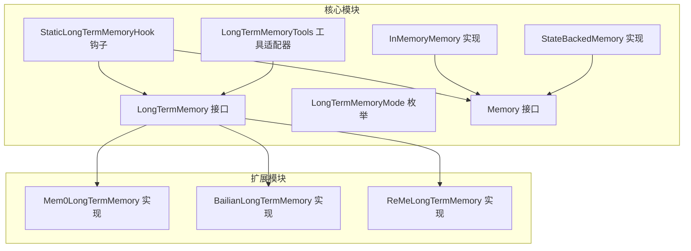
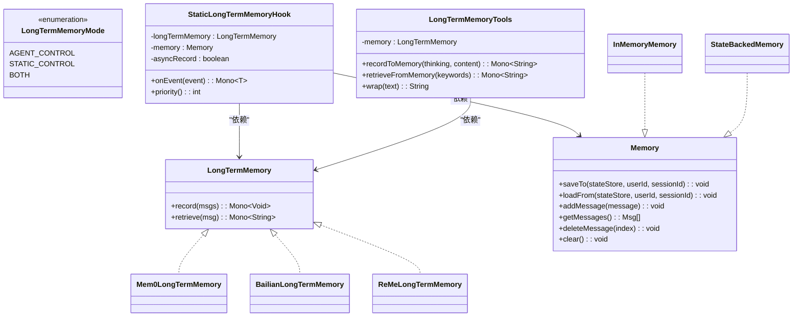
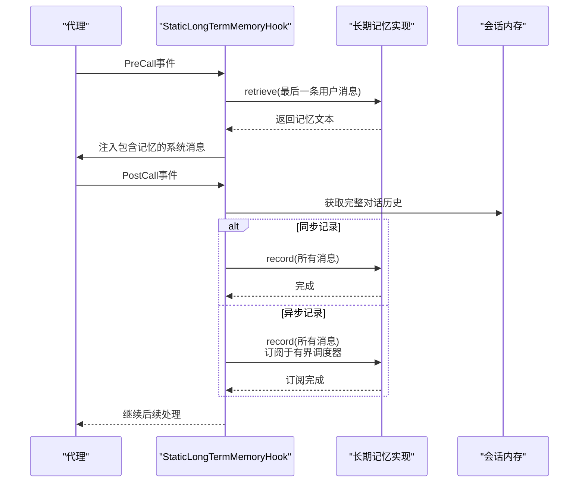
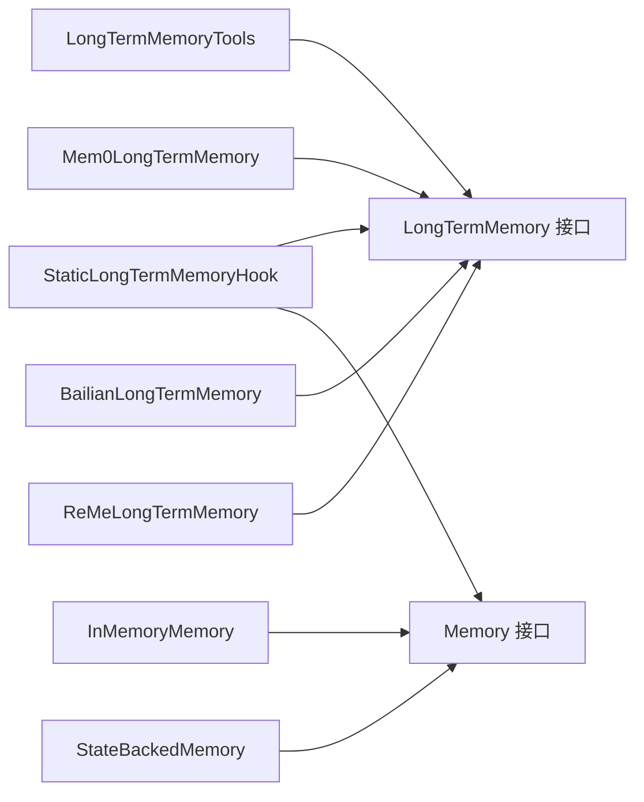

# 长期记忆实现

<cite>
**本文档引用的文件**
- [LongTermMemory.java](file://agentscope-core/src/main/java/io/agentscope/core/memory/LongTermMemory.java)
- [LongTermMemoryMode.java](file://agentscope-core/src/main/java/io/agentscope/core/memory/LongTermMemoryMode.java)
- [StaticLongTermMemoryHook.java](file://agentscope-core/src/main/java/io/agentscope/core/memory/StaticLongTermMemoryHook.java)
- [LongTermMemoryTools.java](file://agentscope-core/src/main/java/io/agentscope/core/memory/LongTermMemoryTools.java)
- [Memory.java](file://agentscope-core/src/main/java/io/agentscope/core/memory/Memory.java)
- [InMemoryMemory.java](file://agentscope-core/src/main/java/io/agentscope/core/memory/InMemoryMemory.java)
- [StateBackedMemory.java](file://agentscope-core/src/main/java/io/agentscope/core/memory/StateBackedMemory.java)
- [Mem0LongTermMemory.java](file://agentscope-extensions/agentscope-extensions-mem/agentscope-extensions-mem0/src/main/java/io/agentscope/core/memory/mem0/Mem0LongTermMemory.java)
- [BailianLongTermMemory.java](file://agentscope-extensions/agentscope-extensions-mem/agentscope-extensions-memory-bailian/src/main/java/io/agentscope/core/memory/bailian/BailianLongTermMemory.java)
- [ReMeLongTermMemory.java](file://agentscope-extensions/agentscope-extensions-mem/agentscope-extensions-reme/src/main/java/io/agentscope/core/memory/reme/ReMeLongTermMemory.java)
- [StaticLongTermMemoryHookTest.java](file://agentscope-core/src/test/java/io/agentscope/core/legacy/memory/StaticLongTermMemoryHookTest.java)
- [LongTermMemoryToolsTest.java](file://agentscope-core/src/test/java/io/agentscope/core/legacy/memory/LongTermMemoryToolsTest.java)
</cite>

## 目录
1. [简介](#简介)
2. [项目结构](#项目结构)
3. [核心组件](#核心组件)
4. [架构总览](#架构总览)
5. [详细组件分析](#详细组件分析)
6. [依赖关系分析](#依赖关系分析)
7. [性能考虑](#性能考虑)
8. [故障排除指南](#故障排除指南)
9. [结论](#结论)

## 简介
本文件面向需要在Agentscope框架中集成长期记忆能力的开发者，系统化阐述长期记忆（LongTermMemory）的架构设计与实现要点。文档覆盖以下关键主题：
- 存储后端抽象层与多存储策略实现（Mem0、阿里云Bailian、ReMe）
- 长期记忆模式（LongTermMemoryMode）的三种策略：自动控制、代理控制与混合模式
- StaticLongTermMemoryHook钩子系统的扩展机制与事件驱动流程
- 工具适配器（LongTermMemoryTools）如何将核心API暴露为可被代理调用的工具函数
- 配置不同存储后端的方法、一致性保障策略以及网络异常与存储故障的容错处理

注意：根据源码注释，长期记忆功能已在2.0版本移除，相关接口与实现标注为废弃。本文档基于历史实现进行总结，帮助理解其设计理念与迁移路径。

## 项目结构
长期记忆相关代码主要分布在核心模块与扩展模块中：
- 核心模块（agentscope-core）：定义长期记忆接口、模式枚举、静态钩子、工具适配器及内存抽象
- 扩展模块（agentscope-extensions）：提供多种具体存储后端实现（Mem0、Bailian、ReMe）

图表来源
- [LongTermMemory.java:71-111](file://agentscope-core/src/main/java/io/agentscope/core/memory/LongTermMemory.java#L71-L111)
- [LongTermMemoryMode.java:54-70](file://agentscope-core/src/main/java/io/agentscope/core/memory/LongTermMemoryMode.java#L54-L70)
- [StaticLongTermMemoryHook.java:78-300](file://agentscope-core/src/main/java/io/agentscope/core/memory/StaticLongTermMemoryHook.java#L78-L300)
- [LongTermMemoryTools.java:67-215](file://agentscope-core/src/main/java/io/agentscope/core/memory/LongTermMemoryTools.java#L67-L215)
- [Memory.java:35-78](file://agentscope-core/src/main/java/io/agentscope/core/memory/Memory.java#L35-L78)
- [InMemoryMemory.java:37-134](file://agentscope-core/src/main/java/io/agentscope/core/memory/InMemoryMemory.java#L37-L134)
- [StateBackedMemory.java:36-79](file://agentscope-core/src/main/java/io/agentscope/core/memory/StateBackedMemory.java#L36-L79)
- [Mem0LongTermMemory.java:113-439](file://agentscope-extensions/agentscope-extensions-mem/agentscope-extensions-mem0/src/main/java/io/agentscope/core/memory/mem0/Mem0LongTermMemory.java#L113-L439)
- [BailianLongTermMemory.java:77-491](file://agentscope-extensions/agentscope-extensions-mem/agentscope-extensions-memory-bailian/src/main/java/io/agentscope/core/memory/bailian/BailianLongTermMemory.java#L77-L491)
- [ReMeLongTermMemory.java:66-306](file://agentscope-extensions/agentscope-extensions-mem/agentscope-extensions-reme/src/main/java/io/agentscope/core/memory/reme/ReMeLongTermMemory.java#L66-L306)

章节来源
- [LongTermMemory.java:16-111](file://agentscope-core/src/main/java/io/agentscope/core/memory/LongTermMemory.java#L16-L111)
- [LongTermMemoryMode.java:16-70](file://agentscope-core/src/main/java/io/agentscope/core/memory/LongTermMemoryMode.java#L16-L70)
- [StaticLongTermMemoryHook.java:16-300](file://agentscope-core/src/main/java/io/agentscope/core/memory/StaticLongTermMemoryHook.java#L16-L300)
- [LongTermMemoryTools.java:16-215](file://agentscope-core/src/main/java/io/agentscope/core/memory/LongTermMemoryTools.java#L16-L215)
- [Memory.java:16-78](file://agentscope-core/src/main/java/io/agentscope/core/memory/Memory.java#L16-L78)
- [InMemoryMemory.java:16-134](file://agentscope-core/src/main/java/io/agentscope/core/memory/InMemoryMemory.java#L16-L134)
- [StateBackedMemory.java:16-79](file://agentscope-core/src/main/java/io/agentscope/core/memory/StateBackedMemory.java#L16-L79)
- [Mem0LongTermMemory.java:16-439](file://agentscope-extensions/agentscope-extensions-mem/agentscope-extensions-mem0/src/main/java/io/agentscope/core/memory/mem0/Mem0LongTermMemory.java#L16-L439)
- [BailianLongTermMemory.java:16-491](file://agentscope-extensions/agentscope-extensions-mem/agentscope-extensions-memory-bailian/src/main/java/io/agentscope/core/memory/bailian/BailianLongTermMemory.java#L16-L491)
- [ReMeLongTermMemory.java:16-306](file://agentscope-extensions/agentscope-extensions-mem/agentscope-extensions-reme/src/main/java/io/agentscope/core/memory/reme/ReMeLongTermMemory.java#L16-L306)

## 核心组件
- 长期记忆接口（LongTermMemory）：定义记录（record）与检索（retrieve）两个核心异步方法，返回Reactor Mono类型，确保非阻塞集成
- 模式枚举（LongTermMemoryMode）：提供三种模式以控制长期记忆的集成方式
- 静态钩子（StaticLongTermMemoryHook）：实现自动控制模式，通过事件钩子在推理前注入上下文，在调用后记录对话
- 工具适配器（LongTermMemoryTools）：将record/retrieve适配为代理可调用的工具函数，支持代理主动控制
- 内存抽象（Memory）：提供会话消息缓冲与持久化接口，兼容v1与v2状态模型

章节来源
- [LongTermMemory.java:71-111](file://agentscope-core/src/main/java/io/agentscope/core/memory/LongTermMemory.java#L71-L111)
- [LongTermMemoryMode.java:54-70](file://agentscope-core/src/main/java/io/agentscope/core/memory/LongTermMemoryMode.java#L54-L70)
- [StaticLongTermMemoryHook.java:78-300](file://agentscope-core/src/main/java/io/agentscope/core/memory/StaticLongTermMemoryHook.java#L78-L300)
- [LongTermMemoryTools.java:67-215](file://agentscope-core/src/main/java/io/agentscope/core/memory/LongTermMemoryTools.java#L67-L215)
- [Memory.java:35-78](file://agentscope-core/src/main/java/io/agentscope/core/memory/Memory.java#L35-L78)

## 架构总览
长期记忆的整体架构围绕“抽象接口 + 多后端实现 + 钩子驱动 + 工具适配”的模式展开。下图展示了核心组件之间的交互关系：

图表来源
- [LongTermMemory.java:71-111](file://agentscope-core/src/main/java/io/agentscope/core/memory/LongTermMemory.java#L71-L111)
- [LongTermMemoryMode.java:54-70](file://agentscope-core/src/main/java/io/agentscope/core/memory/LongTermMemoryMode.java#L54-L70)
- [StaticLongTermMemoryHook.java:78-300](file://agentscope-core/src/main/java/io/agentscope/core/memory/StaticLongTermMemoryHook.java#L78-L300)
- [LongTermMemoryTools.java:67-215](file://agentscope-core/src/main/java/io/agentscope/core/memory/LongTermMemoryTools.java#L67-L215)
- [Memory.java:35-78](file://agentscope-core/src/main/java/io/agentscope/core/memory/Memory.java#L35-L78)
- [InMemoryMemory.java:37-134](file://agentscope-core/src/main/java/io/agentscope/core/memory/InMemoryMemory.java#L37-L134)
- [StateBackedMemory.java:36-79](file://agentscope-core/src/main/java/io/agentscope/core/memory/StateBackedMemory.java#L36-L79)
- [Mem0LongTermMemory.java:113-439](file://agentscope-extensions/agentscope-extensions-mem/agentscope-extensions-mem0/src/main/java/io/agentscope/core/memory/mem0/Mem0LongTermMemory.java#L113-L439)
- [BailianLongTermMemory.java:77-491](file://agentscope-extensions/agentscope-extensions-mem/agentscope-extensions-memory-bailian/src/main/java/io/agentscope/core/memory/bailian/BailianLongTermMemory.java#L77-L491)
- [ReMeLongTermMemory.java:66-306](file://agentscope-extensions/agentscope-extensions-mem/agentscope-extensions-reme/src/main/java/io/agentscope/core/memory/reme/ReMeLongTermMemory.java#L66-L306)

## 详细组件分析

### 长期记忆接口与模式
- 接口职责：record用于将对话消息持久化到长期存储；retrieve用于基于查询语义检索相关记忆文本
- 模式选择：
  - AGENT_CONTROL：由代理通过工具函数自主决定何时记录/检索
  - STATIC_CONTROL：框架自动在推理前注入上下文、在调用后记录对话
  - BOTH：结合上述两种方式，既保留代理控制又提供自动管理

章节来源
- [LongTermMemory.java:71-111](file://agentscope-core/src/main/java/io/agentscope/core/memory/LongTermMemory.java#L71-L111)
- [LongTermMemoryMode.java:54-70](file://agentscope-core/src/main/java/io/agentscope/core/memory/LongTermMemoryMode.java#L54-L70)

### 静态长期记忆钩子（StaticLongTermMemoryHook）
- 触发时机：
  - PreCall事件：在推理开始前，从长期记忆检索相关上下文并注入到消息列表末尾
  - PostCall事件：在模型回复后，将完整对话历史记录到长期存储
- 异步记录：支持fire-and-forget异步记录，避免阻塞主响应链路，内部使用有界弹性调度器限制并发与队列长度
- 错误处理：对检索与记录过程中的异常进行日志记录并忽略，保证不中断主流程

图表来源
- [StaticLongTermMemoryHook.java:124-262](file://agentscope-core/src/main/java/io/agentscope/core/memory/StaticLongTermMemoryHook.java#L124-L262)
- [StaticLongTermMemoryHookTest.java:128-343](file://agentscope-core/src/test/java/io/agentscope/core/legacy/memory/StaticLongTermMemoryHookTest.java#L128-L343)

章节来源
- [StaticLongTermMemoryHook.java:78-300](file://agentscope-core/src/main/java/io/agentscope/core/memory/StaticLongTermMemoryHook.java#L78-L300)
- [StaticLongTermMemoryHookTest.java:53-345](file://agentscope-core/src/test/java/io/agentscope/core/legacy/memory/StaticLongTermMemoryHookTest.java#L53-L345)

### 工具适配器（LongTermMemoryTools）
- 职责：将record/retrieve适配为代理工具函数，支持代理在合适时机主动记录重要信息或检索上下文
- 参数设计：record接收“思考”与“内容清单”，retrieve接收关键词列表
- 包装格式：检索结果通过wrap方法添加标记，便于代理识别与后续处理

章节来源
- [LongTermMemoryTools.java:67-215](file://agentscope-core/src/main/java/io/agentscope/core/memory/LongTermMemoryTools.java#L67-L215)
- [LongTermMemoryToolsTest.java:43-341](file://agentscope-core/src/test/java/io/agentscope/core/legacy/memory/LongTermMemoryToolsTest.java#L43-L341)

### 存储后端实现对比
- Mem0LongTermMemory
  - 特点：向量嵌入检索、多租户隔离（agentId、userId、runId）、自定义元数据过滤、LLM辅助提取
  - 配置：支持API类型、超时、元数据等Builder选项
- BailianLongTermMemory
  - 特点：阿里云服务、向量检索、可选重排/判断/改写、按库/项目/方案隔离
  - 配置：API Key、用户ID、库ID、项目ID、方案ID、TopK、最小相似度等
- ReMeLongTermMemory
  - 特点：轨迹式记忆、工作空间隔离、摘要生成
  - 配置：用户ID映射为工作空间、API基础URL、超时

章节来源
- [Mem0LongTermMemory.java:113-439](file://agentscope-extensions/agentscope-extensions-mem/agentscope-extensions-mem0/src/main/java/io/agentscope/core/memory/mem0/Mem0LongTermMemory.java#L113-L439)
- [BailianLongTermMemory.java:77-491](file://agentscope-extensions/agentscope-extensions-mem/agentscope-extensions-memory-bailian/src/main/java/io/agentscope/core/memory/bailian/BailianLongTermMemory.java#L77-L491)
- [ReMeLongTermMemory.java:66-306](file://agentscope-extensions/agentscope-extensions-mem/agentscope-extensions-reme/src/main/java/io/agentscope/core/memory/reme/ReMeLongTermMemory.java#L66-L306)

### 内存抽象与兼容层
- Memory接口：提供消息增删查清与状态持久化能力，兼容v1与v2状态模型
- InMemoryMemory：线程安全的消息缓冲与状态序列化
- StateBackedMemory：桥接v1访问习惯与v2状态上下文

章节来源
- [Memory.java:35-78](file://agentscope-core/src/main/java/io/agentscope/core/memory/Memory.java#L35-L78)
- [InMemoryMemory.java:37-134](file://agentscope-core/src/main/java/io/agentscope/core/memory/InMemoryMemory.java#L37-L134)
- [StateBackedMemory.java:36-79](file://agentscope-core/src/main/java/io/agentscope/core/memory/StateBackedMemory.java#L36-L79)

## 依赖关系分析
- 组件耦合
  - StaticLongTermMemoryHook强依赖LongTermMemory与Memory，负责事件驱动的上下文注入与记录
  - LongTermMemoryTools仅依赖LongTermMemory，作为工具层解耦代理控制与底层存储
  - 各后端实现均实现LongTermMemory接口，遵循统一契约
- 可能的循环依赖
  - 当前结构清晰，未发现循环依赖迹象
- 外部依赖
  - 后端实现依赖各自的服务客户端与网络传输层（如HTTP），通过Builder注入超时与认证参数

图表来源
- [StaticLongTermMemoryHook.java:78-300](file://agentscope-core/src/main/java/io/agentscope/core/memory/StaticLongTermMemoryHook.java#L78-L300)
- [LongTermMemoryTools.java:67-215](file://agentscope-core/src/main/java/io/agentscope/core/memory/LongTermMemoryTools.java#L67-L215)
- [LongTermMemory.java:71-111](file://agentscope-core/src/main/java/io/agentscope/core/memory/LongTermMemory.java#L71-L111)
- [Memory.java:35-78](file://agentscope-core/src/main/java/io/agentscope/core/memory/Memory.java#L35-L78)
- [Mem0LongTermMemory.java:113-439](file://agentscope-extensions/agentscope-extensions-mem/agentscope-extensions-mem0/src/main/java/io/agentscope/core/memory/mem0/Mem0LongTermMemory.java#L113-L439)
- [BailianLongTermMemory.java:77-491](file://agentscope-extensions/agentscope-extensions-mem/agentscope-extensions-memory-bailian/src/main/java/io/agentscope/core/memory/bailian/BailianLongTermMemory.java#L77-L491)
- [ReMeLongTermMemory.java:66-306](file://agentscope-extensions/agentscope-extensions-mem/agentscope-extensions-reme/src/main/java/io/agentscope/core/memory/reme/ReMeLongTermMemory.java#L66-L306)
- [InMemoryMemory.java:37-134](file://agentscope-core/src/main/java/io/agentscope/core/memory/InMemoryMemory.java#L37-L134)
- [StateBackedMemory.java:36-79](file://agentscope-core/src/main/java/io/agentscope/core/memory/StateBackedMemory.java#L36-L79)

## 性能考虑
- 异步记录：通过有界弹性调度器限制并发与队列深度，避免无界积压导致资源耗尽
- 流水线非阻塞：record/retrieve均为Reactor异步操作，减少阻塞等待
- 过滤与压缩：后端实现对空内容、压缩历史标记等进行过滤，降低无效存储与检索开销
- 检索参数：TopK、最小相似度等参数影响召回质量与性能平衡

## 故障排除指南
- 常见问题
  - 记录失败：钩子与工具适配器均对记录异常进行日志记录并忽略，不影响主流程
  - 检索失败：钩子与工具适配器均对检索异常进行日志记录并返回空结果
  - 异步记录饱和：当有界调度器饱和时，新任务可能被丢弃并记录警告
- 排查步骤
  - 检查后端服务连通性与鉴权配置
  - 查看日志中关于“Failed to record/Failed to retrieve”的警告
  - 在开发环境启用更宽松的超时与重试策略（如适用）
- 迁移建议
  - 由于长期记忆功能已移除，建议将跨会话上下文迁移到应用层状态管理（AgentState）

章节来源
- [StaticLongTermMemoryHook.java:190-261](file://agentscope-core/src/main/java/io/agentscope/core/memory/StaticLongTermMemoryHook.java#L190-L261)
- [LongTermMemoryTools.java:150-213](file://agentscope-core/src/main/java/io/agentscope/core/memory/LongTermMemoryTools.java#L150-L213)
- [StaticLongTermMemoryHookTest.java:182-343](file://agentscope-core/src/test/java/io/agentscope/core/legacy/memory/StaticLongTermMemoryHookTest.java#L182-L343)
- [LongTermMemoryToolsTest.java:170-263](file://agentscope-core/src/test/java/io/agentscope/core/legacy/memory/LongTermMemoryToolsTest.java#L170-L263)

## 结论
长期记忆实现通过抽象接口与多后端策略，提供了灵活的记忆管理能力。静态钩子与工具适配器分别满足了“自动控制”和“代理控制”的需求，配合异步与容错机制，确保在复杂场景下的稳定性与性能。鉴于该功能已在2.0版本移除，建议在迁移过程中将跨会话上下文整合至应用层状态管理，以获得更清晰的架构与更好的可维护性。