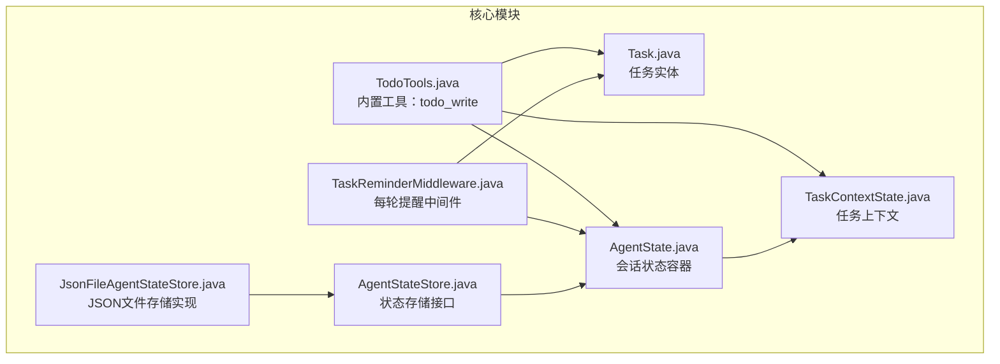
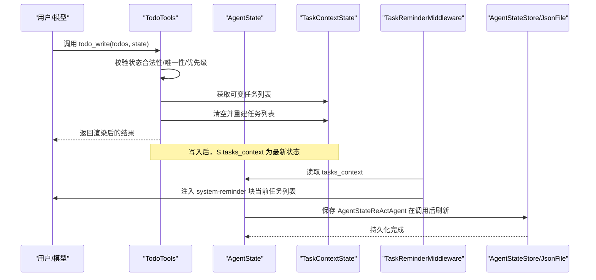
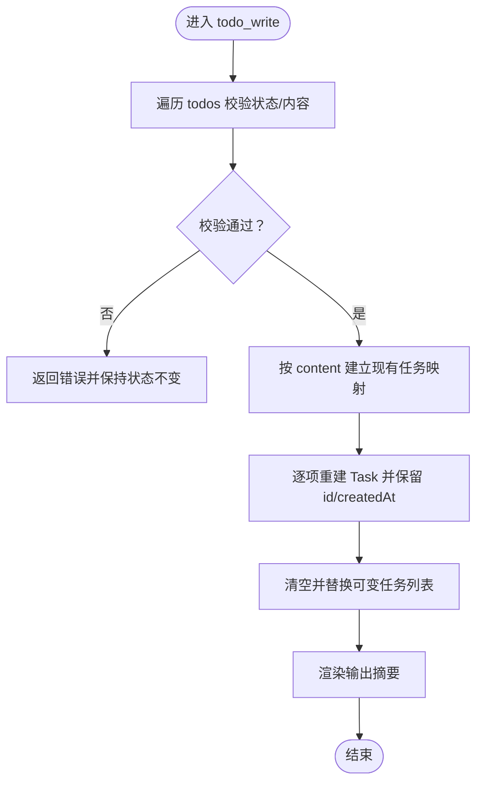
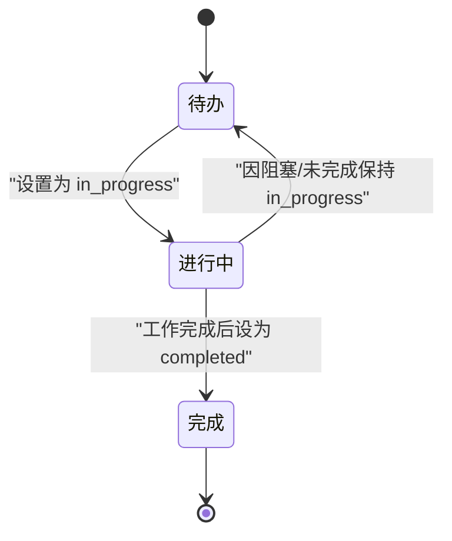
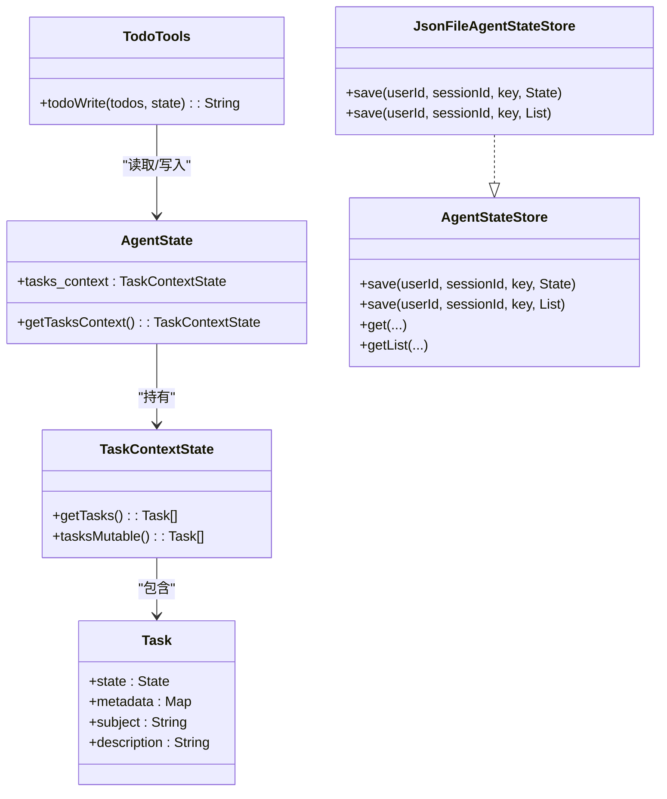
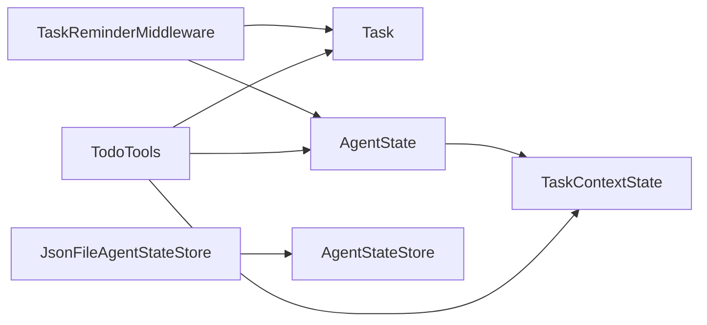

# 任务管理工具

<cite>
**本文引用的文件**
- [TodoTools.java](file://agentscope-core/src/main/java/io/agentscope/core/tool/builtin/TodoTools.java)
- [TodoToolsTest.java](file://agentscope-core/src/test/java/io/agentscope/core/tool/builtin/TodoToolsTest.java)
- [Task.java](file://agentscope-core/src/main/java/io/agentscope/core/state/Task.java)
- [AgentState.java](file://agentscope-core/src/main/java/io/agentscope/core/state/AgentState.java)
- [TaskContextState.java](file://agentscope-core/src/main/java/io/agentscope/core/state/TaskContextState.java)
- [TaskReminderMiddleware.java](file://agentscope-core/src/main/java/io/agentscope/core/middleware/TaskReminderMiddleware.java)
- [AgentStateStore.java](file://agentscope-core/src/main/java/io/agentscope/core/state/AgentStateStore.java)
- [JsonFileAgentStateStore.java](file://agentscope-core/src/main/java/io/agentscope/core/state/JsonFileAgentStateStore.java)
</cite>

## 目录
1. [简介](#简介)
2. [项目结构](#项目结构)
3. [核心组件](#核心组件)
4. [架构总览](#架构总览)
5. [详细组件分析](#详细组件分析)
6. [依赖关系分析](#依赖关系分析)
7. [性能考量](#性能考量)
8. [故障排查指南](#故障排查指南)
9. [结论](#结论)
10. [附录](#附录)

## 简介
本文件面向任务管理工具的实现与使用，重点围绕内置工具 TodoTools 的功能与约束，系统阐述以下主题：
- 任务的创建、查询、更新与删除语义（通过 todo_write 完整列表替换语义实现）
- 任务状态管理机制：pending、in_progress、completed 的转换规则与约束
- 任务优先级处理、内容校验与唯一性保持策略
- 如何使用 todo_write 维护会话任务列表、处理状态变更与完整替换
- 任务管理工具与 AgentState 的集成方式及持久化机制

## 项目结构
任务管理相关代码主要位于 agentscope-core 模块中，涉及工具定义、状态模型、中间件提醒与持久化接口/实现。

图表来源
- [TodoTools.java:1-262](file://agentscope-core/src/main/java/io/agentscope/core/tool/builtin/TodoTools.java#L1-L262)
- [Task.java:1-283](file://agentscope-core/src/main/java/io/agentscope/core/state/Task.java#L1-L283)
- [TaskContextState.java:1-75](file://agentscope-core/src/main/java/io/agentscope/core/state/TaskContextState.java#L1-L75)
- [AgentState.java:1-424](file://agentscope-core/src/main/java/io/agentscope/core/state/AgentState.java#L1-L424)
- [TaskReminderMiddleware.java:1-129](file://agentscope-core/src/main/java/io/agentscope/core/middleware/TaskReminderMiddleware.java#L1-L129)
- [AgentStateStore.java:1-167](file://agentscope-core/src/main/java/io/agentscope/core/state/AgentStateStore.java#L1-L167)
- [JsonFileAgentStateStore.java:1-397](file://agentscope-core/src/main/java/io/agentscope/core/state/JsonFileAgentStateStore.java#L1-L397)

章节来源
- [TodoTools.java:1-262](file://agentscope-core/src/main/java/io/agentscope/core/tool/builtin/TodoTools.java#L1-L262)
- [Task.java:1-283](file://agentscope-core/src/main/java/io/agentscope/core/state/Task.java#L1-L283)
- [TaskContextState.java:1-75](file://agentscope-core/src/main/java/io/agentscope/core/state/TaskContextState.java#L1-L75)
- [AgentState.java:1-424](file://agentscope-core/src/main/java/io/agentscope/core/state/AgentState.java#L1-L424)
- [TaskReminderMiddleware.java:1-129](file://agentscope-core/src/main/java/io/agentscope/core/middleware/TaskReminderMiddleware.java#L1-L129)
- [AgentStateStore.java:1-167](file://agentscope-core/src/main/java/io/agentscope/core/state/AgentStateStore.java#L1-L167)
- [JsonFileAgentStateStore.java:1-397](file://agentscope-core/src/main/java/io/agentscope/core/state/JsonFileAgentStateStore.java#L1-L397)

## 核心组件
- TodoTools：内置工具，提供 todo_write 接口，支持以“完整列表替换”的方式维护会话任务列表；自动进行状态校验、优先级归一化与内容去重保留等逻辑。
- Task：任务实体，包含 subject/description/state/metadata/createdAt/id 等字段，支持从字符串解析状态 wire 名称。
- TaskContextState：任务上下文容器，暴露不可变视图与可变视图，便于工具直接修改任务集合。
- AgentState：会话级运行时状态容器，包含 tasks_context 子上下文，用于承载任务列表。
- TaskReminderMiddleware：在每次推理前注入当前任务列表提醒，确保模型始终看到最新状态。
- AgentStateStore/JsonFileAgentStateStore：状态持久化接口与文件系统实现，负责保存/加载 AgentState 及其子上下文。

章节来源
- [TodoTools.java:92-173](file://agentscope-core/src/main/java/io/agentscope/core/tool/builtin/TodoTools.java#L92-L173)
- [Task.java:41-98](file://agentscope-core/src/main/java/io/agentscope/core/state/Task.java#L41-L98)
- [TaskContextState.java:30-52](file://agentscope-core/src/main/java/io/agentscope/core/state/TaskContextState.java#L30-L52)
- [AgentState.java:59-243](file://agentscope-core/src/main/java/io/agentscope/core/state/AgentState.java#L59-L243)
- [TaskReminderMiddleware.java:54-100](file://agentscope-core/src/main/java/io/agentscope/core/middleware/TaskReminderMiddleware.java#L54-L100)
- [AgentStateStore.java:61-167](file://agentscope-core/src/main/java/io/agentscope/core/state/AgentStateStore.java#L61-L167)
- [JsonFileAgentStateStore.java:66-133](file://agentscope-core/src/main/java/io/agentscope/core/state/JsonFileAgentStateStore.java#L66-L133)

## 架构总览
下图展示了任务管理工具在会话中的端到端流程：工具接收完整列表，执行校验与重建，写入 AgentState 的任务上下文，并由中间件在每轮推理时将当前任务列表注入到模型输入中；最终由状态存储层持久化。

图表来源
- [TodoTools.java:98-173](file://agentscope-core/src/main/java/io/agentscope/core/tool/builtin/TodoTools.java#L98-L173)
- [TaskContextState.java:49-52](file://agentscope-core/src/main/java/io/agentscope/core/state/TaskContextState.java#L49-L52)
- [TaskReminderMiddleware.java:74-100](file://agentscope-core/src/main/java/io/agentscope/core/middleware/TaskReminderMiddleware.java#L74-L100)
- [AgentStateStore.java:73-92](file://agentscope-core/src/main/java/io/agentscope/core/state/AgentStateStore.java#L73-L92)
- [JsonFileAgentStateStore.java:98-108](file://agentscope-core/src/main/java/io/agentscope/core/state/JsonFileAgentStateStore.java#L98-L108)

## 详细组件分析

### TodoTools：任务列表维护工具
- 工具名称与描述：提供 todo_write 工具，要求传入“完整的更新后的任务列表”，工具将整体会话任务列表替换为新列表。
- 输入参数：
  - todos：完整的新任务列表（TodoItem 数组），每个元素包含 content/status/priority 字段。
  - state：框架自动注入的 AgentState（仅内部可见）。
- 校验与约束：
  - 状态必须合法（pending/in_progress/completed），否则拒绝并返回错误。
  - 不能同时存在多个 in_progress 任务，否则拒绝并回滚。
  - 每个任务的内容不能为空白，否则拒绝。
  - 优先级仅接受 high/medium/low，其他值忽略。
- 列表重建与唯一性保持：
  - 将现有任务按 subject 建立映射，尽量复用已有任务的 id/createdAt，以保证跨完整列表替换后标识稳定。
  - 将 metadata 中的优先级合并到新任务的 metadata 中。
- 输出：
  - 返回人类可读的渲染结果，包含开放任务数量与各任务标记与优先级信息。

图表来源
- [TodoTools.java:111-173](file://agentscope-core/src/main/java/io/agentscope/core/tool/builtin/TodoTools.java#L111-L173)

章节来源
- [TodoTools.java:92-173](file://agentscope-core/src/main/java/io/agentscope/core/tool/builtin/TodoTools.java#L92-L173)
- [TodoToolsTest.java:32-117](file://agentscope-core/src/test/java/io/agentscope/core/tool/builtin/TodoToolsTest.java#L32-L117)

### 任务状态管理机制
- 状态枚举与序列化：
  - Task.State 包含 PENDING、IN_PROGRESS、COMPLETED 三态，支持从字符串 wire 名称解析。
- 转换规则与约束：
  - 单实例 in_progress 约束：同一时刻最多只能有一个任务处于 in_progress。
  - 完成条件：仅在工作实际完成后才标记为 completed，不基于意图或计划。
  - 阻塞与跟进：若被阻塞或部分完成，应保持 in_progress，并新增后续待办描述阻塞原因。
  - 任务粒度：条目需具体且可执行，大任务拆分为更小步骤。
  - 删除策略：不再需要的任务只需从完整列表中移除即可。
- 解析与默认值：
  - 空状态解析为 PENDING，非法状态直接拒绝。

图表来源
- [Task.java:44-72](file://agentscope-core/src/main/java/io/agentscope/core/state/Task.java#L44-L72)
- [TodoTools.java:201-210](file://agentscope-core/src/main/java/io/agentscope/core/tool/builtin/TodoTools.java#L201-L210)

章节来源
- [Task.java:44-72](file://agentscope-core/src/main/java/io/agentscope/core/state/Task.java#L44-L72)
- [TodoTools.java:70-84](file://agentscope-core/src/main/java/io/agentscope/core/tool/builtin/TodoTools.java#L70-L84)

### 任务优先级处理、内容验证与唯一性保持
- 优先级归一化：
  - 仅接受 high/medium/low，统一转为小写；其他值忽略。
- 内容验证：
  - 所有任务的 content 必须非空且非空白，否则拒绝。
- 唯一性与标识稳定：
  - 通过 content 去重，尽量复用既有任务的 id/createdAt，使跨完整列表替换后标识稳定。

章节来源
- [TodoTools.java:212-225](file://agentscope-core/src/main/java/io/agentscope/core/tool/builtin/TodoTools.java#L212-L225)
- [TodoTools.java:136-166](file://agentscope-core/src/main/java/io/agentscope/core/tool/builtin/TodoTools.java#L136-L166)

### 使用示例与最佳实践
- 使用 todo_write 维护会话任务列表：
  - 每次调用传入“完整的更新后的任务列表”，不要分步增量更新。
  - 严格遵守单实例 in_progress 约束，避免多任务并行。
  - 完成一项任务后再推进下一项，保持状态实时更新。
- 处理状态变更：
  - 开始工作前先将对应任务置为 in_progress。
  - 实际验证完成后才标记为 completed。
  - 若被阻塞，保持 in_progress 并添加后续待办说明阻塞原因。
- 完整替换语义：
  - 旧列表中不存在于新列表中的任务会被移除（相当于“删除”）。
  - 新增任务将作为全新条目加入。
  - 通过 content 去重与 id 复用，尽量保持历史标识稳定。

章节来源
- [TodoTools.java:98-173](file://agentscope-core/src/main/java/io/agentscope/core/tool/builtin/TodoTools.java#L98-L173)
- [TodoToolsTest.java:51-77](file://agentscope-core/src/test/java/io/agentscope/core/tool/builtin/TodoToolsTest.java#L51-L77)

### 与 AgentState 的集成与持久化
- 集成点：
  - TodoTools 通过 @Tool(stateInjected = true) 自动获取 AgentState。
  - 写入后，AgentState.getTasksContext().tasksMutable() 为最新任务列表。
  - TaskReminderMiddleware 每轮推理前读取 AgentState.tasks_context 并注入提醒。
- 持久化：
  - AgentStateStore 提供 save/load/list/delete 等能力，支持单对象与列表两种保存策略。
  - JsonFileAgentStateStore 默认以 JSON 文件保存单对象，以 JSONL 文件保存列表，并采用哈希判断是否需要全量重写或增量追加。
  - ReActAgent 在每次调用后会将 AgentState 刷新到 AgentStateStore，从而实现会话任务列表的持久化。

图表来源
- [AgentState.java:240-243](file://agentscope-core/src/main/java/io/agentscope/core/state/AgentState.java#L240-L243)
- [TaskContextState.java:44-52](file://agentscope-core/src/main/java/io/agentscope/core/state/TaskContextState.java#L44-L52)
- [Task.java:74-176](file://agentscope-core/src/main/java/io/agentscope/core/state/Task.java#L74-L176)
- [TodoTools.java:98-173](file://agentscope-core/src/main/java/io/agentscope/core/tool/builtin/TodoTools.java#L98-L173)
- [AgentStateStore.java:73-117](file://agentscope-core/src/main/java/io/agentscope/core/state/AgentStateStore.java#L73-L117)
- [JsonFileAgentStateStore.java:98-133](file://agentscope-core/src/main/java/io/agentscope/core/state/JsonFileAgentStateStore.java#L98-L133)

章节来源
- [AgentState.java:240-243](file://agentscope-core/src/main/java/io/agentscope/core/state/AgentState.java#L240-L243)
- [TaskContextState.java:44-52](file://agentscope-core/src/main/java/io/agentscope/core/state/TaskContextState.java#L44-L52)
- [TaskReminderMiddleware.java:74-100](file://agentscope-core/src/main/java/io/agentscope/core/middleware/TaskReminderMiddleware.java#L74-L100)
- [AgentStateStore.java:73-117](file://agentscope-core/src/main/java/io/agentscope/core/state/AgentStateStore.java#L73-L117)
- [JsonFileAgentStateStore.java:98-133](file://agentscope-core/src/main/java/io/agentscope/core/state/JsonFileAgentStateStore.java#L98-L133)

## 依赖关系分析
- TodoTools 依赖 Task、TaskContextState、AgentState 与中间件 TaskReminderMiddleware。
- AgentState 持有 TaskContextState，后者持有任务列表。
- JsonFileAgentStateStore 实现 AgentStateStore，负责将 AgentState 保存到文件系统。

图表来源
- [TodoTools.java:21-24](file://agentscope-core/src/main/java/io/agentscope/core/tool/builtin/TodoTools.java#L21-L24)
- [TaskContextState.java:30-52](file://agentscope-core/src/main/java/io/agentscope/core/state/TaskContextState.java#L30-L52)
- [AgentState.java:69-71](file://agentscope-core/src/main/java/io/agentscope/core/state/AgentState.java#L69-L71)
- [TaskReminderMiddleware.java:24-26](file://agentscope-core/src/main/java/io/agentscope/core/middleware/TaskReminderMiddleware.java#L24-L26)
- [JsonFileAgentStateStore.java:66-66](file://agentscope-core/src/main/java/io/agentscope/core/state/JsonFileAgentStateStore.java#L66-L66)

章节来源
- [TodoTools.java:21-24](file://agentscope-core/src/main/java/io/agentscope/core/tool/builtin/TodoTools.java#L21-L24)
- [TaskContextState.java:30-52](file://agentscope-core/src/main/java/io/agentscope/core/state/TaskContextState.java#L30-L52)
- [AgentState.java:69-71](file://agentscope-core/src/main/java/io/agentscope/core/state/AgentState.java#L69-L71)
- [TaskReminderMiddleware.java:24-26](file://agentscope-core/src/main/java/io/agentscope/core/middleware/TaskReminderMiddleware.java#L24-L26)
- [JsonFileAgentStateStore.java:66-66](file://agentscope-core/src/main/java/io/agentscope/core/state/JsonFileAgentStateStore.java#L66-L66)

## 性能考量
- 完整列表替换的复杂度：
  - 校验阶段对 todos 进行一次线性扫描，时间复杂度 O(n)。
  - 重建阶段按顺序构建新列表，时间复杂度 O(n)。
  - 唯一性映射按 content 建立，平均 O(1) 查找，整体 O(n)。
- 存储优化：
  - JsonFileAgentStateStore 对列表状态采用哈希判断，避免不必要的全量重写，仅在需要时进行增量追加或全量重写。
- 中间件注入：
  - 每轮推理时仅读取 tasks_context 并注入提醒，不会改变任务状态，开销极低。

## 故障排查指南
- 错误场景与定位：
  - 状态非法：返回包含“invalid status”提示的错误消息，且不修改现有状态。
  - 多个 in_progress：返回“at most one in_progress”提示，且不修改现有状态。
  - 内容为空：返回“every todo must have non-blank content”提示，且不修改现有状态。
  - 缺少 AgentState：返回“agent state unavailable”提示。
- 测试覆盖：
  - 单元测试覆盖了完整列表写入、删除旧项、跨列表保留 id、多 in_progress 拒绝、非法状态拒绝、空输入清空列表、缺失状态错误等场景。

章节来源
- [TodoTools.java:111-134](file://agentscope-core/src/main/java/io/agentscope/core/tool/builtin/TodoTools.java#L111-L134)
- [TodoToolsTest.java:80-115](file://agentscope-core/src/test/java/io/agentscope/core/tool/builtin/TodoToolsTest.java#L80-L115)

## 结论
TodoTools 通过“完整列表替换”的简单而强大的语义，将任务管理的复杂度内聚在工具内部：严格的校验与约束确保状态一致性，稳定的标识复用提升用户体验，配合中间件与持久化机制实现端到端的可靠会话任务管理。遵循单实例 in_progress、完成即确认、阻塞即跟进的原则，可获得清晰、可追踪、可持久化的任务工作流。

## 附录
- 关键 API 与行为速查
  - todo_write：接收完整列表，执行校验与重建，返回渲染摘要。
  - 状态 wire 名称：pending/in_progress/completed。
  - 优先级：high/medium/low。
  - 唯一性：按 content 去重，尽量复用 id/createdAt。
  - 中间件：每轮推理注入 system-reminder 块，确保模型始终看到最新任务列表。
  - 持久化：AgentStateStore 保存 AgentState，JsonFileAgentStateStore 采用原子写入与哈希优化。