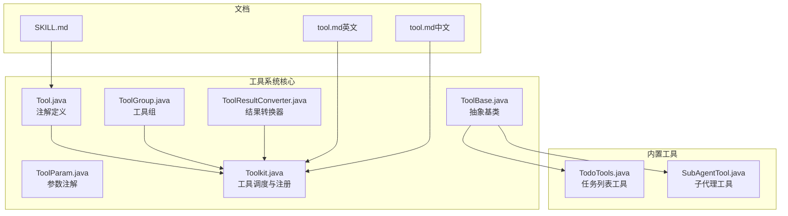
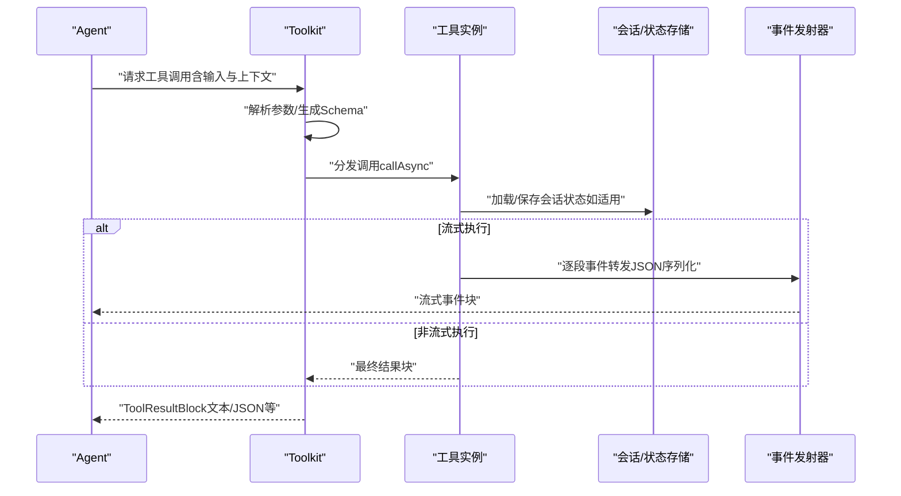
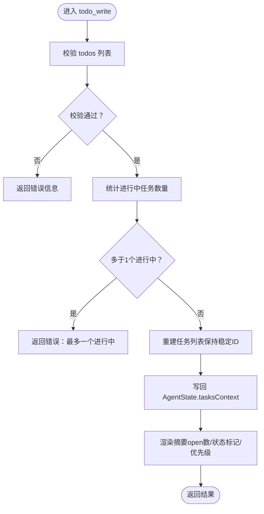
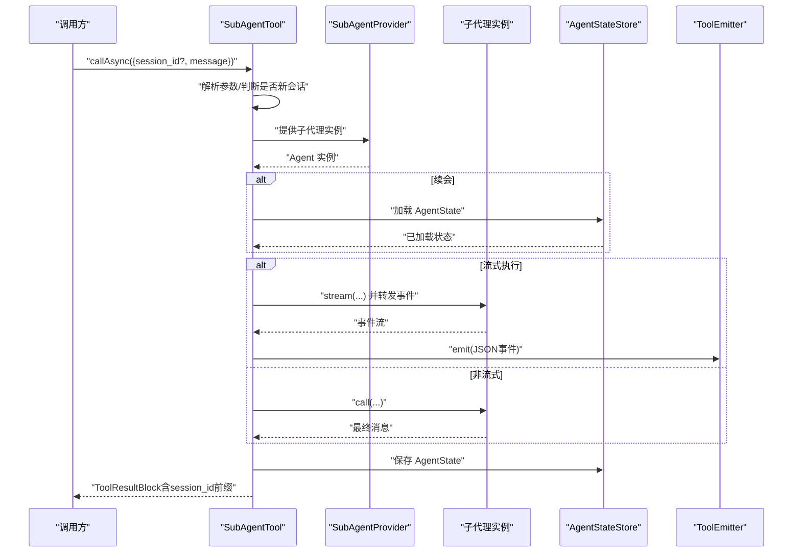
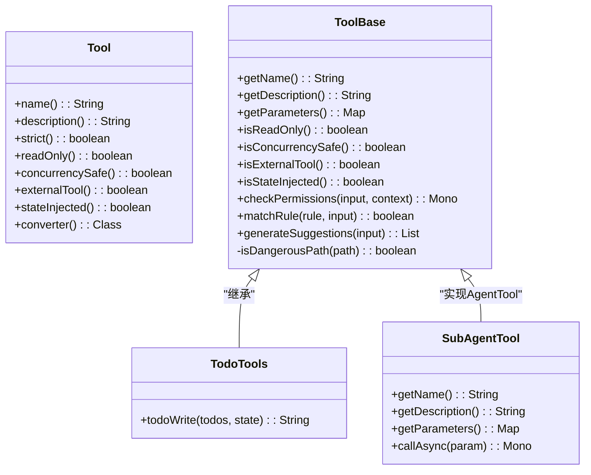
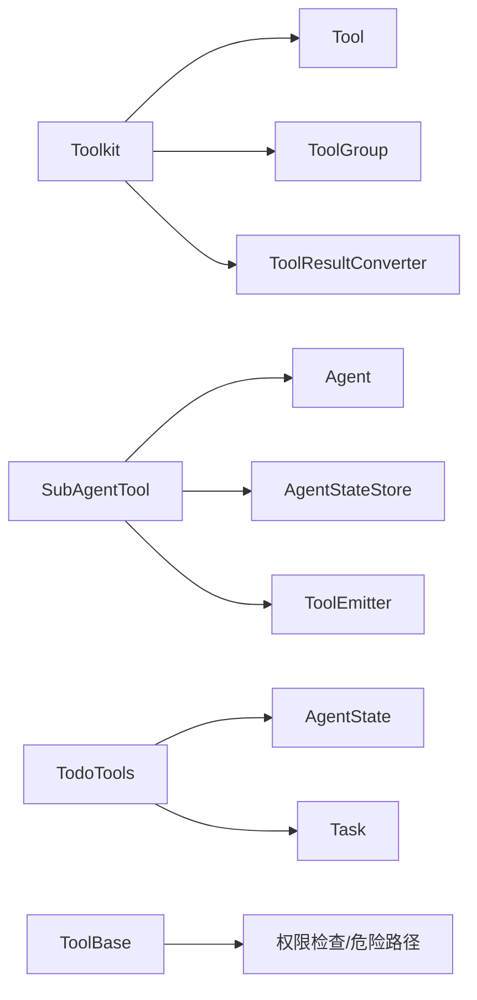

# 内置工具系统

<cite>
**本文引用的文件**
- [Tool.java](file://agentscope-core/src/main/java/io/agentscope/core/tool/Tool.java)
- [ToolBase.java](file://agentscope-core/src/main/java/io/agentscope/core/tool/ToolBase.java)
- [TodoTools.java](file://agentscope-core/src/main/java/io/agentscope/core/tool/builtin/TodoTools.java)
- [SubAgentTool.java](file://agentscope-core/src/main/java/io/agentscope/core/tool/subagent/SubAgentTool.java)
- [Toolkit.java](file://agentscope-core/src/main/java/io/agentscope/core/tool/Toolkit.java)
- [ToolParam.java](file://agentscope-core/src/main/java/io/agentscope/core/tool/ToolParam.java)
- [ToolResultConverter.java](file://agentscope-core/src/main/java/io/agentscope/core/tool/ToolResultConverter.java)
- [ToolGroup.java](file://agentscope-core/src/main/java/io/agentscope/core/tool/ToolGroup.java)
- [tool.md（英文）](file://docs/v2/en/docs/building-blocks/tool.md)
- [tool.md（中文）](file://docs/v2/zh/docs/building-blocks/tool.md)
- [SKILL.md](file://SKILL.md)
</cite>

## 目录
1. [简介](#简介)
2. [项目结构](#项目结构)
3. [核心组件](#核心组件)
4. [架构总览](#架构总览)
5. [详细组件分析](#详细组件分析)
6. [依赖关系分析](#依赖关系分析)
7. [性能考量](#性能考量)
8. [故障排查指南](#故障排查指南)
9. [结论](#结论)
10. [附录](#附录)

## 简介
本文件面向AgentScope的内置工具系统，围绕Toolkit类的设计架构、工具注册机制、组管理（group management）与生命周期控制进行系统性说明；同时深入解析内置工具如TodoTools任务管理工具、SubAgentTool子代理工具的实现与使用场景，覆盖参数校验、结果转换与错误处理；并提供可操作的实践建议，帮助读者创建自定义工具、组织工具组、实现工具间协作，以及扩展插件化能力与第三方工具集成。

## 项目结构
工具系统位于agentscope-core模块中，核心接口与抽象类定义在tool包下，内置工具位于builtin与subagent子包，配套文档位于docs与SKILL文档中。下图给出与本文相关的关键文件与职责映射：

图表来源
- [Tool.java:1-194](file://agentscope-core/src/main/java/io/agentscope/core/tool/Tool.java#L1-L194)
- [ToolBase.java:1-342](file://agentscope-core/src/main/java/io/agentscope/core/tool/ToolBase.java#L1-L342)
- [ToolParam.java](file://agentscope-core/src/main/java/io/agentscope/core/tool/ToolParam.java)
- [ToolResultConverter.java](file://agentscope-core/src/main/java/io/agentscope/core/tool/ToolResultConverter.java)
- [ToolGroup.java](file://agentscope-core/src/main/java/io/agentscope/core/tool/ToolGroup.java)
- [Toolkit.java](file://agentscope-core/src/main/java/io/agentscope/core/tool/Toolkit.java)
- [TodoTools.java:1-262](file://agentscope-core/src/main/java/io/agentscope/core/tool/builtin/TodoTools.java#L1-L262)
- [SubAgentTool.java:1-551](file://agentscope-core/src/main/java/io/agentscope/core/tool/subagent/SubAgentTool.java#L1-L551)
- [tool.md（英文）:501-548](file://docs/v2/en/docs/building-blocks/tool.md#L501-L548)
- [tool.md（中文）:505-552](file://docs/v2/zh/docs/building-blocks/tool.md#L505-L552)
- [SKILL.md:355-395](file://SKILL.md#L355-L395)

章节来源
- [Toolkit.java](file://agentscope-core/src/main/java/io/agentscope/core/tool/Toolkit.java)
- [Tool.java:1-194](file://agentscope-core/src/main/java/io/agentscope/core/tool/Tool.java#L1-L194)
- [ToolBase.java:1-342](file://agentscope-core/src/main/java/io/agentscope/core/tool/ToolBase.java#L1-L342)
- [TodoTools.java:1-262](file://agentscope-core/src/main/java/io/agentscope/core/tool/builtin/TodoTools.java#L1-L262)
- [SubAgentTool.java:1-551](file://agentscope-core/src/main/java/io/agentscope/core/tool/subagent/SubAgentTool.java#L1-L551)
- [ToolGroup.java](file://agentscope-core/src/main/java/io/agentscope/core/tool/ToolGroup.java)
- [ToolParam.java](file://agentscope-core/src/main/java/io/agentscope/core/tool/ToolParam.java)
- [ToolResultConverter.java](file://agentscope-core/src/main/java/io/agentscope/core/tool/ToolResultConverter.java)
- [tool.md（英文）:501-548](file://docs/v2/en/docs/building-blocks/tool.md#L501-L548)
- [tool.md（中文）:505-552](file://docs/v2/zh/docs/building-blocks/tool.md#L505-L552)
- [SKILL.md:355-395](file://SKILL.md#L355-L395)

## 核心组件
- 工具注解与契约
  - Tool：用于标注方法为可被AI调用的工具，支持命名、描述、严格模式、只读、并发安全、外部工具标记、状态注入、危险路径白名单等配置项。
  - ToolParam：用于标注工具方法参数，配合Tool使用以生成JSON Schema。
  - ToolResultConverter：定义工具返回值到ToolResultBlock的转换策略，默认实现由框架提供。
- 抽象基类
  - ToolBase：提供工具元信息（名称、描述、参数Schema）、权限检查钩子、危险路径检测、MCP与外部工具标识、并发安全与只读语义等。
- 工具组
  - ToolGroup：命名化的工具集合，支持作用域（如会话级）与初始激活状态，配合Meta Tool实现运行时切换。
- 工具调度
  - Toolkit：负责扫描、注册、分发工具调用，暴露工具Schema供模型消费；支持Meta Tool以动态启用/禁用工具组。

章节来源
- [Tool.java:1-194](file://agentscope-core/src/main/java/io/agentscope/core/tool/Tool.java#L1-L194)
- [ToolBase.java:1-342](file://agentscope-core/src/main/java/io/agentscope/core/tool/ToolBase.java#L1-L342)
- [ToolParam.java](file://agentscope-core/src/main/java/io/agentscope/core/tool/ToolParam.java)
- [ToolResultConverter.java](file://agentscope-core/src/main/java/io/agentscope/core/tool/ToolResultConverter.java)
- [ToolGroup.java](file://agentscope-core/src/main/java/io/agentscope/core/tool/ToolGroup.java)
- [Toolkit.java](file://agentscope-core/src/main/java/io/agentscope/core/tool/Toolkit.java)

## 架构总览
下图展示工具系统从“注册—发现—执行—结果转换—事件转发”的端到端流程，映射到具体源码文件与职责边界。

图表来源
- [SubAgentTool.java:129-199](file://agentscope-core/src/main/java/io/agentscope/core/tool/subagent/SubAgentTool.java#L129-L199)
- [SubAgentTool.java:272-334](file://agentscope-core/src/main/java/io/agentscope/core/tool/subagent/SubAgentTool.java#L272-L334)
- [SubAgentTool.java:362-376](file://agentscope-core/src/main/java/io/agentscope/core/tool/subagent/SubAgentTool.java#L362-L376)
- [Toolkit.java](file://agentscope-core/src/main/java/io/agentscope/core/tool/Toolkit.java)

## 详细组件分析

### Toolkit：注册、发现与调度
- 动态注册
  - 支持扫描对象中的@Tool方法并注册为工具；支持注册ToolGroup并按作用域激活/禁用。
  - 提供Meta Tool（如reset_tools）以动态切换工具组可见性，减少上下文噪声。
- 组管理
  - ToolGroup包含名称、描述、作用域与初始激活标志；保留名“basic”由Toolkit自动注册且始终激活。
  - 文档示例展示了如何定义多个ToolGroup并启用Meta Tool。
- 生命周期控制
  - 工具调用通过callAsync统一入口；外部工具不直接本地执行，而是抛出异常交由上层处理。
  - 结果转换通过ToolResultConverter完成，支持自定义转换器以过滤敏感数据、格式化输出或附加元数据。

章节来源
- [Toolkit.java](file://agentscope-core/src/main/java/io/agentscope/core/tool/Toolkit.java)
- [ToolGroup.java](file://agentscope-core/src/main/java/io/agentscope/core/tool/ToolGroup.java)
- [tool.md（英文）:501-548](file://docs/v2/en/docs/building-blocks/tool.md#L501-L548)
- [tool.md（中文）:505-552](file://docs/v2/zh/docs/building-blocks/tool.md#L505-L552)

### Tool与ToolBase：契约与安全
- 契约与约束
  - Tool注解要求参数必须标注ToolParam（除ToolEmitter），返回类型支持字符串或响应式类型；工具名遵循snake_case约定；描述需清晰说明用途与触发条件。
  - ToolBase提供默认实现：只读工具在特定模式下自动放行；外部工具禁止本地调用；默认权限检查透传至规则表。
- 安全与合规
  - 危险路径检测：对文件名与路径段进行大小写无关匹配，支持符号链接真实路径解析，防止绕过。
  - 权限建议与规则匹配：默认生成基于工具名的建议规则，子类可覆盖以细化策略。

章节来源
- [Tool.java:1-194](file://agentscope-core/src/main/java/io/agentscope/core/tool/Tool.java#L1-L194)
- [ToolBase.java:1-342](file://agentscope-core/src/main/java/io/agentscope/core/tool/ToolBase.java#L1-L342)
- [SKILL.md:355-395](file://SKILL.md#L355-L395)

### TodoTools：任务管理工具
- 设计要点
  - 全量替换语义：每次调用传递完整更新后的任务列表，工具重建任务上下文；该设计简化了模型推理负担，避免细粒度增删改。
  - 会话持久化：任务列表作为AgentState的一部分，随ReActAgent的调用周期自动落盘。
  - 状态约束：强制最多仅有一个任务处于“进行中”，并要求内容非空；状态解析失败时返回明确错误。
- 参数与结果
  - 输入参数包含“todos”（TodoItem列表），其中TodoItem包含content/status/priority三要素；输出为格式化后的任务摘要。
- 错误处理
  - 对非法状态、多重进行中、空内容等情况进行即时校验并返回错误信息；对状态不可解析的情况给出提示。

图表来源
- [TodoTools.java:92-173](file://agentscope-core/src/main/java/io/agentscope/core/tool/builtin/TodoTools.java#L92-L173)

章节来源
- [TodoTools.java:1-262](file://agentscope-core/src/main/java/io/agentscope/core/tool/builtin/TodoTools.java#L1-L262)

### SubAgentTool：子代理工具
- 设计要点
  - 多轮对话与会话管理：通过session_id区分新会话与续会；首次调用生成随机ID；后续调用需携带上次返回的session_id以延续记忆。
  - 状态存取：基于配置的AgentStateStore加载/保存子代理的AgentState，确保跨轮次上下文一致。
  - 执行模式：支持流式与非流式两种执行路径；流式执行将事件序列化后转发给ToolEmitter，便于上层观察与调试。
  - 工具命名与描述：优先使用配置覆盖，否则从被包装的Agent派生；对非英文或超长名称进行安全裁剪与哈希后缀处理，满足LLM API命名限制。
- 参数与Schema
  - 必填参数：message；可选参数：session_id（续会时必填）。
- 错误处理
  - 输入校验（消息必填）、会话初始化异常、状态读写失败均记录日志并返回错误结果块；流式执行异常被捕获并转化为错误结果。

图表来源
- [SubAgentTool.java:129-199](file://agentscope-core/src/main/java/io/agentscope/core/tool/subagent/SubAgentTool.java#L129-L199)
- [SubAgentTool.java:272-334](file://agentscope-core/src/main/java/io/agentscope/core/tool/subagent/SubAgentTool.java#L272-L334)
- [SubAgentTool.java:362-376](file://agentscope-core/src/main/java/io/agentscope/core/tool/subagent/SubAgentTool.java#L362-L376)

章节来源
- [SubAgentTool.java:1-551](file://agentscope-core/src/main/java/io/agentscope/core/tool/subagent/SubAgentTool.java#L1-L551)

### 类关系图（代码级）

图表来源
- [Tool.java:1-194](file://agentscope-core/src/main/java/io/agentscope/core/tool/Tool.java#L1-L194)
- [ToolBase.java:1-342](file://agentscope-core/src/main/java/io/agentscope/core/tool/ToolBase.java#L1-L342)
- [TodoTools.java:1-262](file://agentscope-core/src/main/java/io/agentscope/core/tool/builtin/TodoTools.java#L1-L262)
- [SubAgentTool.java:1-551](file://agentscope-core/src/main/java/io/agentscope/core/tool/subagent/SubAgentTool.java#L1-L551)

## 依赖关系分析
- 组件耦合
  - SubAgentTool强依赖Agent与RuntimeContext，通过Provider获取实例并使用状态存储；与事件发射器交互以实现流式可观测性。
  - TodoTools依赖AgentState与Task上下文，强调会话内状态一致性与持久化。
  - Toolkit依赖Tool、ToolBase、ToolGroup与ToolResultConverter，承担注册、分发与结果转换职责。
- 外部依赖
  - 日志框架（SLF4J）用于错误与警告输出。
  - Reactor（Mono/Flux）用于异步与流式处理。
  - Jackson用于事件序列化（在SubAgentTool中）。

图表来源
- [Toolkit.java](file://agentscope-core/src/main/java/io/agentscope/core/tool/Toolkit.java)
- [Tool.java:1-194](file://agentscope-core/src/main/java/io/agentscope/core/tool/Tool.java#L1-L194)
- [ToolBase.java:1-342](file://agentscope-core/src/main/java/io/agentscope/core/tool/ToolBase.java#L1-L342)
- [TodoTools.java:1-262](file://agentscope-core/src/main/java/io/agentscope/core/tool/builtin/TodoTools.java#L1-L262)
- [SubAgentTool.java:1-551](file://agentscope-core/src/main/java/io/agentscope/core/tool/subagent/SubAgentTool.java#L1-L551)

章节来源
- [Toolkit.java](file://agentscope-core/src/main/java/io/agentscope/core/tool/Toolkit.java)
- [ToolBase.java:1-342](file://agentscope-core/src/main/java/io/agentscope/core/tool/ToolBase.java#L1-L342)
- [SubAgentTool.java:1-551](file://agentscope-core/src/main/java/io/agentscope/core/tool/subagent/SubAgentTool.java#L1-L551)
- [TodoTools.java:1-262](file://agentscope-core/src/main/java/io/agentscope/core/tool/builtin/TodoTools.java#L1-L262)

## 性能考量
- 并发与串行化
  - 工具并发安全默认开启，适合纯函数式工具；对于有共享状态或资源竞争的工具应设置concurrencySafe=false，以便框架在并行批次中串行化调用。
- 流式执行
  - SubAgentTool在forwardEvents开启时采用流式执行，事件逐段转发，有利于低延迟与可观测性；但需注意序列化开销与事件风暴风险。
- 状态持久化
  - 子代理状态的加载/保存发生在会话开始与结束，频繁调用可能带来I/O压力；建议合理选择状态存储实现与缓存策略。
- Schema生成与反射
  - 工具Schema由注解与反射生成，通常在启动阶段完成；避免在热路径重复生成。

## 故障排查指南
- 工具未被发现
  - 确认工具类包含@Tool方法且被Toolkit正确注册；检查Tool注解参数（name/description）是否符合规范。
- 外部工具本地调用
  - 若工具标记为externalTool=true，请勿在框架内直接调用其callAsync，应通过上层“暂停”机制交由外部处理。
- 子代理会话问题
  - 未携带session_id导致新会话；续会时必须使用上次返回的session_id；状态读写异常会记录告警并返回错误结果。
- Todo任务状态异常
  - 多个“进行中”任务、空内容或非法状态将被拒绝；请根据返回的错误信息修正输入。
- 权限与危险路径
  - 文件名或路径包含危险关键字会被拦截；可通过dangerousFiles/dangerousDirectories扩展策略，或调整工具自检逻辑。

章节来源
- [Tool.java:1-194](file://agentscope-core/src/main/java/io/agentscope/core/tool/Tool.java#L1-L194)
- [ToolBase.java:183-207](file://agentscope-core/src/main/java/io/agentscope/core/tool/ToolBase.java#L183-L207)
- [SubAgentTool.java:129-199](file://agentscope-core/src/main/java/io/agentscope/core/tool/subagent/SubAgentTool.java#L129-L199)
- [TodoTools.java:111-134](file://agentscope-core/src/main/java/io/agentscope/core/tool/builtin/TodoTools.java#L111-L134)

## 结论
AgentScope的内置工具系统以注解驱动为核心，结合Toolkit的动态注册与分发、ToolBase的安全与权限钩子、以及ToolGroup的运行时组管理，形成了高扩展、可插拔的工具生态。内置的TodoTools与SubAgentTool分别覆盖任务编排与多轮对话场景，具备明确的参数校验、结果转换与错误处理机制。通过Meta Tool与工具组，系统实现了上下文聚焦与动态能力开关，便于在复杂任务中按需暴露工具集。对于第三方工具集成，推荐遵循Tool注解规范与ToolResultConverter扩展点，确保与框架的统一性与安全性。

## 附录
- 创建自定义工具
  - 使用@Tool与@ToolParam标注方法与参数；返回类型支持字符串或响应式类型；必要时实现自定义ToolResultConverter。
  - 参考示例路径：[SKILL.md 示例:355-395](file://SKILL.md#L355-L395)
- 组织工具组
  - 定义ToolGroup并注册到Toolkit；通过enableMetaTool启用动态切换；参考文档示例：
    - [tool.md（英文）:501-548](file://docs/v2/en/docs/building-blocks/tool.md#L501-L548)
    - [tool.md（中文）:505-552](file://docs/v2/zh/docs/building-blocks/tool.md#L505-L552)
- 工具间协作
  - SubAgentTool可作为“工具”，被其他Agent调用以实现多轮对话与状态延续；通过session_id实现跨轮次协作。
- 扩展与集成
  - 遵循Tool契约与安全钩子；对外部工具采用“暂停”机制交由外部处理；对危险路径与权限策略进行细化与测试。