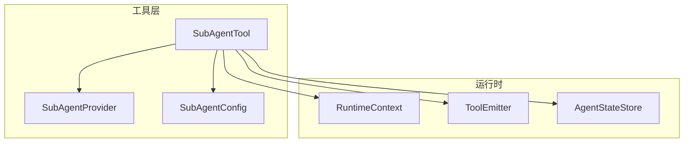
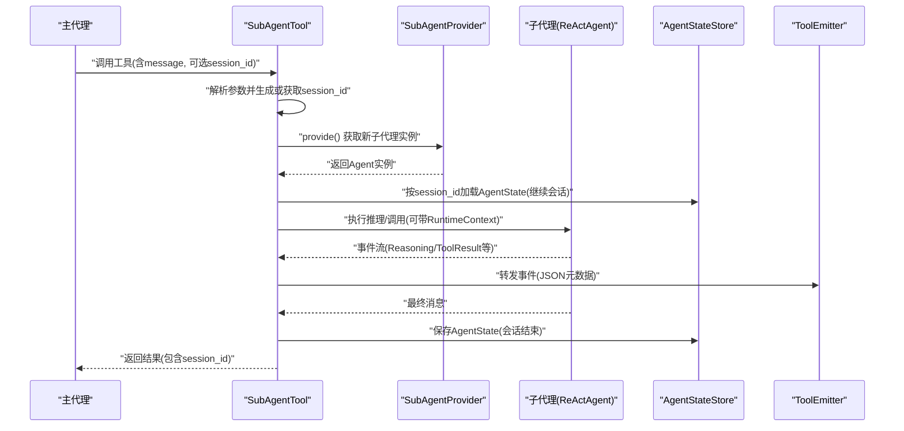
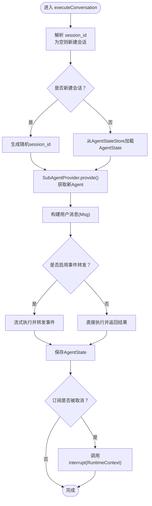
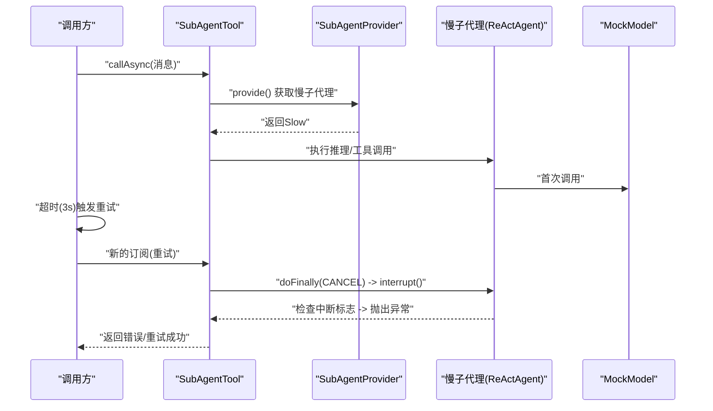
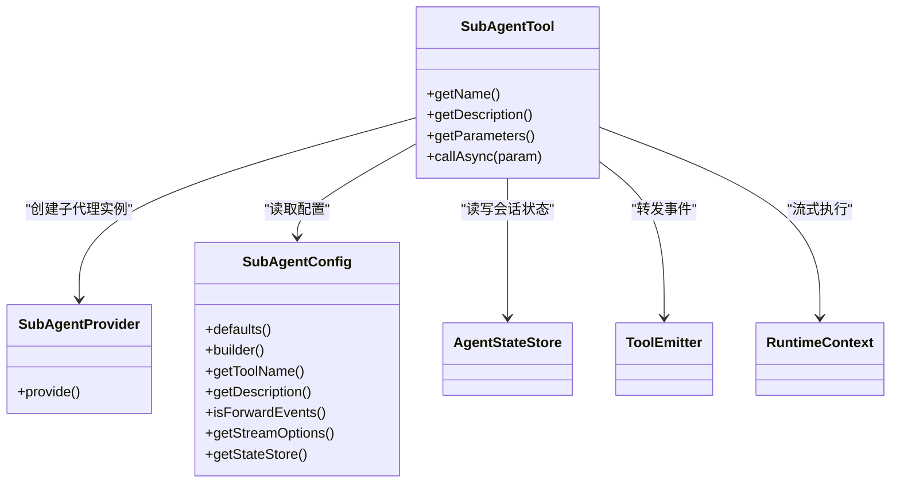

# 子代理协调工具

<cite>
**本文引用的文件**   
- [SubAgentConfig.java](file://agentscope-core/src/main/java/io/agentscope/core/tool/subagent/SubAgentConfig.java)
- [SubAgentProvider.java](file://agentscope-core/src/main/java/io/agentscope/core/tool/subagent/SubAgentProvider.java)
- [SubAgentTool.java](file://agentscope-core/src/main/java/io/agentscope/core/tool/subagent/SubAgentTool.java)
- [SubAgentConfigTest.java](file://agentscope-core/src/test/java/io/agentscope/core/tool/subagent/SubAgentConfigTest.java)
- [SubAgentToolTimeoutRetryIntegrationTest.java](file://agentscope-core/src/test/java/io/agentscope/core/tool/subagent/SubAgentToolTimeoutRetryIntegrationTest.java)
- [agent-as-tool.md](file://docs/v1/en/docs/task/agent-as-tool.md)
- [subagent.md](file://docs/v1/en/docs/multi-agent/subagent.md)
- [ToolkitTest.java](file://agentscope-core/src/test/java/io/agentscope/core/tool/ToolkitTest.java)
</cite>

## 目录
1. [简介](#简介)
2. [项目结构](#项目结构)
3. [核心组件](#核心组件)
4. [架构总览](#架构总览)
5. [详细组件分析](#详细组件分析)
6. [依赖关系分析](#依赖关系分析)
7. [性能考量](#性能考量)
8. [故障排查指南](#故障排查指南)
9. [结论](#结论)
10. [附录](#附录)

## 简介
本文件面向“子代理协调工具”的设计与实现，围绕以下目标展开：  
- 深入解释 SubAgentTool 的设计架构，包括子代理的创建、配置与生命周期管理；  
- 详解 SubAgentConfig 配置类的功能边界（资源分配、超时与重试、事件转发与隔离策略）；  
- 解释 SubAgentProvider 提供者机制，涵盖子代理的动态加载与实例化流程；  
- 给出复杂多代理协作系统的实践路径，覆盖子代理间通信与数据共享、代理级监控与故障恢复；  
- 说明子代理工具与主代理的交互模式与状态同步机制。

## 项目结构
子代理协调工具位于 agentscope-core 模块的 tool/subagent 包中，核心由三部分组成：
- SubAgentTool：作为工具对外暴露，负责会话管理、事件转发、状态持久化与中断控制；
- SubAgentConfig：用于配置工具名、描述、事件转发、流式选项与状态存储；
- SubAgentProvider：函数式接口，确保每次调用都创建全新子代理实例，避免线程安全问题。

图示来源
- [SubAgentTool.java:62-93](file://agentscope-core/src/main/java/io/agentscope/core/tool/subagent/SubAgentTool.java#L62-L93)
- [SubAgentProvider.java:42-54](file://agentscope-core/src/main/java/io/agentscope/core/tool/subagent/SubAgentProvider.java#L42-L54)
- [SubAgentConfig.java:61-96](file://agentscope-core/src/main/java/io/agentscope/core/tool/subagent/SubAgentConfig.java#L61-L96)

章节来源
- [SubAgentTool.java:62-93](file://agentscope-core/src/main/java/io/agentscope/core/tool/subagent/SubAgentTool.java#L62-L93)
- [SubAgentProvider.java:16-55](file://agentscope-core/src/main/java/io/agentscope/core/tool/subagent/SubAgentProvider.java#L16-L55)
- [SubAgentConfig.java:23-60](file://agentscope-core/src/main/java/io/agentscope/core/tool/subagent/SubAgentConfig.java#L23-L60)

## 核心组件
- SubAgentTool：实现 AgentTool 接口，封装 ReActAgent 或其他 Agent 的多轮对话能力，支持会话 ID 管理、事件流转发、状态持久化与订阅取消时的中断控制。
- SubAgentConfig：提供工具名、描述、事件转发开关、流式选项与状态存储的默认值与自定义能力。
- SubAgentProvider：函数式接口，要求每次调用返回全新 Agent 实例，保证并发安全。

章节来源
- [SubAgentTool.java:62-93](file://agentscope-core/src/main/java/io/agentscope/core/tool/subagent/SubAgentTool.java#L62-L93)
- [SubAgentConfig.java:61-96](file://agentscope-core/src/main/java/io/agentscope/core/tool/subagent/SubAgentConfig.java#L61-L96)
- [SubAgentProvider.java:42-54](file://agentscope-core/src/main/java/io/agentscope/core/tool/subagent/SubAgentProvider.java#L42-L54)

## 架构总览
下图展示了主代理通过 SubAgentTool 调用子代理的端到端流程，包括参数解析、会话管理、事件转发与状态持久化。

图示来源
- [SubAgentTool.java:130-221](file://agentscope-core/src/main/java/io/agentscope/core/tool/subagent/SubAgentTool.java#L130-L221)
- [SubAgentTool.java:243-281](file://agentscope-core/src/main/java/io/agentscope/core/tool/subagent/SubAgentTool.java#L243-L281)
- [SubAgentTool.java:309-371](file://agentscope-core/src/main/java/io/agentscope/core/tool/subagent/SubAgentTool.java#L309-L371)
- [SubAgentTool.java:399-413](file://agentscope-core/src/main/java/io/agentscope/core/tool/subagent/SubAgentTool.java#L399-L413)

## 详细组件分析

### SubAgentConfig 配置类
- 设计要点
  - 默认行为：工具名与描述从 Agent 自动派生；事件转发开启；状态存储默认内存实现。
  - 可定制项：工具名、描述、事件转发开关、流式选项、状态存储实现。
  - Builder 模式：链式配置，支持空值安全与默认回退。
- 关键属性与默认值
  - 工具名：若未显式设置则基于 Agent 名称派生，并进行字符清洗与长度截断，必要时追加确定性短哈希。
  - 描述：优先使用配置，其次使用 Agent 描述，最后生成通用模板。
  - 事件转发：默认开启，便于上层钩子链路收集中间态。
  - 流式选项：可指定事件类型与增量/累积模式。
  - 状态存储：默认内存实现，可通过构造函数注入持久化实现（如 JSON 文件）。
- 使用建议
  - 多轮会话需持久化状态存储，避免进程重启丢失上下文。
  - 在生产环境建议关闭事件转发或限制转发事件类型，降低开销。

章节来源
- [SubAgentConfig.java:61-96](file://agentscope-core/src/main/java/io/agentscope/core/tool/subagent/SubAgentConfig.java#L61-L96)
- [SubAgentConfig.java:152-241](file://agentscope-core/src/main/java/io/agentscope/core/tool/subagent/SubAgentConfig.java#L152-L241)
- [SubAgentConfigTest.java:36-67](file://agentscope-core/src/test/java/io/agentscope/core/tool/subagent/SubAgentConfigTest.java#L36-L67)
- [SubAgentConfigTest.java:69-175](file://agentscope-core/src/test/java/io/agentscope/core/tool/subagent/SubAgentConfigTest.java#L69-L175)
- [SubAgentConfigTest.java:177-244](file://agentscope-core/src/test/java/io/agentscope/core/tool/subagent/SubAgentConfigTest.java#L177-L244)

### SubAgentProvider 提供者
- 角色与约束
  - 函数式接口，每次工具调用均需返回全新 Agent 实例，避免 ReActAgent 等非线程安全组件被复用导致竞态。
  - 典型实现：lambda 表达式内调用 Agent.builder().build()，或从外部容器获取新实例。
- 最佳实践
  - 将模型、工具箱、内存与钩子等依赖在提供者内部重新装配，确保隔离性。
  - 对于复杂 Agent，建议在提供者中注入最小可用配置，避免跨调用共享状态。

章节来源
- [SubAgentProvider.java:16-55](file://agentscope-core/src/main/java/io/agentscope/core/tool/subagent/SubAgentProvider.java#L16-L55)

### SubAgentTool 工具
- 参数与模式
  - 必填：message；可选：session_id（不传则新建会话，传入则延续会话）。
  - 支持两种执行模式：带事件转发的流式执行与无事件转发的直接执行。
- 生命周期与状态管理
  - 新建会话：生成随机 session_id 并创建全新 Agent 实例。
  - 继续会话：根据 session_id 从 AgentStateStore 加载 AgentState，并合并到当前实例。
  - 执行完成后：将 AgentState 再次保存至 AgentStateStore。
- 事件转发与监控
  - 当启用事件转发时，将事件序列化为 JSON 文本块，携带子代理名称、ID、会话 ID 等元信息，通过 ToolEmitter 发送到父代理的钩子链路。
  - 适合在父代理侧接入日志、指标采集与可视化。
- 中断与资源回收
  - 订阅取消（如超时触发重试）时，通过 doFinally(SignalType.CANCEL) 调用子代理的 interrupt(RuntimeContext)，防止孤儿任务继续消耗 LLM、网络或线程池资源。
- 命名派生与兼容性
  - 工具名自动从 Agent 名称派生，经过字符清洗与长度截断，必要时追加短哈希，确保满足 LLM API 的命名约束。

图示来源
- [SubAgentTool.java:130-221](file://agentscope-core/src/main/java/io/agentscope/core/tool/subagent/SubAgentTool.java#L130-L221)
- [SubAgentTool.java:243-281](file://agentscope-core/src/main/java/io/agentscope/core/tool/subagent/SubAgentTool.java#L243-L281)
- [SubAgentTool.java:227-236](file://agentscope-core/src/main/java/io/agentscope/core/tool/subagent/SubAgentTool.java#L227-L236)

章节来源
- [SubAgentTool.java:62-93](file://agentscope-core/src/main/java/io/agentscope/core/tool/subagent/SubAgentTool.java#L62-L93)
- [SubAgentTool.java:110-113](file://agentscope-core/src/main/java/io/agentscope/core/tool/subagent/SubAgentTool.java#L110-L113)
- [SubAgentTool.java:130-221](file://agentscope-core/src/main/java/io/agentscope/core/tool/subagent/SubAgentTool.java#L130-L221)
- [SubAgentTool.java:243-281](file://agentscope-core/src/main/java/io/agentscope/core/tool/subagent/SubAgentTool.java#L243-L281)
- [SubAgentTool.java:309-371](file://agentscope-core/src/main/java/io/agentscope/core/tool/subagent/SubAgentTool.java#L309-L371)
- [SubAgentTool.java:399-413](file://agentscope-core/src/main/java/io/agentscope/core/tool/subagent/SubAgentTool.java#L399-L413)
- [SubAgentTool.java:425-433](file://agentscope-core/src/main/java/io/agentscope/core/tool/subagent/SubAgentTool.java#L425-L433)
- [SubAgentTool.java:447-473](file://agentscope-core/src/main/java/io/agentscope/core/tool/subagent/SubAgentTool.java#L447-L473)
- [SubAgentTool.java:487-563](file://agentscope-core/src/main/java/io/agentscope/core/tool/subagent/SubAgentTool.java#L487-L563)

### 与主代理的交互与状态同步
- 参数契约
  - 主代理通过工具调用向 SubAgentTool 传递 message 与可选 session_id。
  - SubAgentTool 返回的结果包含 session_id，便于后续继续同一会话。
- 状态同步
  - 继续会话时，SubAgentTool 从 AgentStateStore 加载 AgentState 并合并到当前实例，确保上下文连续。
  - 会话结束时保存 AgentState，实现跨调用的状态持久化。
- 事件联动
  - 启用事件转发后，父代理可接收子代理的中间事件，用于实时监控、调试与可视化。

章节来源
- [SubAgentTool.java:447-473](file://agentscope-core/src/main/java/io/agentscope/core/tool/subagent/SubAgentTool.java#L447-L473)
- [SubAgentTool.java:243-281](file://agentscope-core/src/main/java/io/agentscope/core/tool/subagent/SubAgentTool.java#L243-L281)
- [SubAgentTool.java:309-371](file://agentscope-core/src/main/java/io/agentscope/core/tool/subagent/SubAgentTool.java#L309-L371)

### 复杂多代理协作与通信
- 协作模式
  - 主代理作为编排器，按需调用多个子代理工具，每个子代理拥有独立的 AgentStateStore 与工具集，彼此隔离。
  - 子代理之间不直接通信，数据交换通过主代理聚合与合成。
- 数据共享
  - 可通过共享的 AgentStateStore 实现有限的数据共享（例如公共知识库或缓存），但需注意隔离边界与一致性。
- 监控与可观测性
  - 利用事件转发机制，将子代理的推理片段、工具调用片段与结果片段统一上报到父代理的钩子链路，便于集中记录与分析。
- 故障恢复
  - 通过订阅取消触发的中断机制，及时终止长时间运行的子代理任务，避免资源浪费与状态漂移。

章节来源
- [SubAgentTool.java:309-371](file://agentscope-core/src/main/java/io/agentscope/core/tool/subagent/SubAgentTool.java#L309-L371)
- [SubAgentTool.java:227-236](file://agentscope-core/src/main/java/io/agentscope/core/tool/subagent/SubAgentTool.java#L227-L236)
- [agent-as-tool.md:73-98](file://docs/v1/en/docs/task/agent-as-tool.md#L73-L98)

### 示例：超时与重试下的中断保护
该集成测试验证了当上游对 SubAgentTool 的调用发生超时时，订阅取消会触发子代理中断，阻止其继续执行长耗时任务与二次 LLM 调用。

图示来源
- [SubAgentToolTimeoutRetryIntegrationTest.java:66-221](file://agentscope-core/src/test/java/io/agentscope/core/tool/subagent/SubAgentToolTimeoutRetryIntegrationTest.java#L66-L221)
- [SubAgentTool.java:191-210](file://agentscope-core/src/main/java/io/agentscope/core/tool/subagent/SubAgentTool.java#L191-L210)

章节来源
- [SubAgentToolTimeoutRetryIntegrationTest.java:66-221](file://agentscope-core/src/test/java/io/agentscope/core/tool/subagent/SubAgentToolTimeoutRetryIntegrationTest.java#L66-L221)
- [SubAgentTool.java:191-210](file://agentscope-core/src/main/java/io/agentscope/core/tool/subagent/SubAgentTool.java#L191-L210)

## 依赖关系分析
- 组件耦合
  - SubAgentTool 依赖 SubAgentProvider 以获得全新 Agent 实例，避免共享状态引发的竞态。
  - SubAgentTool 依赖 SubAgentConfig 控制事件转发、流式选项与状态存储。
  - SubAgentTool 通过 ToolEmitter 将事件上送父代理，形成父子代理的事件通道。
- 外部依赖
  - AgentStateStore：用于会话状态的读写，默认内存实现，可替换为持久化实现。
  - RuntimeContext：在 ReActAgent 上下文中驱动流式执行与中断检查。
  - Reactor：用于响应式流式处理与订阅生命周期管理。

图示来源
- [SubAgentTool.java:62-93](file://agentscope-core/src/main/java/io/agentscope/core/tool/subagent/SubAgentTool.java#L62-L93)
- [SubAgentProvider.java:42-54](file://agentscope-core/src/main/java/io/agentscope/core/tool/subagent/SubAgentProvider.java#L42-L54)
- [SubAgentConfig.java:61-96](file://agentscope-core/src/main/java/io/agentscope/core/tool/subagent/SubAgentConfig.java#L61-L96)

章节来源
- [SubAgentTool.java:62-93](file://agentscope-core/src/main/java/io/agentscope/core/tool/subagent/SubAgentTool.java#L62-L93)
- [SubAgentProvider.java:42-54](file://agentscope-core/src/main/java/io/agentscope/core/tool/subagent/SubAgentProvider.java#L42-L54)
- [SubAgentConfig.java:61-96](file://agentscope-core/src/main/java/io/agentscope/core/tool/subagent/SubAgentConfig.java#L61-L96)

## 性能考量
- 事件转发成本
  - 启用事件转发会增加序列化与传输开销，建议在生产中按需开启或限制事件类型。
- 状态存储
  - 内存状态存储具备低延迟优势，但不具备持久化能力；对于需要跨进程/重启保持上下文的场景，应选用持久化 AgentStateStore。
- 中断与资源回收
  - 订阅取消触发的中断可有效避免孤儿任务，减少不必要的计算与网络消耗。
- 命名与参数校验
  - 工具名自动派生时可能引入哈希后缀，建议在配置中显式设置英文工具名，提升可读性与稳定性。

## 故障排查指南
- 常见问题
  - 会话状态未生效：确认是否正确传入 session_id，以及 AgentStateStore 是否可读写。
  - 事件未到达父代理：检查 SubAgentConfig 的事件转发开关与流式选项。
  - 资源泄漏：确认订阅取消路径是否触发中断，避免长耗时子代理持续占用资源。
- 定位手段
  - 查看 SubAgentTool 的日志输出，关注会话开始/继续、状态加载/保存与事件转发的关键节点。
  - 使用集成测试中的断言思路，验证中断是否按预期触发与资源是否被及时释放。

章节来源
- [SubAgentTool.java:214-219](file://agentscope-core/src/main/java/io/agentscope/core/tool/subagent/SubAgentTool.java#L214-L219)
- [SubAgentTool.java:243-281](file://agentscope-core/src/main/java/io/agentscope/core/tool/subagent/SubAgentTool.java#L243-L281)
- [SubAgentTool.java:309-371](file://agentscope-core/src/main/java/io/agentscope/core/tool/subagent/SubAgentTool.java#L309-L371)
- [SubAgentToolTimeoutRetryIntegrationTest.java:187-218](file://agentscope-core/src/test/java/io/agentscope/core/tool/subagent/SubAgentToolTimeoutRetryIntegrationTest.java#L187-L218)

## 结论
子代理协调工具通过 SubAgentTool、SubAgentConfig 与 SubAgentProvider 的协同，实现了子代理的隔离实例化、会话状态管理、事件转发与中断回收。在复杂多代理协作场景中，建议：
- 明确划分职责域，使用独立的 AgentStateStore 与工具集；
- 在生产中谨慎开启事件转发，平衡可观测性与性能；
- 通过中断机制保障资源安全，避免孤儿任务；
- 显式配置工具名与描述，提升可维护性与稳定性。

## 附录
- 工具注册与发现（参考）
  - 工具注册与参数校验的单元测试展示了工具注册、发现与参数定义的规范，可作为子代理工具注册的参考实践。
- 文档参考
  - 子代理模式与工具配置的官方文档提供了更广泛的使用场景与最佳实践。

章节来源
- [ToolkitTest.java:97-200](file://agentscope-core/src/test/java/io/agentscope/core/tool/ToolkitTest.java#L97-L200)
- [agent-as-tool.md:73-98](file://docs/v1/en/docs/task/agent-as-tool.md#L73-L98)
- [subagent.md:1-131](file://docs/v1/en/docs/multi-agent/subagent.md#L1-L131)