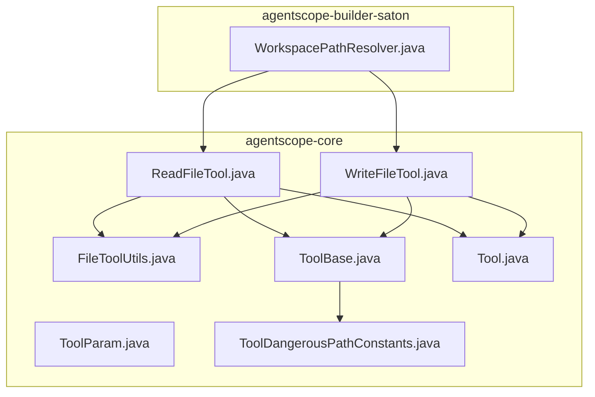
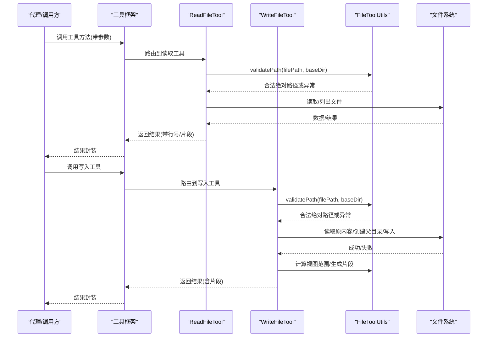
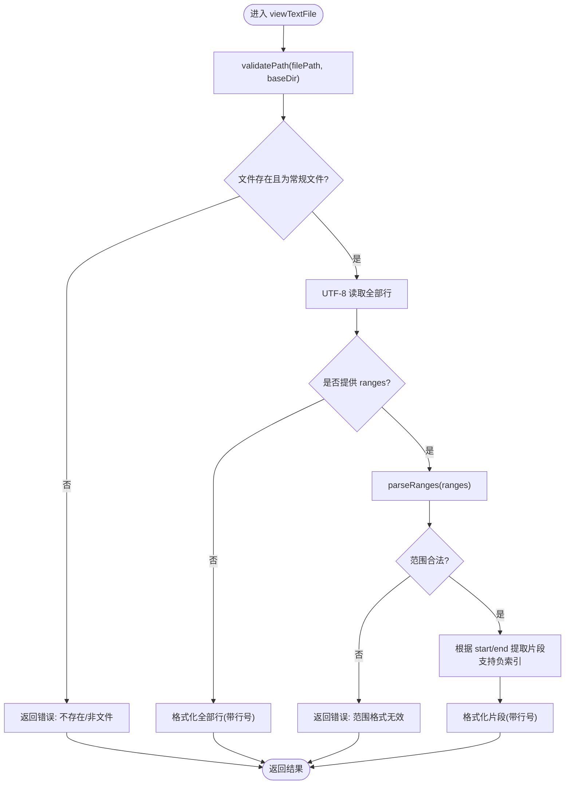
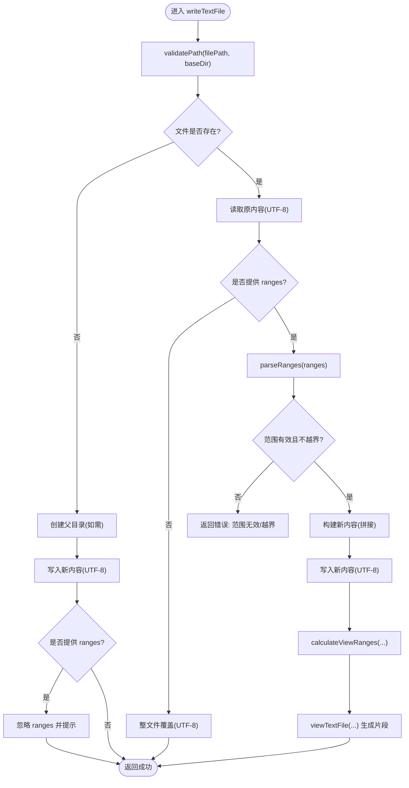
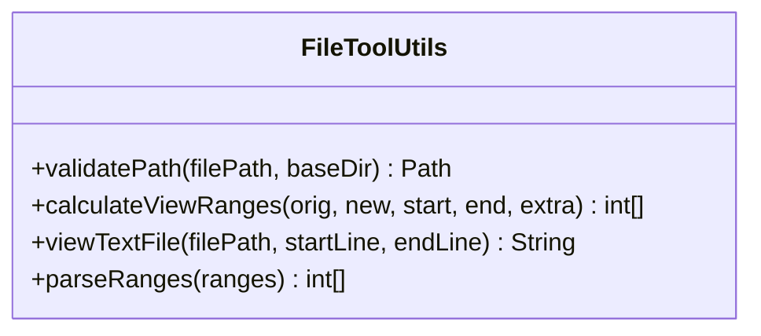
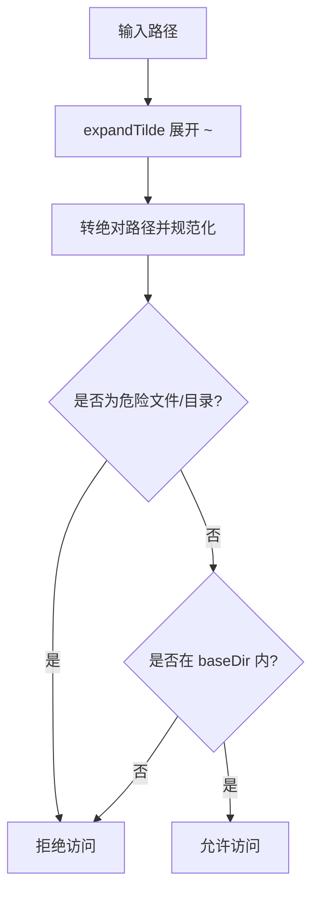
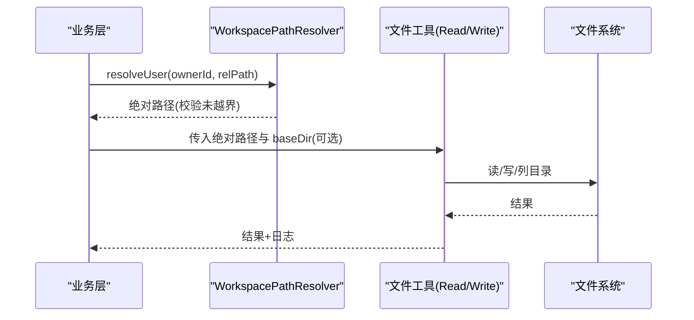
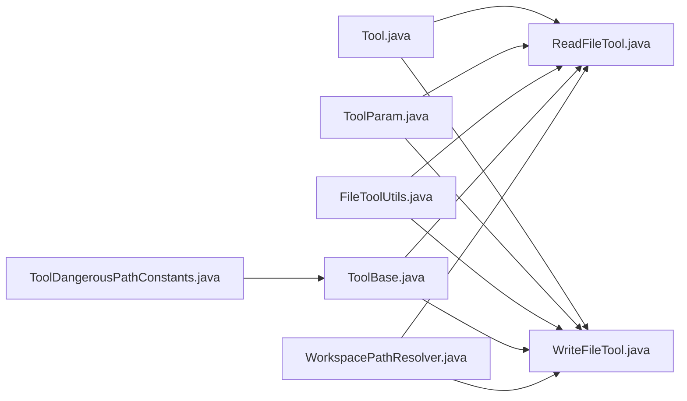
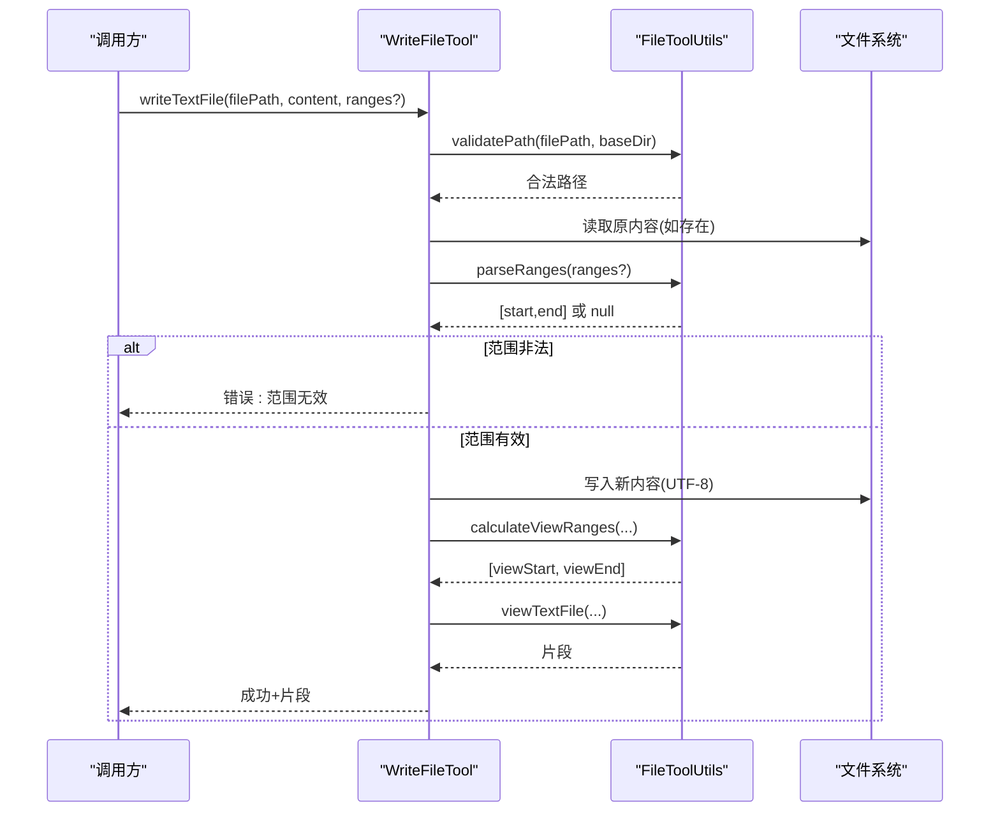

# 文件操作工具

<cite>
**本文引用的文件**   
- [ReadFileTool.java](file://agentscope-core/src/main/java/io/agentscope/core/tool/file/ReadFileTool.java)
- [WriteFileTool.java](file://agentscope-core/src/main/java/io/agentscope/core/tool/file/WriteFileTool.java)
- [FileToolUtils.java](file://agentscope-core/src/main/java/io/agentscope/core/tool/file/FileToolUtils.java)
- [Tool.java](file://agentscope-core/src/main/java/io/agentscope/core/tool/Tool.java)
- [ToolParam.java](file://agentscope-core/src/main/java/io/agentscope/core/tool/ToolParam.java)
- [ToolBase.java](file://agentscope-core/src/main/java/io/agentscope/core/tool/ToolBase.java)
- [ToolDangerousPathConstants.java](file://agentscope-core/src/main/java/io/agentscope/core/tool/ToolDangerousPathConstants.java)
- [WorkspacePathResolver.java](file://agentscope-builder-saton/src/main/java/io/agentscope/builder/saton/workspace/service/WorkspacePathResolver.java)
</cite>

## 目录
1. [引言](#引言)
2. [项目结构](#项目结构)
3. [核心组件](#核心组件)
4. [架构总览](#架构总览)
5. [详细组件分析](#详细组件分析)
6. [依赖关系分析](#依赖关系分析)
7. [性能考虑](#性能考虑)
8. [故障排查指南](#故障排查指南)
9. [结论](#结论)
10. [附录](#附录)

## 引言
本文件面向“文件操作工具”的实现与使用，重点覆盖以下内容：
- ReadFileTool 与 WriteFileTool 的实现原理与安全机制
- FileToolUtils 工具类提供的路径验证、范围解析、视图计算等辅助能力
- 权限控制与安全沙箱策略（含危险路径识别、基础目录限制）
- 与工作区系统（Workspace）的集成方式
- 安全实践：如何正确设置 baseDir、如何处理权限问题、如何记录审计日志
- 典型流程图与时序图帮助理解关键路径

## 项目结构
文件操作工具位于 agentscope-core 模块的 tool.file 包中，并通过通用的工具注解与权限框架协同工作；同时，工作区解析器位于 agentscope-builder-saton 模块中，用于将业务维度的相对路径映射为受控的绝对路径。

**图表来源**
- [ReadFileTool.java:1-357](file://agentscope-core/src/main/java/io/agentscope/core/tool/file/ReadFileTool.java#L1-L357)
- [WriteFileTool.java:1-406](file://agentscope-core/src/main/java/io/agentscope/core/tool/file/WriteFileTool.java#L1-L406)
- [FileToolUtils.java:1-161](file://agentscope-core/src/main/java/io/agentscope/core/tool/file/FileToolUtils.java#L1-L161)
- [ToolBase.java:1-342](file://agentscope-core/src/main/java/io/agentscope/core/tool/ToolBase.java#L1-L342)
- [Tool.java:1-194](file://agentscope-core/src/main/java/io/agentscope/core/tool/Tool.java#L1-L194)
- [ToolParam.java:1-105](file://agentscope-core/src/main/java/io/agentscope/core/tool/ToolParam.java#L1-L105)
- [ToolDangerousPathConstants.java:1-81](file://agentscope-core/src/main/java/io/agentscope/core/tool/ToolDangerousPathConstants.java#L1-L81)
- [WorkspacePathResolver.java:1-92](file://agentscope-builder-saton/src/main/java/io/agentscope/builder/saton/workspace/service/WorkspacePathResolver.java#L1-L92)

**章节来源**
- [ReadFileTool.java:1-357](file://agentscope-core/src/main/java/io/agentscope/core/tool/file/ReadFileTool.java#L1-L357)
- [WriteFileTool.java:1-406](file://agentscope-core/src/main/java/io/agentscope/core/tool/file/WriteFileTool.java#L1-L406)
- [FileToolUtils.java:1-161](file://agentscope-core/src/main/java/io/agentscope/core/tool/file/FileToolUtils.java#L1-L161)
- [ToolBase.java:1-342](file://agentscope-core/src/main/java/io/agentscope/core/tool/ToolBase.java#L1-L342)
- [Tool.java:1-194](file://agentscope-core/src/main/java/io/agentscope/core/tool/Tool.java#L1-L194)
- [ToolParam.java:1-105](file://agentscope-core/src/main/java/io/agentscope/core/tool/ToolParam.java#L1-L105)
- [ToolDangerousPathConstants.java:1-81](file://agentscope-core/src/main/java/io/agentscope/core/tool/ToolDangerousPathConstants.java#L1-L81)
- [WorkspacePathResolver.java:1-92](file://agentscope-builder-saton/src/main/java/io/agentscope/builder/saton/workspace/service/WorkspacePathResolver.java#L1-L92)

## 核心组件
- ReadFileTool：提供文本文件查看、行号范围提取、从末尾负索引取最后 N 行、目录列表等功能；内置基于 baseDir 的路径限制与严格校验。
- WriteFileTool：提供插入内容（指定行号）、替换/覆盖（可选行范围）等写入能力；支持新建文件、父目录自动创建；写后返回上下文片段以供审计。
- FileToolUtils：提供路径合法性校验（防止路径穿越）、范围解析、视图片段生成、修改后视图范围计算等通用能力。
- Tool 注解与参数注解：统一声明工具名称、描述、参数信息，便于框架注册与 LLM 调用。
- ToolBase 与危险路径常量：提供危险文件/目录识别、权限决策入口、默认建议规则等。
- WorkspacePathResolver：将业务层相对路径解析为受控绝对路径，避免越界访问。

**章节来源**
- [ReadFileTool.java:48-357](file://agentscope-core/src/main/java/io/agentscope/core/tool/file/ReadFileTool.java#L48-L357)
- [WriteFileTool.java:43-406](file://agentscope-core/src/main/java/io/agentscope/core/tool/file/WriteFileTool.java#L43-L406)
- [FileToolUtils.java:28-161](file://agentscope-core/src/main/java/io/agentscope/core/tool/file/FileToolUtils.java#L28-L161)
- [Tool.java:57-194](file://agentscope-core/src/main/java/io/agentscope/core/tool/Tool.java#L57-L194)
- [ToolParam.java:59-105](file://agentscope-core/src/main/java/io/agentscope/core/tool/ToolParam.java#L59-L105)
- [ToolBase.java:34-342](file://agentscope-core/src/main/java/io/agentscope/core/tool/ToolBase.java#L34-L342)
- [ToolDangerousPathConstants.java:27-81](file://agentscope-core/src/main/java/io/agentscope/core/tool/ToolDangerousPathConstants.java#L27-L81)
- [WorkspacePathResolver.java:33-92](file://agentscope-builder-saton/src/main/java/io/agentscope/builder/saton/workspace/service/WorkspacePathResolver.java#L33-L92)

## 架构总览
文件工具通过注解暴露方法，经由工具框架注册并参与权限评估；实际文件操作前先进行路径校验与范围解析，确保不越权、不越界。

**图表来源**
- [ReadFileTool.java:89-215](file://agentscope-core/src/main/java/io/agentscope/core/tool/file/ReadFileTool.java#L89-L215)
- [WriteFileTool.java:226-403](file://agentscope-core/src/main/java/io/agentscope/core/tool/file/WriteFileTool.java#L226-L403)
- [FileToolUtils.java:49-79](file://agentscope-core/src/main/java/io/agentscope/core/tool/file/FileToolUtils.java#L49-L79)

## 详细组件分析

### ReadFileTool 分析
- 初始化与安全基座
  - 支持构造时传入 baseDir，内部转换为绝对路径并规范化；若未设置，则不限制。
  - 所有文件操作均通过 FileToolUtils.validatePath 进行路径校验，防止路径穿越与越界。
- 视图文本文件
  - 支持完整文件读取、指定行范围（含负索引从末尾取 N 行）、范围格式解析。
  - 读取采用 UTF-8 编码；范围非法时返回错误消息；日志记录调试/警告/错误级别信息。
- 列目录
  - 对目录存在性与类型进行校验；列出子项并按字符串排序输出；空目录提示；异常捕获并返回错误。
- 输出与审计
  - 文本结果包含文件路径与片段；日志记录关键步骤，便于审计。

**图表来源**
- [ReadFileTool.java:89-215](file://agentscope-core/src/main/java/io/agentscope/core/tool/file/ReadFileTool.java#L89-L215)
- [FileToolUtils.java:142-159](file://agentscope-core/src/main/java/io/agentscope/core/tool/file/FileToolUtils.java#L142-L159)

**章节来源**
- [ReadFileTool.java:89-333](file://agentscope-core/src/main/java/io/agentscope/core/tool/file/ReadFileTool.java#L89-L333)
- [FileToolUtils.java:118-159](file://agentscope-core/src/main/java/io/agentscope/core/tool/file/FileToolUtils.java#L118-L159)

### WriteFileTool 分析
- 初始化与安全基座
  - 同样支持 baseDir 限制；所有写入路径均需通过 validatePath 校验。
- 插入内容
  - 指定行号插入；支持追加到文件末尾；超出范围返回错误；成功后重新读取并计算视图范围，返回上下文片段。
- 写入/替换
  - 新建文件时自动创建父目录；无 ranges 则整文件覆盖；有 ranges 则替换指定区间；范围越界返回错误；成功后返回片段。
- 输出与审计
  - 返回操作结果与片段；日志记录关键步骤；错误统一包装为 ToolResultBlock。

**图表来源**
- [WriteFileTool.java:226-403](file://agentscope-core/src/main/java/io/agentscope/core/tool/file/WriteFileTool.java#L226-L403)
- [FileToolUtils.java:91-134](file://agentscope-core/src/main/java/io/agentscope/core/tool/file/FileToolUtils.java#L91-L134)

**章节来源**
- [WriteFileTool.java:74-404](file://agentscope-core/src/main/java/io/agentscope/core/tool/file/WriteFileTool.java#L74-L404)
- [FileToolUtils.java:91-134](file://agentscope-core/src/main/java/io/agentscope/core/tool/file/FileToolUtils.java#L91-L134)

### FileToolUtils 工具类分析
- 路径验证（validatePath）
  - 处理空路径、相对/绝对路径、baseDir 限定、规范化与越界判断；越界抛出 IO 异常。
- 视图范围计算（calculateViewRanges）
  - 基于原始/新内容行数与修改区间，计算前后对比的可视范围，便于返回上下文片段。
- 文本片段查看（viewTextFile）
  - 读取指定范围行并格式化输出，异常时返回错误提示。
- 范围解析（parseRanges）
  - 支持 "[start,end]" 或 "start,end" 两种格式，非法格式返回 null。

**图表来源**
- [FileToolUtils.java:28-161](file://agentscope-core/src/main/java/io/agentscope/core/tool/file/FileToolUtils.java#L28-L161)

**章节来源**
- [FileToolUtils.java:49-161](file://agentscope-core/src/main/java/io/agentscope/core/tool/file/FileToolUtils.java#L49-L161)

### 权限控制与安全沙箱
- 危险路径识别
  - ToolBase 提供 isDangerousPath，结合 ToolDangerousPathConstants 中的默认敏感文件与目录列表，对路径进行大小写无关匹配；必要时解析真实路径以规避符号链接绕过。
- 基础目录限制
  - ReadFileTool/WriteFileTool 的 baseDir 作为安全边界，所有路径在进入文件系统前必须落在该目录内。
- 权限决策入口
  - ToolBase.checkPermissions 提供自定义权限决策钩子，允许工具在权限引擎规则之外补充细粒度策略。

**图表来源**
- [ToolBase.java:224-260](file://agentscope-core/src/main/java/io/agentscope/core/tool/ToolBase.java#L224-L260)
- [ToolDangerousPathConstants.java:37-64](file://agentscope-core/src/main/java/io/agentscope/core/tool/ToolDangerousPathConstants.java#L37-L64)

**章节来源**
- [ToolBase.java:196-260](file://agentscope-core/src/main/java/io/agentscope/core/tool/ToolBase.java#L196-L260)
- [ToolDangerousPathConstants.java:37-64](file://agentscope-core/src/main/java/io/agentscope/core/tool/ToolDangerousPathConstants.java#L37-L64)

### 与工作区系统的集成
- WorkspacePathResolver 将业务维度的相对路径解析为受控绝对路径，并在解析过程中执行越界校验，确保不会逃逸到工作区根目录之外。
- ReadFileTool/WriteFileTool 可配合 WorkspacePathResolver 使用：先用解析器将业务路径转为绝对路径并校验，再交由工具进行文件操作。

**图表来源**
- [WorkspacePathResolver.java:67-90](file://agentscope-builder-saton/src/main/java/io/agentscope/builder/saton/workspace/service/WorkspacePathResolver.java#L67-L90)
- [ReadFileTool.java:109-121](file://agentscope-core/src/main/java/io/agentscope/core/tool/file/ReadFileTool.java#L109-L121)
- [WriteFileTool.java:121-131](file://agentscope-core/src/main/java/io/agentscope/core/tool/file/WriteFileTool.java#L121-L131)

**章节来源**
- [WorkspacePathResolver.java:33-92](file://agentscope-builder-saton/src/main/java/io/agentscope/builder/saton/workspace/service/WorkspacePathResolver.java#L33-L92)
- [ReadFileTool.java:109-121](file://agentscope-core/src/main/java/io/agentscope/core/tool/file/ReadFileTool.java#L109-L121)
- [WriteFileTool.java:121-131](file://agentscope-core/src/main/java/io/agentscope/core/tool/file/WriteFileTool.java#L121-L131)

## 依赖关系分析
- ReadFileTool/WriteFileTool 依赖 FileToolUtils 提供的路径校验、范围解析与视图计算。
- 工具方法通过 Tool 注解暴露，参数通过 ToolParam 注解声明，便于框架注册与 LLM 调用。
- ToolBase 提供危险路径识别与权限决策接口，配合 ToolDangerousPathConstants 默认规则。
- WorkspacePathResolver 为上层业务提供安全的路径解析与越界保护。

**图表来源**
- [Tool.java:57-194](file://agentscope-core/src/main/java/io/agentscope/core/tool/Tool.java#L57-L194)
- [ToolParam.java:59-105](file://agentscope-core/src/main/java/io/agentscope/core/tool/ToolParam.java#L59-L105)
- [ReadFileTool.java:89-215](file://agentscope-core/src/main/java/io/agentscope/core/tool/file/ReadFileTool.java#L89-L215)
- [WriteFileTool.java:226-403](file://agentscope-core/src/main/java/io/agentscope/core/tool/file/WriteFileTool.java#L226-L403)
- [FileToolUtils.java:49-161](file://agentscope-core/src/main/java/io/agentscope/core/tool/file/FileToolUtils.java#L49-L161)
- [ToolBase.java:196-260](file://agentscope-core/src/main/java/io/agentscope/core/tool/ToolBase.java#L196-L260)
- [ToolDangerousPathConstants.java:37-64](file://agentscope-core/src/main/java/io/agentscope/core/tool/ToolDangerousPathConstants.java#L37-L64)
- [WorkspacePathResolver.java:67-90](file://agentscope-builder-saton/src/main/java/io/agentscope/builder/saton/workspace/service/WorkspacePathResolver.java#L67-L90)

**章节来源**
- [上述所有文件:1-357](file://agentscope-core/src/main/java/io/agentscope/core/tool/file/ReadFileTool.java#L1-L357)

## 性能考虑
- 读取策略
  - viewTextFile 采用一次性读取全部行，适合中小文件；大文件建议分块读取或限制范围，避免内存压力。
- 写入策略
  - 插入/替换均会读取原内容并重建新内容，频繁小范围修改可能产生多次 IO；建议批量合并变更。
- 范围计算
  - calculateViewRanges 为 O(1) 计算，开销极低；但视图片段生成仍受文件大小影响。
- 路径校验
  - validatePath 为轻量级操作（路径规范化与前缀比较），通常可忽略其开销。

[本节为通用指导，无需特定文件来源]

## 故障排查指南
- 路径为空或非法
  - validatePath 对空路径直接抛出异常；请检查输入参数与 baseDir 设置。
- 路径越界
  - 当路径不在 baseDir 内或解析后逃逸工作区，会返回“访问被拒绝”；确认 baseDir 与 WorkspacePathResolver 的使用。
- 非文件/非目录
  - 存在性与类型校验失败时返回错误；请确认目标为文件或目录。
- 范围格式错误
  - parseRanges 返回 null 时，提示范围格式无效；请使用 "[start,end]" 或 "start,end"。
- 权限不足
  - 若路径命中危险文件/目录，或工具自检判定为高风险，权限引擎可能拒绝；调整工具配置或申请授权。
- 日志审计
  - 工具内部使用 SLF4J 记录调试/警告/错误信息；建议在生产环境开启相应日志级别以便追踪。

**章节来源**
- [ReadFileTool.java:114-121](file://agentscope-core/src/main/java/io/agentscope/core/tool/file/ReadFileTool.java#L114-L121)
- [WriteFileTool.java:123-131](file://agentscope-core/src/main/java/io/agentscope/core/tool/file/WriteFileTool.java#L123-L131)
- [FileToolUtils.java:49-79](file://agentscope-core/src/main/java/io/agentscope/core/tool/file/FileToolUtils.java#L49-L79)
- [ToolBase.java:224-260](file://agentscope-core/src/main/java/io/agentscope/core/tool/ToolBase.java#L224-L260)

## 结论
文件操作工具通过严格的路径校验、范围解析与权限决策，提供了安全可控的文件读写能力；结合 WorkspacePathResolver，可在多租户/多代理场景下实现受控的工作区隔离。建议在生产环境中：
- 明确设置 baseDir 并与 WorkspacePathResolver 配合使用；
- 对高风险路径与敏感文件启用危险路径识别；
- 使用范围与视图片段减少一次性读取的内存占用；
- 开启日志记录以满足审计需求。

[本节为总结，无需特定文件来源]

## 附录

### 安全最佳实践清单
- 始终设置 baseDir 并在调用前通过 WorkspacePathResolver 校验路径
- 对外部输入的 ranges 进行严格解析与边界检查
- 对危险文件/目录进行白名单/黑名单管理
- 写入前备份重要文件，写后返回上下文片段用于核验
- 记录操作日志，包含操作者、路径、时间、范围、结果状态

### 关键流程时序图（写入流程）

**图表来源**
- [WriteFileTool.java:244-403](file://agentscope-core/src/main/java/io/agentscope/core/tool/file/WriteFileTool.java#L244-L403)
- [FileToolUtils.java:91-159](file://agentscope-core/src/main/java/io/agentscope/core/tool/file/FileToolUtils.java#L91-L159)