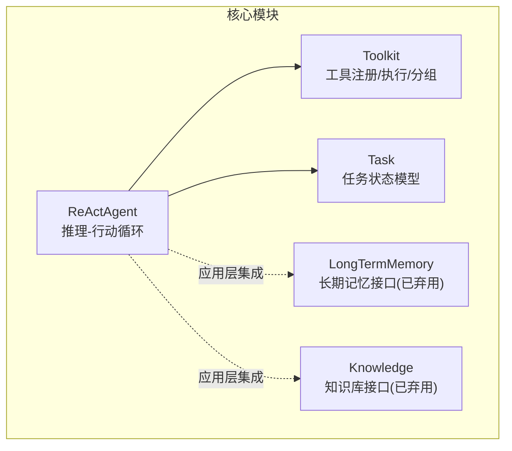
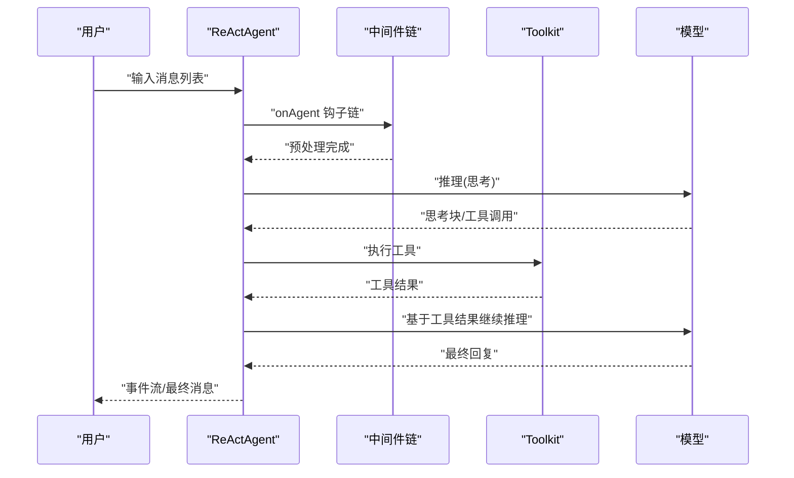
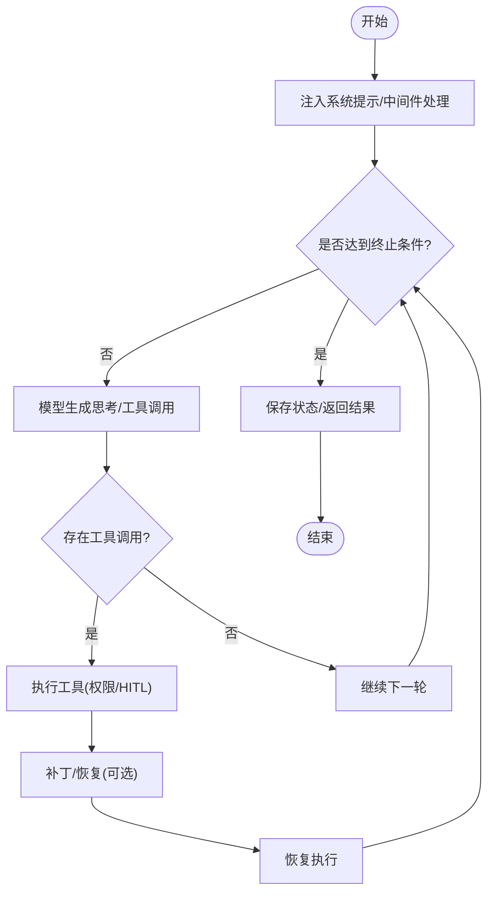
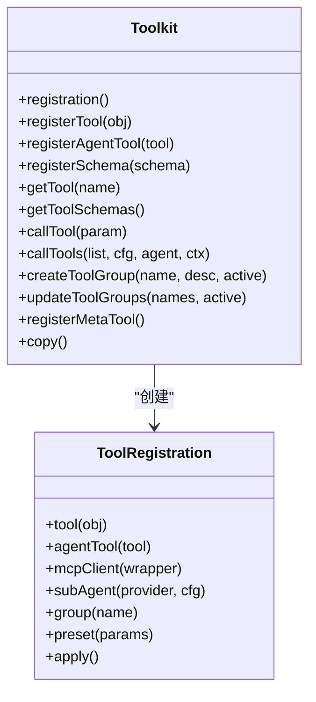
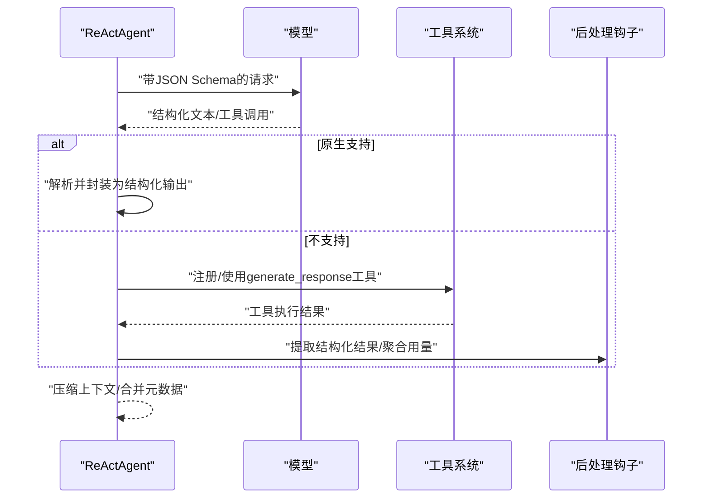
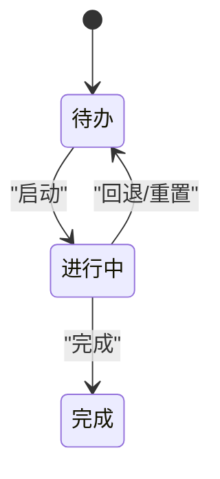
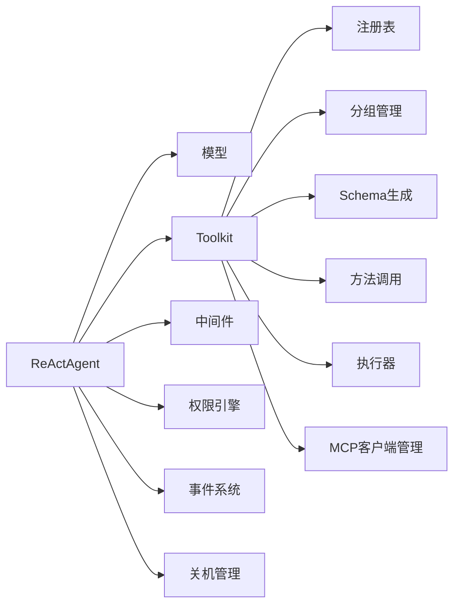

# 核心特性详解

<cite>
**本文引用的文件**
- [ReActAgent.java](file://agentscope-core/src/main/java/io/agentscope/core/ReActAgent.java)
- [Toolkit.java](file://agentscope-core/src/main/java/io/agentscope/core/tool/Toolkit.java)
- [Task.java](file://agentscope-core/src/main/java/io/agentscope/core/state/Task.java)
- [LongTermMemory.java](file://agentscope-core/src/main/java/io/agentscope/core/memory/LongTermMemory.java)
- [Knowledge.java](file://agentscope-core/src/main/java/io/agentscope/core/rag/Knowledge.java)
</cite>

## 目录
1. [引言](#引言)
2. [项目结构](#项目结构)
3. [核心组件](#核心组件)
4. [架构总览](#架构总览)
5. [详细组件分析](#详细组件分析)
6. [依赖分析](#依赖分析)
7. [性能考虑](#性能考虑)
8. [故障排查指南](#故障排查指南)
9. [结论](#结论)
10. [附录](#附录)

## 引言
本文件面向AgentScope Java用户与开发者，系统性阐述ReAct推理-行动模式与内置工具体系的关键特性与实现机制。重点覆盖：
- ReAct循环的动态决策流程与中断控制
- 内置工具系统：工具注册、分组、执行与流式回调
- 结构化输出解析与生成
- 长期记忆与RAG检索（已迁移至应用层）
- 任务状态模型（Task）与计划上下文
- 各模块如何协同，构建完整的智能代理解决方案

## 项目结构
围绕ReActAgent与工具链，核心代码位于agentscope-core模块中：
- ReActAgent：ReAct推理-行动循环、事件流、结构化输出、权限与中断控制
- Toolkit：工具注册、分组、Schema生成、外部工具与MCP客户端集成、执行器
- Task：任务状态模型，支持依赖与进度流转
- LongTermMemory、Knowledge：长期记忆与知识库接口（v2.0起由应用层集成）

图表来源
- [ReActAgent.java](file://agentscope-core/src/main/java/io/agentscope/core/ReActAgent.java)
- [Toolkit.java](file://agentscope-core/src/main/java/io/agentscope/core/tool/Toolkit.java)
- [Task.java](file://agentscope-core/src/main/java/io/agentscope/core/state/Task.java)
- [LongTermMemory.java](file://agentscope-core/src/main/java/io/agentscope/core/memory/LongTermMemory.java)
- [Knowledge.java](file://agentscope-core/src/main/java/io/agentscope/core/rag/Knowledge.java)

章节来源
- [ReActAgent.java](file://agentscope-core/src/main/java/io/agentscope/core/ReActAgent.java)
- [Toolkit.java](file://agentscope-core/src/main/java/io/agentscope/core/tool/Toolkit.java)
- [Task.java](file://agentscope-core/src/main/java/io/agentscope/core/state/Task.java)
- [LongTermMemory.java](file://agentscope-core/src/main/java/io/agentscope/core/memory/LongTermMemory.java)
- [Knowledge.java](file://agentscope-core/src/main/java/io/agentscope/core/rag/Knowledge.java)

## 核心组件
- ReActAgent：基于Project Reactor的非阻塞执行，支持中间件链、事件流、结构化输出、权限与中断控制、Graceful Shutdown集成
- Toolkit：统一的工具注册与执行入口，支持分组激活、Schema生成、外部工具、MCP客户端、流式chunk回调
- Task：持久化的任务记录，支持状态机与依赖关系，便于计划与追踪
- LongTermMemory/Knowledge：v2.0起作为应用层集成点，不再直接在框架内维护跨会话记忆

章节来源
- [ReActAgent.java](file://agentscope-core/src/main/java/io/agentscope/core/ReActAgent.java)
- [Toolkit.java](file://agentscope-core/src/main/java/io/agentscope/core/tool/Toolkit.java)
- [Task.java](file://agentscope-core/src/main/java/io/agentscope/core/state/Task.java)
- [LongTermMemory.java](file://agentscope-core/src/main/java/io/agentscope/core/memory/LongTermMemory.java)
- [Knowledge.java](file://agentscope-core/src/main/java/io/agentscope/core/rag/Knowledge.java)

## 架构总览
ReActAgent通过“思考-行动”迭代，结合工具调用与事件流，形成可观察、可中断、可恢复的智能体执行路径；工具系统提供统一的注册与执行抽象，支持外部工具与MCP扩展。

图表来源
- [ReActAgent.java](file://agentscope-core/src/main/java/io/agentscope/core/ReActAgent.java)
- [Toolkit.java](file://agentscope-core/src/main/java/io/agentscope/core/tool/Toolkit.java)

## 详细组件分析

### ReAct推理-行动模式
- 动态决策与迭代循环
  - 基于消息上下文进行“思考-行动”交替，直至满足终止条件或达到最大迭代次数
  - 支持结构化输出：原生路径与回退合成工具两种策略
- 事件流与中间件
  - 提供细粒度AgentEvent流，贯穿生命周期，支持中间件链对每次调用生效
  - 流式事件可用于调试、可观测与外部集成
- 权限与人类在环(HITL)
  - 工具调用前的权限评估与“待确认”状态，支持用户批准/拒绝并恢复执行
- 中断与优雅停机
  - 按会话级中断控制，避免影响其他并发调用
  - 与Graceful Shutdown集成，支持会话恢复与状态落盘

图表来源
- [ReActAgent.java](file://agentscope-core/src/main/java/io/agentscope/core/ReActAgent.java)

章节来源
- [ReActAgent.java](file://agentscope-core/src/main/java/io/agentscope/core/ReActAgent.java)

### 内置工具系统
- 注册与发现
  - 支持对象方法自动扫描（含注解）、AgentTool实例、Schema-only工具、MCP客户端工具
  - 工具分组与激活：按会话状态同步，支持动态重置
- 执行与流式回调
  - 统一执行器负责参数校验、超时/重试合并、并行/串行策略
  - 支持chunk回调，既可保留用户自定义回调，也可设置框架内部回调
- 外部工具与MCP
  - 外部工具不被框架执行，返回“暂停工具”提示给用户
  - MCP客户端生命周期与工具注册解耦，支持按组启用/禁用

图表来源
- [Toolkit.java](file://agentscope-core/src/main/java/io/agentscope/core/tool/Toolkit.java)

章节来源
- [Toolkit.java](file://agentscope-core/src/main/java/io/agentscope/core/tool/Toolkit.java)

### 结构化输出解析与生成
- 原生路径
  - 若模型支持原生结构化输出，则通过response_format传递JSON Schema，模型直接返回结构化文本，自然终止循环
- 回退路径
  - 注入合成工具generate_response，当模型调用该工具时，循环终止并通过钩子提取结构化结果
  - 自动压缩上下文、聚合用量与最后思考块、合并元数据

图表来源
- [ReActAgent.java](file://agentscope-core/src/main/java/io/agentscope/core/ReActAgent.java)

章节来源
- [ReActAgent.java](file://agentscope-core/src/main/java/io/agentscope/core/ReActAgent.java)

### 长期记忆与RAG检索（应用层集成）
- 长期记忆接口
  - 提供record/retrieve抽象，用于跨会话持久化与检索
  - v2.0起标记弃用，建议在应用层自行集成
- 知识库接口
  - 提供addDocuments/retrieve抽象，用于RAG检索
  - v2.0起标记弃用，建议在应用层自行集成

章节来源
- [LongTermMemory.java](file://agentscope-core/src/main/java/io/agentscope/core/memory/LongTermMemory.java)
- [Knowledge.java](file://agentscope-core/src/main/java/io/agentscope/core/rag/Knowledge.java)

### 任务管理系统（Task）
- 任务状态模型
  - 支持subject/description/metadata/owner等字段
  - 状态机：pending → in_progress → completed
  - 依赖关系：blocks（下游阻塞）与blockedBy（上游依赖）
- 使用场景
  - 计划-执行-追踪闭环中的任务单元
  - 与ReActAgent的会话状态结合，实现跨轮次的任务推进

图表来源
- [Task.java](file://agentscope-core/src/main/java/io/agentscope/core/state/Task.java)

章节来源
- [Task.java](file://agentscope-core/src/main/java/io/agentscope/core/state/Task.java)

## 依赖分析
- ReActAgent依赖
  - 模型：推理与工具调用
  - 工具系统：工具注册、执行、分组、Schema
  - 中间件：系统提示处理、事件流
  - 权限引擎：工具调用前的权限评估与HITL
  - 事件系统：AgentEvent流与钩子
  - 关机管理：Graceful Shutdown与中断控制
- 工具系统内部依赖
  - 注册表、分组管理、Schema生成、方法调用、执行器、MCP客户端管理

图表来源
- [ReActAgent.java](file://agentscope-core/src/main/java/io/agentscope/core/ReActAgent.java)
- [Toolkit.java](file://agentscope-core/src/main/java/io/agentscope/core/tool/Toolkit.java)

章节来源
- [ReActAgent.java](file://agentscope-core/src/main/java/io/agentscope/core/ReActAgent.java)
- [Toolkit.java](file://agentscope-core/src/main/java/io/agentscope/core/tool/Toolkit.java)

## 性能考虑
- 非阻塞执行：基于Project Reactor，适合高并发与长连接
- 并行执行：工具执行器支持并行/串行策略，可通过配置调整吞吐与资源占用
- 上下文压缩：结构化输出完成后压缩对话上下文，降低token与延迟
- 事件与钩子：细粒度事件流仅在需要时开启，避免不必要的开销
- 中断与优雅停机：按会话级中断，避免无效计算；关机时清理与恢复

## 故障排查指南
- 工具调用未执行或卡住
  - 检查工具是否在当前激活分组中；确认权限规则与HITL状态
  - 若启用“挂起工具恢复”，确保输入包含工具结果或允许自动补丁
- 结构化输出异常
  - 模型不支持原生结构化时，检查generate_response工具是否正确注入与触发
  - 校验Schema生成与后处理钩子逻辑
- 事件流缺失
  - 确认使用streamEvents而非旧版stream；检查中间件链是否正确应用
- 中断无效
  - 确认中断目标userId/sessionId与当前会话一致；检查InterruptControl状态

章节来源
- [ReActAgent.java](file://agentscope-core/src/main/java/io/agentscope/core/ReActAgent.java)
- [Toolkit.java](file://agentscope-core/src/main/java/io/agentscope/core/tool/Toolkit.java)

## 结论
ReActAgent以ReAct循环为核心，结合事件流、中间件、权限与中断控制，形成可观察、可恢复、可扩展的智能体执行框架；内置工具系统提供统一的注册、分组、执行与外部扩展能力；结构化输出保障类型安全与结果一致性；长期记忆与RAG检索建议在应用层集成以获得更大灵活性。通过Task模型与ReActAgent的会话状态结合，可实现从计划到执行再到追踪的完整闭环。

## 附录
- 使用建议
  - 工具注册：优先使用注解扫描与分组管理；对外部工具与MCP客户端采用Builder模式精细化配置
  - 结构化输出：优先尝试原生路径；若不可用则启用回退工具并配置Schema
  - 记忆与检索：将LongTermMemory/Knowledge迁移至应用层，按需集成缓存与向量化存储
  - 任务管理：结合Task状态机与ReActAgent会话，实现多轮任务推进与依赖管理