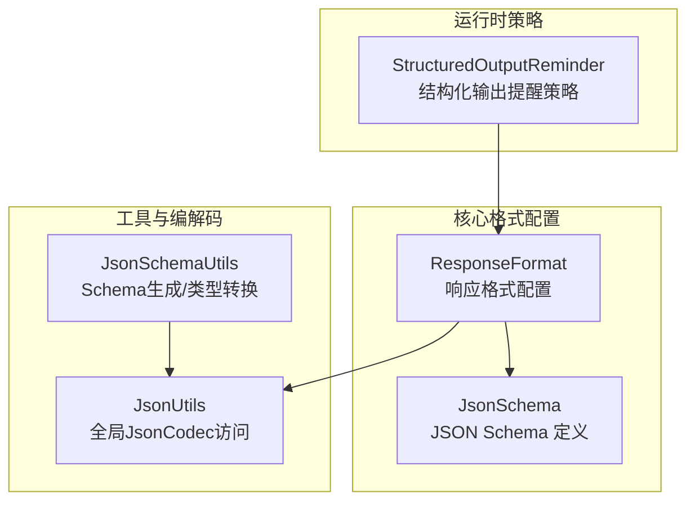
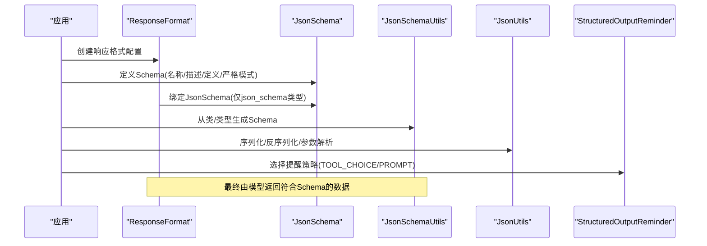
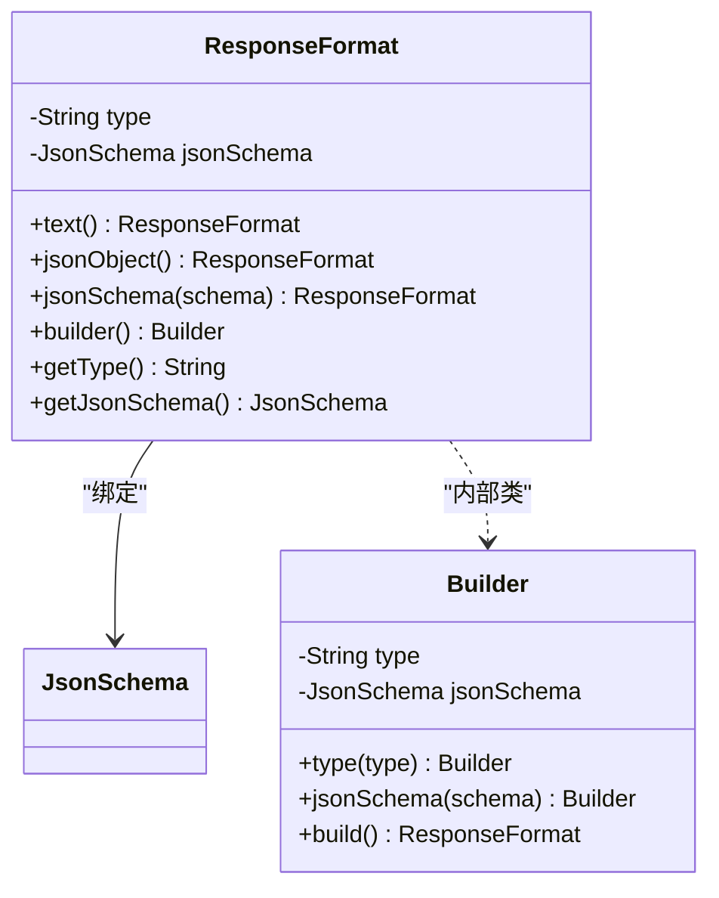
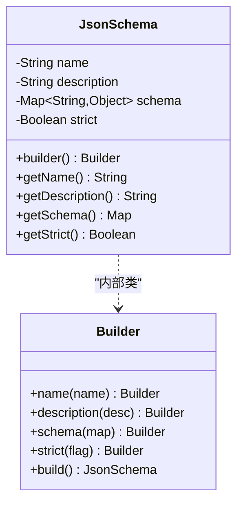
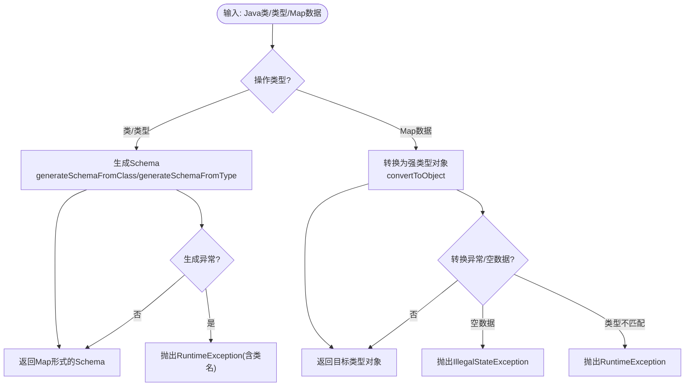
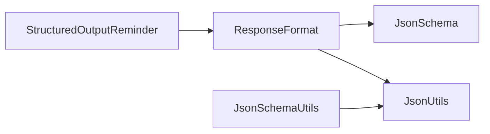

# 结构化输出解析

<cite>
**本文引用的文件**
- [ResponseFormat.java](file://agentscope-core/src/main/java/io/agentscope/core/formatter/ResponseFormat.java)
- [JsonSchema.java](file://agentscope-core/src/main/java/io/agentscope/core/formatter/JsonSchema.java)
- [JsonSchemaUtils.java](file://agentscope-core/src/main/java/io/agentscope/core/util/JsonSchemaUtils.java)
- [ResponseFormatTest.java](file://agentscope-core/src/test/java/io/agentscope/core/formatter/ResponseFormatTest.java)
- [JsonSchemaUtilsTest.java](file://agentscope-core/src/test/java/io/agentscope/core/util/JsonSchemaUtilsTest.java)
- [StructuredOutputReminder.java](file://agentscope-core/src/main/java/io/agentscope/core/model/StructuredOutputReminder.java)
- [JsonUtils.java](file://agentscope-core/src/main/java/io/agentscope/core/util/JsonUtils.java)
- [structured-output.md](file://docs/v1/en/docs/task/structured-output.md)
</cite>

## 目录
1. [简介](#简介)
2. [项目结构](#项目结构)
3. [核心组件](#核心组件)
4. [架构总览](#架构总览)
5. [组件详解](#组件详解)
6. [依赖关系分析](#依赖关系分析)
7. [性能考量](#性能考量)
8. [故障排查指南](#故障排查指南)
9. [结论](#结论)
10. [附录](#附录)

## 简介
本文件面向AgentScope的结构化输出解析能力，系统性阐述ResponseFormat类的设计理念与实现细节，深入解析JsonSchema的生成、验证与错误处理机制，并说明JsonSchemaUtils工具类在Schema生成、类型转换与格式化输出方面的辅助能力。文档同时给出典型使用场景、错误处理策略与扩展实践建议，帮助开发者快速构建稳定可靠的结构化输出流程。

## 项目结构
围绕结构化输出的关键代码主要位于以下模块与包中：
- 核心格式配置：io.agentscope.core.formatter.ResponseFormat、io.agentscope.core.formatter.JsonSchema
- 工具与编解码：io.agentscope.core.util.JsonSchemaUtils、io.agentscope.core.util.JsonUtils
- 运行时提醒策略：io.agentscope.core.model.StructuredOutputReminder
- 测试与示例文档：单元测试与任务文档

图表来源
- [ResponseFormat.java:1-141](file://agentscope-core/src/main/java/io/agentscope/core/formatter/ResponseFormat.java#L1-L141)
- [JsonSchema.java:1-131](file://agentscope-core/src/main/java/io/agentscope/core/formatter/JsonSchema.java#L1-L131)
- [JsonSchemaUtils.java:1-166](file://agentscope-core/src/main/java/io/agentscope/core/util/JsonSchemaUtils.java#L1-L166)
- [JsonUtils.java:1-153](file://agentscope-core/src/main/java/io/agentscope/core/util/JsonUtils.java#L1-L153)
- [StructuredOutputReminder.java:1-52](file://agentscope-core/src/main/java/io/agentscope/core/model/StructuredOutputReminder.java#L1-L52)

章节来源
- [ResponseFormat.java:1-141](file://agentscope-core/src/main/java/io/agentscope/core/formatter/ResponseFormat.java#L1-L141)
- [JsonSchema.java:1-131](file://agentscope-core/src/main/java/io/agentscope/core/formatter/JsonSchema.java#L1-L131)
- [JsonSchemaUtils.java:1-166](file://agentscope-core/src/main/java/io/agentscope/core/util/JsonSchemaUtils.java#L1-L166)
- [JsonUtils.java:1-153](file://agentscope-core/src/main/java/io/agentscope/core/util/JsonUtils.java#L1-L153)
- [StructuredOutputReminder.java:1-52](file://agentscope-core/src/main/java/io/agentscope/core/model/StructuredOutputReminder.java#L1-L52)

## 核心组件
- ResponseFormat：定义模型API响应格式，支持text、json_object与json_schema三种类型；当选择json_schema时，可绑定具体JsonSchema实例进行严格或宽松的结构校验。
- JsonSchema：封装Schema名称、描述、Schema定义与严格模式开关，用于指导模型生成符合预期的数据结构。
- JsonSchemaUtils：提供从Java类/类型生成Schema、将Map数据转换为强类型对象等实用方法，内置Jackson注解与AgentScope注解的支持。
- JsonUtils：提供全局JsonCodec访问入口，统一序列化/反序列化与工具方法（如校验JSON对象有效性、解析工具调用参数）。
- StructuredOutputReminder：控制结构化输出模式下强制模型调用生成工具的策略（TOOL_CHOICE或PROMPT），影响单轮或多轮API交互。

章节来源
- [ResponseFormat.java:21-47](file://agentscope-core/src/main/java/io/agentscope/core/formatter/ResponseFormat.java#L21-L47)
- [JsonSchema.java:22-45](file://agentscope-core/src/main/java/io/agentscope/core/formatter/JsonSchema.java#L22-L45)
- [JsonSchemaUtils.java:33-57](file://agentscope-core/src/main/java/io/agentscope/core/util/JsonSchemaUtils.java#L33-L57)
- [JsonUtils.java:24-48](file://agentscope-core/src/main/java/io/agentscope/core/util/JsonUtils.java#L24-L48)
- [StructuredOutputReminder.java:18-51](file://agentscope-core/src/main/java/io/agentscope/core/model/StructuredOutputReminder.java#L18-L51)

## 架构总览
结构化输出的端到端流程如下：
- 应用层通过ResponseFormat声明期望的响应格式（text/json_object/json_schema）。
- 当使用json_schema时，结合JsonSchema定义目标数据结构与严格模式。
- JsonSchemaUtils基于Java类/类型动态生成Schema，或对复杂嵌套结构进行Schema生成。
- JsonUtils负责序列化/反序列化与工具参数解析，确保传输与落库的一致性。
- StructuredOutputReminder决定是否通过tool_choice或提示词驱动模型调用生成工具，保障最终输出符合Schema。

图表来源
- [ResponseFormat.java:66-99](file://agentscope-core/src/main/java/io/agentscope/core/formatter/ResponseFormat.java#L66-L99)
- [JsonSchema.java:103-129](file://agentscope-core/src/main/java/io/agentscope/core/formatter/JsonSchema.java#L103-L129)
- [JsonSchemaUtils.java:96-140](file://agentscope-core/src/main/java/io/agentscope/core/util/JsonSchemaUtils.java#L96-L140)
- [JsonUtils.java:64-91](file://agentscope-core/src/main/java/io/agentscope/core/util/JsonUtils.java#L64-L91)
- [StructuredOutputReminder.java:25-50](file://agentscope-core/src/main/java/io/agentscope/core/model/StructuredOutputReminder.java#L25-L50)

## 组件详解

### ResponseFormat 设计与实现
- 角色定位：对外暴露统一的响应格式配置接口，屏蔽底层模型差异。
- 类型体系：
  - text：纯文本响应，不强制结构。
  - json_object：要求返回有效JSON对象，但不绑定特定Schema。
  - json_schema：绑定JsonSchema，可启用严格模式进行结构校验。
- 关键特性：
  - Builder模式：支持链式配置type与json_schema。
  - Jackson注解：通过@JsonInclude排除空字段，避免冗余。
  - 可序列化/可反序列化：便于跨模块传递与持久化。
- 使用要点：
  - 选择json_schema时需同时提供JsonSchema实例。
  - 严格模式由JsonSchema.strict控制，配合模型能力决定校验强度。

图表来源
- [ResponseFormat.java:49-140](file://agentscope-core/src/main/java/io/agentscope/core/formatter/ResponseFormat.java#L49-L140)

章节来源
- [ResponseFormat.java:21-47](file://agentscope-core/src/main/java/io/agentscope/core/formatter/ResponseFormat.java#L21-L47)
- [ResponseFormat.java:66-99](file://agentscope-core/src/main/java/io/agentscope/core/formatter/ResponseFormat.java#L66-L99)
- [ResponseFormat.java:117-139](file://agentscope-core/src/main/java/io/agentscope/core/formatter/ResponseFormat.java#L117-L139)

### JsonSchema 实现与使用
- 角色定位：承载JSON Schema定义，描述期望的数据结构与约束。
- 字段说明：
  - name：Schema名称，便于识别与调试。
  - description：Schema描述，增强可读性。
  - schema：标准JSON Schema定义，支持嵌套与复杂结构。
  - strict：严格模式开关，配合模型侧校验策略。
- Builder模式：支持链式设置name/description/schema/strict。
- 与ResponseFormat协作：当ResponseFormat.type=json_schema时，必须提供JsonSchema实例。

图表来源
- [JsonSchema.java:47-130](file://agentscope-core/src/main/java/io/agentscope/core/formatter/JsonSchema.java#L47-L130)

章节来源
- [JsonSchema.java:22-45](file://agentscope-core/src/main/java/io/agentscope/core/formatter/JsonSchema.java#L22-L45)
- [JsonSchema.java:103-129](file://agentscope-core/src/main/java/io/agentscope/core/formatter/JsonSchema.java#L103-L129)

### JsonSchemaUtils 工具类
- 能力概览：
  - 从Java类生成Schema：支持复杂嵌套对象、集合类型等。
  - 从Type生成Schema：支持泛型类型（如List<String>、Map<String,Integer>）。
  - 将Map数据转换为强类型对象：提供类型安全的反序列化。
- 注解支持：
  - Jackson注解：@JsonProperty、@JsonPropertyDescription、@JsonClassDescription等。
  - AgentScope注解：ToolParam等（在工具Schema模块中生效）。
- 错误处理：
  - Schema生成失败抛出RuntimeException，包含类名上下文。
  - 数据转换失败抛出RuntimeException或IllegalStateException，便于上层捕获与降级。

图表来源
- [JsonSchemaUtils.java:96-164](file://agentscope-core/src/main/java/io/agentscope/core/util/JsonSchemaUtils.java#L96-L164)

章节来源
- [JsonSchemaUtils.java:33-57](file://agentscope-core/src/main/java/io/agentscope/core/util/JsonSchemaUtils.java#L33-L57)
- [JsonSchemaUtils.java:96-140](file://agentscope-core/src/main/java/io/agentscope/core/util/JsonSchemaUtils.java#L96-L140)
- [JsonSchemaUtils.java:154-164](file://agentscope-core/src/main/java/io/agentscope/core/util/JsonSchemaUtils.java#L154-L164)

### JsonUtils 编解码与工具方法
- 全局JsonCodec访问：提供getJsonCodec/setJsonCodec/resetToDefault，便于替换实现或测试。
- 工具方法：
  - isValidJsonObject：校验字符串是否为有效的JSON对象。
  - resolveToolCallArgsJson：从ToolUseBlock解析并规范化工具调用参数，保证始终为合法JSON对象。
- 在结构化输出中的作用：统一序列化/反序列化，确保Schema与数据在传输与存储环节保持一致。

章节来源
- [JsonUtils.java:24-48](file://agentscope-core/src/main/java/io/agentscope/core/util/JsonUtils.java#L24-L48)
- [JsonUtils.java:104-151](file://agentscope-core/src/main/java/io/agentscope/core/util/JsonUtils.java#L104-L151)

### StructuredOutputReminder 运行时策略
- TOOL_CHOICE：优先使用tool_choice参数强制模型调用生成工具，若模型未调用则在后续轮次强制触发，适合支持tool_choice的模型。
- PROMPT：通过注入提醒消息促使模型调用生成工具，可能需要多轮迭代，兼容旧模型。
- 与ResponseFormat配合：在构建Agent时设置reminder策略，影响结构化输出的API交互轮次与稳定性。

章节来源
- [StructuredOutputReminder.java:25-50](file://agentscope-core/src/main/java/io/agentscope/core/model/StructuredOutputReminder.java#L25-L50)

## 依赖关系分析
- ResponseFormat依赖JsonSchema（仅在json_schema类型时）。
- JsonSchemaUtils依赖Jackson Schema Generator与AgentScope工具Schema模块，生成Schema并进行类型转换。
- JsonUtils为JsonSchemaUtils与ResponseFormat提供统一的编解码能力。
- StructuredOutputReminder与ResponseFormat共同影响模型调用策略。

图表来源
- [ResponseFormat.java:49-140](file://agentscope-core/src/main/java/io/agentscope/core/formatter/ResponseFormat.java#L49-L140)
- [JsonSchema.java:47-130](file://agentscope-core/src/main/java/io/agentscope/core/formatter/JsonSchema.java#L47-L130)
- [JsonSchemaUtils.java:62-84](file://agentscope-core/src/main/java/io/agentscope/core/util/JsonSchemaUtils.java#L62-L84)
- [JsonUtils.java:64-91](file://agentscope-core/src/main/java/io/agentscope/core/util/JsonUtils.java#L64-L91)
- [StructuredOutputReminder.java:25-50](file://agentscope-core/src/main/java/io/agentscope/core/model/StructuredOutputReminder.java#L25-L50)

章节来源
- [ResponseFormat.java:49-140](file://agentscope-core/src/main/java/io/agentscope/core/formatter/ResponseFormat.java#L49-L140)
- [JsonSchema.java:47-130](file://agentscope-core/src/main/java/io/agentscope/core/formatter/JsonSchema.java#L47-L130)
- [JsonSchemaUtils.java:62-84](file://agentscope-core/src/main/java/io/agentscope/core/util/JsonSchemaUtils.java#L62-L84)
- [JsonUtils.java:64-91](file://agentscope-core/src/main/java/io/agentscope/core/util/JsonUtils.java#L64-L91)
- [StructuredOutputReminder.java:25-50](file://agentscope-core/src/main/java/io/agentscope/core/model/StructuredOutputReminder.java#L25-L50)

## 性能考量
- Schema生成成本：JsonSchemaUtils基于反射与Schema生成器构建Schema，复杂嵌套类型会增加生成时间。建议：
  - 对频繁使用的Schema进行缓存。
  - 在启动阶段预热常用Schema，减少首次调用开销。
- 序列化/反序列化：JsonUtils统一编解码，建议复用JsonCodec实例，避免重复初始化。
- 严格模式校验：开启strict模式可提升数据质量，但会增加模型侧校验成本。根据模型能力与业务需求权衡。

## 故障排查指南
- Schema生成失败
  - 现象：调用generateSchemaFromClass/generateSchemaFromType抛出RuntimeException。
  - 排查：检查类结构、泛型类型、注解配置；确认依赖的Schema生成器版本与模块可用。
  - 参考路径：[JsonSchemaUtils.java:96-140](file://agentscope-core/src/main/java/io/agentscope/core/util/JsonSchemaUtils.java#L96-L140)
- 数据转换异常
  - 现象：convertToObject抛出RuntimeException或IllegalStateException。
  - 排查：确认输入数据非空且字段类型匹配；检查目标类构造函数与字段可见性。
  - 参考路径：[JsonSchemaUtils.java:154-164](file://agentscope-core/src/main/java/io/agentscope/core/util/JsonSchemaUtils.java#L154-L164)
- JSON对象校验失败
  - 现象：resolveToolCallArgsJson返回空对象或警告日志。
  - 排查：检查ToolUseBlock内容是否为合法JSON对象；必要时回退到序列化输入。
  - 参考路径：[JsonUtils.java:133-151](file://agentscope-core/src/main/java/io/agentscope/core/util/JsonUtils.java#L133-L151)
- 单元测试参考
  - ResponseFormat与JsonSchema的序列化/反序列化、Builder链式调用、空值处理等用例。
  - 参考路径：
    - [ResponseFormatTest.java:44-372](file://agentscope-core/src/test/java/io/agentscope/core/formatter/ResponseFormatTest.java#L44-L372)
    - [JsonSchemaUtilsTest.java:44-159](file://agentscope-core/src/test/java/io/agentscope/core/util/JsonSchemaUtilsTest.java#L44-L159)

章节来源
- [JsonSchemaUtils.java:96-164](file://agentscope-core/src/main/java/io/agentscope/core/util/JsonSchemaUtils.java#L96-L164)
- [JsonUtils.java:104-151](file://agentscope-core/src/main/java/io/agentscope/core/util/JsonUtils.java#L104-L151)
- [ResponseFormatTest.java:44-372](file://agentscope-core/src/test/java/io/agentscope/core/formatter/ResponseFormatTest.java#L44-L372)
- [JsonSchemaUtilsTest.java:44-159](file://agentscope-core/src/test/java/io/agentscope/core/util/JsonSchemaUtilsTest.java#L44-L159)

## 结论
ResponseFormat与JsonSchema构成了AgentScope结构化输出的“契约层”，JsonSchemaUtils提供了强大的Schema生成与类型转换能力，JsonUtils统一了编解码与工具参数解析，StructuredOutputReminder则在运行时保障输出策略的落地。通过合理组合这些组件，开发者可以构建稳定、可维护且高性能的结构化输出流程。

## 附录

### 使用示例与最佳实践
- 定义Schema类并生成Schema
  - 参考路径：[structured-output.md:11-19](file://docs/v1/en/docs/task/structured-output.md#L11-L19)
  - 生成Schema：[JsonSchemaUtils.java:96-104](file://agentscope-core/src/main/java/io/agentscope/core/util/JsonSchemaUtils.java#L96-L104)
- 请求结构化输出并提取数据
  - 参考路径：[structured-output.md:23-32](file://docs/v1/en/docs/task/structured-output.md#L23-L32)
  - 提取强类型数据：[JsonSchemaUtils.java:154-164](file://agentscope-core/src/main/java/io/agentscope/core/util/JsonSchemaUtils.java#L154-L164)
- 设置结构化输出提醒策略
  - 参考路径：[structured-output.md:43-49](file://docs/v1/en/docs/task/structured-output.md#L43-L49)
  - 策略枚举：[StructuredOutputReminder.java:25-50](file://agentscope-core/src/main/java/io/agentscope/core/model/StructuredOutputReminder.java#L25-L50)
- 处理Schema验证失败
  - 建议：在业务层对返回数据进行二次校验与异常捕获，结合日志与重试策略。
  - 参考测试：[ResponseFormatTest.java:218-282](file://agentscope-core/src/test/java/io/agentscope/core/formatter/ResponseFormatTest.java#L218-L282)

### 自定义输出格式处理器建议
- 扩展点：通过JsonSchemaUtils的类型转换能力与JsonUtils的编解码入口，可实现自定义的后处理链路。
- 注意事项：确保自定义处理器遵循统一的异常语义与日志规范，避免破坏整体可观测性。