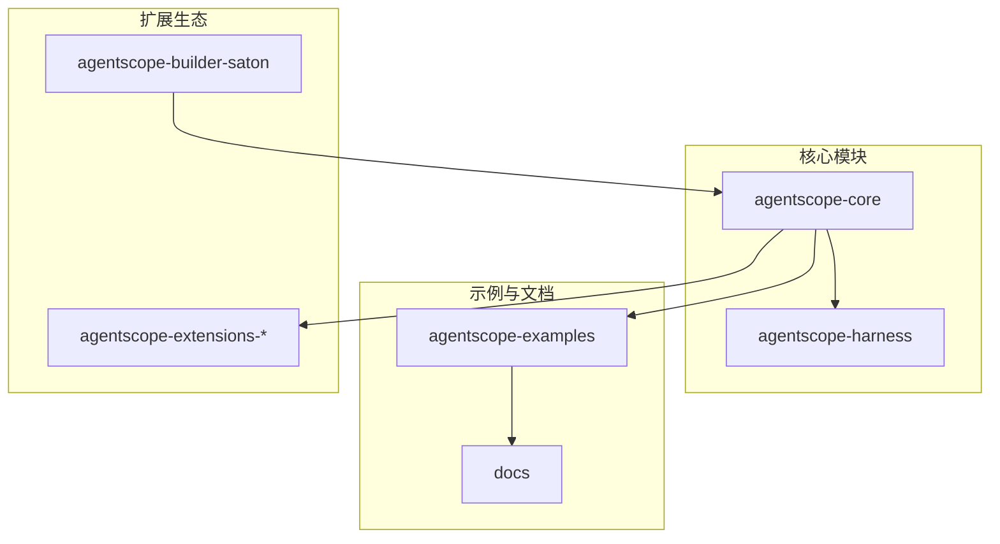
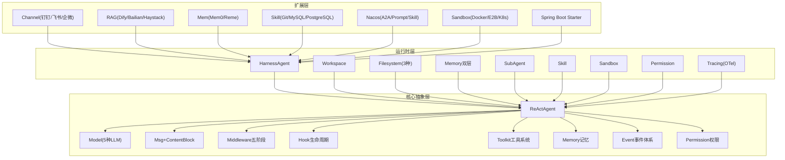
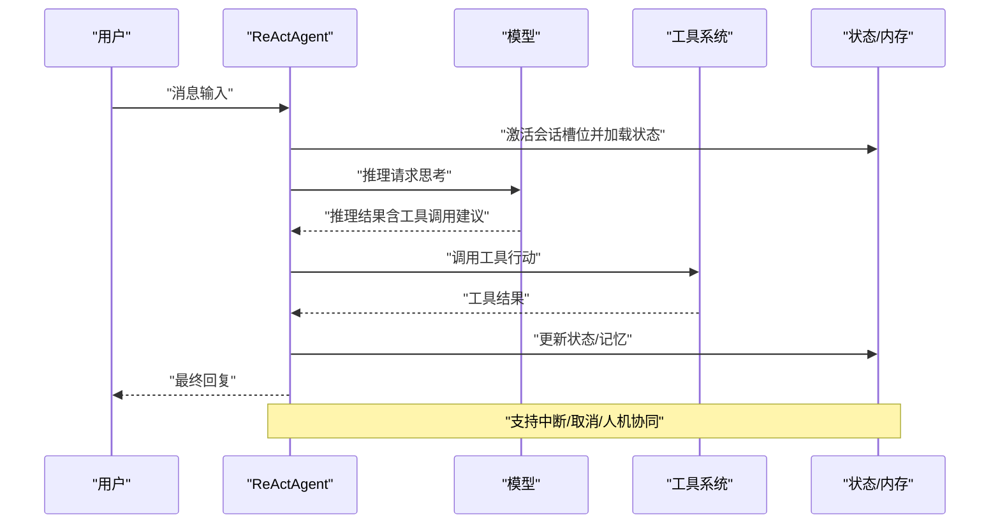
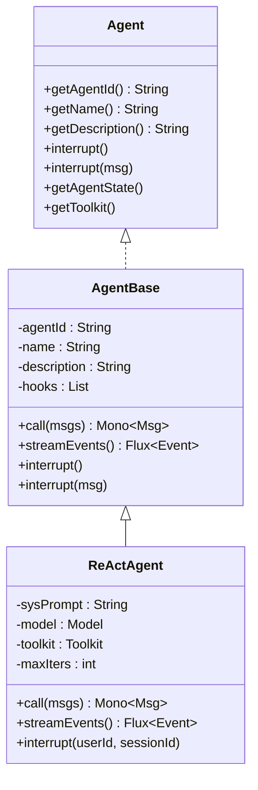
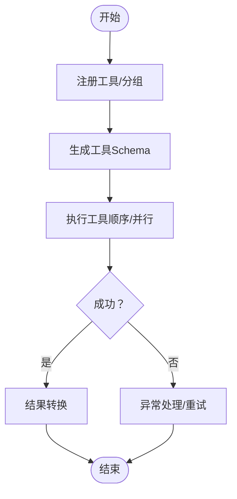
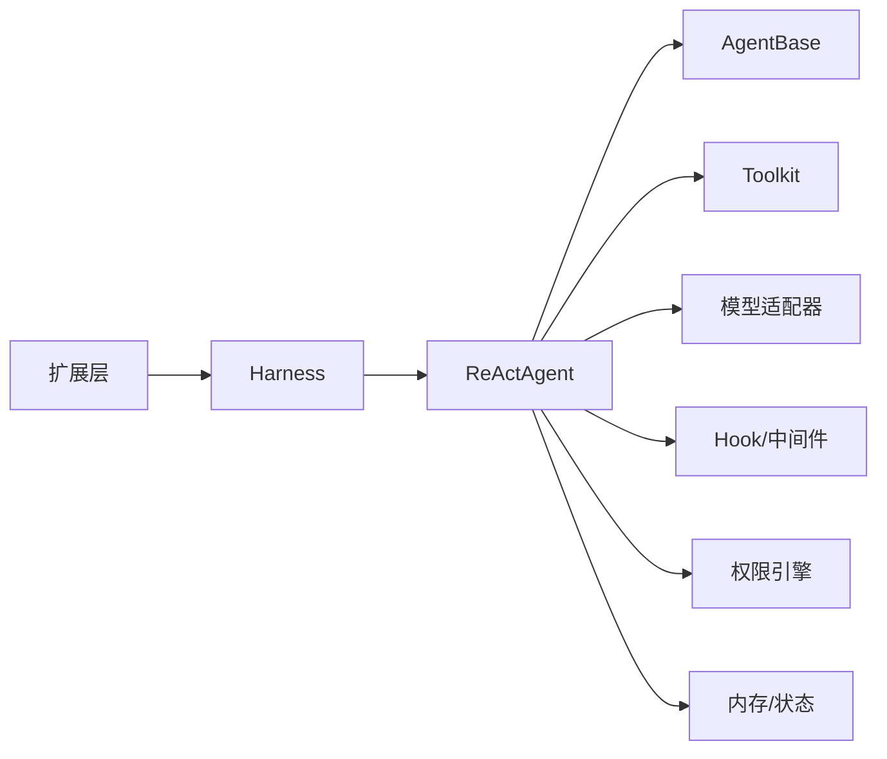

# 框架介绍与定位

<cite>
**本文引用的文件列表**
- [README.md](file://README.md)
- [README_zh.md](file://README_zh.md)
- [agentscope-core/src/main/java/io/agentscope/core/ReActAgent.java](file://agentscope-core/src/main/java/io/agentscope/core/ReActAgent.java)
- [agentscope-core/src/main/java/io/agentscope/core/agent/Agent.java](file://agentscope-core/src/main/java/io/agentscope/core/agent/Agent.java)
- [agentscope-core/src/main/java/io/agentscope/core/agent/AgentBase.java](file://agentscope-core/src/main/java/io/agentscope/core/agent/AgentBase.java)
- [agentscope-core/src/main/java/io/agentscope/core/tool/Toolkit.java](file://agentscope-core/src/main/java/io/agentscope/core/tool/Toolkit.java)
- [agentscope-examples/README.md](file://agentscope-examples/README.md)
- [SKILL.md](file://SKILL.md)
- [agentscope-2.0.0-RC2-guide.html](file://agentscope-2.0.0-RC2-guide.html)
- [agentscope-guide.html](file://agentscope-guide.html)
- [agentscope-core/src/main/java/io/agentscope/core/Version.java](file://agentscope-core/src/main/java/io/agentscope/core/Version.java)
</cite>

## 目录
1. [引言](#引言)
2. [项目结构](#项目结构)
3. [核心组件](#核心组件)
4. [架构总览](#架构总览)
5. [详细组件分析](#详细组件分析)
6. [依赖关系分析](#依赖关系分析)
7. [性能考量](#性能考量)
8. [故障排查指南](#故障排查指南)
9. [结论](#结论)
10. [附录](#附录)

## 引言
AgentScope Java 是一个面向 LLM 驱动应用的“代理导向编程”框架，旨在以 ReAct（推理-行动）范式为核心，构建从基础聊天助手到复杂任务执行器的全栈智能代理系统。它强调“智能但可控”的理念：通过 ReAct 让代理具备动态规划与工具调用能力，同时提供安全中断、优雅取消、人机协同等运行时干预机制，确保在生产环境中既灵活又安全。

本框架的目标是：
- 以 ReAct 为核心范式，实现“思考-行动”的迭代闭环；
- 提供工具系统、结构化输出、长时记忆、RAG、Hook 生命周期、权限与沙箱等生产级能力；
- 支持 MCP/A2A 协议，无缝对接外部生态；
- 以响应式（Reactor）架构实现高吞吐、低延迟、可扩展的运行时。

## 项目结构
仓库采用模块化组织，核心模块与扩展模块分离，便于按需引入与演进。下图给出高层视图（仅展示与本文相关的关键模块）：

图表来源
- [agentscope-core/src/main/java/io/agentscope/core/ReActAgent.java](file://agentscope-core/src/main/java/io/agentscope/core/ReActAgent.java)
- [agentscope-examples/README.md](file://agentscope-examples/README.md)
- [agentscope-2.0.0-RC2-guide.html](file://agentscope-2.0.0-RC2-guide.html)

章节来源
- [README.md](file://README.md)
- [README_zh.md](file://README_zh.md)

## 核心组件
- ReActAgent：实现 ReAct 推理-行动循环的智能代理，支持工具调用、结构化输出、Hook 生命周期、权限与中断等能力。
- Agent 接口与 AgentBase 抽象类：统一代理契约，提供 Hook、订阅、中断、状态与序列化门控等通用基础设施。
- Toolkit：工具注册、分组、Schema 生成、MCP 客户端管理与执行器，支撑代理的“行动”能力。
- 版本与用户代理：统一版本号与 UA 字符串，便于统计与兼容性管理。

章节来源
- [agentscope-core/src/main/java/io/agentscope/core/agent/Agent.java](file://agentscope-core/src/main/java/io/agentscope/core/agent/Agent.java)
- [agentscope-core/src/main/java/io/agentscope/core/agent/AgentBase.java](file://agentscope-core/src/main/java/io/agentscope/core/agent/AgentBase.java)
- [agentscope-core/src/main/java/io/agentscope/core/tool/Toolkit.java](file://agentscope-core/src/main/java/io/agentscope/core/tool/Toolkit.java)
- [agentscope-core/src/main/java/io/agentscope/core/Version.java](file://agentscope-core/src/main/java/io/agentscope/core/Version.java)

## 架构总览
AgentScope Java 采用“四层架构”（扩展层、运行时层、核心抽象层、协议与工具层），ReActAgent 位于核心抽象层，向上通过 Hook/中间件提供可观测与可干预，向下通过 Toolkit/模型适配器接入工具与 LLM。

图表来源
- [agentscope-2.0.0-RC2-guide.html](file://agentscope-2.0.0-RC2-guide.html)

章节来源
- [agentscope-2.0.0-RC2-guide.html](file://agentscope-2.0.0-RC2-guide.html)

## 详细组件分析

### ReActAgent：推理-行动范式与运行时控制
- ReAct 循环：代理在“思考（推理）-行动（工具调用）”之间迭代，直至完成任务或达到最大迭代次数。
- 运行时控制：支持安全中断、优雅取消、人机协同（Hook 注入），确保生产可用性与可审计性。
- 结构化输出：通过 per-call 的结构化输出工具，保证类型安全与自动校正。
- 会话与状态：基于会话槽位（userId/sessionId）的 AgentState 缓存与持久化，支持多租户隔离与跨实例一致性。
- 中间件与 Hook：统一的生命周期钩子与中间件链，贯穿推理、调用、行动各阶段，便于观测与干预。

图表来源
- [agentscope-core/src/main/java/io/agentscope/core/ReActAgent.java](file://agentscope-core/src/main/java/io/agentscope/core/ReActAgent.java)

章节来源
- [agentscope-core/src/main/java/io/agentscope/core/ReActAgent.java](file://agentscope-core/src/main/java/io/agentscope/core/ReActAgent.java)
- [README.md](file://README.md)
- [README_zh.md](file://README_zh.md)

### Agent 接口与 AgentBase：统一契约与基础设施
- Agent 接口：统一可调用、可流式、可观测的代理能力边界。
- AgentBase：提供 Hook 管理、订阅 Hub、中断机制、序列化门控、Tracing 等通用基础设施；具体代理（如 ReActAgent）负责领域逻辑。

图表来源
- [agentscope-core/src/main/java/io/agentscope/core/agent/Agent.java](file://agentscope-core/src/main/java/io/agentscope/core/agent/Agent.java)
- [agentscope-core/src/main/java/io/agentscope/core/agent/AgentBase.java](file://agentscope-core/src/main/java/io/agentscope/core/agent/AgentBase.java)
- [agentscope-core/src/main/java/io/agentscope/core/ReActAgent.java](file://agentscope-core/src/main/java/io/agentscope/core/ReActAgent.java)

章节来源
- [agentscope-core/src/main/java/io/agentscope/core/agent/Agent.java](file://agentscope-core/src/main/java/io/agentscope/core/agent/Agent.java)
- [agentscope-core/src/main/java/io/agentscope/core/agent/AgentBase.java](file://agentscope-core/src/main/java/io/agentscope/core/agent/AgentBase.java)

### Toolkit：工具注册、分组与执行
- 工具注册与查找：扫描注解或直接注册 AgentTool 实例，支持预设参数与扩展模型。
- 工具分组与动态激活：通过 meta-tool（如 reset_equipped_tools）实现运行时工具组的自管理。
- MCP 客户端：桥接外部 MCP 服务器，统一注册与调用流程。
- 执行器：支持顺序/并行执行、参数校验、结果转换与异常处理。

图表来源
- [agentscope-core/src/main/java/io/agentscope/core/tool/Toolkit.java](file://agentscope-core/src/main/java/io/agentscope/core/tool/Toolkit.java)

章节来源
- [agentscope-core/src/main/java/io/agentscope/core/tool/Toolkit.java](file://agentscope-core/src/main/java/io/agentscope/core/tool/Toolkit.java)

### 示例与入门路径
- 示例清单覆盖基础对话、工具调用、结构化输出、Hook 观察、流式 Web、会话持久化、中断等主题，便于快速上手。
- 文档与指南提供 ReAct 循环、架构图、多智能体协作等概念讲解。

章节来源
- [agentscope-examples/README.md](file://agentscope-examples/README.md)
- [agentscope-guide.html](file://agentscope-guide.html)

## 依赖关系分析
- ReActAgent 依赖 AgentBase（基础设施）、Toolkit（工具系统）、模型适配器（如 OpenAI/DashScope/Gemini/Ollama）、Hook/中间件、权限引擎、内存与状态存储。
- 运行时层（Harness）通过统一接口暴露 ReActAgent，并结合 Workspace、Sandbox、Permission、Tracing 等能力，形成生产级运行时。
- 扩展层通过 MCP/A2A/Nacos 等协议与生态对接，实现工具与智能体的生态化扩展。

图表来源
- [agentscope-core/src/main/java/io/agentscope/core/ReActAgent.java](file://agentscope-core/src/main/java/io/agentscope/core/ReActAgent.java)
- [agentscope-core/src/main/java/io/agentscope/core/tool/Toolkit.java](file://agentscope-core/src/main/java/io/agentscope/core/tool/Toolkit.java)
- [agentscope-2.0.0-RC2-guide.html](file://agentscope-2.0.0-RC2-guide.html)

章节来源
- [agentscope-core/src/main/java/io/agentscope/core/ReActAgent.java](file://agentscope-core/src/main/java/io/agentscope/core/ReActAgent.java)
- [agentscope-core/src/main/java/io/agentscope/core/tool/Toolkit.java](file://agentscope-core/src/main/java/io/agentscope/core/tool/Toolkit.java)
- [agentscope-2.0.0-RC2-guide.html](file://agentscope-2.0.0-RC2-guide.html)

## 性能考量
- 响应式非阻塞：基于 Project Reactor 的 Mono/Flux，避免线程阻塞，提升吞吐与延迟表现。
- 冷启动优化：支持 GraalVM 原生镜像，实现毫秒级冷启动，适合 Serverless 与弹性扩缩容。
- 并发与序列化：按会话槽位进行调用序列化，不同槽位并发执行，兼顾一致性与吞吐。
- 观测与诊断：原生 OpenTelemetry 集成与 Studio 可视化，便于生产环境的性能与稳定性治理。

章节来源
- [README.md](file://README.md)
- [README_zh.md](file://README_zh.md)
- [agentscope-2.0.0-RC2-guide.html](file://agentscope-2.0.0-RC2-guide.html)

## 故障排查指南
- API Key 与模型配置：示例文档提供了环境变量与交互式输入两种方式，若缺失会提示。
- MCP 服务器：示例文档明确 MCP 服务器安装与连接步骤，确保本地服务可用。
- 编译与依赖：示例文档说明先构建核心库再编译示例的流程，避免编译错误。
- 中断与恢复：ReActAgent 支持安全中断与优雅取消，可在长任务中进行干预与恢复。

章节来源
- [agentscope-examples/README.md](file://agentscope-examples/README.md)
- [README.md](file://README.md)

## 结论
AgentScope Java 以 ReAct 为核心范式，结合响应式架构、Hook 生命周期、工具系统、权限与沙箱等能力，构建了从基础聊天到复杂任务执行的全栈智能代理平台。它在保证灵活性的同时，提供了生产级的可控性与可观测性，适用于客户服务、数据分析、自动化办公、研发辅助等多种场景。对于初学者，建议从示例入手，逐步掌握 ReAct 循环、工具注册、Hook 观察与会话管理等关键概念。

## 附录
- 快速开始与依赖声明见 README。
- 版本与 UA 信息由 Version 类统一维护，便于统计与兼容性管理。

章节来源
- [README.md](file://README.md)
- [agentscope-core/src/main/java/io/agentscope/core/Version.java](file://agentscope-core/src/main/java/io/agentscope/core/Version.java)