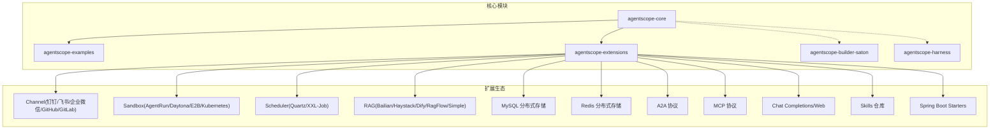
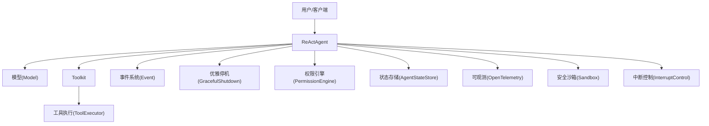
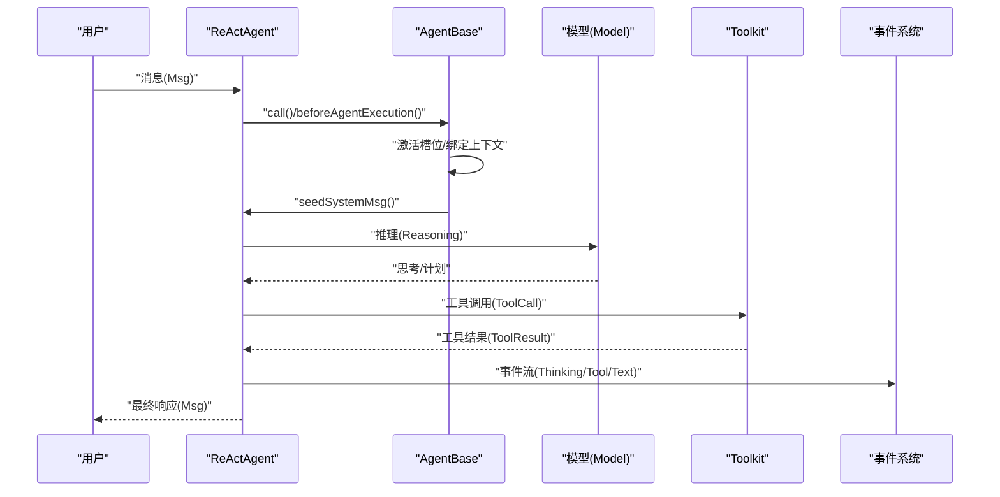
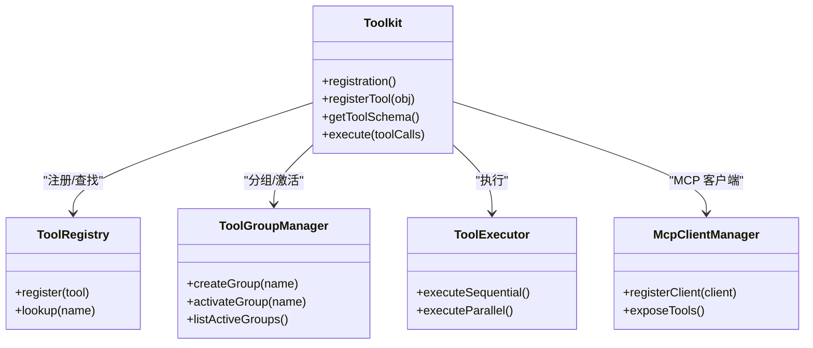
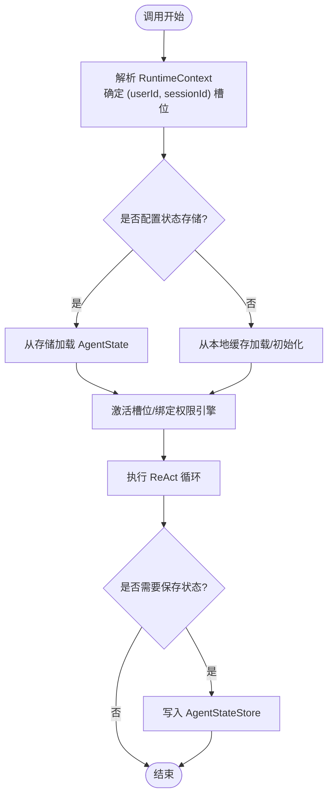
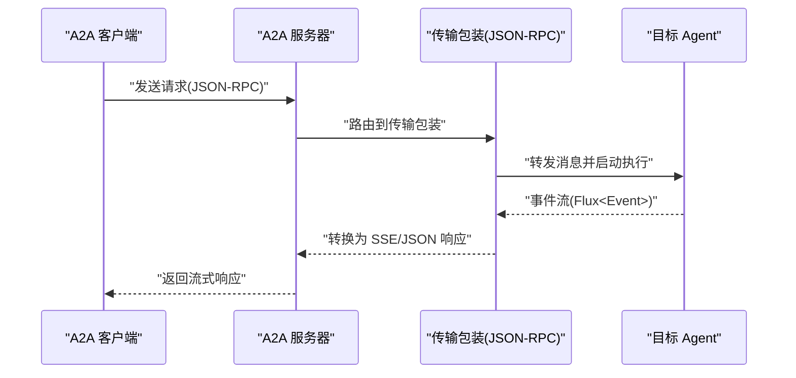
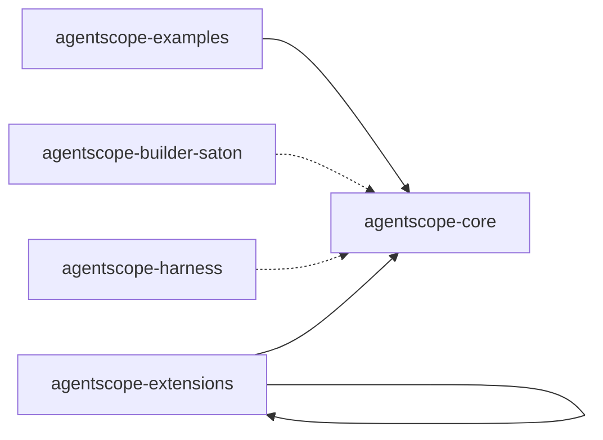

# 项目概述

<cite>
**本文档引用的文件**
- [README.md](file://README.md)
- [agentscope-core/src/main/java/io/agentscope/core/ReActAgent.java](file://agentscope-core/src/main/java/io/agentscope/core/ReActAgent.java)
- [agentscope-core/src/main/java/io/agentscope/core/agent/Agent.java](file://agentscope-core/src/main/java/io/agentscope/core/agent/Agent.java)
- [agentscope-core/src/main/java/io/agentscope/core/agent/AgentBase.java](file://agentscope-core/src/main/java/io/agentscope/core/agent/AgentBase.java)
- [agentscope-core/src/main/java/io/agentscope/core/tool/Toolkit.java](file://agentscope-core/src/main/java/io/agentscope/core/tool/Toolkit.java)
- [agentscope-core/src/main/java/io/agentscope/core/memory/Memory.java](file://agentscope-core/src/main/java/io/agentscope/core/memory/Memory.java)
- [agentscope-core/src/main/java/io/agentscope/core/Version.java](file://agentscope-core/src/main/java/io/agentscope/core/Version.java)
- [agentscope-examples/README.md](file://agentscope-examples/README.md)
- [agentscope-core/src/main/java/io/agentscope/core/shutdown/GracefulShutdownManager.java](file://agentscope-core/src/main/java/io/agentscope/core/shutdown/GracefulShutdownManager.java)
</cite>

## 目录
1. [简介](#简介)
2. [项目结构](#项目结构)
3. [核心组件](#核心组件)
4. [架构总览](#架构总览)
5. [详细组件分析](#详细组件分析)
6. [依赖关系分析](#依赖关系分析)
7. [性能考量](#性能考量)
8. [故障排查指南](#故障排查指南)
9. [结论](#结论)
10. [附录](#附录)

## 简介
AgentScope Java 是一个面向 LLM 驱动应用的“代理导向编程”框架，专注于构建生产级智能代理。它以 ReAct（推理-行动）范式为核心，提供智能代理、工具调用、内存管理、多代理协作等能力，并强调生产级特性：安全沙箱、可观测性、高性能与可扩展的集成生态。

- 核心价值定位
  - 将“智能代理”从“刚性工作流”中解放出来：ReAct 让代理在思考与行动之间迭代，动态选择工具与策略，适应复杂多变的任务。
  - 在保持自治的同时提供“全控制”：通过安全中断、优雅取消、人机协同钩子等机制，确保生产可用与可审计。
  - 一体化工程化能力：内置工具、结构化输出、长程记忆、RAG、MCP/A2A 协议、安全沙箱与可观测性，降低集成成本。

- 与传统工作流方法的区别
  - 工作流：固定步骤、强耦合、难以自适应；ReAct：弱耦合、可迭代、可自调整。
  - 工作流强调“流程控制”，ReAct 强调“认知控制”：先思考再行动，必要时回溯修正。

- 框架提供的核心能力
  - 智能代理：ReActAgent 作为默认实现，具备推理-行动循环、事件流、结构化输出、会话状态持久化等。
  - 工具调用：Toolkit 统一注册、分组、执行与元工具控制，支持 MCP 外部工具生态。
  - 内存管理：支持会话级 AgentState 持久化与多租户隔离。
  - 多代理协作：通过 A2A 协议与服务发现实现跨节点的智能体互发现与互调用。
  - 安全与可观测：安全沙箱隔离不可信代码；OpenTelemetry 原生集成；AgentScope Studio 提供可视化调试与监控。
  - 性能：基于 Project Reactor 的响应式架构，支持 GraalVM 原生镜像，满足 Serverless 与弹性伸缩场景。

- 实际使用场景示例
  - 个人助理：根据用户意图进行计划、检索知识、调用工具并生成结构化结果。
  - 数据分析流水线：自动拆解任务、调用数据工具、生成报告并持久化。
  - 多智能体编排：通过 A2A 协议让多个智能体按需协作完成复杂任务。

**章节来源**
- [README.md:28-71](file://README.md#L28-L71)
- [agentscope-examples/README.md:33-46](file://agentscope-examples/README.md#L33-L46)

## 项目结构
项目采用模块化组织，核心模块包含：
- agentscope-core：框架内核，包含 Agent 接口、ReActAgent、工具系统、内存、事件与钩子、权限与中断、优雅停机、状态存储等。
- agentscope-examples：示例集合，覆盖基础对话、工具调用、结构化输出、MCP 集成、钩子监控、会话持久化、中断与恢复、Web 流式等。
- agentscope-extensions：扩展模块，涵盖渠道接入（DingTalk/飞书/企业微信/GitHub/GitLab）、安全沙箱（AgentRun/Daytona/E2B/Kubernetes）、任务调度（Quartz/XXL-Job）、RAG（Bailian/Haystack/Dify/RagFlow/Simple）、MySQL/Redis 分布式存储、协议扩展（A2A/MCP/Chat Completions/Web）、技能仓库、训练与 Spring Boot Starter 等。
- agentscope-builder-saton：前端与后端构建器应用，用于可视化构建与管理智能体。
- agentscope-harness：测试与集成 Harness，验证多模块组合场景。

**图表来源**
- [README.md:54-71](file://README.md#L54-L71)
- [agentscope-examples/README.md:33-46](file://agentscope-examples/README.md#L33-L46)

**章节来源**
- [README.md:54-71](file://README.md#L54-L71)
- [agentscope-examples/README.md:33-46](file://agentscope-examples/README.md#L33-L46)

## 核心组件
- Agent 接口与抽象基类
  - Agent：统一的代理契约，融合可调用、可流式、可观察三种能力。
  - AgentBase：提供钩子、订阅、中断、追踪、状态等基础设施，具体代理实现负责领域逻辑。
- ReActAgent
  - 基于 ReAct 循环的智能代理，支持推理-行动迭代、事件流、结构化输出、权限与中断、会话状态持久化等。
- Toolkit
  - 工具注册、分组、执行与元工具控制，支持 MCP 客户端集成。
- Memory（已迁移至 AgentState）
  - 旧版内存接口，现由 AgentState 承载会话上下文。
- 版本与用户代理
  - Version 提供统一的 User-Agent 字符串，便于统计与识别。

**章节来源**
- [agentscope-core/src/main/java/io/agentscope/core/agent/Agent.java:21-47](file://agentscope-core/src/main/java/io/agentscope/core/agent/Agent.java#L21-L47)
- [agentscope-core/src/main/java/io/agentscope/core/agent/AgentBase.java:47-90](file://agentscope-core/src/main/java/io/agentscope/core/agent/AgentBase.java#L47-L90)
- [agentscope-core/src/main/java/io/agentscope/core/ReActAgent.java:148-199](file://agentscope-core/src/main/java/io/agentscope/core/ReActAgent.java#L148-L199)
- [agentscope-core/src/main/java/io/agentscope/core/tool/Toolkit.java:37-65](file://agentscope-core/src/main/java/io/agentscope/core/tool/Toolkit.java#L37-L65)
- [agentscope-core/src/main/java/io/agentscope/core/memory/Memory.java:22-34](file://agentscope-core/src/main/java/io/agentscope/core/memory/Memory.java#L22-L34)
- [agentscope-core/src/main/java/io/agentscope/core/Version.java:24-45](file://agentscope-core/src/main/java/io/agentscope/core/Version.java#L24-L45)

## 架构总览
AgentScope 的整体架构围绕“响应式执行 + 可观测 + 安全隔离 + 可扩展集成”展开。ReActAgent 作为核心执行单元，贯穿模型调用、工具执行、事件流与状态持久化；AgentBase 提供统一的生命周期与中断控制；Toolkit 负责工具生态；扩展模块提供渠道、沙箱、调度、RAG、协议与 Spring Boot Starter。

**图表来源**
- [agentscope-core/src/main/java/io/agentscope/core/ReActAgent.java:148-199](file://agentscope-core/src/main/java/io/agentscope/core/ReActAgent.java#L148-L199)
- [agentscope-core/src/main/java/io/agentscope/core/agent/AgentBase.java:47-90](file://agentscope-core/src/main/java/io/agentscope/core/agent/AgentBase.java#L47-L90)
- [agentscope-core/src/main/java/io/agentscope/core/tool/Toolkit.java:37-65](file://agentscope-core/src/main/java/io/agentscope/core/tool/Toolkit.java#L37-L65)
- [agentscope-core/src/main/java/io/agentscope/core/shutdown/GracefulShutdownManager.java:37-95](file://agentscope-core/src/main/java/io/agentscope/core/shutdown/GracefulShutdownManager.java#L37-L95)

## 详细组件分析

### ReAct 推理-行动模式与 Agent 生命周期
- ReActAgent 的设计目标是“在思考与行动之间迭代”，通过事件流与中间件链路实现可观察、可干预、可恢复的执行过程。
- 关键流程
  - 输入消息进入 AgentBase 的统一生命周期，经过系统提示注入、中间件处理、ReAct 循环、工具调用、事件发射与最终结果收敛。
  - 支持结构化输出：通过 per-call 的 generate_response 工具保证类型安全的响应。
  - 支持中断与恢复：在任意阶段可触发中断，保留上下文并允许后续继续或重试。
  - 支持会话持久化：每个 (userId, sessionId) 槽位独立加载/保存 AgentState，支持多租户隔离。

**图表来源**
- [agentscope-core/src/main/java/io/agentscope/core/ReActAgent.java:510-621](file://agentscope-core/src/main/java/io/agentscope/core/ReActAgent.java#L510-L621)
- [agentscope-core/src/main/java/io/agentscope/core/agent/AgentBase.java:189-200](file://agentscope-core/src/main/java/io/agentscope/core/agent/AgentBase.java#L189-L200)

**章节来源**
- [agentscope-core/src/main/java/io/agentscope/core/ReActAgent.java:510-621](file://agentscope-core/src/main/java/io/agentscope/core/ReActAgent.java#L510-L621)
- [agentscope-core/src/main/java/io/agentscope/core/agent/AgentBase.java:189-200](file://agentscope-core/src/main/java/io/agentscope/core/agent/AgentBase.java#L189-L200)

### 工具系统与 MCP 集成
- Toolkit 提供工具注册、分组、Schema 生成、执行与元工具控制，支持 MCP 客户端自动注册外部工具。
- 典型能力
  - 工具分组与动态启用：通过 reset_equipped_tools 等元工具实现自主工具管理。
  - 结构化输出：结合 generate_response 工具实现类型安全的响应。
  - MCP 集成：连接外部工具服务器（文件系统、Git、浏览器等），无需自定义适配。

**图表来源**
- [agentscope-core/src/main/java/io/agentscope/core/tool/Toolkit.java:37-65](file://agentscope-core/src/main/java/io/agentscope/core/tool/Toolkit.java#L37-L65)

**章节来源**
- [agentscope-core/src/main/java/io/agentscope/core/tool/Toolkit.java:37-65](file://agentscope-core/src/main/java/io/agentscope/core/tool/Toolkit.java#L37-L65)

### 内存与状态管理
- 旧版 Memory 接口已迁移至 AgentState：会话上下文、工具上下文、权限上下文与状态持久化均在 AgentState 中体现。
- 会话槽位
  - 每个 (userId, sessionId) 对应一个槽位，首次激活时从 AgentStateStore 加载或初始化，后续并发调用共享缓存但按槽位隔离。
- 状态保存
  - 通过 GracefulShutdownManager 绑定状态保存器，在优雅停机时保存当前会话状态，避免数据丢失。

**图表来源**
- [agentscope-core/src/main/java/io/agentscope/core/ReActAgent.java:437-478](file://agentscope-core/src/main/java/io/agentscope/core/ReActAgent.java#L437-L478)
- [agentscope-core/src/main/java/io/agentscope/core/shutdown/GracefulShutdownManager.java:105-117](file://agentscope-core/src/main/java/io/agentscope/core/shutdown/GracefulShutdownManager.java#L105-L117)

**章节来源**
- [agentscope-core/src/main/java/io/agentscope/core/ReActAgent.java:437-478](file://agentscope-core/src/main/java/io/agentscope/core/ReActAgent.java#L437-L478)
- [agentscope-core/src/main/java/io/agentscope/core/memory/Memory.java:22-34](file://agentscope-core/src/main/java/io/agentscope/core/memory/Memory.java#L22-L34)
- [agentscope-core/src/main/java/io/agentscope/core/shutdown/GracefulShutdownManager.java:105-117](file://agentscope-core/src/main/java/io/agentscope/core/shutdown/GracefulShutdownManager.java#L105-L117)

### 多代理协作与 A2A 协议
- A2A（Agent-to-Agent）协议通过标准服务发现实现跨节点智能体互发现与互调用。
- Spring Boot Starter 提供控制器与传输包装，支持 JSON-RPC 等传输协议，实现请求转发与事件流输出。

**图表来源**
- [agentscope-extensions/agentscope-spring-boot-starters/agentscope-a2a-spring-boot-starter/src/main/java/io/agentscope/spring/boot/a2a/controller/A2aJsonRpcController.java:50-75](file://agentscope-extensions/agentscope-spring-boot-starters/agentscope-a2a-spring-boot-starter/src/main/java/io/agentscope/spring/boot/a2a/controller/A2aJsonRpcController.java#L50-L75)

**章节来源**
- [README.md:58-60](file://README.md#L58-L60)
- [agentscope-extensions/agentscope-spring-boot-starters/agentscope-a2a-spring-boot-starter/src/main/java/io/agentscope/spring/boot/a2a/controller/A2aJsonRpcController.java:50-75](file://agentscope-extensions/agentscope-spring-boot-starters/agentscope-a2a-spring-boot-starter/src/main/java/io/agentscope/spring/boot/a2a/controller/A2aJsonRpcController.java#L50-L75)

### 安全沙箱与可观测性
- 安全沙箱：提供多种沙箱实现（AgentRun/Daytona/E2B/Kubernetes），隔离不可信工具代码，限制文件系统、GUI 自动化与移动设备交互等高风险操作。
- 观测性：原生集成 OpenTelemetry，支持分布式追踪；配合 AgentScope Studio 提供可视化调试、实时监控与日志聚合。

**章节来源**
- [README.md:66-70](file://README.md#L66-L70)

## 依赖关系分析
- 模块间依赖
  - agentscope-core 为所有功能的内核，agentscope-examples 依赖 agentscope-core 进行演示。
  - agentscope-extensions 依赖 agentscope-core 并扩展渠道、沙箱、调度、RAG、协议与 Spring Boot Starter。
  - agentscope-builder-saton 与 agentscope-harness 作为前端应用与集成测试模块，间接依赖 agentscope-core 与 extensions。
- 关键依赖点
  - ReActAgent 依赖 Model、Toolkit、AgentStateStore、GracefulShutdownManager、PermissionEngine、事件系统等。
  - AgentBase 提供统一钩子、中断与序列化门控，贯穿所有代理实现。
  - 示例模块通过 Maven 依赖 agentscope-core，运行时展示核心能力。

**图表来源**
- [README.md:54-71](file://README.md#L54-L71)

**章节来源**
- [README.md:54-71](file://README.md#L54-L71)

## 性能考量
- 响应式执行：基于 Project Reactor 的非阻塞执行模型，适合高并发与低延迟场景。
- 原生镜像：支持 GraalVM 原生镜像编译，显著缩短冷启动时间，适合 Serverless 与弹性伸缩。
- 会话序列化：按 (userId, sessionId) 键进行调用序列化，避免并发冲突；不同槽位可并行执行。
- 工具执行优化：Toolkit 支持顺序/并行执行策略，结合参数校验与结果转换，减少无效往返。

**章节来源**
- [README.md:66](file://README.md#L66)
- [agentscope-core/src/main/java/io/agentscope/core/agent/AgentBase.java:107-112](file://agentscope-core/src/main/java/io/agentscope/core/agent/AgentBase.java#L107-L112)
- [agentscope-core/src/main/java/io/agentscope/core/tool/Toolkit.java:37-65](file://agentscope-core/src/main/java/io/agentscope/core/tool/Toolkit.java#L37-L65)

## 故障排查指南
- API 密钥问题
  - 示例模块支持环境变量或交互式输入，若未设置密钥会导致示例无法运行。
- MCP 服务器连接失败
  - 需要安装对应 MCP 服务器（如文件系统/Git 服务器），并在示例中正确配置。
- 编译错误
  - 需先在 agentscope-core 下执行安装，再编译示例模块。
- 中断与恢复
  - 使用 ReActAgent 的 interrupt 接口触发中断，结合事件流与状态保存实现恢复。
- 优雅停机
  - 通过 GracefulShutdownManager 注册状态保存器，在停机前保存 AgentState，避免数据丢失。

**章节来源**
- [agentscope-examples/README.md:357-386](file://agentscope-examples/README.md#L357-L386)
- [agentscope-core/src/main/java/io/agentscope/core/shutdown/GracefulShutdownManager.java:105-117](file://agentscope-core/src/main/java/io/agentscope/core/shutdown/GracefulShutdownManager.java#L105-L117)

## 结论
AgentScope Java 以 ReAct 为核心范式，构建了“可观察、可中断、可恢复”的智能代理体系。通过统一的工具生态、会话状态管理、安全沙箱与可观测性，框架既适合初学者快速入门，也能满足企业级生产的高可用与高扩展需求。借助 A2A 协议与 Spring Boot Starter，多智能体协作与云端部署变得简单可控。

## 附录
- 快速开始
  - 添加 Maven 依赖，创建 ReActAgent，配置模型与工具，即可发起对话与工具调用。
- 示例参考
  - 基础对话、工具调用、结构化输出、MCP 集成、钩子监控、会话持久化、中断与恢复、Web 流式等示例均可在 agentscope-examples 中找到。

**章节来源**
- [README.md:72-100](file://README.md#L72-L100)
- [agentscope-examples/README.md:33-46](file://agentscope-examples/README.md#L33-L46)